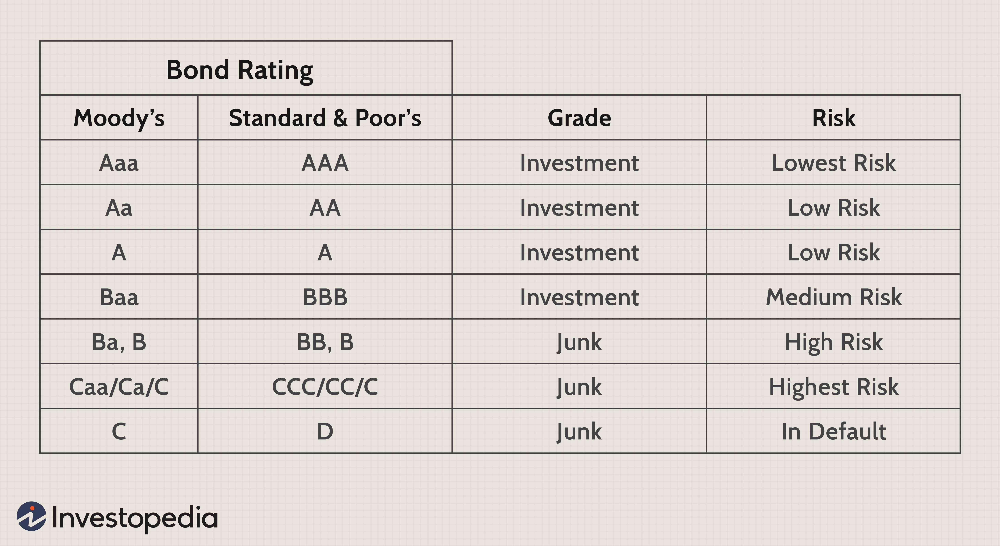

The advent of algorithmic trading has profoundly changed the dynamics of financial markets, leading to faster, more efficient, and highly automated trading systems. Algorithmic trading leverages computer algorithms to make trading decisions at speeds and frequencies that are impossible for human traders to match. This transformation has allowed for greater liquidity, tighter spreads, and reduced costs in the market, thereby revolutionizing how traders interact with financial instruments.

Central to this transformation are B1/B+ applications, which have emerged as critical tools in facilitating high-frequency and sophisticated trading strategies. These applications are specifically designed to handle the demands of modern trading, offering capabilities that include low latency data processing, advanced risk management, and seamless execution of complex strategies. As such, they provide traders with the ability to capitalize on opportunities in the market swiftly and efficiently, enhancing their competitive edge.

This article aims to explore the various considerations involved in utilizing B1/B+ applications within the context of algorithmic trading. We will provide a detailed examination of their key features, from robust data handling and high scalability to essential security measures. Moreover, we will discuss the significant benefits they offer, such as improved trade execution times, enhanced accuracy, and increased cost-efficiency, which are indispensable in today's fast-paced trading environment.

However, integrating these systems is not without its challenges. The initial setup can be resource-intensive, requiring substantial technical expertise and vigilant oversight to mitigate potential vulnerabilities. Understanding these complexities is crucial for traders looking to maximize the benefits of B1/B+ applications. By addressing these considerations, market participants can substantially enhance their decision-making processes and ultimately achieve greater trading success.

## Table of Contents

## Understanding B1/B+ Applications

B1/B+ applications are pivotal technologies designed to support modern algorithmic trading infrastructures. They are built to manage complex computations and handle massive datasets with exceptional speed and accuracy, which are critical requirements in today's fast-paced financial markets. The integration of B1/B+ systems enables traders to automate various operational processes, significantly reduce latency, and enhance execution efficiency.

One of the primary purposes of B1/B+ applications is their role in data analysis and trade execution. These systems can process vast amounts of trading data in real-time, allowing traders to make informed decisions quickly. This capability ensures that traders are equipped with the most up-to-date market information, facilitating timely and precise trade execution.

The applications support several essential high-level functions. Risk management is a major component, as B1/B+ systems can assess and mitigate potential risks associated with trading activities. They achieve this by analyzing historical and current data trends to predict future market movements and identify potential market anomalies.

Back-testing is another critical function offered by B1/B+ applications. This feature allows traders to test their trading strategies against historical market data to evaluate their effectiveness before deploying them in live markets. By simulating trades under various market conditions, traders can refine their strategies and improve their potential for success.

Moreover, real-time market analysis is facilitated by B1/B+ applications, enabling traders to continuously monitor market conditions and adjust their strategies accordingly. This real-time monitoring is vital for high-frequency trading environments where rapid response times can be the difference between profit and loss.

Overall, B1/B+ applications form an integral part of [algorithmic trading](/wiki/algorithmic-trading) by providing comprehensive tools for efficient data handling, risk assessment, strategy testing, and market analysis. These applications are indispensable for traders seeking to capitalize on the speed and precision required in today’s dynamic markets.

## Key Features of B1/B+ Applications

B1/B+ applications exhibit key features that make them indispensable tools in algorithmic trading. One of the most significant characteristics is their robust data handling capabilities. These applications manage and process vast amounts of trading data efficiently, which is paramount in the fast-paced environment of algorithmic trading. With the ability to handle large volumes of data, B1/B+ applications support traders in making informed decisions quickly.

Scalability is another crucial feature of B1/B+ applications. As market demands fluctuate and trading activities intensify, these applications can scale up to manage increased data loads and computational requirements. This scalability ensures continuous performance and reliability, making them ideal for high-frequency trading environments.

Security features are integral to B1/B+ applications. Protecting sensitive trading information and proprietary strategies is of utmost importance. These applications incorporate advanced security protocols to safeguard data against unauthorized access and potential cyber threats. Implementing strong encryption mechanisms and adhering to stringent security standards are common practices to ensure the integrity and confidentiality of trading data.

Another essential feature is data integration capabilities. B1/B+ applications can seamlessly merge data from various sources, including market feeds, historical data, and external databases. This integrated approach facilitates comprehensive data analysis and enriches the decision-making process. The synergy among disparate data sources provides traders with a holistic view of market conditions, enhancing their ability to strategize effectively.

Moreover, B1/B+ applications are adaptable to evolving technological advancements and market changes. This adaptability ensures that applications remain relevant and efficient, even as new technologies emerge or market dynamics shift. For instance, incorporating [machine learning](/wiki/machine-learning) algorithms into trading systems allows B1/B+ applications to evolve and optimize trading strategies based on historical data patterns and predictive analytics.

In summary, the key features of B1/B+ applications - robust data handling, scalability, security, data integration, and adaptability - collectively contribute to their effectiveness in algorithmic trading. These features enable traders to operate with greater efficiency, security, and insight, ultimately leading to more successful trading outcomes.

## Benefits of Using B1/B+ in Algorithmic Trading

The integration of B1/B+ applications into algorithmic trading systems offers a multitude of advantages that significantly enhance trading efficiency and effectiveness. One primary benefit is the substantial reduction in trade execution time. In high-frequency trading environments, speed is paramount; B1/B+ applications streamline and automate processes, reducing the delay between decision-making and action. For instance, with reduced latency, traders can capitalize on fleeting market opportunities, executing trades at optimal prices.

B1/B+ applications are proficient in managing complex algorithms, which allows traders to develop and implement strategies that are both data-driven and precise. These systems are capable of handling numerous variables and data inputs simultaneously, ensuring that the trading logic incorporates real-time data analysis and market trends. This level of complexity is crucial for developing and testing sophisticated trading strategies that can adapt to ever-changing market conditions.

Furthermore, these applications enhance accuracy by minimizing human error. The automated nature of B1/B+ systems eliminates the subjective biases and potential mistakes associated with manual trading processes. This precision is particularly valuable in volatile markets where rapid fluctuations can impact trading outcomes.

Cost efficiency is another notable benefit. By automating trading operations, B1/B+ systems reduce the overhead costs linked with manual interventions and human resources. They optimize resource allocation and reduce the need for extensive manpower, which in turn lowers operational expenses.

Additionally, B1/B+ applications offer enhanced strategic flexibility. They allow traders to swiftly adapt to new market environments or objectives. This adaptability is supported by their ability to integrate with varying data sources and their scalability to handle increased data loads as market demands evolve. As a result, traders can efficiently update their strategies to align with new market insights or regulatory requirements.

In summary, the adoption of B1/B+ applications in algorithmic trading leads to faster execution, increased precision, cost savings, and greater strategic flexibility, making them indispensable tools for traders seeking a competitive edge in today's dynamic financial markets.

## Challenges and Considerations

Implementing B1/B+ applications in trading systems introduces several challenges that need careful consideration. One major challenge is the resource-intensive nature of the initial setup and integration process. These applications require significant computational resources and technical expertise to implement effectively. Organizations may need to invest in specialized hardware and skilled developers to ensure successful integration. This can involve high upfront costs and time investments, necessitating a detailed cost-benefit analysis before proceeding.

Another crucial consideration is the vulnerability of these systems to cyber threats. As B1/B+ applications handle sensitive trading data and strategies, they are potential targets for cyberattacks. Market participants must implement robust cybersecurity measures to protect against unauthorized access and exploitation. This includes regular security audits, employing encryption methodologies, and maintaining awareness of emerging vulnerabilities.

Ongoing maintenance and updates are paramount for the optimal performance of B1/B+ applications. The dynamic nature of financial markets means that trading systems must be continuously refined to adapt to new data and trading conditions. Regular updates ensure that the system is equipped with the latest algorithms and security features, minimizing the risk of encountering bugs or experiencing performance degradation.

Algorithmic errors pose another significant risk. These errors can result from flawed algorithms, incorrect data inputs, or unexpected market conditions. To mitigate these risks, traders should develop robust testing and monitoring protocols. This includes rigorous back-testing using historical data to validate the effectiveness of algorithms and the establishment of fail-safes to prevent unintended trading actions.

In conclusion, while B1/B+ applications are powerful tools for algorithmic trading, successful implementation demands addressing these challenges. By focusing on these key considerations, traders can ensure that these technological advancements contribute positively to their trading strategies.

## Future Trends in B1/B+ Application Development

As technology evolves, B1/B+ applications are adapting to meet new market demands and integrate emerging trends. A significant development in this area is the incorporation of [artificial intelligence](/wiki/ai-artificial-intelligence) (AI) and machine learning (ML), which are set to dramatically enhance the predictive capabilities and strategy development within these systems. By leveraging AI and ML algorithms, B1/B+ applications can analyze vast datasets to identify patterns, optimize decision-making processes, and develop sophisticated trading strategies with higher accuracy than traditional methods. For instance, utilizing [deep learning](/wiki/deep-learning) models allows these systems to predict market movements and adapt strategies in real-time, improving trading outcomes.

Simultaneously, there is an increasing focus on cloud-based solutions, which provide B1/B+ applications with scalability and resource efficiency. Cloud infrastructure allows these applications to handle significant computational loads and large datasets without the physical constraints of on-premise servers, thereby enabling faster data processing and reduced latency. The flexibility of cloud services supports dynamic scalability, adjusting resources based on current market conditions or trading volumes.

Furthermore, advancements in data analytics continue to enhance decision-making processes by improving both the quality and speed of data analysis. These advancements are likely to integrate more sophisticated analytical tools that refine market insights, support risk assessment, and optimize algorithmic strategies. Enhanced data visualization techniques also play a crucial role by providing clearer, more intuitive interfaces that facilitate rapid interpretation of complex datasets by traders.

Future B1/B+ applications are expected to feature enhanced user interfaces, designed to improve user interaction and operational efficiency. These interfaces will likely focus on usability, allowing traders to customize dashboards and access critical data quickly. Additionally, greater integration capabilities with other fintech systems are anticipated, facilitating seamless interoperability across a variety of platforms.

In summary, B1/B+ applications are on the cusp of significant technological transformation, driven by AI and ML, cloud computing, and advanced data analytics. These trends are positioning B1/B+ systems to offer even greater precision, scalability, and integration in algorithmic trading environments, thereby solidifying their role as indispensable tools for modern traders.

## Conclusion

B1/B+ applications are pivotal in advancing technological innovations that are transforming algorithmic trading. Their ability to deliver rapid execution, enhanced data handling, and strategic adaptability make them essential tools for modern traders. Despite these advantages, the integration process is fraught with complexities and challenges, such as the need for technical expertise and the management of cybersecurity risks. Successfully navigating these hurdles is crucial for traders aiming to maximize the potential of B1/B+ systems.

To leverage these systems effectively, traders must remain vigilant in keeping abreast of technological developments and emerging trends in the field. This awareness is essential not only for improving system performance but also for maintaining a competitive edge in an ever-evolving trading environment. As B1/B+ applications continue to evolve, they will increasingly incorporate advanced technologies like artificial intelligence and machine learning, further enhancing predictive accuracy and strategic formulation.

In conclusion, B1/B+ applications stand as indispensable assets in the dynamic landscape of algorithmic trading. They significantly enhance performance and strategy execution, providing traders with the tools necessary to succeed in a competitive market. Staying informed and addressing the accompanying challenges will ensure that traders exploit these systems to their fullest potential, cementing their status as crucial components of modern trading strategies.

## References & Further Reading

[1]: Bergstra, J., Bardenet, R., Bengio, Y., & Kégl, B. (2011). ["Algorithms for Hyper-Parameter Optimization."](https://papers.nips.cc/paper/4443-algorithms-for-hyper-parameter-optimization) Advances in Neural Information Processing Systems 24.

[2]: ["Advances in Financial Machine Learning"](https://www.amazon.com/Advances-Financial-Machine-Learning-Marcos/dp/1119482089) by Marcos Lopez de Prado

[3]: ["Evidence-Based Technical Analysis: Applying the Scientific Method and Statistical Inference to Trading Signals"](https://www.amazon.com/Evidence-Based-Technical-Analysis-Scientific-Statistical/dp/0470008741) by David Aronson

[4]: ["Machine Learning for Algorithmic Trading"](https://github.com/stefan-jansen/machine-learning-for-trading) by Stefan Jansen

[5]: ["Quantitative Trading: How to Build Your Own Algorithmic Trading Business"](https://www.amazon.com/Quantitative-Trading-Build-Algorithmic-Business/dp/1119800064) by Ernest P. Chan