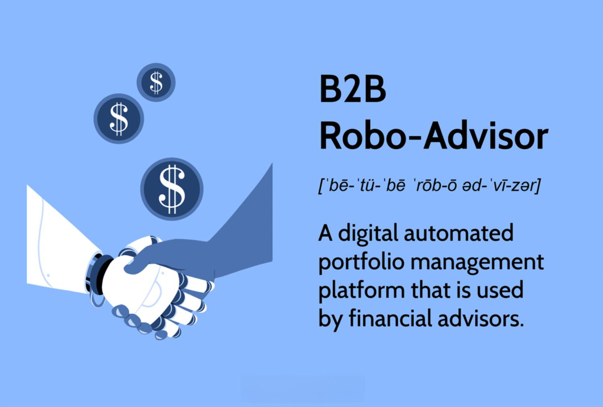

## Table of Contents

## What is a B2B Robo-Advisor?

A B2B Robo-Advisor is a type of automated financial service that businesses use to help manage their money. Instead of working directly with individual people, these robo-advisors work with other businesses. They use computer programs and algorithms to give advice on investments, savings, and other financial decisions. This helps businesses save time and money because they don't need to hire a human financial advisor.

These robo-advisors are useful for companies that want to offer financial services to their clients or employees without building their own financial team. For example, a bank might use a B2B robo-advisor to provide investment options to its customers. The robo-advisor handles all the investment decisions and management, while the bank focuses on its main services. This way, businesses can offer more to their clients without the extra work and cost of managing investments themselves.

## How does a B2B Robo-Advisor differ from a B2C Robo-Advisor?

A B2B Robo-Advisor works with businesses, while a B2C Robo-Advisor works directly with individual people. B2B stands for "business-to-business," meaning the robo-advisor helps other companies manage their money. On the other hand, B2C stands for "business-to-consumer," where the robo-advisor helps individual customers with their personal finances. So, the main difference is who they serve: businesses for B2B and individuals for B2C.

Another difference is how they are used. B2B Robo-Advisors are often used by companies to offer financial services to their own clients or employees without having to build their own financial team. For example, a company might use a B2B Robo-Advisor to manage investments for its customers. In contrast, B2C Robo-Advisors are used by individuals to manage their own personal investments. People sign up for these services to get help with their savings and investment choices without needing to talk to a human advisor.

## What are the primary functions of a B2B Robo-Advisor?

The primary function of a B2B Robo-Advisor is to help businesses manage their money and investments. It uses computer programs to make decisions about where to put money to help it grow. This saves businesses time and money because they don't need to hire a human advisor to do this work. Instead, the robo-advisor does all the work automatically, following rules set by experts.

Another important function is to help companies offer financial services to their clients or employees. For example, a bank might use a B2B Robo-Advisor to manage investments for its customers. This way, the bank can provide investment options without needing to build its own team of financial advisors. It makes it easier for businesses to offer more services to their clients without the extra work and cost.

Overall, B2B Robo-Advisors help businesses make smart financial decisions and offer financial products to others, all while keeping costs low and efficiency high.

## Who are the typical clients of B2B Robo-Advisors?

The typical clients of B2B Robo-Advisors are businesses that want to offer financial services to their clients or employees. These can include banks, financial institutions, and companies in the fintech sector. They use B2B Robo-Advisors to manage investments and savings for their customers without needing to build their own team of financial advisors. This helps them save time and money while still providing valuable services.

Another group of clients are businesses looking to manage their own money more efficiently. These could be small businesses or large corporations that want to automate their investment decisions. By using a B2B Robo-Advisor, these companies can let the robo-advisor handle their financial management, freeing up their time to focus on other parts of their business. This makes it easier for them to grow their money without the need for a human financial advisor.

## What kind of services can financial institutions offer through B2B Robo-Advisors?

Financial institutions can use B2B Robo-Advisors to offer investment management services to their clients. This means they can help their customers put their money into different investments like stocks, bonds, and mutual funds. The robo-advisor uses computer programs to decide where the money should go, based on the customer's goals and how much risk they are willing to take. This makes it easier for financial institutions to provide these services without needing to hire a lot of financial advisors.

Another service that can be offered is retirement planning. Through B2B Robo-Advisors, financial institutions can help their clients plan for the future by setting up retirement accounts and managing the money in those accounts. The robo-advisor will automatically adjust the investments to make sure the client's retirement savings grow over time. This helps clients save for retirement without having to do all the work themselves.

Lastly, financial institutions can offer personalized financial advice through B2B Robo-Advisors. The robo-advisor can analyze a client's financial situation and give them advice on how to save money, pay off debt, and invest for the future. This personalized advice is based on the client's specific needs and goals, making it easier for them to manage their finances effectively.

## How does a B2B Robo-Advisor integrate with existing financial systems?

A B2B Robo-Advisor integrates with existing financial systems by using special software that can talk to other computer programs. This means it can connect with the systems that a business already uses, like their banking software or investment platforms. The robo-advisor can get information from these systems, like how much money a client has or what investments they already own. Then, it can use this information to make smart decisions about where to put the money next.

Once the robo-advisor has made these decisions, it can send instructions back to the financial systems to buy or sell investments. This makes everything run smoothly because the robo-advisor works behind the scenes, without the business needing to change how they do things. It's like having a helper that fits right into the team, making sure all the financial work is done correctly and on time.

## What are the key technological components required for a B2B Robo-Advisor?

The main technological part of a B2B Robo-Advisor is the algorithm. This is like a set of rules that the computer follows to decide where to put money. The algorithm looks at things like how much risk someone wants to take and what their goals are. It then chooses the best investments to help reach those goals. The algorithm needs to be smart and fast, so it can make good choices quickly.

Another important part is the software that helps the robo-advisor talk to other computer systems. This software lets the robo-advisor get information from a company's banking or investment systems and send instructions back to those systems. It's like a translator that makes sure everything works together smoothly. This way, the robo-advisor can do its job without messing up the company's other work.

Lastly, a good user interface is key. This is what people see when they use the robo-advisor. It needs to be easy to use so that businesses can set up their clients' investments without any trouble. A clear and simple interface helps everyone understand what's going on and makes it easier to manage money.

## What are the benefits of using a B2B Robo-Advisor for financial institutions?

Using a B2B Robo-Advisor helps financial institutions save time and money. Instead of hiring many human advisors, they can use the robo-advisor to manage investments for their clients. This means they don't have to pay salaries and other costs that come with having a big team. The robo-advisor can handle a lot of clients at once, so it's more efficient. This lets financial institutions offer investment services to more people without spending a lot more money.

Another benefit is that B2B Robo-Advisors make it easier for financial institutions to offer new services. They can quickly set up things like retirement accounts or personalized financial plans for their clients. The robo-advisor does all the hard work of managing these investments, so the financial institution can focus on other parts of their business. This helps them grow and offer more to their clients without having to do a lot of extra work.

## What are the potential challenges and limitations of implementing a B2B Robo-Advisor?

One of the main challenges of implementing a B2B Robo-Advisor is making sure it works well with the systems a business already uses. If the robo-advisor can't talk to these systems easily, it might cause problems and slow things down. Another challenge is getting people to trust the robo-advisor. Some clients might feel more comfortable working with a human advisor and might not like the idea of a computer making decisions about their money. This can make it hard for financial institutions to convince their clients to use the robo-advisor.

There are also limitations to what a B2B Robo-Advisor can do. For example, they might not be able to handle very complex financial situations as well as a human advisor. If a client has a lot of different investments or special needs, the robo-advisor might not be able to give the best advice. Also, robo-advisors work based on rules and data, so they might not be able to think outside the box or come up with creative solutions like a human can. This means that while they are good for many things, they might not be the best choice for every situation.

## How can a B2B Robo-Advisor comply with regulatory requirements?

A B2B Robo-Advisor can comply with regulatory requirements by following the rules set by financial authorities. These rules might include making sure client information is kept safe, giving clear information about investments, and following laws about how to handle money. The robo-advisor can use special software to keep track of these rules and make sure everything is done the right way. This software can check that all the information given to clients is correct and that all the money is handled according to the law.

Another way a B2B Robo-Advisor can comply is by working with people who know a lot about financial regulations. These experts can help set up the robo-advisor so it follows all the rules. They can also keep an eye on things to make sure the robo-advisor is always up to date with any new laws. By working together with these experts, the robo-advisor can make sure it's doing everything right and keeping clients happy and safe.

## What are some case studies or examples of successful B2B Robo-Advisor implementations?

One example of a successful B2B Robo-Advisor implementation is the partnership between BlackRock and Envestnet. BlackRock, a big investment company, worked with Envestnet, a financial technology firm, to create a robo-advisor service for financial advisors and their clients. This service helps advisors manage their clients' money more easily. By using BlackRock's investment strategies and Envestnet's technology, they were able to offer a simple and effective way for advisors to grow their clients' money without needing a lot of extra work.

Another example is the collaboration between Vanguard and Ascensus. Vanguard, known for its low-cost investment options, teamed up with Ascensus, a company that helps with retirement plans, to offer a robo-advisor service for small businesses. This service helps small businesses set up retirement accounts for their employees. The robo-advisor manages these accounts, making it easier for small businesses to offer good retirement benefits without the need for a big financial team. This has helped many small businesses provide valuable services to their employees.

## What future trends are expected in the development of B2B Robo-Advisors?

In the future, B2B Robo-Advisors are expected to become even smarter and more personalized. They will use new technology like [artificial intelligence](/wiki/ai-artificial-intelligence) (AI) to understand each client's needs better. This means they will be able to give advice that is just right for each business or person. They might also use more data to make better decisions about where to put money. This could help businesses grow their money even faster and more safely.

Another trend is that B2B Robo-Advisors will work even better with other systems. They will be able to connect with more types of software, making it easier for businesses to use them. This could mean that businesses can manage all their money in one place, without having to switch between different programs. As technology gets better, B2B Robo-Advisors will become a bigger part of how businesses handle their finances, helping them save time and money.

## References & Further Reading

[1]: Bergstra, J., Bardenet, R., Bengio, Y., & Kégl, B. (2011). ["Algorithms for Hyper-Parameter Optimization."](https://papers.nips.cc/paper/4443-algorithms-for-hyper-parameter-optimization) Advances in Neural Information Processing Systems 24.

[2]: ["Advances in Financial Machine Learning"](https://www.amazon.com/Advances-Financial-Machine-Learning-Marcos/dp/1119482089) by Marcos Lopez de Prado

[3]: ["Evidence-Based Technical Analysis: Applying the Scientific Method and Statistical Inference to Trading Signals"](https://www.amazon.com/Evidence-Based-Technical-Analysis-Scientific-Statistical/dp/0470008741) by David Aronson

[4]: ["Machine Learning for Algorithmic Trading"](https://github.com/stefan-jansen/machine-learning-for-trading) by Stefan Jansen

[5]: ["Quantitative Trading: How to Build Your Own Algorithmic Trading Business"](https://www.amazon.com/Quantitative-Trading-Build-Algorithmic-Business/dp/1119800064) by Ernest P. Chan