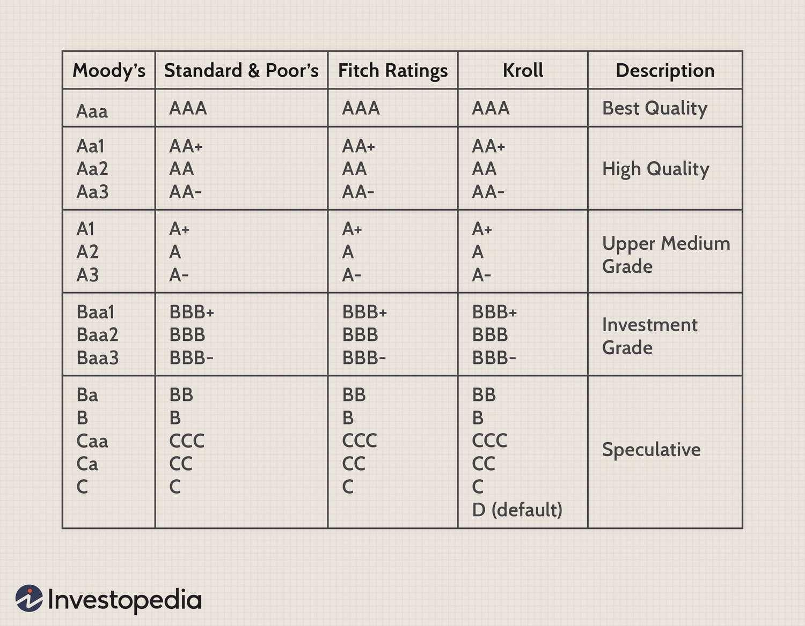

## Table of Contents

## What does a B3/B- rating signify in the context of credit ratings?

A B3/B- rating is a type of credit rating given by credit rating agencies like Moody's and Standard & Poor's. It means that the company or bond being rated has a higher chance of not being able to pay back its debts compared to companies with higher ratings. This rating is considered to be on the lower end of the investment spectrum, often referred to as "junk" status.

When a company or bond has a B3/B- rating, it suggests that there are significant risks involved in lending to or investing in them. Investors might demand higher interest rates to compensate for these risks. This rating indicates that the company's financial situation is not as strong as those with higher ratings, and there might be challenges in meeting financial obligations in the future.

## Who are the main credit rating agencies that assign B3/B- ratings?

The main credit rating agencies that assign B3/B- ratings are Moody's, Standard & Poor's (S&P), and Fitch Ratings. These agencies are well-known for evaluating the creditworthiness of companies and bonds. They use different scales to rate credit, but B3 from Moody's and B- from S&P and Fitch are considered equivalent and indicate a higher risk of default.

These agencies play a big role in the financial world. Investors and lenders look at their ratings to decide if they should invest in or lend money to a company or buy its bonds. A B3/B- rating tells them that the company might have trouble paying back its debts, so they might want a higher interest rate to take on that risk.

## How does a B3/B- rating compare to other credit ratings?

A B3/B- rating is on the lower end of the credit rating scale. It means the company or bond is riskier than those with higher ratings like A or AA. These higher ratings show that the company is more likely to pay back its debts on time. A B3/B- rating is considered "junk" status, which means it's not seen as a safe investment. Companies with this rating might have to pay more interest to borrow money because lenders see them as riskier.

Compared to even lower ratings like C or D, a B3/B- rating is better. A C rating means the company is really struggling and might not pay back its debts. A D rating means the company has already missed payments. So, a B3/B- rating is better than these, but it's still not great. It's like being in the middle of the lower ratings, showing that there's a higher chance of problems but not as bad as the very lowest ratings.

In the world of credit ratings, a B3/B- rating is a warning sign. It tells investors and lenders to be careful because the company might have trouble paying back what it owes. But it's not the worst rating out there. There are still lower ratings that signal even bigger problems. So, while a B3/B- rating isn't good, it's better than being at the very bottom of the credit rating scale.

## What are the general investment risks associated with a B3/B- rated bond?

Investing in a B3/B- rated bond comes with higher risks. This rating means the bond is seen as "junk" or not very safe. The biggest risk is that the company might not be able to pay back the money it owes. This is called default risk. If the company can't pay, investors might lose their money or not get the interest they were expecting. Because of this risk, these bonds usually offer higher interest rates to try to attract investors.

Another risk is that the value of the bond can go up and down a lot. This is called market risk. If people think the company is doing worse, the price of the bond can drop quickly. This means if you need to sell the bond before it matures, you might get less money back than you paid for it. Also, these bonds can be harder to sell quickly because fewer people want to buy them. So, it's important to think about how long you can keep your money tied up in these bonds.

## Can you explain the difference between B3 and B- ratings from different agencies?

A B3 rating comes from Moody's, and a B- rating comes from Standard & Poor's (S&P) and Fitch Ratings. Even though the letters and numbers are a bit different, they mean the same thing. Both ratings show that the company or bond is riskier than those with higher ratings like A or AA. They are considered "junk" status, which means they are not seen as safe investments. 

When a company gets a B3 or B- rating, it means there's a higher chance it might not be able to pay back its debts. Because of this risk, these companies might have to pay more interest to borrow money. Investors see these ratings as a warning sign to be careful. But, these ratings are not the worst. There are lower ratings like C or D that show even bigger problems. So, while a B3 or B- rating isn't good, it's better than being at the very bottom of the credit rating scale.

## How do B3/B- rated securities typically perform in different economic cycles?

B3/B- rated securities usually do better when the economy is growing and doing well. When people are buying more things and businesses are making more money, these companies are more likely to pay back their debts. So, during good economic times, the value of these securities might go up and investors might feel more confident about them. But, these securities still carry more risk than those with higher ratings, so they might not do as well as securities with A or AA ratings.

On the other hand, when the economy is struggling or going through a downturn, B3/B- rated securities can have a tough time. If businesses are making less money and people are spending less, these companies might have a harder time paying back their debts. This can make the value of their securities go down, and investors might start to worry more about them. During these times, the risk of the company not being able to pay back its debts, called default risk, goes up, which can make these securities perform worse than those with higher ratings.

## What are the historical default rates for securities rated B3/B-?

Historically, securities rated B3/B- have had higher default rates than those with higher ratings like A or AA. Over the years, studies have shown that around 10% to 15% of B3/B- rated securities might default within a year. This means that about one in every seven to ten of these securities might not be able to pay back what they owe. These numbers can change a bit depending on the economy and the specific industry the company is in, but overall, the risk is much higher than for securities with better ratings.

When the economy is doing well, the default rates for B3/B- rated securities tend to be lower. For example, during good economic times, the default rate might be closer to the lower end of that range, like around 10%. But when the economy is struggling, the default rates can go up a lot. During bad economic times, the default rate for these securities might jump to the higher end of the range or even above, like 15% or more. This shows how sensitive B3/B- rated securities are to changes in the economy.

## What kind of investors are typically interested in B3/B- rated investments?

Investors who are interested in B3/B- rated investments are usually looking for higher returns and are willing to take on more risk. These investors know that B3/B- rated securities can be risky because there's a higher chance the company might not pay back its debts. But, because of this risk, these securities often offer higher interest rates. So, people who invest in them are hoping to earn more money than they would from safer investments.

These investors are often called "high-yield" or "junk bond" investors. They might be big institutions like hedge funds or pension funds that have the money and knowledge to handle these risks. They also might be individual investors who understand the risks and have a plan to manage them. These investors keep a close eye on the economy and the companies they invest in, knowing that things can change quickly and affect their investments.

## How does the yield of a B3/B- rated bond compare to higher-rated bonds?

B3/B- rated bonds usually offer higher yields than bonds with higher ratings like A or AA. This is because they are riskier. When a bond is rated B3/B-, it means there's a bigger chance the company might not pay back the money it owes. Because of this risk, investors want to be paid more to take that chance. So, these bonds have to offer higher interest rates to attract investors. This higher interest rate is what we call the yield, and it's usually a lot more than what you'd get from safer bonds.

For example, if an A-rated bond might offer a yield of around 3%, a B3/B- rated bond might offer a yield of 7% or even more. The exact difference can change based on the economy and how the company is doing, but the main point is that B3/B- rated bonds need to give investors a bigger reward to make up for the bigger risk. So, if you're thinking about investing in these bonds, you might earn more money, but you also have to be ready for the chance that things could go wrong.

## What are the key factors that can lead to a B3/B- rating being upgraded or downgraded?

A B3/B- rating can be upgraded if the company starts doing better financially. This could happen if the company makes more money, pays off some of its debts, or finds new ways to bring in cash. If the economy is doing well and the company's industry is growing, that can help too. When these things happen, credit rating agencies might think the company is less risky and give it a better rating. Investors would then feel more confident about the company's ability to pay back its debts, which could make the company's bonds more valuable.

On the other hand, a B3/B- rating can be downgraded if the company's financial situation gets worse. This could be because the company is losing money, has too much debt, or is having trouble paying its bills on time. If the economy is struggling or the company's industry is facing challenges, that can make things harder for the company. When these problems happen, credit rating agencies might see the company as riskier and give it a lower rating. This can make investors worry more about the company's ability to pay back its debts, which could make the company's bonds less valuable.

## How should an investor assess the liquidity risk of a B3/B- rated investment?

When thinking about the liquidity risk of a B3/B- rated investment, an investor should first look at how easy it is to buy or sell the bond. B3/B- rated bonds can be harder to sell quickly because fewer people want to buy them. This is because they are seen as riskier. If an investor needs to sell the bond before it matures, they might have to wait longer to find a buyer or sell it for less money than they paid for it. So, it's important to think about how long you can keep your money tied up in these bonds and if you might need to get your money back quickly.

Another thing to consider is the overall market conditions. If the economy is doing well, more people might be willing to buy these bonds, making them easier to sell. But if the economy is struggling, fewer people might want to take the risk, which can make it harder to sell the bond. Also, the specific industry the company is in can affect liquidity. If the industry is doing well, the bond might be easier to sell. But if the industry is facing challenges, it could be harder. So, it's a good idea to keep an eye on both the economy and the company's industry when thinking about the liquidity risk of a B3/B- rated investment.

## What advanced strategies can be used to mitigate the risks of investing in B3/B- rated securities?

One way to lower the risks of investing in B3/B- rated securities is to spread your money around. This means instead of putting all your money into one bond, you can buy a bunch of different B3/B- rated bonds. If one company can't pay back its debts, you won't lose all your money because you have other bonds that might still be okay. This is called diversification, and it can help protect you from losing everything if one bond goes bad.

Another strategy is to keep a close eye on the economy and the companies you invest in. If you see signs that the economy is going to get worse, you might want to sell your B3/B- rated bonds before they lose too much value. Also, if a company starts to do better or worse, that can affect its bond's value. By staying informed and ready to make changes, you can try to avoid big losses. This means you need to be ready to act quickly and not be afraid to sell if things start to look bad.

A third approach is to use something called a "hedge." This means you can buy other investments that will go up in value if your B3/B- rated bonds go down. For example, you might buy something that does well when the economy is bad, like certain types of stocks or options. This can help balance out your losses if your bonds don't do well. Hedging can be a bit tricky and might need some help from a financial advisor, but it's a way to try to protect your money from big swings in the market.

## What are the investment risks associated with B3/B- ratings?

Investing in bonds rated B3 by Moody's or B- by Standard & Poor's and Fitch involves substantial risk due to their enhanced probability of default. These ratings suggest a significant level of speculative risk, categorizing them among the lowest investment grades within the junk bond market. The primary appeal of these bonds lies in their high yields, which compensate investors for taking on such pronounced risk. This additional return, often referred to as the risk premium, compensates for the increased [volatility](/wiki/volatility-trading-strategies) and potential losses.

The high yield associated with B3/B- rated bonds can be attributed to the higher interest rates these bonds must offer to attract investors. The risk premium, mathematically defined as:

$$
\text{Risk Premium} = \text{Yield of B3/B- Bond} - \text{Risk-Free Rate}
$$

serves as an incentive for investors to accept the bonds' inherent credit risk. This spread is essential for understanding the compensation received relative to the risk assumed.

Market conditions, including the risk-free rate of return, significantly impact the attractiveness of these speculative bonds. The risk-free rate is generally represented by government bonds like U.S. Treasury securities. In lower [interest rate](/wiki/interest-rate-trading-strategies) environments, the relative attractiveness of B3/B- rated bonds may increase as investors search for higher yields. Conversely, in higher interest rate settings, these speculative bonds must offer even greater yields to remain appealing compared to safer alternatives.

Volatility is another critical [factor](/wiki/factor-investing). B3/B- rated bonds are susceptible to significant price fluctuations due to changes in issuer creditworthiness or broader economic conditions. High volatility can lead to substantial capital losses, especially if an issuer defaults or if market sentiment drastically shifts. Investors must closely monitor factors such as economic downturns, changes in interest rates, and issuer-specific news, which can affect the creditworthiness and default likelihood of bonded entities. The historical default rates of these bonds further underscore the level of investment risk, with studies often showing higher incidents of default compared to investment-grade securities.

In conclusion, B3/B- rated bonds present a complex array of risks and rewards. While their yields may be appealing, the associated volatility and potential for default necessitate a thorough risk assessment by investors. Understanding market conditions and the relative risk premium is crucial for those considering these high-risk, high-reward investments.

## References & Further Reading

[1]: Bergstra, J., Bardenet, R., Bengio, Y., & Kégl, B. (2011). ["Algorithms for Hyper-Parameter Optimization."](https://dl.acm.org/doi/10.5555/2986459.2986743) Advances in Neural Information Processing Systems 24.

[2]: ["Advances in Financial Machine Learning"](https://www.amazon.com/Advances-Financial-Machine-Learning-Marcos/dp/1119482089) by Marcos Lopez de Prado

[3]: ["Evidence-Based Technical Analysis: Applying the Scientific Method and Statistical Inference to Trading Signals"](https://www.amazon.com/Evidence-Based-Technical-Analysis-Scientific-Statistical/dp/0470008741) by David Aronson

[4]: ["Machine Learning for Algorithmic Trading"](https://github.com/stefan-jansen/machine-learning-for-trading) by Stefan Jansen

[5]: ["Quantitative Trading: How to Build Your Own Algorithmic Trading Business"](https://www.amazon.com/Quantitative-Trading-Build-Algorithmic-Business/dp/1119800064) by Ernest P. Chan