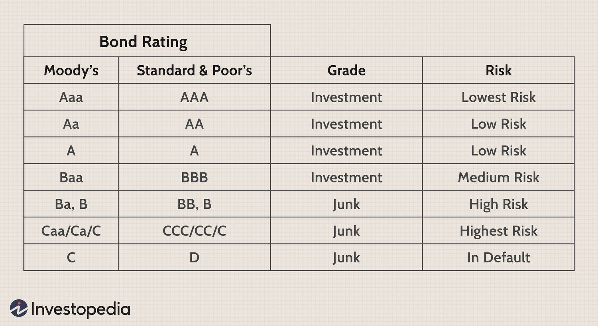

## Table of Contents

## What does a Ba1/BB+ credit rating signify?

A Ba1/BB+ credit rating is given by credit rating agencies like Moody's and S&P to indicate the creditworthiness of a borrower, such as a company or government. This rating falls in the "non-investment grade" or "speculative" category, which means it is considered to have a higher risk of default compared to investment-grade ratings. Specifically, Ba1 is used by Moody's and BB+ is used by S&P, but both ratings are considered equivalent and suggest moderate credit risk.

When a borrower has a Ba1/BB+ rating, it means they are seen as having a higher chance of missing debt payments than those with higher ratings. However, it also suggests that the borrower still has some ability to meet their financial obligations. Investors might demand higher interest rates from these borrowers to compensate for the increased risk. This rating is often seen in companies that are growing quickly but have not yet proven their long-term stability, or in countries that are facing economic challenges but are working on improvements.

## Who assigns Ba1/BB+ ratings and what is their role?

Credit rating agencies like Moody's and Standard & Poor's (S&P) assign Ba1/BB+ ratings. Their job is to look at how likely a borrower, like a company or a country, is to pay back money they borrow. They give a grade, or rating, to show how safe or risky it is to lend money to that borrower. Moody's uses Ba1 and S&P uses BB+, but both mean the same thing: the borrower is a bit risky but still okay.

These agencies help investors make choices about where to put their money. If a borrower gets a Ba1/BB+ rating, it tells investors that there's a higher chance the borrower might not pay back the money on time. But it also means the borrower is not in the worst situation. Investors might want a higher [interest rate](/wiki/interest-rate-trading-strategies) to take on this extra risk. The agencies keep watching and can change the ratings if the borrower's situation gets better or worse.

## How does a Ba1/BB+ rating compare to other credit ratings?

A Ba1/BB+ rating is in the middle of the credit rating scale. It is not as good as ratings like Aaa/AAA, which are the best and mean the borrower is very safe to lend to. But it is better than ratings like C or D, which are the worst and mean the borrower is very likely to not pay back the money. A Ba1/BB+ rating is called "non-investment grade" or "speculative," which means it's a bit risky but not the riskiest.

Compared to other ratings, a Ba1/BB+ is just below the investment-grade ratings like Baa3/BBB-, which are the lowest of the safe ratings. If a borrower's rating goes from Ba1/BB+ to Baa3/BBB-, it means they are seen as safer and might get better loan terms. On the other hand, if the rating drops to Ba2/BB, it means the borrower is seen as riskier and might have to pay more interest on loans. So, a Ba1/BB+ rating shows that the borrower is in a middle spot - not the safest, but not the riskiest either.

## What are the implications of a Ba1/BB+ rating for investors?

A Ba1/BB+ rating tells investors that the borrower is a bit risky but still okay. This means there's a higher chance the borrower might not pay back the money on time compared to safer borrowers. Because of this risk, investors might want a higher interest rate when they lend money to a borrower with this rating. They need more money back to make up for the chance that they might not get all their money back.

Even though it's riskier, some investors like to invest in borrowers with a Ba1/BB+ rating. They think the higher interest rates they get can make up for the risk. But these investors need to watch the borrower closely because the rating can change. If the borrower's situation gets better, the rating might go up, making the investment safer. If things get worse, the rating might go down, making the investment riskier. So, investors need to be ready for changes and keep an eye on what's happening with the borrower.

## How is a Ba1/BB+ rating determined?

Credit rating agencies like Moody's and S&P look at many things to decide if a borrower should get a Ba1/BB+ rating. They check the borrower's money coming in and going out, how much debt they have, and if they have a good history of paying back money on time. They also look at the economy and what might happen in the future that could affect the borrower. All this information helps them see how likely the borrower is to pay back the money they borrow.

After looking at all these things, the agencies give a rating. A Ba1/BB+ rating means the borrower is a bit risky but still okay. It's not as safe as the best ratings like Aaa/AAA, but it's better than the worst ratings like C or D. The agencies keep watching the borrower and can change the rating if things get better or worse. This helps investors know how safe it is to lend money to the borrower.

## What are the key factors that can influence a change from Ba1/BB+ to a higher or lower rating?

Changes in a borrower's credit rating from Ba1/BB+ to a higher or lower one can be influenced by many things. If the borrower starts making more money or pays off some of their debt, their rating might go up. This shows they are safer to lend to because they have more money to pay back what they owe. Also, if the economy gets better or the borrower does things to make their business stronger, like finding new ways to make money or cutting costs, their rating could improve. Credit rating agencies like Moody's and S&P watch these things and might give a higher rating if they see the borrower is doing better.

On the other hand, if the borrower's situation gets worse, their rating might go down. This could happen if they start losing money or take on more debt, making it harder for them to pay back what they owe. Bad things happening in the economy, like a recession, can also make it harder for the borrower to keep up with payments, leading to a lower rating. If the borrower faces problems like lawsuits or losing important customers, this can also hurt their rating. Credit rating agencies keep an eye on these factors and might lower the rating if they see the borrower is struggling more.

## Can you explain the historical performance of Ba1/BB+ rated securities?

Securities with a Ba1/BB+ rating have had ups and downs over time. They are riskier than safer ratings like Aaa/AAA, so they sometimes don't pay back as well. But they can also give investors higher returns because of the higher interest rates they offer. Over the years, some of these securities did well, especially when the economy was strong and the companies or countries behind them were doing good. But in tough times, like during a recession, these securities could struggle more than safer ones. This means investors who put money into Ba1/BB+ rated securities need to be ready for more ups and downs.

Looking at the past, Ba1/BB+ rated securities have shown that they can be good for investors who are willing to take on more risk. When the economy is doing well, these securities can give investors a lot more money back than safer investments. But when things get bad, these securities can lose value faster. That's why it's important for investors to keep an eye on the economy and the specific companies or countries they are investing in. If they do that, they might be able to make good money, but they also need to be ready for times when things don't go as planned.

## What industries or types of companies typically receive a Ba1/BB+ rating?

Companies in industries that are growing fast but can be a bit risky often get a Ba1/BB+ rating. This can include tech startups that are trying new things and need money to grow. It can also include companies in the energy sector, like oil and gas, where prices can go up and down a lot. These companies might have a lot of debt because they are trying to expand or because they need to keep up with changes in their industry. Even though they are doing well now, there's a chance things could change, so they get a rating that says they are a bit risky.

Sometimes, companies that are going through changes or facing tough times also get a Ba1/BB+ rating. This could be a big company that is trying to fix its problems or a smaller one that is growing but not making much money yet. For example, a car company that is trying to switch to making electric vehicles might get this rating because it's not sure if they will do well with the new products. Also, companies in industries like airlines or hotels, where things can change quickly because of things like travel trends or economic downturns, might get this rating. They are not in the worst spot, but they need to be careful and work on getting better to move to a safer rating.

## How do Ba1/BB+ ratings impact the cost of borrowing for a company?

When a company has a Ba1/BB+ rating, it means they are seen as a bit risky to lend money to. Because of this, lenders want more money back for taking on that risk. So, the company might have to pay higher interest rates on the money they borrow. This makes borrowing more expensive for them compared to companies with safer ratings like Aaa/AAA. The higher cost can affect the company's plans, making it harder for them to grow or invest in new projects.

Even though borrowing is more expensive, a Ba1/BB+ rating isn't the worst. It shows that the company is still okay and can manage its debts, but it's not as safe as some others. If the company can show it's doing better, like making more money or paying off debt, it might get a better rating later. This could lower the cost of borrowing in the future. Until then, the company needs to be careful with how it spends money and make sure it can handle the higher interest rates.

## What are the potential risks associated with investing in Ba1/BB+ rated bonds?

Investing in Ba1/BB+ rated bonds can be riskier than investing in bonds with higher ratings. These bonds are called "non-investment grade" or "speculative" because there's a higher chance the company or country might not pay back the money on time. If that happens, investors could lose some or all of their money. Also, if the economy gets worse or the company runs into trouble, the bond's value could go down a lot, which means investors might not be able to sell it for as much as they paid.

Even though these bonds are riskier, they can offer higher interest rates to make up for the risk. Some investors like this because they think the extra money they get back will be worth it. But they need to keep a close eye on the company or country they're investing in. If things get better, the bond's rating might go up, and it could become a safer investment. But if things get worse, the rating might go down, making the investment even riskier. So, investors need to be ready for ups and downs and watch what's happening closely.

## How do global economic conditions affect Ba1/BB+ ratings?

Global economic conditions can have a big impact on Ba1/BB+ ratings. When the world economy is doing well, companies and countries with these ratings might do better too. They could make more money and pay off their debts easier, which could help them get a better rating. But if the world economy gets worse, like during a recession, it can be harder for them. They might lose money or struggle to pay back what they owe, and their rating could go down.

Even small changes in the global economy can affect Ba1/BB+ ratings. For example, if interest rates go up around the world, it can be more expensive for these companies and countries to borrow money. This might make it harder for them to keep up with their payments, which could lead to a lower rating. On the other hand, if the global economy is stable and growing, it can give them a better chance to improve their situation and maybe get a higher rating. So, keeping an eye on what's happening in the world economy is important for understanding these ratings.

## What advanced analytical tools or models are used to assess and predict changes in Ba1/BB+ ratings?

Credit rating agencies like Moody's and S&P use advanced tools and models to look at Ba1/BB+ ratings. They use something called quantitative models, which are like math formulas that help them predict how likely a company or country is to pay back money. These models look at things like how much money the borrower is making, how much debt they have, and what might happen in the future. They also use computer programs that can look at a lot of information quickly and find patterns that might show if the rating should go up or down. These tools help the agencies make better guesses about what might happen next.

Besides math and computers, the agencies also use something called qualitative analysis. This means they talk to people who know a lot about the company or country, like managers or experts. They ask about things that numbers can't tell them, like if the company is planning to do something new or if there are problems they need to fix. By mixing the numbers from the quantitative models with what they learn from talking to people, the agencies can get a fuller picture of the borrower's situation. This helps them decide if a Ba1/BB+ rating should stay the same, go up, or go down.

## References & Further Reading

[1]: "Moody's Approach to Ratings" provided by [Moody's Investors Service](https://ratings.moodys.com/api/rmc-documents/390481)

[2]: "Standard & Poor's Credit Ratings Definitions" available at [S&P Global](https://en.wikipedia.org/wiki/S%26P_Global)

[3]: Lopez de Prado, M. (2018). ["Advances in Financial Machine Learning."](https://www.amazon.com/Advances-Financial-Machine-Learning-Marcos/dp/1119482089) John Wiley & Sons.

[4]: Aronson, D. R. (2007). ["Evidence-Based Technical Analysis: Applying the Scientific Method and Statistical Inference to Trading Signals."](https://onlinelibrary.wiley.com/doi/book/10.1002/9781118268315) John Wiley & Sons.

[5]: Jansen, S. (2020). ["Machine Learning for Algorithmic Trading."](https://github.com/stefan-jansen/machine-learning-for-trading) Packt Publishing.

[6]: Chan, E. P. (2009). ["Quantitative Trading: How to Build Your Own Algorithmic Trading Business."](https://github.com/ftvision/quant_trading_echan_book) John Wiley & Sons.

[7]: "Leveraging AI and Machine Learning for Risk Assessment in Lending and Credit Scoring" by Deloitte, available at [Deloitte Insights](https://global.beyondbullsandbears.com/2024/12/18/dimensions-insights-how-inclusive-principles-can-transform-financial-wellness/)