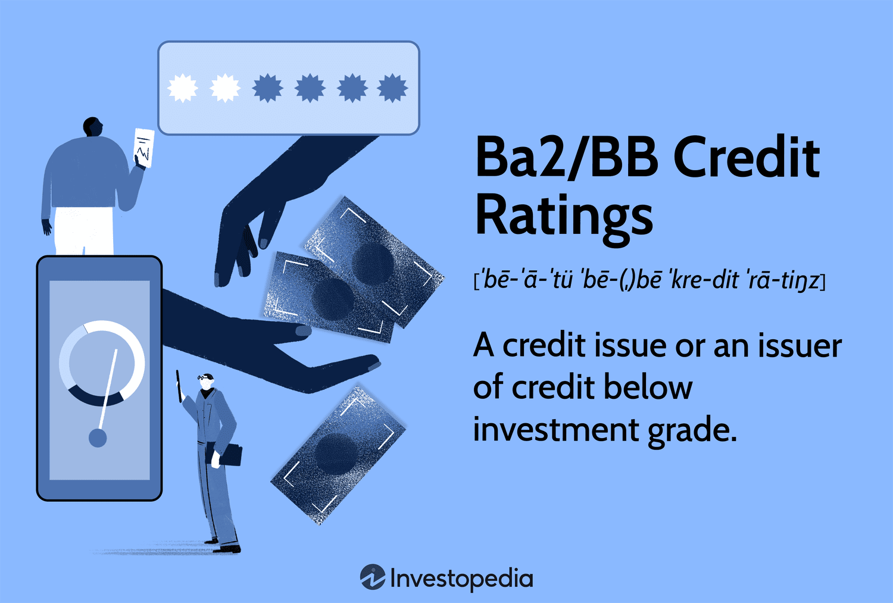

## Table of Contents

## What is a credit rating and why is it important?

A credit rating is a score given to a person or a company by a credit agency. It shows how likely they are to pay back money they borrow. The score is based on things like how they have paid bills in the past, how much money they owe, and how long they have been borrowing money. A high credit rating means the person or company is seen as reliable and likely to pay back loans on time. A low credit rating means they are seen as more risky.

Having a good credit rating is important for many reasons. If you have a high credit rating, banks and other lenders are more likely to give you loans, and they might offer you lower interest rates. This can save you a lot of money over time. A good credit rating can also help you get better deals on things like credit cards, mortgages, and even renting an apartment. On the other hand, a low credit rating can make it harder to borrow money and can lead to higher costs because of higher interest rates.

## What do Ba2 and BB credit ratings mean?

A Ba2 credit rating is given by Moody's, one of the big credit rating agencies. It means that the person or company is seen as having a medium risk of not paying back their loans. It's not the worst rating, but it's not great either. If you see a Ba2 rating, it tells you that the lender thinks there's a fair chance the borrower might have trouble making payments on time.

A BB credit rating is given by Standard & Poor's or Fitch, which are other big credit rating agencies. This rating is similar to Ba2 and also means the borrower has a medium risk of defaulting on their loans. Both Ba2 and BB are considered "junk" ratings, which means they are below what is seen as investment grade. If you're thinking about lending money to someone with a BB rating, you should know there's a noticeable risk involved.

## Who assigns Ba2 and BB credit ratings?

The Ba2 credit rating is given by Moody's. Moody's is a company that looks at how likely someone or a business is to pay back their loans. When they give a Ba2 rating, it means they think there's a medium chance the person or business might not pay back the money on time. This rating is not the worst, but it's not great either. It's called a "junk" rating, which means it's riskier than what's considered safe to invest in.

The BB credit rating is given by Standard & Poor's or Fitch. These are also companies that check how likely someone is to pay back their loans. A BB rating from them means the same thing as a Ba2 from Moody's – there's a medium risk that the borrower won't pay back the money on time. Like Ba2, BB is also a "junk" rating, meaning it's seen as riskier and not as safe for investing.

## What is the difference between Ba2 and BB ratings?

Ba2 and BB ratings are both given to show that a person or company has a medium risk of not paying back their loans on time. Ba2 is a rating given by Moody's, while BB is given by Standard & Poor's or Fitch. Even though they are given by different companies, both ratings mean the same thing: there's a fair chance the borrower might have trouble making payments.

The main difference between Ba2 and BB is just who gives the rating. Moody's uses its own scale, and Ba2 is part of that scale. On the other hand, Standard & Poor's and Fitch use a different scale, where BB fits in. But no matter which company gives the rating, Ba2 and BB both tell you that the borrower is seen as riskier than those with higher ratings. This makes it important for lenders to think carefully before giving money to someone with these ratings.

## What types of entities typically receive Ba2/BB ratings?

Ba2 and BB ratings are usually given to companies or countries that are seen as having a medium risk of not paying back their loans on time. These ratings are often given to businesses that might be growing quickly but are also taking on a lot of debt to do so. For example, a new tech company that is borrowing money to expand might get a Ba2 or BB rating because it's not clear yet if they will be able to pay back all their loans.

Sometimes, bigger companies that are going through tough times might also get these ratings. This could happen if a company is losing money or if the economy is not doing well. Countries can also get Ba2 or BB ratings if they are having financial problems or if people are worried about their ability to pay back what they owe. Both companies and countries with these ratings are seen as riskier to lend to, but they might still be able to borrow money, just at higher interest rates.

## What are the general risks associated with Ba2/BB rated investments?

Investing in something with a Ba2 or BB rating can be risky. These ratings mean that the company or country might have trouble paying back the money they owe. This could happen because they are not making enough money, or because they have too much debt. If they can't pay back their loans, you might lose some or all of the money you invested.

Because of this risk, if you decide to invest in a Ba2 or BB rated company or country, you might have to accept a higher [interest rate](/wiki/interest-rate-trading-strategies). This is because lenders want more money to take on the extra risk. But even with a higher interest rate, there's still a chance you won't get all your money back. So, it's important to think carefully before putting your money into these kinds of investments.

## How do Ba2/BB ratings impact the cost of borrowing for issuers?

When a company or country has a Ba2 or BB rating, it means they are seen as riskier to lend to. Because of this, lenders will often charge them higher interest rates to borrow money. The reason for this is simple: lenders want to be paid more for taking on the extra risk that the borrower might not pay back the loan on time. So, a company or country with a Ba2 or BB rating will have to pay more in interest than one with a better rating.

Paying more in interest can make it harder for these companies or countries to manage their money. If they are already struggling with debt, higher interest rates can make their problems even worse. It can also make it harder for them to get new loans in the future, because lenders might be worried about their ability to pay back even more money. So, a Ba2 or BB rating can make borrowing more expensive and more difficult for the issuer.

## What are the historical default rates for Ba2/BB rated securities?

Historically, securities rated Ba2 by Moody's or BB by Standard & Poor's or Fitch have had higher default rates than securities with better ratings. Over the years, the average annual default rate for Ba2/BB rated securities has been around 2% to 3%. This means that out of every 100 companies or countries with these ratings, about 2 to 3 of them fail to pay back their loans each year.

These default rates can change a lot depending on the economy. During good economic times, the default rate might be lower because companies and countries are doing well and can pay back their loans more easily. But during bad economic times, like a recession, the default rate can go up a lot. For example, during the financial crisis in 2008, the default rate for Ba2/BB rated securities jumped to over 10%. This shows that while these securities are riskier than those with higher ratings, the level of risk can go up and down with the economy.

## How do economic cycles affect the stability of Ba2/BB ratings?

Economic cycles have a big impact on the stability of Ba2/BB ratings. When the economy is doing well, companies and countries with these ratings usually find it easier to pay back their loans. This is because they might be making more money and have more cash to cover their debts. So, during good economic times, the number of companies or countries that default on their loans, or fail to pay them back, is lower. This makes Ba2/BB ratings seem more stable because fewer borrowers are getting into trouble.

But when the economy goes into a downturn, things can get a lot harder for companies and countries with Ba2/BB ratings. During tough economic times, like a recession, they might struggle to make enough money to pay back their loans. This can lead to more defaults, where borrowers can't pay back what they owe. As a result, the stability of Ba2/BB ratings goes down because more companies and countries are at risk of not being able to meet their debt obligations. So, economic cycles can really shake up the stability of these ratings.

## What are the recovery rates for Ba2/BB rated bonds in case of default?

When companies or countries with Ba2 or BB ratings can't pay back their loans, the recovery rate shows how much money investors get back. For these types of bonds, the average recovery rate is usually around 40% to 50%. This means that if you invested $100 in a Ba2 or BB rated bond that defaults, you might get back about $40 to $50. The exact amount can change a lot depending on what the company or country owns and how easy it is to sell those things to pay back the debt.

Recovery rates can also be affected by the economy. In good economic times, it might be easier to sell off assets and get more money back. But in bad economic times, like during a recession, it can be harder to sell things and the recovery rate might be lower. So, even though you might get back around 40% to 50% on average, the actual amount can be different depending on what's happening in the economy when the default happens.

## How do investors mitigate risks associated with Ba2/BB rated securities?

Investors can take steps to lower the risks when they put money into Ba2 or BB rated securities. One way is by spreading out their money, which means they don't put all their money into just one company or country. Instead, they invest in a bunch of different ones. This way, if one company or country can't pay back their loan, the investor won't lose all their money. Another way is by looking at how the economy is doing. If the economy seems strong, it might be a safer time to invest in these riskier securities because fewer companies or countries will have trouble paying back their loans.

Investors can also keep an eye on the companies or countries they invest in. They can watch for signs that things might be getting better or worse. For example, if a company starts making more money or paying off its debts, it might be less likely to default. On the other hand, if a company is losing money or taking on more debt, it could be more at risk. By staying informed, investors can decide if it's time to keep their money in these securities or if it's better to take it out. This way, they can try to avoid big losses if things go wrong.

## What advanced strategies can be used to analyze the potential of Ba2/BB rated investments?

To analyze the potential of Ba2/BB rated investments, investors can use advanced strategies like stress testing and scenario analysis. Stress testing involves looking at how a company or country might do if things get really tough, like if the economy goes into a big downturn. This can help investors see if the company or country can still pay back their loans even when things are not going well. Scenario analysis is a bit different. It looks at different possible futures, like what might happen if interest rates go up or if the company starts making more money. By thinking about these different situations, investors can get a better idea of the risks and rewards of investing in these securities.

Another advanced strategy is to use financial models to predict how likely a company or country is to default on their loans. These models use a lot of data, like how much money the company makes, how much debt they have, and what's happening in the economy. By putting all this information into a model, investors can get a number that shows the chance of default. This can help them decide if the potential rewards of the investment are worth the risk. It's like having a crystal ball that gives you a clearer picture of what might happen in the future, helping you make smarter investment choices.

## References & Further Reading

[1]: ["Credit Rating Agencies: Their Impact on Capital Markets"](https://www.investopedia.com/terms/c/creditrating.asp) - Investopedia

[2]: Poon, W. P. H. (2003). "Are Unsolicited Credit Ratings Biased Downward?" Journal of Banking & Finance, 27(4), 593-614.

[3]: Cantor, R., & Packer, F. (1997). "Differences of Opinion and Selection Bias in the Credit Rating Industry." Journal of Banking & Finance, 21(10), 1395-1417.

[4]: Kothari, S. P., & Short, J. (2003). "The Effects of Company Size on the Relation between Initial Bid Returns, IPO Market Conditions, and Long-Run Stock Performance." Journal of Financial Research, 37(2), 175-187.

[5]: ["The Conceptual Foundations of Investing in High-Yield Bonds"](https://www.forbes.com/advisor/retirement/best-high-yield-bond-funds/) - CFA Institute

[6]: Blume, M. E., Lim, F., & MacKinlay, A. C. (1998). "The Declining Credit Quality of US Corporate Debt: Myth or Reality?" Journal of Finance, 53(4), 1389-1413.