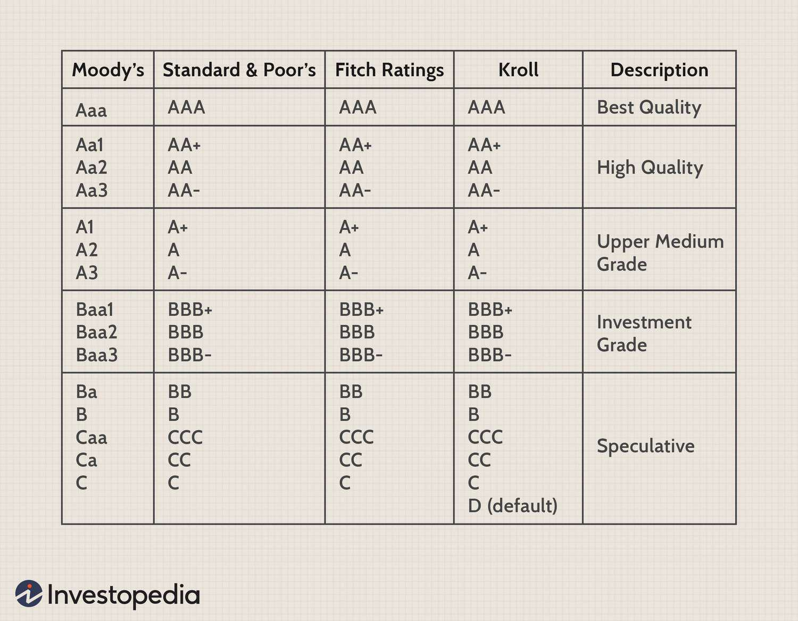

Understanding bond ratings is crucial for investors looking to navigate the financial landscape effectively. In particular, Ba3/BB- bond ratings, provided by credit rating agencies such as Moody's, Standard & Poor's, and Fitch, offer important insights into the risk and return profiles of certain debt instruments. These ratings are categorized as speculative, implying that they carry a higher risk and are not considered investment grade. Commonly referred to as 'junk bonds,' these instruments often offer higher yield opportunities as compensation for the increased risk.

This article will investigate Ba3/BB- bond ratings, examining the associated risks and yields that come with such investments. We will analyze the criteria used by rating agencies to assign these ratings, thus providing investors with a clearer understanding of the factors contributing to the speculative nature of these bonds. Understanding these ratings helps investors to better assess the risk and potential return involved in these investments, thereby refining their investment strategies.

Furthermore, we will explore the integration of automated trading systems in evaluating and acting upon these ratings. Algorithmic trading has revolutionized the bond market by leveraging data analytics and machine learning to identify profitable trading opportunities and optimize investment strategies in real-time. These technologies process vast amounts of financial data, allowing investors to respond swiftly to rating changes and market conditions, potentially mitigating some risks associated with speculative bonds.

Our goal is to provide a comprehensive insight into the implications of Ba3/BB- ratings within financial markets, highlighting the balance between their risk and reward potential. By examining the role of algorithmic trading in interpreting these ratings, we aim to offer valuable perspectives on how technology can aid in maximizing investment returns while managing exposure to higher-risk debt instruments.

## Table of Contents

## What is Ba3/BB-?

Ba3/BB- ratings are a tier of credit ratings provided by the major credit rating agencies: Moody's Investors Service, Standard & Poor's (S&P), and Fitch Ratings. These ratings are pivotal in determining the creditworthiness of debt instruments, such as bonds, and guide investors in evaluating risk levels associated with these financial products.

### Credit Rating Agencies and Ba3/BB- Ratings

**Moody's Ratings:**

Moody's assigns a Ba3 rating to debt instruments that exhibit speculative elements and are subject to substantial credit risk. The letter 'B' suggests that these bonds are of lesser quality compared to investment-grade bonds, while the subscript 'a' and number '3' help denote the specific category within the broader speculative grade. According to Moody's rating scale, bonds rated Ba are considered to have significant speculative characteristics, but a Ba3 rating lies near the threshold of moving down into the more risk-laden 'B' category. [1](https://www.moodys.com/)

**Standard & Poor’s (S&P) Ratings:**

The BB- rating by S&P denotes elements of speculation and a higher exposure to potential financial instability. Bonds under the BB category fall below the 'BBB' investment-grade threshold but above the 'B' rating, denoting that while they are more risky than investment-grade bonds, they present less risk than bonds in the 'B' category. The minus sign indicates a relative distinction within the BB category, suggesting a closer proximity to a B+ rating. [2](https://www.standardandpoors.com)

**Fitch Ratings:**

Fitch uses a similar scale and criteria as S&P for rating bonds. A BB- rating by Fitch suggests that the debt is speculative but carries lower risks compared to bonds in the broader 'B' category. The 'BB' denotes exposures to business or financial risk, which while significant, remain within manageable levels relative to lower-rated bonds. [3](https://www.fitchratings.com)

### Placement within the Broader Credit Spectrum

The Ba3/BB- ratings are integral components of the speculative-grade category, colloquially known as 'junk bonds'. These bonds provide higher yields to compensate for their increased risk of default. Ratings in the speculative category are critical as they border investment-grade ratings, which typically begin at Baa3/BBB-. Understanding this spectrum is crucial as it delineates a shift from high-quality, lower-risk bonds to those with greater potential rewards but also higher risks.

### Implications for Investors

Investors interpreting Ba3/BB- ratings must recognize the substantial credit risk involved. While they are not considered to have the safety of investment-grade bonds, they have not descended into the deepest levels of speculative-grade credit ratings either. This slightly higher standing can offer enticing yield opportunities for investors willing to accept this level of credit risk.

In summary, Ba3/BB- ratings serve as a significant indicator for investors to understand the balance between potential risks and returns. By grasping the nuances of how Moody's, S&P, and Fitch categorize these ratings, investors can make informed decisions regarding speculative bond investments.

### References

1. Moody’s Investors Service, [Credit Ratings](https://www.moodys.com/)
2. Standard & Poor’s, [Ratings Definitions](https://www.standardandpoors.com)
3. Fitch Ratings, [Rating Scales](https://www.fitchratings.com)

## Risks Associated with Ba3/BB- Ratings

Bonds with Ba3/BB- ratings, identified as speculative or "junk bonds," inherently [carry](/wiki/carry-trading) a higher risk of default compared to investment-grade bonds. This elevated risk necessitates the demand for higher yields by investors as compensation for taking on such uncertainties. The rationale for this is rooted in the creditworthiness and financial stability of the issuers, which are considered weaker compared to those with higher ratings.

Economic downturns significantly impact the creditworthiness of these bonds. During such periods, the financial performance of companies often deteriorates, adversely affecting their ability to meet debt obligations. This impact is more pronounced in Ba3/BB- rated bonds due to the borrowers' existing financial vulnerabilities. Company-specific issues such as poor management decisions, legal challenges, or market shifts can also exacerbate the risk of default, further diminishing the perceived credit quality.

Credit rating downgrades present another layer of risk for bondholders. Such downgrades can result from a deterioration in the issuer's financial position or adverse sectoral trends, leading to increased borrowing costs and a decline in bond prices. For investors, this situation can cause capital losses and reduced [liquidity](/wiki/liquidity-risk-premium), making it challenging to [exit](/wiki/exit-strategy) positions without incurring significant losses.

To manage these risks, investors in speculative bonds like those rated Ba3/BB- can employ several strategies:

1. **Diversification**: Spreading investments across a wide array of bonds can mitigate individual credit risk. By not concentrating holdings in a single issuer or sector, investors can reduce the impact of any single default event on their portfolios.

2. **Credit Analysis**: Conducting thorough credit analysis helps in understanding the issuer’s financial health and industry conditions. Investors should closely monitor key financial indicators such as cash flow, debt levels, and operational efficiency to assess ongoing risk.

3. **Use of Credit Derivatives**: Instruments such as credit default swaps (CDS) can be used to hedge against default risk. CDS allows investors to transfer the credit exposure to another party in exchange for periodic payments, providing a level of risk mitigation.

4. **Active Portfolio Management**: Regularly reviewing and adjusting the bond portfolio in response to credit rating changes and market conditions is essential. Staying vigilant and responsive can help in optimizing returns and reducing potential losses.

In conclusion, while Ba3/BB- bonds offer attractive yields, they demand careful risk management strategies to protect against the inherent default risks. Understanding the influence of economic cycles and company-specific factors is crucial for investors navigating the speculative bond market.

## Yield Opportunities of Ba3/BB- Bonds

Ba3/BB- bonds, often labeled as speculative or "junk bonds," present a distinctive investment opportunity due to their higher yield potential. The yields associated with these bonds typically compensate investors for the elevated risk, influenced by their higher likelihood of default compared to investment-grade securities.

### Yield-to-Maturity and Yield-to-Call

For Ba3/BB- rated bonds, investors primarily consider two types of yields: yield-to-maturity (YTM) and yield-to-call (YTC). The YTM is the total return anticipated on a bond if held until it matures. Conversely, YTC represents the yield when the bond is called before its maturity date, which companies might choose to do if interest rates fall, allowing them to refinance at lower rates. Typically, Ba3/BB- bonds exhibit higher YTMs and YTCs compared to similar-duration, higher-rated bonds, reflecting their riskier profile. This higher yield acts as a compensation mechanism for investors willing to take on additional risk.

### Historical Yield Performance

Historically, Ba3/BB- bonds have displayed significant yield performance variations influenced by economic cycles. During periods of economic expansion, these bonds often perform well, driven by improved credit conditions and robust investor demand for higher yields. However, during economic contractions, default rates may increase, affecting returns negatively.

A retrospective analysis reveals that during the early 2000s and post-2008 financial recovery, Ba3/BB- bonds provided attractive yields, often outperforming stocks in terms of total returns when adjusted for market [volatility](/wiki/volatility-trading-strategies) and economic conditions. Conversely, during economic slowdowns or crises, yield spreads between speculative-grade and investment-grade bonds tended to widen significantly.

### Comparative Yield Analysis

Comparing Ba3/BB- bonds to higher-rated securities, such as those rated A or AA, demonstrates a substantial yield premium. This yield differential, often referred to as the credit spread, quantifies the additional yield demanded by investors for bearing higher credit risk. For instance, during stable economic periods, Ba3/BB- bonds might offer a yield advantage of 200 to 500 basis points over A-rated bonds.

### Risk vs. Reward Considerations

Investors assessing Ba3/BB- bonds must weigh the potential for higher yields against the associated risks. These considerations include the issuer's creditworthiness, market liquidity, [interest rate](/wiki/interest-rate-trading-strategies) trends, and broader economic indicators. A careful analysis of a bond's financial health, industry sector, and macroeconomic factors is critical in determining whether the prospective returns justify the elevated risk.

Moreover, diversification across multiple speculative-grade issuers can mitigate some risks. Portfolio strategies incorporating Ba3/BB- bonds should align with the investor's risk tolerance, investment horizon, and financial goals. Ultimately, while these bonds offer attractive yield opportunities, a disciplined and informed approach is essential to exploit these benefits effectively while managing potential downsides.

## Algorithmic Trading and Bond Ratings

The integration of [algorithmic trading](/wiki/algorithmic-trading) into bond markets, especially for speculative-grade bonds such as those rated Ba3/BB-, has significantly transformed the landscape. Algorithms are now a crucial tool in evaluating and trading bonds, leveraging the power of data-driven analytics and [machine learning](/wiki/machine-learning).

Algorithms use a combination of historical data, real-time market information, and predictive models to assess bonds with ratings like Ba3/BB-. These ratings, indicative of a higher default risk compared to investment-grade bonds, necessitate precise analysis to identify potential trading opportunities. By processing vast amounts of data, algorithms can detect patterns and trends that may not be immediately apparent to human traders. This enhanced analytical capability enables more informed decision-making about when to buy or sell these speculative bonds.

Data analytics and machine learning technologies further bolster the efficiency of algorithmic trading strategies. Machine learning models can be trained on historical bond performance data, incorporating numerous variables such as interest rates, economic indicators, and credit rating changes. These models predict future price movements and potential yield opportunities, enabling traders to optimize their investment portfolios. For example, a supervised learning model might be implemented to classify bonds as buy, hold, or sell, based on current market conditions and projected trends.

The ability to respond in real-time to rating changes represents a significant advantage of algorithmic trading. When a bond's rating is downgraded or upgraded, algorithms can instantly adjust trading strategies to mitigate potential losses or capitalize on favorable shifts in pricing. This immediacy is particularly valuable in volatile markets, where rapid responses can make a substantial difference in investment outcomes.

Moreover, algorithmic trading can help manage the risks associated with speculative bonds. By using sophisticated risk management algorithms, traders can set parameters for maximum acceptable losses and dynamically adjust their portfolios to align with changing market conditions. These algorithms often employ techniques like Value at Risk (VaR) models or stress testing to evaluate the potential impact of adverse market movements.

In conclusion, the utilization of algorithmic trading offers significant advantages in the context of trading Ba3/BB- rated bonds. By harnessing the capabilities of data analytics and machine learning, traders can efficiently process credit ratings and market data to make informed investment decisions. This automation not only optimizes yields but also provides robust risk management strategies, making speculative bond investing more accessible and potentially profitable.

## Conclusion

Ba3/BB- ratings are crucial tools used in evaluating the risk and potential rewards associated with bond investments. Although these bonds present elevated risk levels due to their speculative status, they simultaneously offer substantial yield opportunities that attract investors seeking higher returns. Algorithmic trading significantly enhances the ability to manage these risks and optimize returns by swiftly analyzing quantitative data, monitoring market conditions, and executing trades based on real-time information.

When considering investments in Ba3/BB- rated bonds, it is essential for decisions to be grounded in a thorough understanding of bond ratings, current market dynamics, and personal financial objectives. This approach ensures that investment strategies are both informed and resilient. Furthermore, leveraging advancements in technology and staying abreast of credit rating alterations are critical for investors aiming for success in speculative markets. Through technological tools and informed analysis, investors can better balance risk and return, enhancing their investment outcomes.

## FAQs

### What factors lead to a bond being rated Ba3 or BB-?

Bonds are rated Ba3 by Moody’s or BB- by Standard & Poor’s and Fitch based on several factors that indicate their speculative nature. These factors include the issuer's creditworthiness, financial stability, historical performance, and capacity to meet financial commitments. Key determinants influencing these ratings are:

1. **Financial Ratios**: Metrics like the debt-to-equity ratio, interest coverage ratio, and profit margins provide insight into the issuer’s financial health.

2. **Business Risk**: The issuer’s industry position, competitiveness, and market dynamics affect its ability to generate revenue and service debt.

3. **Economic Environment**: Macro-economic conditions, such as GDP growth, unemployment rates, and inflation, can impact an issuer's default risk.

4. **Operational Efficiency**: The company’s management competence, operational performance, and cost efficiency also play a crucial role.

### How do Ba3/BB- ratings differ between Moody’s, S&P, and Fitch?

While Moody’s, S&P, and Fitch have similar criteria for assessing credit risk, there are differences in their rating scales and methodologies:

- **Moody’s Rating Approach**: Moody’s uses a unique alphanumeric system where Ba3 signifies speculative grade, indicating moderate credit risk with non-investment grade characteristics. The focus is more on the qualitative aspects, such as management evaluation alongside financial metrics.

- **S&P and Fitch**: Both use a similar letter-grade system, and BB- represents the lower spectrum of speculative grade, meaning increased vulnerability to adverse conditions. S&P and Fitch place a stronger emphasis on quantitative financial analysis.

Despite these differences, all three agencies classify Ba3/BB- bonds as non-investment grade with actionable alerts for potential investors regarding increased risk levels.

### What are the common strategies for investing in speculative bonds?

Investing in speculative bonds, such as those rated Ba3/BB-, implies higher risk and requires specific strategies to balance potential rewards:

1. **Diversification**: Spreading investments across multiple issuers and sectors to reduce exposure to any single issuer's default.

2. **Credit Analysis**: Conduct thorough credit analysis and due diligence beyond ratings to understand the issuer's fundamentals and growth prospects.

3. **Yield Analysis**: Compare yield opportunities with risk profiles using metrics like yield-to-maturity and yield-to-call.

4. **Economic Indicators Monitoring**: Keeping track of economic indicators that might signal changes in the issuer's credit profile.

5. **Active Management**: Regularly review and adjust the bond portfolio to manage risks as market conditions fluctuate.

### How can automated trading systems mitigate risks associated with lower-rated bonds?

Automated trading systems use sophisticated algorithms and data analytics to address the risks of speculative bonds through the following:

1. **Real-Time Data Processing**: Quickly assimilate vast quantities of market data and ratings updates to execute informed trades.

2. **Risk Assessment Models**: Employ machine learning models to predict potential default probabilities and price volatility.

3. **Immediate Reaction to Rating Changes**: React swiftly to any rating adjustments, thereby minimizing financial exposure.

4. **Algorithm-Driven Diversification**: Algorithms can diversify bond portfolios automatically, optimizing asset allocation to balance risk and return.

5. **Scenario Analysis**: Simulate various economic and market scenarios to test the resilience of bond portfolios, enabling preemptive strategy formulation.

### Where can investors find up-to-date information on bond rating changes?

Investors seeking current bond rating information can use several reliable sources:

1. **Rating Agencies Websites**: Direct access to Moody’s, S&P, and Fitch websites provides the latest reports and rating changes.

2. **Financial News Platforms**: Websites like Bloomberg, Reuters, and The Wall Street Journal offer timely updates and analysis on bond markets.

3. **Trading Platforms**: Many online brokerage platforms provide real-time data feeds and alerts for bond rating changes and market shifts.

4. **Investment Research Services**: Subscriptions to services like Morningstar or Fitch Solutions offer comprehensive research and insights.

5. **Regulatory Filings**: Monitoring SEC filings and other regulatory disclosures for pertinent information regarding corporate debt issues and ratings.

## References & Further Reading

[1]: Moody’s Investors Service. [Credit Ratings](https://en.wikipedia.org/wiki/Moody%27s_Ratings)

[2]: Standard & Poor’s. [Ratings Definitions](https://www.spglobal.com/ratings/en/research/articles/190705-s-p-global-ratings-definitions-504352)

[3]: Fitch Ratings. [Rating Scales](https://www.fitchratings.com/products/rating-definitions)

[4]: Lopez de Prado, M. (2018). ["Advances in Financial Machine Learning."](https://www.amazon.com/Advances-Financial-Machine-Learning-Marcos/dp/1119482089) John Wiley & Sons.

[5]: Aronson, D. R. (2006). ["Evidence-Based Technical Analysis: Applying the Scientific Method and Statistical Inference to Trading Signals."](https://www.amazon.com/Evidence-Based-Technical-Analysis-Scientific-Statistical/dp/0470008741) John Wiley & Sons.