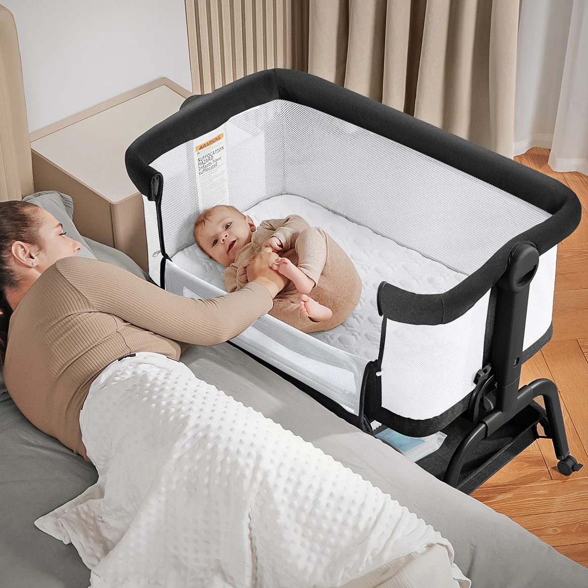

## Table of Contents

## What is a Baby Bond?

A Baby Bond is a special savings account that the government gives to every newborn baby. The idea is to help all kids start their adult life with some money saved up. This money can be used when they become adults, usually between the ages of 18 and 30, to help them buy a home, start a business, pay for education, or save for retirement.

The amount of money in the Baby Bond account can grow over time. It depends on how much the government puts in at the start and how well the money is invested. The goal is to give everyone a fair chance, especially those born into families with less money. By giving every child a Baby Bond, it can help reduce inequality and give everyone a better start in life.

## How does a Baby Bond work?

A Baby Bond works by giving every newborn baby a special savings account from the government. When a baby is born, the government puts some money into this account. The amount of money can be different for each baby, depending on how much their family earns. If a family earns less money, the baby might get more money in their Baby Bond account. This money then grows over time because it is invested.

When the child grows up and becomes an adult, usually between 18 and 30 years old, they can use the money in their Baby Bond account. They can use it to buy a house, start a business, pay for school, or save for when they are older. The idea is to help everyone have a fair start in life, no matter how much money their family has. By giving every child a Baby Bond, it can help make things more equal and give everyone a better chance to succeed.

## What is the purpose of a Baby Bond?

The main purpose of a Baby Bond is to give every child a fair start in life. By giving each newborn baby a special savings account from the government, Baby Bonds help make sure that all kids, no matter how much money their family has, have some money saved up for when they become adults. This can be really helpful for kids from families that don't have a lot of money, as it gives them a better chance to succeed.

When these kids grow up, they can use the money in their Baby Bond account to do important things like buying a house, starting a business, paying for school, or saving for when they are older. The idea is to reduce inequality and help everyone have a good start in life. By making sure every child has a Baby Bond, it can help create a more equal society where everyone has the opportunity to do well.

## Who qualifies for a Baby Bond?

Every baby born in a place where Baby Bonds are offered qualifies for one. This means that as soon as a baby is born, they get a special savings account from the government. The idea is to help all kids, no matter how much money their family has, have some money saved up for when they grow up.

The amount of money put into a Baby Bond can be different for each baby. Babies from families that earn less money might get more money in their Baby Bond account. This is to make things more fair and give every child a good start in life. When the child becomes an adult, they can use this money to help them buy a home, start a business, go to school, or save for the future.

## What are the potential benefits of Baby Bonds?

Baby Bonds can help make things more equal for everyone. When every baby gets a special savings account from the government, it means that kids from families with less money have a better chance to succeed. This money can grow over time and be used when the child becomes an adult. It can help them buy a house, start a business, go to school, or save for the future. By giving everyone a fair start, Baby Bonds can reduce the gap between rich and poor people.

Another benefit of Baby Bonds is that they encourage people to save money. Knowing that they have a special account that can grow over time might make young people think more about saving and planning for the future. This can lead to better financial habits and more security when they are adults. Overall, Baby Bonds can help create a society where everyone has a better chance to do well in life.

## What are the criticisms or challenges associated with Baby Bonds?

Some people worry that Baby Bonds might be too expensive for the government to set up and keep running. It takes a lot of money to give every baby a special savings account, and then the government has to keep track of all these accounts and make sure the money is growing. People who think this way say that the government might have better ways to spend its money, like helping people who need it right now instead of saving money for babies who won't use it for many years.

Another challenge is making sure the money in Baby Bond accounts is used in the right way. When kids grow up and can use the money, they might not spend it on things like buying a house or going to school. They might spend it on other things that don't help them in the long run. This makes some people think that Baby Bonds might not work as well as we hope, because the money might not be used to really help people have a better future.

There are also worries about how fair Baby Bonds are. Even though the idea is to help all kids have a fair start, some people say that giving different amounts of money based on how much a family earns might not be the best way to do it. They think that everyone should get the same amount of money, no matter how rich or poor their family is. This way, it would be more about giving everyone an equal chance instead of trying to fix the differences between rich and poor families.

## How are Baby Bonds funded?

Baby Bonds are usually funded by the government. The money comes from taxes that people pay. The government sets aside some of this tax money to put into the special savings accounts for every baby born. The amount of money that goes into each baby's account can be different. It depends on how much money the baby's family earns. Babies from families with less money might get more money in their Baby Bond account.

The money in the Baby Bond accounts is then invested. This means it is used to buy things like stocks or bonds that can grow in value over time. The government works with banks or investment companies to make sure the money is growing. As the money grows, the account gets bigger, so when the child becomes an adult, they have more money to use for important things like buying a house or going to school.

## What are some examples of Baby Bond programs around the world?

In the United States, one example of a Baby Bond program is the "American Opportunity Accounts" proposed by Senator Cory Booker. This plan would give every baby born in the U.S. a savings account with money from the government. The amount of money would depend on how much the family earns, with babies from poorer families getting more money. The money would grow over time and could be used when the child turns 18 for things like buying a home, starting a business, or paying for education.

Another example is in the United Kingdom, where a program called the "Child Trust Fund" was introduced in 2005. Every baby born between September 1, 2002, and January 2, 2011, got a special savings account with money from the government. The amount was the same for every baby, and the money could be used when the child turned 18. The goal was to help young people have some money to start their adult life, but the program was stopped in 2011 due to costs.

## How do Baby Bonds compare to other wealth-building initiatives?

Baby Bonds are different from other wealth-building initiatives because they give money to every baby at birth. Other programs, like tax breaks for people who invest in certain things or special savings accounts for education, usually help people who already have some money. Baby Bonds want to help all kids, no matter how much money their family has, so they start life with some savings. This can be really helpful for kids from families that don't have a lot of money, giving them a better chance to succeed.

Other wealth-building initiatives, like homeownership programs or retirement accounts, focus on helping people at different times in their life. For example, homeownership programs might help adults buy a house, while retirement accounts help people save money for when they are older. Baby Bonds are special because they start helping people right from the beginning of their life. By the time these kids grow up, they have money saved that can be used for big things like buying a home, starting a business, or going to school. This makes Baby Bonds a unique way to help build wealth for everyone, not just those who already have some.

## What are the key considerations for implementing a Baby Bond program?

When thinking about starting a Baby Bond program, it's really important to look at how much money it will cost. The government needs to set aside money from taxes to put into these special savings accounts for every baby born. This can be a lot of money, so the government has to make sure it can afford it. Also, the government needs to decide how much money to give each baby. Some people think babies from families with less money should get more money to make things more fair. But others think every baby should get the same amount, no matter how rich or poor their family is.

Another big thing to consider is how to make sure the money in the Baby Bond accounts grows over time. The government will need to work with banks or investment companies to invest the money in things like stocks or bonds. This way, the money can get bigger and be worth more when the kids grow up. It's also important to think about how the money will be used when the kids become adults. The government needs to make rules about what the money can be spent on, like buying a house, starting a business, or going to school, to make sure it helps the kids have a better future.

## What alternatives to Baby Bonds exist for promoting economic equity?

One alternative to Baby Bonds is giving families more money each month, called a universal basic income. This means everyone gets a certain amount of money from the government every month, no matter how much they earn. It can help families with less money have more to spend on things they need, like food, rent, and clothes. By having more money each month, families can save some of it for the future, which can help their kids have a better start in life. This way, it helps make things more equal for everyone.

Another way to promote economic equity is through education and job training programs. These programs help people learn new skills and get better jobs. If everyone has the chance to go to school and learn, they can earn more money and build wealth over time. Some programs even pay people while they learn, so they can keep earning money while getting new skills. By helping everyone get a good education and job training, it can make sure everyone has a fair chance to succeed and build a better life for themselves and their families.

## How can the effectiveness of Baby Bonds and their alternatives be measured and evaluated?

The effectiveness of Baby Bonds can be measured by looking at how much the money in the accounts grows over time and how people use it when they become adults. Researchers can track the accounts to see if the money is being invested well and if it's growing enough to make a difference. When the kids grow up, they can see if the money is being used for things like buying a house, starting a business, or going to school. By comparing the lives of people who had Baby Bonds with those who didn't, they can see if the program is helping to make things more equal and giving everyone a better start in life.

Alternatives like universal basic income and education programs can be evaluated in similar ways. For universal basic income, researchers can look at how families spend the extra money each month and if it helps them save for the future. They can compare families who get the money with those who don't to see if it makes a difference in their lives. For education and job training programs, the effectiveness can be measured by seeing how many people finish the programs and get better jobs. By looking at their income and savings over time, researchers can see if these programs help people build wealth and have a more equal chance in life.

## References & Further Reading

[1]: Bogle, J. C. (2009). *Common Sense on Mutual Funds: New Imperatives for the Intelligent Investor*. John Wiley & Sons.

[2]: Narang, R. K. (2013). *Inside the Black Box: A Simple Guide to Quantitative and High-Frequency Trading*. John Wiley & Sons.

[3]: Bergstra, J., Bardenet, R., Bengio, Y., & Kégl, B. (2011). ["Algorithms for Hyper-Parameter Optimization."](https://dl.acm.org/doi/10.5555/2986459.2986743) Advances in Neural Information Processing Systems 24.

[4]: Lopez de Prado, M. (2018). ["Advances in Financial Machine Learning."](https://www.amazon.com/Advances-Financial-Machine-Learning-Marcos/dp/1119482089) Wiley.

[5]: Chan, E. P. (2009). ["Quantitative Trading: How to Build Your Own Algorithmic Trading Business."](https://github.com/ftvision/quant_trading_echan_book) Wiley.