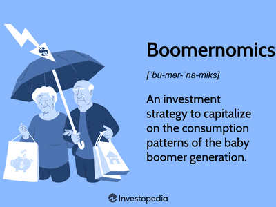

## Table of Contents

## What is the Baby Boomer Age Wave Theory?

The Baby Boomer Age Wave Theory is an idea about how the large group of people born between 1946 and 1964, called Baby Boomers, will affect society as they get older. This theory says that because there are so many Baby Boomers, they will have a big impact on things like the economy, health care, and social services as they age. It's like a big wave moving through time, changing everything it touches.

As Baby Boomers retire, they will need more health care and might strain the resources available. This could mean higher costs for everyone and changes in how health care is provided. Also, because there are so many of them, they might change what people think about getting older and even influence politics and culture. The Baby Boomer Age Wave Theory helps people plan for these changes and think about how to handle them.

## Who are considered Baby Boomers?

Baby Boomers are people born between 1946 and 1964. This time after World War II saw a big increase in the number of babies born, which is why they are called Baby Boomers. They make up a large part of the population in many countries, especially in the United States.

As they grew up, Baby Boomers had a big impact on society. They influenced things like music, fashion, and politics. Now that they are getting older, they continue to affect areas like health care and the economy because there are so many of them.

## How does the Baby Boomer Age Wave Theory impact society?

The Baby Boomer Age Wave Theory says that as Baby Boomers get older, they will change society in big ways. Because there are so many Baby Boomers, they will need a lot of health care. This could make health care more expensive and harder to get for everyone. Also, when Baby Boomers retire, they might not have enough money saved up. This could mean they need more help from the government, like social security, which might put a strain on those programs.

Baby Boomers also change how we think about getting old. They are a big group, so they can influence what people think is normal for their age. They might want to keep working or stay active longer than people used to. This could change things like laws about retirement and how businesses treat older workers. Overall, the Baby Boomer Age Wave Theory helps us understand and plan for the big changes that come with so many people getting older at the same time.

## What are the key demographic characteristics of Baby Boomers?

Baby Boomers are people born between 1946 and 1964. They are a big group because after World War II, a lot more babies were born. This makes them a large part of the population in many countries, especially in the United States. They are now between about 60 and 78 years old. Because there are so many of them, they have always had a big impact on society.

As they get older, Baby Boomers are changing things like health care and the economy. Many of them are retiring, which means they might need more help from doctors and hospitals. They also might not have saved enough money for retirement, so they could need more support from the government. Baby Boomers are also changing what it means to be old. They want to stay active and might keep working longer than people used to.

## How does the Baby Boomer Age Wave affect the economy?

The Baby Boomer Age Wave affects the economy a lot because there are so many Baby Boomers. As they get older and retire, they stop working and start spending their savings. This can slow down the economy because fewer people are working and making money. Also, Baby Boomers might not have saved enough money for retirement. This means they might need more help from the government, like social security. If a lot of people need this help, it can put a strain on the government's money and make taxes go up for everyone.

Another way the Baby Boomer Age Wave impacts the economy is through health care. As Baby Boomers get older, they need more doctors and hospitals. This makes health care more expensive for everyone. The government might have to spend more money on health care programs like Medicare. Businesses might also have to change how they work to keep older workers or find new workers to replace the ones who retire. All these changes can make the economy different from what it used to be.

## What are the social implications of the Baby Boomer Age Wave?

The Baby Boomer Age Wave has big social effects because there are so many Baby Boomers. As they get older, they need more help from health care and social services. This means that hospitals and doctors might be busier, and it could be harder for everyone to get the care they need. It also means that the government might have to spend more money on programs like Medicare and social security to help Baby Boomers. This could make taxes go up or make it harder for younger people to get help from these programs.

Another social effect is how Baby Boomers change what people think about getting old. They are a big group, so they can change ideas about what is normal for their age. Many Baby Boomers want to stay active and might keep working longer than people used to. This could mean changes in laws about when people can retire and how businesses treat older workers. It might also change how families work, with more grandparents staying active in their grandchildren's lives. Overall, the Baby Boomer Age Wave makes society think differently about aging and plan for the future in new ways.

## How has the Baby Boomer Age Wave influenced healthcare systems?

The Baby Boomer Age Wave has made a big impact on healthcare systems. There are so many Baby Boomers that as they get older, they need more doctors and hospitals. This makes healthcare more expensive for everyone because there are more people needing help. The government also has to spend more money on programs like Medicare to take care of Baby Boomers. This can mean higher taxes or less money for other things.

Because there are so many Baby Boomers, healthcare systems have to change. They need to find ways to take care of a lot of older people at the same time. This might mean building more hospitals or training more doctors and nurses. It also means that healthcare systems have to think about new ways to help people stay healthy as they get older, like focusing on preventing sickness instead of just treating it. Overall, the Baby Boomer Age Wave is making healthcare systems work harder and change to meet the needs of a big group of older people.

## What are the political consequences of the Baby Boomer Age Wave?

The Baby Boomer Age Wave has big effects on politics because there are so many Baby Boomers. When they vote, they can change what politicians do and what laws get made. Baby Boomers might want different things than younger people, like more money for health care and social security. This can make politicians focus on those things more. Also, because Baby Boomers are a big group, they can have a lot of power in elections. Politicians might try to make them happy so they can win votes.

Another way the Baby Boomer Age Wave affects politics is by changing what people think about getting old. Baby Boomers might want to keep working longer or stay active, so they could push for laws that help them do that. This might mean changing rules about when people can retire or making it easier for older people to find jobs. As Baby Boomers get older, they might also care more about issues like health care and how to pay for it, which can change what politicians talk about and what they try to do.

## How do generational shifts relate to the Baby Boomer Age Wave Theory?

Generational shifts mean changes that happen when one group of people, like the Baby Boomers, gets older and a new group, like Millennials, starts to have more influence. The Baby Boomer Age Wave Theory is all about how the big group of Baby Boomers, born between 1946 and 1964, affects society as they age. Because there are so many of them, their needs and wants can change things like health care, the economy, and even politics. As Baby Boomers get older, they need more help from doctors and might need more money from the government, which can make everything different for the whole society.

These generational shifts also change how different age groups work together. As Baby Boomers retire, younger people like Millennials and Gen Z start to take over jobs and have more say in what happens. This can lead to new ideas and ways of doing things, but it can also cause tension between the older and younger generations. The Baby Boomer Age Wave Theory helps us understand how these changes happen and how to plan for them, so that everyone can work together better and make society better for all ages.

## What future trends can we predict based on the Baby Boomer Age Wave?

As the Baby Boomers keep getting older, they will need more help from health care. This means hospitals and doctors will be busier, and health care might get more expensive for everyone. The government will also have to spend more money on programs like Medicare to take care of Baby Boomers. This could mean higher taxes or less money for other things. To handle this, health care systems might have to find new ways to help people stay healthy as they get older, like focusing on preventing sickness instead of just treating it.

The economy will also change because of the Baby Boomer Age Wave. As more Baby Boomers retire, fewer people will be working and making money. This can slow down the economy. Also, many Baby Boomers might not have saved enough money for retirement, so they could need more help from the government, like social security. This could put a strain on the government's money and might make taxes go up. Businesses might have to change how they work to keep older workers or find new workers to replace the ones who retire.

In politics, the Baby Boomer Age Wave will keep having a big impact. Baby Boomers can change what politicians do and what laws get made because they are a big group. They might want more money for health care and social security, so politicians will focus on those things more. Also, as Baby Boomers get older, they might push for laws that help them stay active and keep working longer. This could change rules about retirement and how older people are treated in society.

## How have different countries experienced the Baby Boomer Age Wave differently?

Different countries have felt the Baby Boomer Age Wave in their own ways because the number of Baby Boomers and how they live can be different in each place. In the United States, there are a lot of Baby Boomers, so they have had a big impact on things like health care and the economy. As they get older, they need more doctors and hospitals, which makes health care more expensive. Also, many Baby Boomers in the U.S. are retiring, which means they stop working and start using their savings. This can slow down the economy because fewer people are making money.

In Japan, the Baby Boomer Age Wave is also important, but it's a bit different. Japan has an even older population than the U.S., so they have to deal with a lot of older people needing help. This makes health care and social services very busy and expensive. Japan also has a smaller number of young people, so it's harder for them to take care of the older Baby Boomers. This means Japan has to find new ways to help older people stay healthy and active, like using more technology in health care.

In Europe, countries like Germany and the UK also have a lot of Baby Boomers, but their experiences can be different from each other. In Germany, the government has to spend a lot of money on health care and pensions for Baby Boomers, which can make taxes higher. In the UK, the National Health Service (NHS) is feeling the strain from more older people needing care. Both countries have to plan for how to take care of their aging populations, but they do it in their own ways based on their own rules and money.

## What are the criticisms and limitations of the Baby Boomer Age Wave Theory?

Some people think the Baby Boomer Age Wave Theory is too simple. It says that because there are a lot of Baby Boomers, they will change everything as they get older. But, not all Baby Boomers are the same. They live in different places and have different jobs and money. So, it's hard to say they will all need the same things or change society in the same way. Also, the theory might make people think that only Baby Boomers matter, but younger people and other groups are important too. They can change things just as much as Baby Boomers.

Another problem with the Baby Boomer Age Wave Theory is that it might make us focus too much on problems and not enough on solutions. It talks a lot about how health care and the economy might get harder because of Baby Boomers, but it doesn't always say what we can do about it. Also, the theory can make people worry too much about the future. It might make us think that things will get worse, but we can find ways to make them better. We need to think about how to help everyone, not just worry about the Baby Boomers getting older.

## References & Further Reading

[1]: Ken Dychtwald. ["Age Wave: How The Most Important Trend Of Our Time Will Change Your Future."](https://www.amazon.com/Age-Wave-Important-Change-Future/dp/055334806X) Bantam Books.

[2]: Harry S. Dent Jr. ["The Demographic Cliff: How to Survive and Prosper During the Great Deflation of 2014-2019."](https://www.amazon.com/Demographic-Cliff-Survive-Prosper-Deflation/dp/1591847885) Portfolio.

[3]: Ernest P. Chan. ["Quantitative Trading: How to Build Your Own Algorithmic Trading Business."](https://www.amazon.com/Quantitative-Trading-Build-Algorithmic-Business/dp/0470284889) Wiley.

[4]: Stefan Jansen. ["Machine Learning for Algorithmic Trading: Predictive models to extract signals from market and alternative data for systematic trading strategies with Python."](https://github.com/stefan-jansen/machine-learning-for-trading) Packt Publishing.

[5]: Marcos Lopez de Prado. ["Advances in Financial Machine Learning."](https://www.amazon.com/Advances-Financial-Machine-Learning-Marcos/dp/1119482089) Wiley.