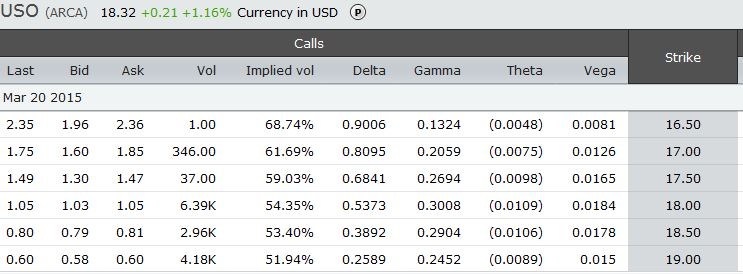

## Table of Contents

## What are back months in finance?

In finance, back months refer to the months that are further away from the current month in futures and options contracts. These contracts are agreements to buy or sell an asset at a future date, and they are organized by expiration dates. The months closest to the current date are called front months, while the later months are the back months. For example, if it's January now, February and March might be front months, and April, May, and June would be back months.

Back months are important because they can show what people think will happen to prices in the future. If more people want to buy contracts for back months, it might mean they expect prices to go up later. This information helps traders and investors make decisions. Also, back months usually have less trading activity than front months, which can make them riskier but also potentially more profitable if you guess right about future price changes.

## How do back months affect futures and options trading?

Back months in futures and options trading are important because they give us a peek into what people think will happen to prices far into the future. If lots of people are buying contracts for back months, it might mean they believe prices will go up later on. This helps traders and investors decide what to do. For example, if someone thinks the price of oil will be higher in six months, they might buy a back month contract for oil futures.

Trading in back months can be trickier than trading in front months. There's usually less activity in back months, which means fewer people are buying and selling these contracts. This can make prices move around more and be harder to predict. But if you guess right about what will happen in the future, trading back months can be more rewarding because the changes in price can be bigger. So, while back months can be riskier, they also offer chances for bigger gains if you make the right moves.

## Why are back months important for commodity traders?

Back months are important for commodity traders because they help them see what people think will happen to commodity prices in the future. If lots of people are buying contracts for back months, it might mean they expect the price of the commodity, like oil or wheat, to go up later. This information is really useful for traders because it helps them decide when to buy or sell their commodities. For example, if a trader thinks the price of corn will be higher in six months, they might buy a back month contract for corn futures.

Trading in back months can be riskier but also more rewarding. There's usually less trading happening in back months compared to front months, which means prices can move around a lot more. This can make it harder to predict what will happen, but if a trader guesses right about future prices, they can make more money. So, while back months can be a bit trickier to trade, they give commodity traders a chance to make bigger profits if they make the right decisions.

## What is the difference between front months and back months?

Front months and back months are terms used in futures and options trading to describe the timing of contract expirations. Front months are the months closest to the current date. For example, if it's January now, February and March might be front months. These are the months that people trade the most because they are coming up soon. Back months, on the other hand, are the months that are further away from the current month. If it's January, April, May, and June would be back months. These months have less trading happening because they are further in the future.

The difference between front and back months is important because it affects how traders make decisions. Front months are more popular and have more trading activity, so the prices are usually more stable and easier to predict. Traders use front months to make quick decisions based on what's happening right now. Back months, however, can show what people think will happen to prices far into the future. There's less trading in back months, which can make prices move around more and be harder to predict. But if a trader guesses right about what will happen later, they can make more money by trading back months.

## How can understanding back months help in predicting market trends?

Understanding back months can help traders predict market trends by giving them a look into what people think will happen to prices far into the future. If lots of people are buying contracts for back months, it might mean they expect prices to go up later. This can tell traders that there might be a trend coming where prices will increase. For example, if more traders are buying oil contracts for six months from now, it could mean they think oil prices will be higher then, signaling a future upward trend in the oil market.

Because there's usually less trading happening in back months, the prices can move around a lot more. This can make it harder to predict what will happen, but it also gives traders a chance to spot trends that others might miss. If a trader sees that the prices for back months are going up while the prices for front months are staying the same, it might mean a big change is coming. By watching back months, traders can get a head start on understanding and preparing for future market trends.

## What role do back months play in the pricing of financial instruments?

Back months play a big role in how financial instruments like futures and options are priced. They show what people think will happen to prices in the future. If lots of people are buying contracts for back months, it might mean they expect prices to go up later. This can make the price of those back month contracts go up because more people want them. On the other hand, if fewer people are buying, the prices might go down because there's less demand. So, the prices of back month contracts can tell us a lot about what people expect to happen in the market.

The prices of back months can also affect the overall pricing of financial instruments. Traders and investors look at the prices of back months to make decisions about what to buy or sell. If the prices of back months are going up, it might make the prices of other related financial instruments go up too. For example, if the back month prices for oil futures are rising, it might make the prices of oil stocks or other oil-related investments go up as well. By understanding back months, traders can get a better idea of where the market might be headed and price their financial instruments accordingly.

## How do back months influence the decision-making process in portfolio management?

Back months help portfolio managers make better decisions by showing them what people think will happen to prices in the future. If lots of people are buying contracts for back months, it might mean they expect prices to go up later. This can tell portfolio managers that it might be a good time to buy certain investments now, before prices go up. For example, if more traders are buying oil contracts for six months from now, a portfolio manager might decide to invest more in oil-related stocks because they think the price of oil will go up.

Understanding back months can also help portfolio managers plan for the long term. If the prices of back months are going up while the prices of front months are staying the same, it might mean a big change is coming. This can help managers decide to adjust their portfolios to take advantage of these future trends. By watching back months, portfolio managers can get a head start on understanding and preparing for future market changes, which can lead to better investment decisions and potentially higher returns.

## Can back months be used to assess the long-term stability of a financial market?

Back months can help assess the long-term stability of a financial market by showing what people think will happen to prices far into the future. If lots of people are buying contracts for back months, it might mean they expect the market to stay stable or even grow. On the other hand, if fewer people are buying back month contracts, it might mean they think the market could be unstable or prices could go down. By looking at how people are trading back months, you can get an idea of how confident they are about the market's future.

The prices of back months can also tell you a lot about the market's long-term health. If the prices of back months are going up steadily, it might mean the market is strong and stable. But if the prices are moving around a lot or going down, it could be a sign that the market is not as stable as it seems. By watching back months, you can spot trends that might not be clear when you just look at what's happening right now. This can help you understand if the market is likely to be stable over the long term.

## What are some strategies for trading based on back month data?

One strategy for trading based on back month data is to look for trends in the prices of back months compared to front months. If the prices of back months are going up while the prices of front months are staying the same, it might mean that people think prices will go up in the future. A trader could use this information to buy contracts for back months, hoping to sell them later at a higher price. This strategy can be risky because there's less trading in back months, but it can also be rewarding if the trader's guess about future prices is right.

Another strategy is to use back month data to spot changes in the market's long-term outlook. If more people are buying back month contracts, it might mean they think the market will be stable or grow over time. A trader could use this information to adjust their portfolio, maybe by investing more in certain commodities or stocks that they think will do well in the future. By watching back month data, traders can make decisions that are based on what they think will happen over the long term, not just what's happening right now.

A third strategy involves using back month data to hedge against future price changes. If a trader thinks prices will go down in the future, they might sell back month contracts to protect themselves from losing money. This can help them manage risk and keep their portfolio stable, even if the market changes. By using back month data to plan ahead, traders can make smarter decisions that help them stay safe in the market.

## How do back months impact the risk management strategies of financial institutions?

Back months help financial institutions manage risk by showing them what people think will happen to prices in the future. If lots of people are buying contracts for back months, it might mean they expect prices to go up later. This can help banks and other financial institutions decide how much risk to take. For example, if they see that people think oil prices will go up, they might decide to invest more in oil-related products because they think it's less risky. On the other hand, if fewer people are buying back month contracts, it might mean they think prices could go down, so the institutions might be more careful and take less risk.

Financial institutions also use back month data to plan their long-term strategies. If the prices of back months are going up steadily, it might mean the market is strong and stable. This can help them decide to hold onto certain investments for a longer time, knowing that they might be safer. But if the prices of back months are moving around a lot or going down, it could be a sign that the market is not as stable. In this case, financial institutions might use back month data to adjust their portfolios and protect themselves from big losses. By watching back months, they can make better decisions about how to manage risk over the long term.

## What advanced analytical tools are used to study back months in financial markets?

Financial experts use advanced tools like time series analysis to study back months in the market. This tool helps them look at how prices change over time and spot patterns. They can see if the prices of back months are going up or down and use this information to predict what might happen in the future. Another tool they use is regression analysis, which helps them understand how different factors affect the prices of back months. By looking at things like interest rates or economic news, they can figure out what makes prices go up or down.

Another important tool is volatility analysis, which helps experts measure how much prices might move around. This is useful because back months can be riskier, and knowing how much prices might change can help traders and financial institutions manage their risk better. They also use machine learning and artificial intelligence to study back months. These tools can look at huge amounts of data quickly and find patterns that humans might miss. By using these advanced tools, financial experts can make smarter decisions based on what they learn from back month data.

## How have historical back month trends influenced current financial theories and models?

Historical back month trends have played a big role in shaping how people think about and predict the future of financial markets. By looking at what happened in the past with back months, experts have learned that the prices of these months can tell us a lot about what people think will happen to prices far into the future. This has led to the development of theories like the expectations hypothesis, which says that the prices of futures contracts reflect what people expect will happen to prices later on. Understanding how back months have behaved in the past helps experts build models that can predict what might happen in the market next.

These historical trends have also influenced how financial models are made and used. For example, the Black-Scholes model, which is used to price options, takes into account the time until the contract expires. Back month data has shown that the longer the time until expiration, the more uncertainty there can be, which affects the price of the option. This has led to the creation of more advanced models that can handle the extra risk and uncertainty that come with trading back months. By studying back month trends from the past, financial experts can make better models that help them understand and predict the market's future behavior.

## References & Further Reading

[1]: Hull, J.C. (2018). [Options, Futures, and Other Derivatives](https://www.semanticscholar.org/paper/Options%2C-Futures%2C-and-Other-Derivatives-Hull/89bdee500c8623864fc9eb7a471546aa713acc44). Pearson.

[2]: Black, F., & Scholes, M. (1973). ["The Pricing of Options and Corporate Liabilities."](https://www.cs.princeton.edu/courses/archive/fall09/cos323/papers/black_scholes73.pdf) Journal of Political Economy.

[3]: Chan, E.P. (2009). [Quantitative Trading: How to Build Your Own Algorithmic Trading Business](https://github.com/ftvision/quant_trading_echan_book). Wiley.

[4]: Spooner, E. (2010). [U.S. Commodity Futures Trading: A Technical Analysis of the CFTC’s Commitment of Traders Reports](https://www.sciencedirect.com/science/article/abs/pii/S0140988304000209).

[5]: Coursera’s ["Trading Strategies in Emerging Markets"](https://www.coursera.org/specializations/trading-strategy) by the Indian School of Business.

[6]: edX’s ["Algorithmic Trading and Finance Models with Python, R, and Stata Essential Training"](https://www.linkedin.com/learning/algorithmic-trading-and-finance-models-with-python-r-and-stata-essential-training) by the New York Institute of Finance.

[7]: Investopedia. ["Futures"](https://www.investopedia.com/terms/f/futures.asp).

[8]: The Chicago Mercantile Exchange (CME) Group. [Educational Resources](https://www.cmegroup.com/education.html).

[9]: Bloomberg Markets. [Bloomberg.com](https://www.bloomberg.com/news/articles/2024-12-12/stock-market-today-dow-s-p-live-updates).

[10]: Reuters Commodities. [Reuters.com](https://www.reuters.com/markets/commodities/).