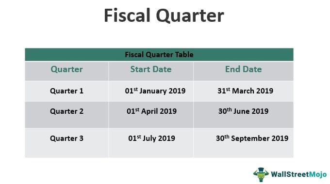

Futures contracts are standardized legal agreements to buy or sell a particular commodity or financial instrument at a predetermined price at a specified time in the future. These contracts are traded on futures exchanges and are crucial for enabling hedging and speculation within financial markets. Traders use futures contracts to manage risk associated with price fluctuations in various asset classes, including commodities, currencies, and indices. The certainty provided by these contracts allows businesses to stabilize costs and predict future revenue, ultimately fostering more predictable financial planning and risk management strategies.

‘Back months’ are a term in the futures market that refer to delivery months on futures contracts that are further out in time, beyond the nearest or ‘near month’ contracts. The significance of back months lies in their utility for long-term hedging strategies and speculative positions that anticipate future price movements over a more extended period than near-month contracts. Traders and investors often utilize back months to capitalize on longer-term trends or to hedge against anticipated future events that could affect market prices.



Algorithmic trading, often referred to as algo trading, involves the use of computer algorithms to automate trading decisions in the financial markets. These systems are designed to execute trades based on predefined criteria that can incorporate data-driven analysis, statistical models, and machine learning techniques. Algorithmic trading has gained prominence due to its ability to improve market efficiency and liquidity while minimizing human error and emotional influence on trading decisions.

The analysis of back month futures contracts using algorithmic trading strategies is essential for several reasons. Firstly, it allows traders to efficiently process large data sets and identify patterns or trends that may not be immediately apparent through manual analysis. Secondly, algorithmic trading can take advantage of inefficiencies in less liquid back month markets and execute trades with speed and precision that humans cannot match. 

This article will cover an in-depth understanding of futures contracts and the distinct characteristics of back months. It will explore the significance and development of algorithmic trading, followed by strategies tailored specifically for back month futures trading. Additionally, the article will review technological tools enhancing algo trading in futures, provide case studies demonstrating real-world applications, and discuss the risks and challenges associated with this trading method. A conclusion will summarize the benefits of integrating algorithmic trading with back month futures, and references will guide further reading on this evolving and impactful financial topic.

## Table of Contents

## Understanding Futures Contracts

Futures contracts are standardized legal agreements to buy or sell a particular asset at a predetermined price at a specified time in the future. These contracts are traded on futures exchanges and provide a framework for transferring the price risk associated with the ownership of the asset. The underlying asset can vary widely, encompassing commodities like oil and wheat, financial instruments like currencies and interest rates, or stock market indexes.

The key feature of futures contracts is their standardization, which facilitates [liquidity](/wiki/liquidity-risk-premium) and makes them suitable for hedging and speculative purposes. For example, a wheat farmer might sell futures contracts to lock in a favorable price for their crop months before harvest, thereby hedging against the risk of price decline. Conversely, a speculator might buy wheat futures contracts if they believe prices will rise, aiming to profit from the price change.

Futures contracts can be categorized based on their maturity dates into near month and back month contracts. Near month contracts are those with the closest expiration date, often leading to greater liquidity and smaller bid-ask spreads due to heightened trader interest. Back month contracts, on the other hand, have later expiration dates and may display less liquidity but allow traders to speculate or hedge over longer periods.

The differences in liquidity and [volatility](/wiki/volatility-trading-strategies) between these contracts can influence trading strategies. Back month contracts are sometimes preferred for hedging due to their longer time horizons, which can be helpful for firms with longer-term exposures.

Futures contracts play a crucial role in both hedging and speculation. In hedging, they allow market participants like producers and consumers to protect against adverse price movements. For instance, airlines might use fuel futures contracts to manage the risk of rising jet fuel prices. In speculation, traders seek to profit from price changes by taking on the risk that hedgers are trying to avoid, often relying on their market predictions and analysis.

Examples of futures contracts across different asset classes include:

1. **Commodities**: 
   - Crude Oil Futures (e.g., WTI Crude)
   - Gold Futures
   - Agricultural Futures such as Corn, Wheat, and Soybeans

2. **Financial Instruments**:
   - Treasury Bond Futures
   - Eurodollar Futures

3. **Stock Indexes**:
   - S&P 500 Futures
   - NASDAQ-100 Futures

Each futures contract is linked to a specific quantity and quality of the underlying asset, which is defined by the exchange in which it is traded. This standardization reduces ambiguity and ensures that all market participants have a uniform understanding of the contract specifications.

## The Concept of Back Months in Futures

Back months in futures trading refer to those contracts with expiration dates scheduled further in the future compared to the nearest or “front month” contract. While front month contracts are primarily used for immediate trading and hedging needs, back months offer numerous strategic opportunities for traders and investors willing to anticipate and capitalize on future market movements and trends.

### Definition and Usage of Back Month Contracts

Back month futures contracts typically involve expiration dates that are several months to years away. They allow traders and investors to express views on long-term market trends and hedge future exposures. These contracts are especially prevalent in markets where seasonality, macroeconomic cycles, or specific market events are significant factors influencing prices over long periods. For example, agricultural commodities like wheat or corn may have back month contracts reflecting planting and harvest cycles.

### Advantages and Challenges of Trading Back Month Futures

**Advantages:**
1. **Price Discovery and Diversification:** Back month futures enable traders to engage in price discovery over longer horizons, allowing them to diversify positions across various maturities and potentially exploit long-term historical price trends.

2. **Mitigation of Short-term Volatility:** Traders can avoid the short-term volatility affecting front month contracts often driven by news and immediate market sentiments.

3. **Hedging Long-term Risks:** Commercial users can hedge against long-term price risks associated with production or procurement by using back month contracts.

**Challenges:**
1. **Liquidity Issues:** Back month futures often suffer from lower trading volumes than their front month counterparts, which can lead to wider bid-ask spreads and increased transaction costs.

2. **Larger Storage Costs and Interest Rate Exposure:** Holding certain commodities for extended periods can lead to higher storage costs, and these contracts might also be subject to varying interest rate risks over time.

3. **Market Sentiment Predictability:** Predicting market conditions over a long timeframe can be more challenging as numerous unpredictable economic, climatic, and geopolitical factors could influence outcomes.

### Market Trends Analysis in Back Month Futures Contracts

The trend analysis of back month futures contracts involves understanding their price movements in response to varying market pressures. These contracts are often used to hedge anticipated supply-demand imbalances or macroeconomic forecasts. For example, in energy markets, traders might analyze geopolitical risks or regulatory changes that could affect oil supply and prices over several contingencies in contract maturities.

Python can be used to model these trends, integrating historical price data with external factors such as interest rates, economic indicators, or weather patterns. A simple Python script might utilize libraries such as `pandas` for data manipulation and analysis, and `matplotlib` for visualizations, allowing traders to analyze correlations and forecast potential price scenarios. Below is a basic example of how Python could provide insights into back month futures pricing trends:

```python
import pandas as pd
import matplotlib.pyplot as plt
from sklearn.linear_model import LinearRegression
import numpy as np

# Assume 'data' is a DataFrame containing historical prices for back month futures
data = pd.read_csv('back_month_prices.csv')

# Simple linear regression model to understand trends
X = np.array(data.index).reshape(-1, 1)  # Dates as independent variable
y = data['price']  # Prices as dependent variable
model = LinearRegression()
model.fit(X, y)

# Plotting the results
plt.figure(figsize=(10, 5))
plt.plot(data.index, y, label='Historical Prices')
plt.plot(data.index, model.predict(X), label='Trend Line', linestyle='--')
plt.title('Back Month Futures Price Trend Analysis')
plt.xlabel('Time')
plt.ylabel('Price')
plt.legend()
plt.show()
```

This script demonstrates a simple trend analysis approach using linear regression to map potential price trends in back month futures, providing traders with insights that could guide strategic decisions. Through careful analysis of back month contracts, traders and investors can effectively manage long-term risks and opportunities within futures markets, albeit with due consideration of liquidity and other associated challenges.

 to Algorithmic Trading

Algorithmic trading, often referred to as "algo trading," is a method of executing orders using automated pre-programmed trading instructions. These instructions consider variables such as timing, price, and [volume](/wiki/volume-trading-strategy), making the process more efficient and less susceptible to human emotions and errors. Within financial markets, [algorithmic trading](/wiki/algorithmic-trading) has gained prominence due to its ability to process large volumes of data and execute trades at speeds far beyond human capability. This form of trading plays a crucial role in enhancing market liquidity and narrowing bid-ask spreads, thereby increasing market efficiency.

At its core, algorithmic trading systems are developed through a combination of quantitative analysis, programming, and financial theory. The development process typically involves several stages: defining a trading strategy based on a hypothesis, [backtesting](/wiki/backtesting) the strategy using historical data to evaluate its viability, and finally, deploying it in live markets with real-time data feeds. Programming languages such as Python are widely used for developing these systems due to their rich libraries like pandas for data analysis and NumPy for numerical computations.

Data and technology are at the heart of modern algorithmic trading. The seamless flow of market data, powered by advancements in networking and computing, allows for real-time analysis and decision-making. High-frequency trading ([HFT](/wiki/high-frequency-trading-strategies)), for instance, relies on sophisticated algorithms and ultra-fast connectivity to disseminate and act upon market data in milliseconds. Furthermore, [machine learning](/wiki/machine-learning) algorithms are increasingly being adopted to identify patterns and make predictions, enhancing the capability of traditional algorithms.

Several strategies can be implemented in algorithmic trading, each tailored to specific financial goals and markets. One common strategy is [arbitrage](/wiki/arbitrage), where trades are executed to exploit price differences of the same asset across different markets. Another is trend-following, where algorithms identify and follow long-term market trends. Mean-reversion strategies are also popular, based on the hypothesis that asset prices will revert to their historical averages over time.

These algorithmic strategies maximize efficiency and profitability while minimizing risk, through mechanisms such as dynamic portfolio rebalancing and adaptive pricing. As technology continues to evolve, the scope and precision of algorithmic trading strategies are expected to expand, further embedding them in the fabric of financial markets.

## Algorithmic Trading Strategies for Back Month Futures

Algorithmic trading strategies for back month futures involve the development and execution of computer algorithms to trade futures contracts that are not the nearest expiration date. These strategies capitalize on the unique characteristics of back month contracts, which often reflect longer-term market expectations. Here is an overview of these strategies:

**1. Overview of Strategies for Trading Back Month Futures Using Algorithms:**

Several algorithmic trading strategies are tailored specifically for trading back month futures. These strategies often integrate advanced computational techniques to identify arbitrage opportunities, exploit market inefficiencies, and improve trade execution.

- **Pair Trading and Arbitrage:** Algorithms can exploit the price differences between near month and back month contracts, or between different futures markets. By implementing algorithms that simultaneously long and short futures based on historical correlations, traders can execute pair trading and arbitrage strategies effectively.

- **Trend Following:** This strategy involves identifying and capitalizing on market trends using past price data. In back month futures, algorithms can be programmed to recognize patterns and execute trades based on the momentum, moving averages, or other technical indicators that signal a continuation or reversal of trends.

**2. Technical Analysis and Quantitative Models in Algorithmic Strategies:**

Algorithmic strategies for back month futures heavily rely on technical analysis and quantitative models to generate trading signals.

- **Technical Analysis Indicators:** Algorithms utilize various technical indicators such as Relative Strength Index (RSI), Moving Average Convergence Divergence (MACD), and Bollinger Bands. These indicators help in determining entry and exit points for trades based on historical price data.

- **Quantitative Models:** Quantitative models, such as statistical arbitrage models, aim to derive pricing inefficiencies by analyzing historical data. Machine learning algorithms can also be implemented to predict future price movements based on complex patterns discerned from large datasets.

**3. Leveraging Market Inefficiencies with Algorithms:**

Algorithms can rapidly process and analyze vast amounts of data to detect inefficiencies in the back month futures markets which are otherwise hard to identify manually.

- **Cross-Market Efficiency:** By examining correlations between related futures contracts and underlying assets, algorithms can identify discrepancies and execute trades that capitalize on inefficiencies before the broader market corrects them.

- **Latency Arbitrage:** Algorithms leveraging low-latency data feeds can execute trades within microseconds of identifying a pricing inefficiency. This speed is particularly crucial in capturing fleeting arbitrage opportunities in back month futures.

**4. Risk Management Techniques for Algo Trading with Back Month Contracts:**

Risk management is an integral aspect of algorithmic trading strategies. Proper techniques are essential to guard against market volatility and external risks.

- **Position Sizing and Diversification:** Algorithms can be programmed to adjust position sizes dynamically based on the volatility and liquidity of back month contracts. Diversification across multiple contracts and asset classes can mitigate risk.

- **Stop-Loss and Take-Profit Orders:** Implementing stop-loss and take-profit orders automatically limits potential losses and secures profits. Algorithms can optimize these thresholds based on historical volatility and market conditions.

- **Dynamic Hedging:** Utilizing options or other derivatives, algorithms can dynamically hedge positions to offset potential losses. This involves real-time adjustments of the hedging strategy based on changes in market conditions.

In conclusion, algorithmic trading strategies for back month futures are founded on sophisticated technical analysis, quantitative models, and risk management principles designed to navigate and exploit market inefficiencies. These strategies require a robust technological infrastructure and continual adaptation to evolving market dynamics.

## Technological Tools for Algo Trading in Futures

Algorithmic trading in futures markets relies on advanced platforms and software that offer sophisticated tools for executing trades based on pre-set algorithms. These platforms enable traders to automate and optimize their trading strategies, reducing human error and enhancing efficiency. Some popular platforms include MetaTrader 5, which provides algorithmic trading capabilities through its Expert Advisors (EAs), and others like TradeStation, NinjaTrader, and [Interactive Brokers](/wiki/interactive-brokers-api), which support custom algorithm development using languages like Python, C++, and proprietary scripting languages.

Over the years, technology has significantly transformed futures trading by introducing high-frequency trading, real-time data analysis, and automated execution. This evolution has made the market more accessible, even to retail traders, by providing them with tools that were once exclusive to institutional traders. The advancements in computing power along with the proliferation of internet technology have enabled rapid processing of large datasets, which is crucial for analyzing futures markets.

Artificial intelligence (AI) and machine learning (ML) play pivotal roles in algorithmic trading by improving strategy development and decision-making processes. Machine learning algorithms are capable of identifying complex patterns in vast datasets, allowing for the prediction of price movements with greater accuracy. Techniques such as supervised learning, [reinforcement learning](/wiki/reinforcement-learning), and neural networks are employed to refine trading strategies continuously. For instance, a Python-based machine learning algorithm using libraries like TensorFlow or Scikit-learn can be used to predict futures prices based on historical data and other market indicators.

```python
import pandas as pd
from sklearn.model_selection import train_test_split
from sklearn.ensemble import RandomForestRegressor

# Assuming 'data' is a DataFrame containing futures market data
X = data.drop('target_price', axis=1)  # features
y = data['target_price']  # target variable

# Splitting data into training and testing sets
X_train, X_test, y_train, y_test = train_test_split(X, y, test_size=0.2, random_state=42)

# Using a Random Forest model for prediction
model = RandomForestRegressor(n_estimators=100, random_state=42)
model.fit(X_train, y_train)

# Predicting prices
predictions = model.predict(X_test)
```

The future of algorithmic trading technology is heavily oriented towards further integration of AI and ML. The development of predictive analytics and improved data infrastructures are expected to facilitate more sophisticated analyses and execution capabilities. Additionally, the rise of quantum computing promises a revolutionary impact on algorithmic trading, offering exponential enhancements in computational speed and problem-solving capacity. Quantum algorithms could potentially handle complex risk assessments and optimizations far beyond the capabilities of classical computers, creating new horizons for trading strategies and market analysis. 

Moreover, advancements in blockchain and distributed ledger technologies could also introduce more transparency and security, leading to innovations in smart contract-based trading platforms. These changes are anticipated to foster an environment where trading strategies are not only efficient but also more adaptable and resilient to market fluctuations.

## Case Studies and Real-World Applications

The application of algorithmic trading strategies has significantly advanced futures trading, particularly in back month contracts. This section reviews several notable case studies highlighting how algorithms have been utilized in trading back months, offering insights and lessons from financial institutions and industry experts.

### Notable Case Studies

One prominent case study involves Renaissance Technologies, a [hedge fund](/wiki/hedge-fund-trading-strategies) known for its high-frequency trading strategies, which has successfully applied algorithmic models to trade back month contracts. Renaissance employs complex mathematical models to identify market inefficiencies, enabling them to profit from the price differentials in futures markets. Their approach demonstrates the potential for substantial returns when algorithms are designed to capture subtle pricing anomalies across different futures contract months.

Another example is AQR Capital Management, which uses algorithmic strategies for [quantitative trading](/wiki/quantitative-trading) in futures markets, including back month contracts. AQR leverages [statistical arbitrage](/wiki/statistical-arbitrage) methods, where algorithms exploit temporary price discrepancies between futures contracts and their underlying assets. By systematically identifying and trading these inefficiencies, AQR achieves a diversified portfolio that mitigates risks associated with back months.

### Insights from Financial Institutions

Financial institutions, such as Goldman Sachs and Morgan Stanley, have been at the forefront of integrating algorithmic trading into their futures trading operations. Insights from these institutions highlight the importance of data-driven decision-making. Advanced data analytics and machine learning are used to predict market trends and execute trades more effectively in back month futures. These companies have demonstrated that incorporating algorithms in trading strategies not only enhances efficiency but also reduces transaction costs and improves liquidity management.

### Lessons Learned

A key lesson from successful strategies is that a robust risk management framework is crucial. Algorithms designed to trade back month futures must account for the higher volatility and lower liquidity often associated with these contracts. Incorporating risk management techniques, such as the Value at Risk (VaR) model, can help mitigate potential losses.

In contrast, unsuccessful strategies often stem from overfitting trading algorithms to historical data without accounting for changing market conditions. This can lead to significant losses when live trading results differ from back-tested outcomes. Continuous monitoring and recalibration of algorithms are essential to ensure adaptability and resilience.

### Expert Perspectives

Industry experts emphasize the importance of developing adaptive algorithms that can respond to evolving market environments. Dr. Marcos López de Prado, a leading quantitative researcher, suggests that deploying machine learning models capable of understanding complex market dynamics is vital for successful algorithmic trading in back month futures. Moreover, expert traders advocate for a hybrid approach, combining human oversight with automated systems to enhance trading performance and decision-making.

These case studies and insights underscore the transformative impact of algorithmic trading in back month futures markets, illustrating both the potential rewards and the inherent challenges. The lessons learned provide valuable guidance for those exploring algorithm-driven strategies in these financial instruments.

## Risks and Challenges in Trading Back Month Futures with Algorithms

Algorithmic trading of back month futures contracts presents a variety of risks and challenges that traders must navigate. Understanding these risks is crucial for effectively managing and mitigating potential adverse outcomes associated with these financial instruments.

One of the primary risks is market volatility. Back month futures contracts often have lower liquidity compared to near month contracts, making them more susceptible to price swings and market manipulation. This volatility can lead to significant slippage and increased execution costs, impacting the profitability of trading strategies.

Regulatory considerations are paramount when engaging in algorithmic trading of back month futures. Market participants must comply with regulations set forth by financial authorities, such as the Commodity Futures Trading Commission (CFTC) and the Securities and Exchange Commission (SEC) in the United States. These regulations ensure market integrity and protect investors from unfair trading practices. Algorithmic traders must implement compliance mechanisms to ensure adherence to these regulations, including regular audits and reporting requirements. Failure to comply with regulations can result in substantial fines and reputational damage.

Data accuracy and system reliability are critical components in algorithmic trading. Inaccurate data feeds or software glitches can lead to incorrect trading decisions, resulting in financial losses. Algorithms rely on historical and real-time data to make trading decisions, and any discrepancies can distort predictions. Ensuring data integrity involves deploying robust data validation processes and utilizing multiple data sources to cross-verify information. Additionally, system reliability can be bolstered by implementing redundant systems and performing regular stress tests to ensure the infrastructure can handle extreme market conditions.

Risk management techniques are paramount in mitigating the risks associated with algorithmic trading in back month futures. One effective strategy includes diversification, where traders spread their investments across different asset classes and maturity periods to reduce exposure to market volatility. Another strategy involves using stop-loss and take-profit orders to automatically close positions at predetermined levels, thereby limiting potential losses and securing profits. Additionally, advanced algorithmic strategies can incorporate machine learning models to dynamically adjust trading parameters based on market conditions, thereby enhancing risk management capabilities.

In conclusion, algorithmic trading of back month futures contracts involves navigating various risks and challenges. By addressing market volatility, adhering to regulatory requirements, ensuring data accuracy and system reliability, and implementing robust risk management strategies, traders can enhance their success in this complex financial landscape.

## Conclusion

Integrating algorithmic trading with back month futures provides numerous benefits that enhance both trading efficiency and profitability. One of the primary advantages is the ability to process vast amounts of data in real-time, identify patterns, and execute trades at optimal times. Algorithms can sift through historical data to detect trends and anomalies specific to back month futures contracts, offering traders an edge in decision-making. This approach harnesses computational power not typically accessible through manual trading methods, thereby increasing the potential for higher returns.

Algorithmic trading also minimizes human errors attributed to emotional and cognitive biases, such as overconfidence or aversion to loss. This is particularly crucial in the trading of back month futures, which may involve longer time horizons and more speculative elements. Automating the trading process ensures that strategies adhere strictly to predefined criteria, leading to consistent performance and reduced risks.

Looking forward, the role of algorithmic trading in back month futures is poised to grow significantly. With technological advancements, particularly in [artificial intelligence](/wiki/ai-artificial-intelligence) and machine learning, algorithms are becoming more sophisticated, capable of adaptive learning from vast datasets. This evolution might lead to the development of systems that can predict market movements with higher accuracy, thereby enhancing strategic outcomes for back month contracts. Enhanced data analytics tools and computational models continue to push the boundaries, allowing more nuanced and effective trading strategies.

For those interested in algorithmic trading, investing in learning and exploration in this dynamic field is highly beneficial. A fundamental understanding of both algorithmic principles and back month futures adds significant value to any financial expertise. There are numerous resources available—scholarly articles, online courses, and financial news outlets—that provide insights and updates critical for staying current.

In conclusion, integrating algorithmic trading with back month futures trading offers profound potential impacts on the financial industry. By leveraging advanced computing power and analytical techniques, traders can optimize their strategies, mitigate risks, and potentially achieve superior financial outcomes. As the market landscape continues to evolve, the further incorporation of algorithms in trading practices will likely redefine industry standards, encouraging ongoing innovation and adaptation.

## References and Further Reading

### References and Further Reading

#### Scholarly Articles and Books
1. **Hull, J.C. (2018).** *Options, Futures, and Other Derivatives.* Pearson. A comprehensive guide on derivatives, covering futures contracts and their applications in financial markets.
2. **Black, F., & Scholes, M. (1973).** "The Pricing of Options and Corporate Liabilities." *Journal of Political Economy.* A seminal paper that introduced key concepts used in option pricing which are also applicable to futures valuation.
3. **Chan, E.P. (2009).** *Quantitative Trading: How to Build Your Own Algorithmic Trading Business.* Wiley. This book provides insights into developing algorithmic trading strategies, useful for trading back-month futures.
4. **Spooner, E. (2010).** *U.S. Commodity Futures Trading: A Technical Analysis of the CFTC’s Commitment of Traders Reports.* A deep dive into understanding futures positions that can aid in analyzing back-month futures trends.

#### Online Courses and Tutorials
- **Coursera’s “Trading Strategies in Emerging Markets”** by the Indian School of Business. This course covers trading strategies for various markets, including futures, with a focus on quantitative methods.
- **edX’s “Algorithmic Trading and Finance Models with Python, R, and Stata Essential Training”** by New York Institute of Finance. Offers practical training in developing and implementing trading models.
- **Khan Academy** – Offers free resources on the basics of futures contracts and related financial instruments.
- **Udacity’s “Artificial Intelligence for Trading”** – An in-depth program focused on AI applications in trading, including algorithmic and quantitative methods.

#### Financial News Websites
- **Bloomberg Markets** – Provides comprehensive financial news, including futures contract updates and market trends. [Bloomberg.com](https://www.bloomberg.com/markets)
- **Reuters Commodities** – Features news and insights on commodity futures and other related financial instruments. [Reuters.com](https://www.reuters.com/markets/commodities/)
- **The Financial Times** – Offers analysis and commentary on global financial markets, including futures trading. [FT.com](https://www.ft.com/markets)
- **CNBC Futures** – Focuses on futures market data and the latest news. [CNBC.com](https://www.cnbc.com/futures-and-commodities/)

#### Additional Resources
- **Investopedia’s Futures Basics** – A useful primer for those new to futures trading. [Investopedia Futures](https://www.investopedia.com/terms/f/futures.asp)
- **The Chicago Mercantile Exchange (CME) Group** – Offers educational resources and tools for futures trading. [CMEGroup.com](https://www.cmegroup.com/education.html)
- **Python Quant Platform** – A community-centered platform that focuses on quantitative computing and financial data analysis with Python. [QuantPlatform.com](https://www.pythonquant.com)

These resources provide foundational knowledge and advanced strategies for futures trading and algorithmic trading, aiding both novices and experts in navigating the complexities of financial markets.

## References & Further Reading

[1]: Hull, J.C. (2018). [Options, Futures, and Other Derivatives](https://www.semanticscholar.org/paper/Options%2C-Futures%2C-and-Other-Derivatives-Hull/89bdee500c8623864fc9eb7a471546aa713acc44). Pearson.

[2]: Black, F., & Scholes, M. (1973). ["The Pricing of Options and Corporate Liabilities."](https://www.cs.princeton.edu/courses/archive/fall09/cos323/papers/black_scholes73.pdf) Journal of Political Economy.

[3]: Chan, E.P. (2009). [Quantitative Trading: How to Build Your Own Algorithmic Trading Business](https://github.com/ftvision/quant_trading_echan_book). Wiley.

[4]: Spooner, E. (2010). [U.S. Commodity Futures Trading: A Technical Analysis of the CFTC’s Commitment of Traders Reports](https://www.sciencedirect.com/science/article/abs/pii/S0140988304000209).

[5]: Coursera’s ["Trading Strategies in Emerging Markets"](https://www.coursera.org/specializations/trading-strategy) by the Indian School of Business.

[6]: edX’s ["Algorithmic Trading and Finance Models with Python, R, and Stata Essential Training"](https://www.linkedin.com/learning/algorithmic-trading-and-finance-models-with-python-r-and-stata-essential-training) by the New York Institute of Finance.

[7]: Investopedia. ["Futures"](https://www.investopedia.com/terms/f/futures.asp).

[8]: The Chicago Mercantile Exchange (CME) Group. [Educational Resources](https://www.cmegroup.com/education.html).

[9]: Bloomberg Markets. [Bloomberg.com](https://www.bloomberg.com/news/articles/2024-12-12/stock-market-today-dow-s-p-live-updates).

[10]: Reuters Commodities. [Reuters.com](https://www.reuters.com/markets/commodities/).