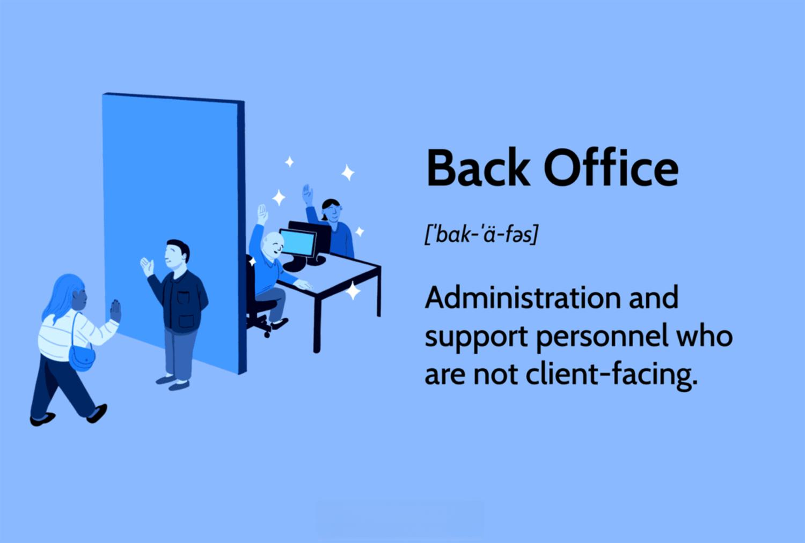

## Table of Contents

## What is a back office in a business?

A back office in a business is the part of the company that handles tasks that customers don't see. These tasks include things like accounting, human resources, and IT support. The back office is important because it helps the business run smoothly by taking care of the behind-the-scenes work.

Even though customers don't interact with the back office directly, it plays a big role in making sure the front office, where customers are served, can work well. For example, if the back office does a good job with accounting, the front office can focus on selling products or services without worrying about money issues. In short, the back office supports the whole business by handling essential but less visible tasks.

## What are the main functions of a back office?

The main functions of a back office include handling the company's finances, like keeping track of money coming in and going out, paying bills, and preparing financial reports. They also manage human resources, which means they deal with hiring new employees, keeping employee records, and making sure everyone gets paid correctly. Another big part of the back office is IT support, where they make sure all the computers and technology in the company are working properly.

In addition to these, the back office often takes care of administrative tasks like managing the company's records and documents. They might also handle customer support issues that need more time or special attention, like solving complex problems or dealing with complaints. All these tasks are crucial because they help the company run smoothly and support the work done in the front office, where customers are directly served.

## How does the back office differ from the front office?

The back office and the front office are two different parts of a business. The front office is what customers see and interact with. It's where people come to buy things, ask questions, or get help. For example, the sales team, customer service, and the reception area are all part of the front office. They focus on making customers happy and helping them with their needs.

On the other hand, the back office works behind the scenes and doesn't deal directly with customers. It includes departments like accounting, human resources, and IT support. The back office takes care of things like paying bills, hiring new employees, and fixing computer problems. While customers don't see the back office, it's very important because it supports the front office by making sure everything runs smoothly in the background.

## What are some common departments found in the back office?

In a business, the back office has several important departments that help everything run smoothly. One key department is accounting, which keeps track of all the money coming in and going out. They make sure bills are paid on time and create financial reports to show how the business is doing. Another important department is human resources, which is in charge of hiring new employees, managing their records, and making sure everyone gets paid correctly.

The back office also includes the IT department, which takes care of all the computers and technology in the company. They fix problems, set up new systems, and make sure everyone can use the tools they need to do their jobs. Additionally, there's often an administrative department that manages the company's records and documents, helping to keep everything organized and easy to find. All these departments work together to support the front office and make sure the business runs well.

## Why is the back office important to a business's operations?

The back office is very important to a business because it does all the behind-the-scenes work that keeps everything running smoothly. This includes tasks like accounting, which makes sure the company's money is managed well, and human resources, which takes care of hiring and paying employees. Without the back office, the business would struggle to keep track of its finances, manage its staff, and maintain its technology, which are all crucial for day-to-day operations.

In addition, the back office supports the front office, where customers are served. For example, if the accounting team in the back office does a good job, the sales team in the front office can focus on selling products without worrying about money problems. The IT department in the back office also helps by keeping all the computers and systems working, which allows the front office to serve customers efficiently. Overall, the back office is essential because it handles important tasks that help the entire business operate smoothly and effectively.

## How does technology impact back office operations?

Technology has a big impact on back office operations. It makes things faster and easier. For example, with computers and special software, the accounting team can keep track of money and make reports quickly. This means they can see how the business is doing and make smart decisions faster. Also, technology helps the human resources team manage employee records and payroll more easily. They can use special programs to keep everything organized and make sure everyone gets paid on time.

Technology also helps the IT department in the back office. They use it to fix computer problems and set up new systems. This is important because it keeps everything working well for the whole company. For example, if the IT team can quickly fix a problem with the company's computers, the front office can keep serving customers without any delays. Overall, technology makes the back office more efficient, which helps the whole business run better.

## What are the challenges faced by back office operations?

Back office operations face many challenges. One big challenge is keeping up with new technology. The back office needs to use the latest computers and software to do their jobs well. But learning how to use new technology can be hard and take a lot of time. Also, keeping everything safe from hackers is important. If the back office does not protect the company's information, it can cause big problems.

Another challenge is making sure everything runs smoothly. The back office has to handle a lot of tasks at the same time, like paying bills, hiring new people, and fixing computer problems. If something goes wrong, it can slow down the whole company. For example, if the accounting team makes a mistake with the money, it can cause big issues for the front office. So, the back office needs to be very careful and organized to keep everything working well.

## How can efficiency be improved in the back office?

To improve efficiency in the back office, using technology is a big help. Special software can make tasks like accounting and managing employee records faster and easier. This means the back office can do their jobs more quickly and make fewer mistakes. Also, automating some tasks can save time. For example, using a computer program to pay bills automatically means the accounting team can focus on other important work.

Another way to boost efficiency is by training employees well. When everyone in the back office knows how to use the tools and do their jobs correctly, things run more smoothly. It's also important to keep good communication between different parts of the back office. If the accounting team talks well with the human resources team, they can work together better and solve problems faster. By using technology and making sure everyone is trained and talking to each other, the back office can work more efficiently and help the whole business run better.

## What role does data management play in the back office?

Data management is very important in the back office because it helps keep everything organized and easy to find. The back office deals with a lot of information, like employee records, financial data, and customer details. Good data management means this information is stored safely and can be used quickly when needed. For example, the accounting team needs to see financial data to make reports, and the human resources team needs to access employee records to manage payroll and hiring. If data is well-managed, these tasks become much easier and faster.

Also, good data management helps the back office make smart decisions. By keeping data clean and up-to-date, the back office can look at it to see how the business is doing. This helps them find problems and fix them before they get worse. For example, if the back office sees that some bills are not being paid on time, they can work to solve this issue quickly. Overall, good data management makes the back office more efficient and helps the whole business run better.

## How does the back office contribute to customer satisfaction?

The back office helps make customers happy even though they don't see it. They do this by making sure everything behind the scenes works well. For example, the accounting team in the back office makes sure the company has enough money to keep running. If the company runs out of money, it can't serve customers well. The human resources team also helps by hiring good people to work in the front office. When the front office has good workers, they can help customers better.

The IT department in the back office is important too. They keep all the computers and technology working properly. If something goes wrong with the computers, the front office can't help customers as well. The back office also deals with customer problems that need more time to solve. They work on these problems so the front office can focus on helping customers right away. By doing all these things, the back office helps make sure customers are happy with the service they get.

## What are the latest trends in back office management?

The latest trends in back office management focus a lot on using technology to make things easier and faster. One big trend is using [artificial intelligence](/wiki/ai-artificial-intelligence) (AI) and [machine learning](/wiki/machine-learning). These tools can help the back office do things like accounting and customer support more quickly. For example, AI can look at a lot of data and find patterns that help the accounting team make better decisions. Another trend is using cloud computing. This means the back office can store information and use software on the internet instead of on their own computers. This makes it easier to work from anywhere and share information with other parts of the company.

Another important trend is automation. Many back office tasks can now be done by computers without people having to do them. For example, paying bills and managing payroll can be done automatically, which saves time and reduces mistakes. Also, there is a trend towards better data management. The back office is using special software to keep data organized and safe. This helps them make smart decisions and work more efficiently. Overall, these trends are making the back office more efficient and helping the whole business run better.

## How can a business measure the performance of its back office?

A business can measure the performance of its back office by looking at how quickly and accurately they do their work. For example, the accounting team's performance can be measured by how fast they prepare financial reports and how few mistakes they make. The human resources team can be evaluated by how quickly they hire new employees and how well they manage payroll. The IT department's performance can be checked by how fast they fix computer problems and keep the systems running smoothly. By looking at these things, a business can see if the back office is doing a good job.

Another way to measure back office performance is by seeing how well they help the front office. If the front office is happy with the support they get from the back office, it means the back office is doing well. For example, if the sales team can focus on selling without worrying about money problems because the accounting team is doing a good job, that's a sign of good performance. Also, if the back office can handle customer problems quickly and well, it helps keep customers happy. By looking at these signs, a business can tell how well the back office is helping the whole company.

## References & Further Reading

[1]: MacKenzie, D. (2006). ["An Engine, Not a Camera: How Financial Models Shape Markets."](https://academic.oup.com/mit-press-scholarship-online/book/20588) MIT Press.

[2]: Aldridge, I. (2013). ["High-Frequency Trading: A Practical Guide to Algorithmic Strategies and Trading Systems."](https://www.wiley.com/en-us/High-Frequency+Trading%3A+A+Practical+Guide+to+Algorithmic+Strategies+and+Trading+Systems%2C+2nd+Edition-p-9781118343500) Wiley.

[3]: Hasbrouck, J. (2007). ["Empirical Market Microstructure: The Institutions, Economics, and Econometrics of Securities Trading."](https://academic.oup.com/book/52241) Oxford University Press.

[4]: Kissell, R. (2013). ["The Science of Algorithmic Trading and Portfolio Management."](https://www.sciencedirect.com/book/9780124016897/the-science-of-algorithmic-trading-and-portfolio-management) Academic Press.

[5]: Leinweber, D. (2009). ["Nerds on Wall Street: Math, Machines and Wired Markets."](https://archive.org/details/nerdsonwallstree0000lein) Wiley.

[6]: Hull, J. C. (2018). ["Options, Futures, and Other Derivatives."](https://www.pearson.com/nl/en_NL/higher-education/subject-catalogue/finance/Options-Futures-and-Other-Derivatives-Hull.html) Pearson.