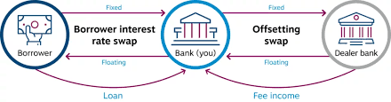

## Table of Contents

## What is a back-to-back loan?

A back-to-back loan is when two companies from different countries lend money to each other at the same time. They do this to help each other get around rules about moving money across borders. For example, a company in the United States might want to invest in a company in Japan, but there are restrictions on sending money directly. So, they set up a back-to-back loan where the U.S. company lends money to the Japanese company, and the Japanese company lends the same amount back to the U.S. company.

This type of loan can be useful for businesses that want to expand into new markets without breaking any laws. It helps them manage their money better and can make it easier to do business internationally. However, back-to-back loans need to be carefully managed to make sure they follow all the rules and regulations in both countries involved.

## How does a back-to-back loan work?

A back-to-back loan happens when two companies from different countries lend money to each other at the same time. This is done to help them get around rules that make it hard to move money across borders. For example, if a company in the United States wants to invest in a company in Japan, but there are restrictions on sending money directly, they can use a back-to-back loan. The U.S. company lends money to the Japanese company, and the Japanese company lends the same amount back to the U.S. company.

This type of loan can be very helpful for businesses that want to grow into new markets without breaking any laws. It helps them manage their money better and makes it easier to do business in different countries. However, companies need to be careful and make sure they follow all the rules in both countries. If they don't, they could get into trouble. So, it's important to manage back-to-back loans carefully.

## What are the main purposes of using back-to-back loans?

The main purpose of using back-to-back loans is to help companies get around rules that make it hard to move money across borders. For example, if a company in one country wants to invest in a company in another country, there might be restrictions on sending money directly. By using a back-to-back loan, the company can lend money to the foreign company and get the same amount back from them. This way, both companies can still do business together without breaking any laws.

Another purpose of back-to-back loans is to help companies manage their money better. When a company wants to expand into a new market, it can be tricky to move money around. Back-to-back loans make it easier to handle these financial transactions. They allow companies to invest in new opportunities and grow their business internationally. But, it's important for companies to be careful and make sure they follow all the rules in both countries to avoid any problems.

## What are the advantages of back-to-back loans for businesses?

Back-to-back loans can help businesses a lot. They let companies from different countries work together even when there are rules that make it hard to send money across borders. For example, if a company in the U.S. wants to invest in a company in Japan, they can use a back-to-back loan. The U.S. company lends money to the Japanese company, and the Japanese company lends the same amount back to the U.S. company. This way, both companies can still do business without breaking any laws.

Another big advantage is that back-to-back loans help businesses manage their money better. When a company wants to grow into a new market, moving money can be tricky. Back-to-back loans make it easier to handle these financial transactions. They allow companies to invest in new opportunities and expand their business internationally. But, companies need to be careful to follow all the rules in both countries to avoid any problems.

## What are the potential risks associated with back-to-back loans?

Back-to-back loans can be risky for businesses. One big risk is that they might not follow all the rules in both countries. If the companies don't manage the loans carefully, they could break the law. This could lead to fines or other problems. It's important for companies to understand and follow all the rules to avoid these risks.

Another risk is that one of the companies might not pay back the loan. If the company in one country goes bankrupt or has financial problems, the other company might not get their money back. This can cause big financial losses and make it hard for the other company to do business. So, it's important to check the financial health of the other company before agreeing to a back-to-back loan.

Also, back-to-back loans can be complicated to set up and manage. They need a lot of paperwork and legal work. If something goes wrong with the loan agreement, it can be hard to fix. This can take a lot of time and money to sort out. So, businesses need to be ready for the extra work and potential problems that can come with back-to-back loans.

## How do back-to-back loans differ from traditional loans?

Back-to-back loans are different from traditional loans because they involve two companies from different countries lending money to each other at the same time. With a traditional loan, one party borrows money from a bank or another lender and pays it back with interest over time. But with a back-to-back loan, the two companies agree to lend each other the same amount of money. This helps them get around rules that make it hard to move money across borders. For example, if a company in the U.S. wants to invest in a company in Japan, they can use a back-to-back loan to do it without breaking any laws.

Another big difference is the purpose of the loans. Traditional loans are usually used for things like buying equipment, starting a new project, or covering short-term cash needs. The borrower gets the money they need and pays it back over time. Back-to-back loans, on the other hand, are often used to help companies expand into new markets and manage their money better. They allow companies to invest in each other without moving money directly across borders, which can be tricky due to regulations. But back-to-back loans need careful management to make sure both companies follow all the rules and avoid any problems.

## Can individuals use back-to-back loans, or are they strictly for businesses?

Back-to-back loans are usually used by businesses, not individuals. They are set up to help companies from different countries work together and get around rules that make it hard to move money across borders. For example, a company in the U.S. might want to invest in a company in Japan, but there are restrictions on sending money directly. So, they use a back-to-back loan where the U.S. company lends money to the Japanese company, and the Japanese company lends the same amount back to the U.S. company.

While it's possible for individuals to set up back-to-back loans, it's not common. Individuals usually don't need to move large amounts of money across borders for business purposes, so they don't often use this type of loan. If an individual did want to use a back-to-back loan, they would need to find another person in a different country to set it up with, and both would need to carefully follow the rules in their countries to avoid any problems.

## What are the key legal and regulatory considerations for back-to-back loans?

When companies use back-to-back loans, they need to make sure they follow the laws and rules in both countries. Each country has its own rules about moving money across borders. If the companies don't follow these rules, they could get into trouble. For example, they might have to pay fines or face other problems. So, it's important for the companies to understand the laws in both countries and make sure their back-to-back loan agreement follows them.

Another important thing to consider is how the loan is set up and managed. The loan agreement needs to be clear and detailed so both companies know what they have to do. This includes things like how much money is being lent, when it needs to be paid back, and what happens if one company can't pay. The companies also need to keep good records and be ready to show them to the authorities if they need to. This helps make sure everything is done the right way and keeps both companies safe from legal problems.

## How do tax implications affect the structuring of back-to-back loans?

Tax implications can really change how back-to-back loans are set up. When two companies from different countries lend money to each other, they need to think about the taxes in both countries. If the loan is not set up right, one or both companies might have to pay more taxes. They need to make sure the loan follows the tax rules in both countries to avoid any surprises. This means looking at things like withholding taxes, which are taxes taken out of the money being sent, and making sure the loan is structured in a way that keeps tax costs low.

To do this, companies often work with tax experts to plan the loan. These experts can help make sure the loan is set up in a way that follows all the tax rules and keeps the tax bill as small as possible. They might suggest things like adjusting the interest rates or the timing of the loan payments to make it more tax-friendly. By thinking carefully about taxes when setting up a back-to-back loan, companies can save money and avoid any legal problems with the tax authorities.

## What documentation is required to set up a back-to-back loan?

To set up a back-to-back loan, companies need a lot of paperwork. They need a loan agreement that clearly says how much money is being lent, when it needs to be paid back, and what happens if one company can't pay. This agreement needs to be signed by both companies to make it official. They also need to keep records of all the money that moves between them, like bank statements and receipts. This helps make sure everything is done the right way and can be shown to the authorities if needed.

Besides the loan agreement and financial records, companies might need other documents too. They might need to show that they are allowed to move money across borders, like getting approval from the government or a special license. They also need to keep records of any tax documents, like forms that show how much tax they paid on the loan. All these documents help make sure the back-to-back loan follows the rules in both countries and keeps both companies safe from legal problems.

## How can back-to-back loans be used in international financing?

Back-to-back loans can help companies with international financing by letting them move money across borders more easily. If a company in one country wants to invest in a company in another country, but there are rules that make it hard to send money directly, they can use a back-to-back loan. The company in the first country lends money to the company in the second country, and the second company lends the same amount back. This way, both companies can still do business together without breaking any laws. It helps them grow their business in new markets and manage their money better.

To set up a back-to-back loan for international financing, companies need to be careful and follow all the rules in both countries. They need a clear loan agreement that says how much money is being lent, when it needs to be paid back, and what happens if one company can't pay. They also need to keep good records of all the money that moves between them, like bank statements and receipts. This helps make sure everything is done the right way and can be shown to the authorities if needed. By using back-to-back loans, companies can work together across borders and make their international financing smoother.

## What are some real-world examples of back-to-back loans in action?

A real-world example of a back-to-back loan happened when a U.S. company wanted to invest in a project in China. The U.S. company couldn't send money directly to China because of strict rules on moving money across borders. So, they set up a back-to-back loan with a Chinese company. The U.S. company lent money to the Chinese company, and the Chinese company lent the same amount back to the U.S. company. This way, both companies could work together on the project without breaking any laws.

Another example is when a German company wanted to expand into Brazil but faced similar restrictions on moving money. The German company used a back-to-back loan to partner with a Brazilian company. The German company lent money to the Brazilian company, and the Brazilian company lent the same amount back. This allowed the German company to finance its expansion into Brazil and helped both companies manage their money better. By using back-to-back loans, they could navigate the financial regulations and grow their businesses internationally.

## References & Further Reading

[1]: ["International Financial Management"](https://en.wikipedia.org/wiki/International_financial_management) by Cheol Eun and Bruce Resnick

[2]: ["Foreign Exchange Risk: Models, Instruments and Strategies"](https://www.amazon.com/Foreign-Exchange-Risk-Instruments-Strategies/dp/1899332375) by Jessica James and Nick Webber

[3]: ["Trading and Exchanges: Market Microstructure for Practitioners"](https://www.amazon.com/Trading-Exchanges-Market-Microstructure-Practitioners/dp/0195144708) by Larry Harris

[4]: ["The Essentials of Risk Management"](https://archive.org/details/essentialsofrisk0000crou_n6p4) by Michel Crouhy, Dan Galai, and Robert Mark

[5]: ["Currency Strategy: The Practitioner's Guide to Currency Investing, Hedging and Forecasting"](https://www.wiley.com/en-us/Currency+Strategy%3A+The+Practitioner%27s+Guide+to+Currency+Investing%2C+Hedging+and+Forecasting%2C+2nd+Edition-p-9780470029732) by Callum Henderson