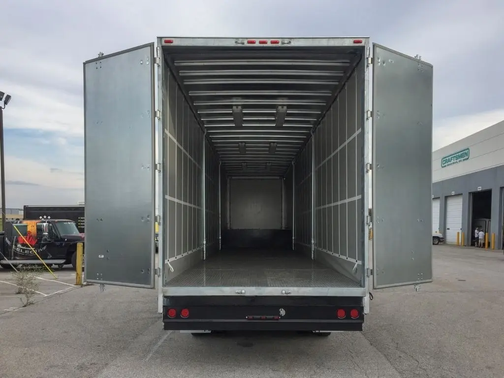

## Table of Contents

## What does 'Back Up The Truck' mean?

"Back Up The Truck" is a phrase used to describe buying a lot of something. It means you think the thing you are buying is a great deal, so you want to get as much of it as you can.

This phrase comes from the idea of using a truck to move a large amount of stuff. If you see a good deal, you might want to "back up the truck" to load up on it, like filling a truck with as much as it can carry.

## Where did the phrase 'Back Up The Truck' originate?

The phrase "Back Up The Truck" comes from the world of business and finance. It started being used in the late 20th century, especially in the stock market. When people saw a stock that was very cheap and thought it would go up in value, they would say they wanted to "back up the truck" to buy as many shares as they could. It was like saying the deal was so good, they needed a truck to carry all the shares they wanted to buy.

Over time, the phrase moved beyond just stocks and into everyday language. People started using it to talk about buying a lot of anything that was a good deal. Whether it was groceries, clothes, or anything else on sale, if someone thought it was a great deal, they might say they wanted to "back up the truck" and get as much of it as they could.

## In what contexts is 'Back Up The Truck' commonly used?

People often use the phrase "Back Up The Truck" when they see something on sale that they think is a great deal. It means they want to buy a lot of it because it's so cheap. For example, if someone finds a big discount on their favorite snacks at the grocery store, they might say they want to "back up the truck" and fill their cart with as many snacks as they can.

This phrase is also used in the world of investing. If someone thinks a stock is priced very low and will go up a lot in the future, they might say they want to "back up the truck" and buy as many shares as they can. It's like saying they see such a good opportunity that they want to take full advantage of it by buying a lot.

## Can 'Back Up The Truck' be used in formal settings?

The phrase "Back Up The Truck" is usually used in casual conversations. It's not common to hear it in formal settings like business meetings or official reports. In these situations, people might use more professional language to talk about buying a lot of something.

However, if everyone in a formal setting understands the phrase and uses it often, it might be okay to use it. But it's better to be safe and use more formal words when talking about buying a lot of something in a professional environment.

## How has the usage of 'Back Up The Truck' evolved over time?

The phrase "Back Up The Truck" started in the world of business and finance. People used it when they saw a stock that was very cheap and thought it would go up in value. They would say they wanted to "back up the truck" to buy as many shares as they could. This was like saying the deal was so good, they needed a truck to [carry](/wiki/carry-trading) all the shares they wanted to buy.

Over time, the phrase moved beyond just stocks and into everyday language. People started using it to talk about buying a lot of anything that was a good deal. Whether it was groceries, clothes, or anything else on sale, if someone thought it was a great deal, they might say they wanted to "back up the truck" and get as much of it as they could. This shows how the phrase became more common and used in many different situations.

## What are some synonyms or similar expressions to 'Back Up The Truck'?

Some people say "load up" when they want to buy a lot of something because it's a good deal. It's like saying they want to fill up their shopping cart or bag with as much of the item as they can. Another phrase is "stock up," which means the same thing. People use it when they see something on sale and want to buy a lot of it to use later.

Another similar expression is "go all in." This phrase comes from card games where players put all their money into the game. In everyday talk, it means someone is putting all their effort or money into something because they think it's a great opportunity. These phrases all show that someone thinks something is such a good deal, they want to get as much of it as they can.

## Are there any cultural variations in the use of 'Back Up The Truck'?

In the United States, people use the phrase "Back Up The Truck" a lot when they see a good deal. They might say it when they want to buy a lot of something at a store, like groceries or clothes. It's a fun way to say they think the deal is so good, they want to fill a truck with whatever they're buying. This phrase is mostly used in casual talks with friends or family.

In other countries, people might not use "Back Up The Truck" as much because it's an American saying. But they might have their own ways to say the same thing. For example, in the UK, someone might say they want to "stock up" or "load up" on something if it's on sale. These phrases mean the same as "Back Up The Truck" but are more common in British English. So, while the exact words might change, the idea of wanting to buy a lot of a good deal is the same everywhere.

## How can 'Back Up The Truck' be used metaphorically?

People use "Back Up The Truck" in a fun way to talk about buying a lot of something because it's a good deal. But they can also use it to mean they want to do a lot of something else, not just buying. For example, if someone is excited about a new hobby, they might say they want to "back up the truck" and spend all their time on it. This means they want to do as much of the hobby as they can because they think it's a great way to spend their time.

In another way, someone might use "Back Up The Truck" when talking about helping others. If a friend needs a lot of help moving to a new house, someone might say they want to "back up the truck" and help as much as they can. This means they want to give a lot of their time and effort to help their friend because they think it's important. So, the phrase can be used to talk about doing a lot of anything, not just buying things.

## What are some common mistakes or misunderstandings about the phrase 'Back Up The Truck'?

Some people might think "Back Up The Truck" means to actually move a truck backwards. But it's not about moving a truck at all. It's a fun way to say you want to buy a lot of something because it's a good deal. It's like saying the deal is so good, you want to fill a truck with whatever you're buying.

Another mistake is thinking you can use this phrase in any situation. It's usually used in casual talks with friends or family. Using it in a formal meeting might sound strange because it's not professional language. It's important to know when and where to use it so you don't sound out of place.

## How does 'Back Up The Truck' fit into the broader category of idiomatic expressions?

"Back Up The Truck" is an idiomatic expression, which means it's a phrase that doesn't mean what the words say. Instead, it has a special meaning that people understand. In this case, it means you want to buy a lot of something because it's a good deal. It's like saying the deal is so good, you need a truck to carry everything you want to buy. Idioms like this make language fun and interesting because they add color and can be a bit like secret codes that people who know them understand.

These kinds of expressions are common in everyday talk. They help people say things in a shorter, more interesting way. For example, instead of saying "I want to buy a lot of this because it's on sale," you can just say "Back Up The Truck." It's a quick way to say you think something is a great deal and you want to get as much of it as you can. Idioms like this show how language can be creative and how people can use words in fun ways to share ideas.

## What psychological or social factors contribute to the popularity of 'Back Up The Truck'?

People like to use "Back Up The Truck" because it's a fun and simple way to show they are excited about a good deal. It makes shopping feel like an adventure, and when someone says it, others can easily understand that they think something is a great buy. This phrase also helps people feel like they are part of a group because it's a saying that many people know and use. When someone says "Back Up The Truck," it can make others laugh or feel the same excitement, which makes social interactions more fun and enjoyable.

Another reason "Back Up The Truck" is popular is because it taps into the feeling of getting a good deal. People love to feel like they are smart shoppers, and saying this phrase shows that they think they found something really valuable. It also plays into the idea of wanting more when something is cheap, which is a common feeling in shopping. So, this phrase not only makes shopping fun but also helps people feel good about their choices and connect with others who feel the same way.

## How might future trends affect the usage of 'Back Up The Truck'?

Future trends might change how people use "Back Up The Truck." As more shopping happens online, people might use this phrase less because they don't think about filling a truck with stuff they buy on the internet. Instead, they might use new phrases that fit better with online shopping, like "fill up your cart" or "click and buy a lot." Also, as people become more aware of saving money and the environment, they might not want to buy so much at once, even if it's a good deal. This could make the phrase less popular because it's all about buying a lot of something.

On the other hand, "Back Up The Truck" might stay popular if it becomes a fun saying that people use in all kinds of situations, not just shopping. If people start using it to talk about doing a lot of anything they enjoy, like a hobby or helping others, it could stay common. It's all about how people feel about the phrase and if they find new ways to use it that fit with their lives and what they care about.

## References & Further Reading

[1]: Bergstra, J., Bardenet, R., Bengio, Y., & Kégl, B. (2011). ["Algorithms for Hyper-Parameter Optimization."](https://dl.acm.org/doi/10.5555/2986459.2986743) Advances in Neural Information Processing Systems 24.

[2]: ["Advances in Financial Machine Learning"](https://www.amazon.com/Advances-Financial-Machine-Learning-Marcos/dp/1119482089) by Marcos Lopez de Prado

[3]: ["Evidence-Based Technical Analysis: Applying the Scientific Method and Statistical Inference to Trading Signals"](https://www.amazon.com/Evidence-Based-Technical-Analysis-Scientific-Statistical/dp/0470008741) by David Aronson

[4]: ["Machine Learning for Algorithmic Trading"](https://github.com/stefan-jansen/machine-learning-for-trading) by Stefan Jansen

[5]: ["Quantitative Trading: How to Build Your Own Algorithmic Trading Business"](https://www.amazon.com/Quantitative-Trading-Build-Algorithmic-Business/dp/1119800064) by Ernest P. Chan