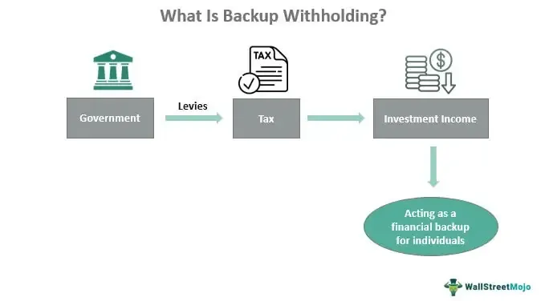

Investment strategies constitute a fundamental aspect of financial markets, serving as blueprints for making informed decisions aimed at achieving specific financial goals. These strategies encompass a range of techniques and approaches that investors use to allocate their resources across different financial instruments, such as stocks, bonds, and derivatives. The overarching objective is to maximize returns while managing risk appropriately.

A diverse investment strategy is crucial for mitigating risk and enhancing returns. Diversification involves spreading investments across various asset classes, geographic regions, and industries to minimize the impact of a poor performance in any single component. This approach is based on the principle that different assets often exhibit different patterns of returns, and their performance is not perfectly correlated. By diversifying, investors can potentially reduce the overall volatility of their portfolio while still capturing gains from well-performing investments.



An intriguing concept within investment strategies is the term "back up the truck," which denotes a strong conviction in a particular investment opportunity. When investors "back up the truck," they are essentially indicating their intention to purchase a substantial amount of a specific asset, driven by the belief that it is significantly undervalued or poised for substantial growth. This phrase typically signals a bullish outlook and reflects confidence in the anticipated performance of the asset. During market conditions where certain assets are deemed undervalued, investors might choose this aggressive strategy to capitalize on the perceived opportunity.

In the modern investment landscape, algorithmic trading, or algo trading, serves as a powerful tool, complementing traditional investment strategies. Algo trading involves the use of computer programs to execute orders at speeds and frequencies that are impossible for human traders. Algorithms can process vast amounts of data, identify patterns, and execute optimal trades based on predefined criteria. This technological advancement offers precision and efficiency, allowing investors to optimize their decision-making processes and manage risks more effectively. The integration of algorithmic strategies can enhance the execution of an investment plan by providing timely and data-driven insights that can adapt to changing market conditions.

In conclusion, the interplay of diverse investment strategies, the strategic timing of "back up the truck" decisions, and the adoption of algorithmic trading collectively underscore the complexity and dynamism of modern financial markets. Investors must weigh the potential rewards against the inherent risks, ensuring that their strategies align with their financial goals and risk tolerance.

## Table of Contents

## Understanding the Term 'Back Up The Truck'

"Back up the truck" is a colloquial financial term that signifies an investor's strong conviction to purchase a large quantity of assets, due to an expectation of substantial future gains. This phrase encapsulates a highly bullish market sentiment, where investors anticipate that the value of an asset or a group of assets will rise significantly. Essentially, it is an expression of utmost confidence, encouraging the acquisition of as much of an asset as possible, akin to filling up a truck to its full capacity.

The phrase gained widespread popularity in the 1990s, during a period characterized by aggressive investing and the dot-com bubble. The decade witnessed a surge in technology stocks, with investors pouring vast amounts of capital into companies in anticipation of revolutionary advancements. This environment fostered a culture where "backing up the truck" became synonymous with seizing lucrative opportunities perceived in emergent tech markets. At that time, the optimism of perpetual growth spurred analysts and investors alike to heavily subscribe to this strategy, often viewing it as a pathway to substantial financial rewards.

Financial analysts often employ the term "back up the truck" to describe situations they believe present extraordinary investment prospects. For example, if a stock is deemed significantly undervalued or poised for a turnaround, an analyst might advise their clients to "back up the truck" on shares of that stock. Such recommendations are usually fortified by thorough research and analysis, highlighting why an asset is expected to outperform the market.

A noteworthy instance of this terminology might occur when a reputable analyst issues a report suggesting that a particular company's innovations or strategic initiatives are likely to propel its stock price. This expert opinion could potentially trigger a wave of buying from those aiming to capitalize on the anticipated surge. Furthermore, the concept of "backing up the truck" isn’t confined to equities; it can also relate to commodities, real estate, or any market assets where bullish indicators suggest a significant upward movement.

In summary, "back up the truck" is a strategic term signifying the purchase of a substantial quantity of assets, driven by confidence in future market performance, widely embraced and popularized especially during dynamic economic periods like the late 20th century.

## Situations to 'Back Up The Truck'

Investors often choose to "back up the truck" in situations where they perceive an extraordinary opportunity in the market, usually characterized by undervalued assets or market trends that signal potential growth. This approach, akin to making substantial investments, is generally favored during bullish market outlooks or when certain macroeconomic indicators align favorably.

**Undervalued Assets**

Identifying undervalued assets is a common trigger for investors to embrace this strategy. When assets are priced significantly below their intrinsic value, investors may consider them opportunities for substantial returns. This valuation approach can be quantified using financial metrics such as the Price-to-Earnings (P/E) ratio, Price-to-Book (P/B) ratio, or Free Cash Flow (FCF) analysis. For example, if a company's P/E ratio is considerably lower than the industry average, it may signal to investors that the stock is undervalued.

**Market Trends Signaling Growth**

Another scenario that might prompt investors to "back up the truck" is when market trends indicate prospective growth. This can include technological advancements, regulatory changes, or demographic shifts that create an environment conducive to growth. For instance, the tech boom of the late 1990s created a substantial increase in the perceived value of internet-based companies, leading many investors to pour funds into these stocks. The anticipation of groundbreaking innovations often propels such aggressive investment moves.

**Historical Examples**

Several instances in history illustrate the widespread implementation of this investment strategy. During the early 2000s, the rise of emerging markets drew significant attention from global investors. Countries like China, India, and Brazil saw substantial capital inflows as they were perceived to be poised for rapid economic expansion. Investors placed heavy bets on these markets under the belief that they were investing at the cusp of a multi-decade growth trend.

Another example can be observed in the post-2008 financial crisis period. As central banks around the world adopted quantitative easing measures, assets perceived to be undervalued or poised for recovery attracted considerable investment. Stocks and real estate sectors experienced inflows as investors backed up the truck, banking on a macroeconomic environment that supported asset recovery and growth.

In each of these cases, the sentiment was driven by the belief that the market or specific assets were momentarily undervalued, offering an entry point for substantial future gains. This strategy, however, is not without risk, as market bubbles and misjudgments regarding intrinsic values can lead to significant financial repercussions.

## Risks Associated with 'Backing Up The Truck'

'Backing up the truck' is an aggressive investment strategy that entails heavily investing in a particular asset or market, often under the assumption that its value will increase significantly. While this approach can potentially lead to substantial financial gains, it also carries considerable risks.

Market [volatility](/wiki/volatility-trading-strategies) is a significant danger when employing this strategy. Stock prices and market conditions can fluctuate unpredictably due to economic indicators, geopolitical events, or changes in investor sentiment. An investment perceived as a lucrative opportunity one day may become less attractive or even a liability the next due to sudden market shifts. This volatility can lead to rapid and significant declines in asset values, eroding potential profits or amplifying losses. 

Investor overconfidence further compounds the risks associated with backing up the truck. This cognitive bias leads investors to overestimate their understanding of market conditions or the accuracy of their predictions. Overconfidence can result in a lack of diversification, as investors concentrate their resources into a few assets, erroneously believing in guaranteed returns. This behavior ignores the fundamental investment principle of spread risk, making their portfolios exceptionally vulnerable to adverse market movements.

Another risk stems from holding large, unhedged positions. In the context of investment, hedging involves taking offsetting positions to mitigate potential losses. When investors back up the truck without implementing hedging strategies, they expose themselves to the full brunt of market corrections. For example, if an investor buys a large [volume](/wiki/volume-trading-strategy) of a stock expecting an upward trend based on market hype, and the stock subsequently plummets, the lack of a hedging mechanism—such as purchasing put options—can result in significant financial setbacks.

I've written a Python script to demonstrate a simplified scenario showing how volatility can affect an aggressive investment:

```python
import numpy as np
import matplotlib.pyplot as plt

np.random.seed(42)

def simulate_stock_price(initial_price, days, volatility):
    returns = np.random.normal(0, volatility, days)
    price = initial_price * np.exp(returns.cumsum())
    return price

initial_price = 100  # initial stock price
days = 365  # simulate for one year
volatility = 0.02  # 2% daily volatility

price_simulation = simulate_stock_price(initial_price, days, volatility)

plt.plot(price_simulation)
plt.title('Simulated Stock Price with 2% Daily Volatility')
plt.xlabel('Days')
plt.ylabel('Stock Price')
plt.show()
```

This script simulates the price changes of a stock over a year with a daily volatility of 2%. It illustrates how even small daily fluctuations can lead to significant variation in stock value over time, highlighting the risks inherent to aggressive investment strategies like 'backing up the truck'.

In conclusion, while 'backing up the truck' can be enticing in a bullish market, investors must remain vigilant of the associated risks, including market volatility, overconfidence, and the absence of risk mitigation strategies. Implementing sound investment principles, such as diversification and hedging, can help manage these risks effectively.

## Role of Algorithmic (Algo) Trading

Algorithmic trading, commonly referred to as algo trading, has significantly transformed modern investing by leveraging computer programs to execute trades at high speed and frequency based on predefined criteria. This form of trading harnesses mathematical models and sophisticated algorithms to make data-driven decisions, evaluating numerous variables that can influence market movements.

Algo trading complements traditional investment strategies by providing enhanced efficiency and precision. Traditional methods often rely on human judgment, which can be influenced by emotions or biases. In contrast, algorithmic systems operate based on logic and data, ensuring quick adaptation to market changes. For instance, an investor might use algorithmic models to identify opportunities where asset prices deviate from historical trends or patterns, thereby potentially optimizing their entry and [exit](/wiki/exit-strategy) points without the delay associated with manual processes.

One of the primary advantages of [algorithmic trading](/wiki/algorithmic-trading) is its capability for optimization in investment decisions and risk management. Algorithms can process vast amounts of market data in real-time, identifying trends or patterns that might not be immediately apparent to human analysts. This analytical power allows for the construction of diversified portfolios that can be tuned to achieve desired risk-return profiles. Moreover, algorithms can implement complex strategies such as statistical [arbitrage](/wiki/arbitrage), [market making](/wiki/market-making), or [trend following](/wiki/trend-following), each automatically adjusted based on continuous learning from market data.

In terms of risk management, algorithms excel by employing techniques such as portfolio rebalancing and stop-loss orders to mitigate potential losses. For instance, a simple moving average crossover strategy might be employed to determine when to buy or sell a stock, with the algorithm dynamically adjusting positions as market conditions evolve.

Additionally, algo trading mitigates human errors caused by manual entries and enhances consistency by adhering strictly to predefined rules. This consistency is especially valuable in volatile markets where rapid decisions are crucial. Furthermore, the reduction in transaction costs, attributed to the automation of trade executions, represents another significant benefit, as algorithms find the most effective paths, markets, and times to execute trades.

As algorithmic trading continues to grow, its integration into a broader suite of investment strategies presents opportunities for more sophisticated risk management and improved portfolio performance. Through the precise and rapid execution of trades, algo trading offers a robust tool for investors aiming to enhance their investment processes in a competitive market environment.

## Integrating 'Back Up The Truck' with Algo Trading

Integrating the investment strategy known as "back up the truck" with algorithmic trading can enable investors to make more informed and strategic decisions. The aggressive nature of "back up the truck" — characterized by making significant investments based on a robust bullish outlook — can be harmonized with the precision and analytical capacity provided by algorithmic trading.

**Strategies for Balancing Aggressive Investments with Algorithmic Risk Assessments**

To balance the aggressive nature of "back up the truck" investments with comprehensive risk management, algorithmic trading can employ several strategies:

1. **Quantitative Analysis**: Algorithms can be designed to analyze vast datasets and identify bullish trends that justify significant investments. By utilizing predictive models, such algorithms can help determine the optimal timing for "backing up the truck."

2. **Risk-Adjusted Decision Making**: Algorithms can implement metrics such as Value at Risk (VaR) and Conditional Value at Risk (CVaR) to assess the risk associated with large investments. These metrics ensure that potential downsides are quantified and factored into decision-making processes.

3. **Portfolio Diversification Models**: Using machine learning, algorithms can suggest diversification strategies even when employing the "back up the truck" philosophy. For instance, it can identify correlated assets to balance the portfolio, ensuring that an overly concentrated position in one asset class is offset by investments in others with counterbalancing risks.

**Examples of Algorithms Seeking 'Back Up The Truck' Opportunities**

1. **Momentum Algorithms**: Seek assets with strong upward price momentum, which aligns with a bullish scenario favorable for "backing up the truck." These algorithms identify stocks experiencing rapid price increases and project their sustainability using historical patterns.

   ```python
   # Example Python snippet for a momentum-based strategy
   import pandas as pd

   def calculate_momentum(data, days):
       data['Momentum'] = data['Close'].pct_change(periods=days)
       return data

   stock_data = pd.DataFrame({'Close': [100, 110, 120, 130, 150]})
   print(calculate_momentum(stock_data, 1))
   ```

2. **Sentiment Analysis Algorithms**: Harness natural language processing (NLP) to gauge market sentiment from news articles, social media, and earnings reports. Positive sentiment can be a precursor to bullish trends, thus signaling a "back up the truck" opportunity.

3. **Machine Learning Models for Anomaly Detection**: Identify unusual market patterns which precede substantial price movements. By detecting anomalies in trading volumes or price changes, algorithms can flag potential opportunities for aggressive investment.

Integrating "back up the truck" approaches with algorithmic trading not only enhances the identification of lucrative investment opportunities but also embeds a layer of risk management that traditional methods may lack. This fusion allows investors to harness the fervor of significant market moves while maintaining a disciplined approach to portfolio management.

## Conclusion

In conclusion, the dynamic landscape of investment strategies requires a nuanced understanding of various approaches, whether traditional or modern. 'Backing up the truck' represents a bold strategy that hinges on significant confidence in market analysis. However, this approach carries inherent risks, emphasizing the necessity of diversification and vigilance in investment planning.

Algorithmic trading, a hallmark of modern finance, can serve as a valuable tool in refining investment strategies such as 'backing up the truck.' By leveraging advanced algorithms, investors gain the capacity to analyze large datasets, optimize decision-making processes, and manage risks efficiently. The integration of these high-tech tools with traditional strategies allows for a more balanced and informed approach, potentially maximizing returns while minimizing exposure to unforeseen market volatility.

Ultimately, making informed decisions is paramount in investment. The blend of traditional strategies with cutting-edge technology exemplifies the evolving paradigm in finance, serving as a reminder for investors to weigh both rewards and risks. Consideration of these factors is crucial in fostering sustainable growth and long-term success in the financial markets.

## References & Further Reading

[1]: Bergstra, J., Bardenet, R., Bengio, Y., & Kégl, B. (2011). ["Algorithms for Hyper-Parameter Optimization."](https://dl.acm.org/doi/10.5555/2986459.2986743) Advances in Neural Information Processing Systems 24.

[2]: ["Advances in Financial Machine Learning"](https://www.amazon.com/Advances-Financial-Machine-Learning-Marcos/dp/1119482089) by Marcos Lopez de Prado

[3]: ["Evidence-Based Technical Analysis: Applying the Scientific Method and Statistical Inference to Trading Signals"](https://www.amazon.com/Evidence-Based-Technical-Analysis-Scientific-Statistical/dp/0470008741) by David Aronson

[4]: ["Machine Learning for Algorithmic Trading"](https://github.com/stefan-jansen/machine-learning-for-trading) by Stefan Jansen

[5]: ["Quantitative Trading: How to Build Your Own Algorithmic Trading Business"](https://www.amazon.com/Quantitative-Trading-Build-Algorithmic-Business/dp/1119800064) by Ernest P. Chan