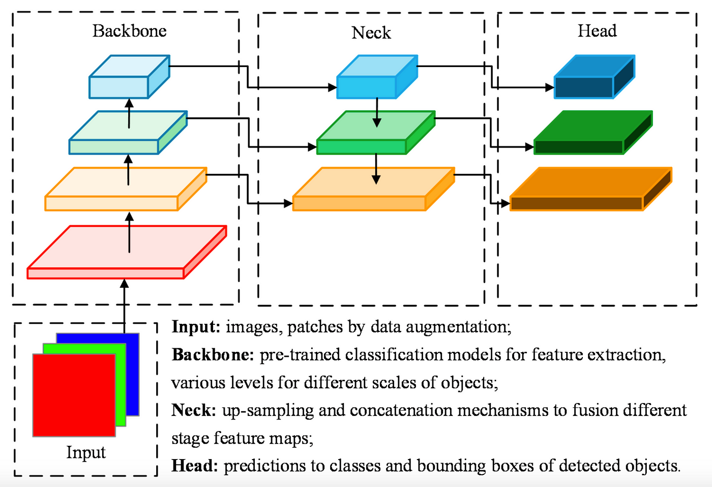

## Table of Contents

## What is a backbone architecture in machine learning?

A backbone architecture in machine learning is like the main structure of a building. It's the basic part of a neural network that helps it understand and process information. Imagine a backbone as the skeleton that supports everything else. In machine learning, this skeleton is usually made up of layers of neurons that work together to find patterns in data. For example, in image recognition, the backbone might be a series of layers that look at different parts of an image to figure out what's in it.

These backbones are often used as a starting point for more complex models. People take a well-known backbone, like ResNet or VGG, and add their own special parts to it to solve specific problems. This is helpful because it saves time and effort. Instead of building a new model from scratch, you can use a backbone that's already good at understanding data and then customize it. This way, you can focus on making your model better at the specific task you're working on, like recognizing faces or predicting the weather.

## How does ConvNeXt improve upon traditional convolutional neural networks?

ConvNeXt improves upon traditional convolutional neural networks by making them simpler and more efficient. Traditional convolutional networks, like VGG and ResNet, have many layers and complex structures. ConvNeXt takes these ideas and makes them easier to understand and use. It uses fewer, but larger, layers and simpler operations. This makes the network faster and easier to train. For example, ConvNeXt uses a technique called depthwise separable convolutions, which breaks down the traditional convolution into two simpler steps. This not only speeds up the process but also reduces the number of parameters the network needs to learn.

Another way ConvNeXt improves on traditional networks is by using modern training techniques. These techniques help the network learn better and faster. For instance, ConvNeXt uses a method called layer normalization, which helps stabilize the learning process. It also uses a technique called stochastic depth, which randomly drops out some layers during training. This helps prevent the network from overfitting, which means it can perform better on new, unseen data. By combining these modern techniques with a simpler architecture, ConvNeXt can achieve better results than traditional convolutional networks while being easier to work with.

## What are the key components of Deep Sets and how do they work?

Deep Sets are a type of [neural network](/wiki/neural-network) that work with sets of data. Sets are groups of items where the order doesn't matter. For example, a set of numbers like {1, 2, 3} is the same as {3, 2, 1}. The key components of Deep Sets are two functions: a function that processes each item in the set, and a function that combines the results. The first function, often called the element-wise function, takes each item in the set and turns it into a new form. This new form is usually a set of numbers that the neural network can understand better. The second function, called the aggregation function, takes all these new forms and combines them into one final result. This could be something like adding them all up or finding their average.

The element-wise function in Deep Sets can be any kind of neural network, like a simple one-layer network or a more complex one. It looks at each item in the set and changes it in a way that helps the network understand the data better. For example, if you have a set of images, the element-wise function might turn each image into a set of numbers that represent important features of the image. The aggregation function then takes all these sets of numbers and combines them. A common way to do this is to use a sum or an average, but it could also be something more complex. The final result is a single set of numbers that represents the whole set of data. This makes Deep Sets useful for tasks where you need to understand a group of items as a whole, not just one at a time.

## Can you explain the function of the Spatial Broadcast Decoder in neural networks?

The Spatial Broadcast Decoder is a part of some neural networks that helps them understand and create images. It takes a small set of numbers, called a latent code, and turns it into a full image. Imagine you have a tiny puzzle piece, and you need to make a whole picture from it. The Spatial Broadcast Decoder does this by spreading out the information in the latent code across a larger area, kind of like broadcasting a signal. This way, it can create detailed images from just a few numbers.

To do this, the Spatial Broadcast Decoder first takes the latent code and repeats it many times, creating a grid where each spot on the grid has the same information. Then, it uses a series of layers to turn this grid into an image. These layers look at the information in each spot and figure out what color and shape should go there. By doing this, the Spatial Broadcast Decoder can create complex images from simple inputs, making it useful for tasks like generating new images or filling in missing parts of pictures.

## What makes TNT (Transformer in Transformer) unique among backbone architectures?

TNT, or Transformer in Transformer, stands out among backbone architectures because it combines two levels of transformers to better understand images. Traditional transformers are good at processing sequences of data, like words in a sentence. But images are different because they have a grid-like structure. TNT solves this by using a smaller transformer, called an inner transformer, to look at small parts of the image. Then, it uses a larger transformer, called an outer transformer, to put these parts together and understand the whole image. This two-level approach helps TNT capture both the details and the overall structure of an image, making it more effective at tasks like image recognition.

Another unique feature of TNT is how it handles the spatial relationships in images. While traditional transformers might struggle with the grid-like nature of images, TNT uses its inner and outer transformers to better understand these relationships. The inner transformer focuses on small patches of the image, learning about the local features. The outer transformer then takes these local features and combines them to understand the global context of the image. This dual approach allows TNT to perform better than many other backbone architectures, especially when dealing with complex images that have both fine details and broad patterns.

## How does the FFF (Fully-Featured Fusion) architecture enhance feature extraction?

The FFF (Fully-Featured Fusion) architecture enhances feature extraction by combining different types of features from an image in a smart way. It uses a method called feature fusion, which means it takes features from different layers of a neural network and mixes them together. This helps the network understand the image better because it can see both the small details and the big picture at the same time. For example, if you're looking at a picture of a dog, FFF can help the network see the dog's fur and also understand that it's a whole dog, not just a bunch of fur.

FFF does this by using a special kind of layer called a fusion layer. This layer takes the features from different parts of the network and combines them in a way that makes the final features more useful. It's like taking pieces of a puzzle from different boxes and putting them together to make a complete picture. By doing this, FFF can make the network better at tasks like recognizing objects in images or understanding scenes. This makes FFF a powerful tool for improving how neural networks work with images.

## What is the role of 2D DWT (Discrete Wavelet Transform) in backbone architectures?

The 2D Discrete Wavelet Transform (DWT) plays an important role in backbone architectures by helping them break down images into different parts. Imagine you have a picture and you want to understand it better. The 2D DWT does this by splitting the image into smaller pieces, called wavelets, which show different levels of detail. This is useful because it helps the neural network see both the big shapes and the tiny details in the image. For example, if you're looking at a picture of a tree, the 2D DWT can help the network see the overall shape of the tree and also the small leaves.

By using the 2D DWT, backbone architectures can process images more efficiently. Instead of looking at the whole image at once, the network can focus on different parts of the image one at a time. This makes it easier for the network to learn and understand what's in the image. The 2D DWT is like a special tool that helps the network see the image in a new way, making it better at tasks like recognizing objects or understanding scenes.

## How does CBNet utilize compound scaling to improve performance?

CBNet uses compound scaling to make its neural network better at understanding images. Compound scaling means changing different parts of the network at the same time to make it work better. Instead of just making the network bigger or deeper, CBNet changes the width, depth, and resolution of the network all together. This helps the network see more details in the image and understand them better. By doing this, CBNet can recognize objects in images more accurately and quickly.

The way CBNet does this is by using a special formula to figure out how to change the network. The formula looks at how much the network needs to grow in width, depth, and resolution to get the best results. For example, if the network needs to be a little wider and a lot deeper, the formula will tell CBNet how to do that. This makes the network more efficient and powerful, so it can handle more complex tasks like recognizing different kinds of objects in a busy scene.

## What are the advantages of using RDNet for image processing tasks?

RDNet, or Residual Dense Network, is really good at processing images because it uses a smart way of connecting different parts of the network. It's like a team where everyone works together to understand the image better. RDNet uses something called residual learning, which means it looks at the differences between what it sees and what it should see. This helps the network learn faster and make fewer mistakes. It also uses dense connections, which means each part of the network can see what every other part is doing. This makes the network more efficient and helps it catch more details in the image.

Another advantage of RDNet is that it can handle a lot of information at once. This is important for tasks like making images clearer or adding missing parts to them. By using residual learning and dense connections, RDNet can keep track of all the details it needs without getting confused. This makes it really good at tasks where you need to understand the whole image and all its parts at the same time. So, if you're working on a project where you need to make images look better or understand them more deeply, RDNet can be a great choice.

## How does PoAPL (Pooling and Attention-based Pyramid Learning) work to improve feature representation?

PoAPL, or Pooling and Attention-based Pyramid Learning, improves feature representation by using a special way to look at images at different sizes. Imagine you're trying to understand a big picture. PoAPL helps by breaking the picture into smaller pieces and looking at them from different distances. It uses something called pooling to make the image smaller and simpler, and then it uses attention to focus on the most important parts. By doing this at different levels, PoAPL can see both the big shapes and the tiny details in the image. This helps the neural network understand the image better and do tasks like recognizing objects more accurately.

The way PoAPL works is by creating a pyramid of features. At the bottom of the pyramid, it looks at the image in a lot of detail. As you move up the pyramid, the image gets simpler, but the network can still see the important parts thanks to the attention mechanism. This pyramid structure helps the network see the image from different angles and understand it more completely. By combining pooling and attention in this way, PoAPL makes the features more useful for tasks like image recognition or understanding scenes.

## What is the M-S structure and how does it contribute to the efficiency of backbone architectures?

The M-S structure, or Multi-Scale structure, is a way to make backbone architectures better at understanding images. It works by looking at the image at different sizes, or scales. Imagine you have a picture of a dog. The M-S structure helps the network see the whole dog from far away and also the small details like the dog's fur up close. By doing this, the network can understand both the big picture and the tiny details at the same time. This makes the network more efficient because it can use all the information it gets from the image to do its job better.

Using the M-S structure helps backbone architectures be more efficient because it lets them process images faster and with fewer mistakes. When the network looks at the image at different scales, it can figure out what's important quickly. For example, if the network needs to recognize a car in a busy street, the M-S structure helps it see the car as a whole and also notice important details like the license plate. This way, the network can make better decisions and do its job more accurately, making it a powerful tool for tasks like object recognition or scene understanding.

## How can these various backbone architectures be compared in terms of performance, efficiency, and application suitability?

Different backbone architectures like ConvNeXt, Deep Sets, TNT, FFF, RDNet, and PoAPL each have their own strengths and weaknesses when it comes to performance, efficiency, and what they're best used for. For performance, ConvNeXt stands out because it uses simpler and more efficient layers, which helps it process data faster and with fewer mistakes. Deep Sets are good at understanding groups of items, making them great for tasks where the order of data doesn't matter. TNT is unique because it uses two levels of transformers to capture both the details and the overall structure of an image, which can lead to better performance in image recognition tasks. FFF improves feature extraction by combining different types of features, making it efficient for tasks that need to understand both small details and the big picture. RDNet uses residual learning and dense connections to handle a lot of information at once, which can improve performance in tasks like image enhancement. PoAPL uses a pyramid structure to look at images at different scales, which can lead to better feature representation and performance in tasks like object recognition.

In terms of efficiency, each architecture has its own way of saving time and resources. ConvNeXt is efficient because it uses fewer, but larger, layers and simpler operations, which makes it faster to train and use. Deep Sets can be efficient for set-based data because they don't need to worry about the order of items, which can save computational resources. TNT might be less efficient than some other architectures because it uses two levels of transformers, but it can still be worth it for the improved performance it offers. FFF can be efficient because it combines features in a smart way, reducing the need for extra layers. RDNet's use of residual learning and dense connections can make it more efficient by allowing it to learn faster and with fewer mistakes. PoAPL's pyramid structure can be efficient because it allows the network to process images at different scales without needing to look at the whole image at once. 

When it comes to application suitability, each architecture is best for different tasks. ConvNeXt is great for general image processing tasks because of its simplicity and efficiency. Deep Sets are perfect for tasks where you need to understand a group of items, like predicting the behavior of a group of people. TNT is well-suited for complex image recognition tasks where understanding both the details and the overall structure is important. FFF is good for tasks that need to combine different types of features, like scene understanding. RDNet is ideal for tasks that need to handle a lot of information at once, like image enhancement or super-resolution. PoAPL is suitable for tasks that benefit from looking at images at different scales, like object detection in varied environments. Each architecture's unique approach makes it better for certain types of tasks, so choosing the right one depends on what you need to do.

## References & Further Reading

[1]: He, K., Zhang, X., Ren, S., & Sun, J. (2016). ["Deep Residual Learning for Image Recognition."](https://arxiv.org/abs/1512.03385) arXiv:1512.03385.

[2]: Simonyan, K., & Zisserman, A. (2015). ["Very Deep Convolutional Networks for Large-Scale Image Recognition."](https://arxiv.org/abs/1409.1556) arXiv:1409.1556.

[3]: Liu, Z., Lin, Y., Cao, Y., Hu, H., Wei, Y., Zhang, Z., Lin, S., & Guo, B. (2022). ["ConvNeXt: VGG-inspired Vision Transformers."](https://ieeexplore.ieee.org/document/9710580) arXiv:2201.03545.

[4]: Zaheer, M., Kottur, S., Ravanbakhsh, S., Poczos, B., Salakhutdinov, R., & Smola, A. (2017). ["Deep Sets."](https://arxiv.org/abs/1703.06114) arXiv:1703.06114.

[5]: Han, K., Xiao, A., Wu, E., Guo, J., Xu, C., & Wang, Y. (2021). ["Transformer in Transformer."](https://arxiv.org/abs/2103.00112) arXiv:2103.00112.

[6]: Huang, G., Liu, S., Van Der Maaten, L., & Weinberger, K. Q. (2017). ["Densely Connected Convolutional Networks."](https://ieeexplore.ieee.org/document/8099726) arXiv:1608.06993.

[7]: Wang, Z., & Bovik, A. C. (2002). ["A Universal Image Quality Index."](https://ieeexplore.ieee.org/document/995823) IEEE Signal Processing Letters, 9(3), 81-84.

[8]: Mallat, S. (1989). ["A theory for multiresolution signal decomposition: The wavelet representation."](https://ieeexplore.ieee.org/document/192463) IEEE Transactions on Pattern Analysis and Machine Intelligence, 11(7), 674-693.

[9]: Tan, M., & Le, Q. V. (2019). ["EfficientNet: Rethinking Model Scaling for Convolutional Neural Networks."](https://arxiv.org/abs/1905.11946) arXiv:1905.11946.

[10]: Vaswani, A., Shazeer, N., Parmar, N., Uszkoreit, J., Jones, L., Gomez, A. N., Kaiser, Ł., & Polosukhin, I. (2017). ["Attention Is All You Need."](https://arxiv.org/abs/1706.03762) arXiv:1706.03762.