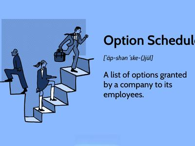

The world of finance is fraught with complexities and controversies, where financial misconduct often casts shadows over markets and investor confidence. Within this domain, practices such as options backdating and algorithmic trading have emerged prominently, significantly impacting market dynamics and the trust investors place in financial institutions.

Options backdating attracted substantial attention during the mid-2000s, revealing a critical loophole in corporate governance and accounting practices. This scandal involved manipulating the date on which stock options were granted, allowing executives to benefit from lower stock prices retrospectively. Such practices resulted in unreported financial gains, at the expense of transparency and integrity in executive compensation. Prominent companies, including Apple and UnitedHealth Group, became embroiled in these allegations, highlighting significant flaws in financial oversight mechanisms.

Algorithmic trading, while revolutionizing market operations through speed and automation, has also given rise to concerns over fairness and regulatory adequacy. The rapid advancement of AI-driven trading algorithms presents new challenges. Such systems have the potential to inadvertently or deliberately manipulate markets, disrupt liquidity, and distort price formation. The emergence of these sophisticated trading methods requires robust regulatory frameworks to prevent misuse and maintain market stability.

This article aims to explore the intricacies of high-profile financial scandals involving options backdating and algorithmic trading, examining the critical role of regulatory responses in mitigating these issues. Through analysis of historical cases, the discussion will illuminate the profound implications of these scandals on corporate governance and market integrity. Understanding these dimensions is essential in fostering a financial environment where innovation and regulation coexist to preserve market integrity and investor trust.

## Table of Contents

## The Scandal of Options Backdating

Options backdating emerged as a significant financial scandal in the mid-2000s, highlighting considerable flaws in corporate governance practices. This controversial method involved the manipulation of the grant date of stock options to an earlier date with a lower market price. This strategic timing allowed executives to receive options that were "in the money," providing them with immediate, unrecorded financial gains once the options were exercised. 

This practice affected several high-profile companies, with notable examples including Apple, UnitedHealth Group, and Broadcom. By altering the dates retrospectively, executives were able to capitalize on these stock options more lucratively than with a straightforward, current market option grant. While stock options are legitimate tools intended to align the interests of executives with those of shareholders by tying compensation to company performance, backdating subverted this purpose, offering rewards that did not reflect actual performance during the purported grant period.

From an accounting perspective, options backdating exploited specific regulatory loopholes. Companies could sidestep the proper reporting of executive compensation by failing to disclose these artificial gains. Under standard accounting regulations, companies are mandated to record fair-value compensation expenses based on the market price of stock options as of the grant date. However, backdating effectively distorted these records, resulting in understated compensation expenses and inflated reported earnings in the financial statements.

The implications of this practice were far-reaching and costly. By undermining the transparency of corporate financial reporting, companies engaged in options backdating could mislead investors, regulators, and other stakeholders about the true cost of employee compensation. This financial misrepresentation resulted in significant discrepancies across earnings reports.

Beyond the financial misrepresentations, options backdating also posed ethical and legal dilemmas. The practice raised questions regarding the fidelity of corporate executives to their fiduciary duties and the ability of corporate boards to adequately oversee management practices. In the wake of exposure and investigation, companies implicated in backdating scandals faced severe repercussions, including significant legal penalties, loss of investor trust, and reputational damage.

The detection of these unethical practices sparked a wave of regulatory and legal scrutiny. Investigations led by the U.S. Securities and Exchange Commission (SEC) resulted in large fines and the resignation of multiple high-ranking executives. These high-profile scandals underscored the necessity of stringent corporate governance standards and the vital role of transparency in executive compensation. The fallout prompted stricter enforcement of financial reporting standards and fueled ongoing debates regarding the ethics and regulation of executive compensation mechanisms.

## Algorithmic Trading and Financial Misconduct

Algorithmic trading, the use of computer algorithms to automate trading decisions and execute orders at high speeds, has significantly reshaped financial markets. By processing vast amounts of data, [algorithmic trading](/wiki/algorithmic-trading) can identify market patterns, price inefficiencies, and execute trades within microseconds, often without direct human intervention. This technological advancement has improved market [liquidity](/wiki/liquidity-risk-premium), reduced transaction costs, and increased trading volumes. However, it has also introduced new forms of financial misconduct, particularly concerning market manipulation and collusion.

Market manipulation through algorithmic trading can occur when traders use algorithms to create artificial market conditions. One of the most notorious practices is "spoofing," where traders place large orders they intend to cancel to create a false sense of demand or supply, influencing prices to their benefit. These manipulative strategies can quickly distort price formation and drive away genuine investors, as seen in several cases investigated by financial regulators globally.

The integration of [artificial intelligence](/wiki/ai-artificial-intelligence) (AI) into these algorithms adds another layer of complexity. AI algorithms, designed to learn and adapt, can potentially engage in sophisticated collusion with other trading algorithms, a phenomenon referred to as "algorithmic collusion." This could result in coordinated market manipulation without explicit communication between parties, making detection and regulation challenging. Contemporary research highlights that, while AI-driven trading can optimize performance and hedge risks more effectively, its unchecked application may lead to unintended coordination, reducing market competition (Calvano et al., 2020).

If left unregulated, algorithmic trading could lead to significant market inefficiencies and distortions. The "Flash Crash" of May 6, 2010, exemplifies such a risk, where market indexes plummeted in minutes due to high-frequency trading algorithms reacting to large sell orders, only to recover shortly after. Such events underscore the vulnerabilities inherent in a trading landscape dominated by speed and automation, where liquidity can rapidly vanish.

To prevent potential abuses, there is a growing emphasis among regulators to institute robust oversight frameworks. These include imposing stricter compliance requirements for trading algorithms, developing real-time monitoring systems to detect suspicious trading patterns, and strengthening the repercussions for breaching trading regulations. Balancing the innovative advantages of algorithmic trading with the necessity for market integrity is a crucial task for contemporary financial oversight.

## Case Studies: Lessons Learned

The options backdating scandal underscored the critical role of transparency and regulation in executive compensation. Revealed in the mid-2000s, this scandal involved manipulating the date of stock options to coincide with periods when stock prices were lower. This alteration allowed companies to report smaller compensation expenses, deceiving shareholders and the market. The resulting financial discrepancies underscored a lack of adequate regulatory mechanisms to ensure transparent reporting of executive remuneration. In response, regulatory bodies were urged to reinforce the importance of accurate accounting practices, emphasizing transparency as a deterrent to similar misconduct.

Research and investigative journalism have proven instrumental in uncovering financial misconduct, as evidenced by the options backdating scandal. Scholarly investigations, complemented by detailed reporting, shed light on complex financial practices and their potential for misuse. These efforts have prompted systemic changes, prompting corporations to adopt more stringent governance frameworks aimed at bolstering transparency and accountability.

The Volkswagen emissions scandal serves as another example highlighting the need for rigorous corporate oversight. Discovered in 2015, the scandal involved the installation of software in diesel engines to manipulate emissions tests, thereby deceiving regulators and consumers. The fallout from this scandal included substantial financial penalties and a tarnished corporate reputation, emphasizing the necessity for persistent oversight and ethical corporate conduct.

Similarly, the Enron scandal of the early 2000s underscored the destructive impact of accounting manipulations on corporate governance. Utilizing complex accounting schemes, Enron obscured its financial health, ultimately leading to one of the largest bankruptcies in American history. The scandal propelled significant legislative and regulatory changes, including the implementation of the Sarbanes-Oxley Act, designed to enhance corporate accountability and deter fraudulent practices.

These case studies underscore the vital importance of stringent corporate governance and regulatory oversight in preventing financial misconduct. They illustrate how transparency and accountability are cornerstone principles necessary to maintain trust and integrity within financial markets.

## Regulatory Responses and Future Implications

In response to the scandals involving options backdating and algorithmic trading, regulatory agencies implemented measures to enhance transparency and accountability in financial markets. A notable example is the Sarbanes-Oxley Act of 2002, enacted in the wake of corporate scandals like Enron and WorldCom. This legislation aimed to improve corporate governance and financial disclosure, thereby preventing abuses such as options backdating. One key provision requires companies to report stock option grants to executives within two business days, ensuring timely and accurate disclosure of executive compensation. The Act also introduced measures to enhance the accuracy of financial statements and imposed stricter penalties for fraudulent practices.

Additionally, the accounting standards were tightened to eliminate the exploitation of loopholes that allowed companies to obscure the true cost of stock options. The Financial Accounting Standards Board (FASB) mandated that companies must recognize stock options as an expense on their income statements. This regulation addressed one of the primary incentives for backdating, as the practice often misrepresented a company's financial standing to investors and the public.

As algorithmic trading grows more pervasive, regulators worldwide have tuned their focus on potential market abuses. High-frequency trading ([HFT](/wiki/high-frequency-trading-strategies)), characterized by rapid execution speeds, has been particularly scrutinized for its potential to cause market disturbances. The "flash crash" of May 6, 2010, where the U.S. stock market experienced a sudden and dramatic drop in prices, acted as a catalyst for regulatory bodies to implement measures addressing the risks associated with algorithmic trading. The Commodity Futures Trading Commission (CFTC) and the Securities and Exchange Commission (SEC) have since developed rules to ensure market stability, including "circuit breakers" to automatically pause trading during extreme [volatility](/wiki/volatility-trading-strategies).

Furthermore, as artificial intelligence (AI) powered algorithms become more advanced, concerns over potential collusion and market manipulation have grown. Regulators are now exploring ways to ensure these technologies do not undermine fair market practices. Techniques like [machine learning](/wiki/machine-learning), which can independently adapt and optimize trading strategies, present new challenges. Organizations such as the European Securities and Markets Authority (ESMA) are proposing policies to enhance the transparency of algorithmic transactions, including strategies to monitor algorithmic trading more effectively.

The future of trading regulations continues to demand a balanced approach, aiming to harness technological advancements while safeguarding market integrity. Regulatory bodies are considering a variety of tools, including advanced data analytics and machine learning, to detect and manage potential trading abuses proactively. It is clear that ongoing regulatory vigilance and adaptations are essential to maintain the delicate equilibrium between innovation and oversight in financial markets.

## Conclusion

Understanding financial misconduct through historical scandals such as options backdating and algorithmic trading provides valuable lessons that are pivotal for both regulators and market participants. These events highlight the nuanced ways financial systems can be manipulated, necessitating a continuous evolution in regulatory practices to ensure market integrity.

The dual challenge regulators face is balancing innovation in financial technology with the imperative for oversight. Financial technology, particularly algorithmic trading, offers significant benefits, including increased market efficiency and liquidity. However, it also poses risks like market manipulation and unintended consequences from high-frequency trading. For regulators, the primary task is to create a framework that supports beneficial innovations while curbing potential abuses. For instance, by implementing real-time monitoring systems and stricter reporting requirements, financial authorities can preemptively identify and address misconduct.

Moreover, perseverance in proactive measures is indispensable for maintaining market trust. This involves not only regulatory enactment but also fostering a culture of compliance within financial institutions. Ensuring that corporate governance structures emphasize ethical conduct and accountability can deter malpractices before they escalate into significant scandals. 

In summary, historical financial scandals underscore the requirement for continuous vigilance and adaptive regulatory frameworks. These efforts collectively contribute to a financial environment where integrity and trust are prioritized, safeguarding the interests of investors and the broader economy.

## References & Further Reading

[1]: Heron, R. A., & Lie, E. (2009). ["What Fraction of Stock Option Grants to Top Executives Have Been Backdated or Manipulated?"](https://www.jstor.org/stable/pdf/40539166.pdf?addFooter=false) The Journal of Financial and Quantitative Analysis, 44(4), 801-828.

[2]: Narayanan, V. G., Schipani, C. A., & Seyhun, H. N. (2007). ["The economic impact of backdating of executive stock options."](https://www.jstor.org/stable/pdf/40041561.pdf) Michigan Law Review, 105(8), 1597-1638.

[3]: Markham, J. W. (2014). ["A Financial History of Modern U.S. Corporate Scandals: From Enron to Reform."](https://books.google.com/books/about/A_Financial_History_of_Modern_U_S_Corpor.html?id=Z7qTGiF8FCgC) Routledge.

[4]: Calvano, E., Calzolari, G., Denicolò, V., & Pastorello, S. (2020). ["Artificial Intelligence, Algorithmic Pricing, and Collusion."](https://www.aeaweb.org/articles?id=10.1257/aer.20190623) The Review of Economic Studies, 87(1), 326-350.

[5]: Lewis, M. (2014). ["Flash Boys: A Wall Street Revolt."](https://en.wikipedia.org/wiki/Flash_Boys) W. W. Norton & Company.

[6]: Johnson, B. (2010). ["Algorithmic Trading & DMA: An Introduction to Direct Access Trading Strategies."](https://www.semanticscholar.org/paper/Algorithmic-trading-%26-DMA-%3A-an-introduction-to-Johnson/aa5de1ab883d5e23b6651faa7c1807586d688e4b) 4Myeloma Press.

[7]: MacKenzie, D. (2021). ["Trading at the Speed of Light: How Ultrafast Algorithms Are Transforming Financial Markets."](https://ieeexplore.ieee.org/abstract/document/9647710) Princeton University Press.