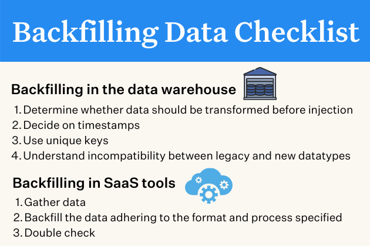

## Table of Contents

## What is backfilled data?

Backfilled data is information that is added to a database or system after the fact, to fill in gaps or complete records that were missing or incomplete at the time they should have been recorded. For example, if a company starts using a new system to track sales, but they want to include sales data from before the system was in use, they might backfill that data into the new system.

This process is important because it helps maintain a complete and accurate historical record. Without backfilling, there would be gaps in the data, which could make it difficult to analyze trends or make informed decisions based on past performance. Backfilling can be done manually or through automated processes, depending on the size and complexity of the data involved.

## Why is backfilled data important in data analysis?

Backfilled data is important in data analysis because it helps to create a complete picture of the past. When you're looking at data over time, it's really helpful to have all the information, not just what was recorded after a certain point. For example, if you start using a new system to track your sales, you want to include the sales from before you started using that system. This way, you can see how things have changed and understand the full story.

Having a full set of data also makes your analysis more accurate and reliable. If you only look at data from a certain point forward, you might miss important trends or patterns that happened before that time. By backfilling the data, you can spot these trends and make better decisions. It's like filling in the missing pieces of a puzzle, which helps you see the whole picture more clearly.

## How does backfilling data affect the accuracy of historical data?

Backfilling data helps make historical data more accurate by filling in missing information. When you add data that was not recorded at the time it happened, you get a fuller picture of what really occurred in the past. This is important because it lets you see trends and patterns that you might miss if you only look at the data that was recorded after a certain date.

However, backfilling data can also introduce some problems. If the data is not added carefully, it might not be as accurate as the data that was recorded at the time. Sometimes, people might guess or estimate the missing information, which can lead to mistakes. So, while backfilling can improve the completeness of historical data, it's important to do it carefully to make sure the data stays accurate.

## What are common scenarios where backfilling data is necessary?

Backfilling data is often needed when a business starts using a new system. For example, if a store switches to a new computer program to keep track of sales, they might want to add old sales numbers into the new system. This helps them see all their sales history in one place, which is useful for understanding how the business has been doing over time.

Another common scenario is when a company merges with another one. When two companies come together, they need to combine their data. If one company has been tracking customer information longer than the other, they might need to backfill data to make sure both sets of records are complete. This way, they can see the full picture of their customers and make better decisions.

Sometimes, backfilling data is also necessary when there's been a mistake or a gap in data collection. For instance, if a sensor stops working and doesn't record data for a while, the missing information might need to be added later. This helps make sure the data is as complete as possible, which is important for accurate analysis and decision-making.

## What are the risks associated with backfilling data?

Backfilling data can be tricky because it might not be as accurate as the data that was recorded when it happened. When you add old information to a new system, you might have to guess or estimate some of the details. If these guesses are wrong, it can make your data less reliable. This is a big problem if you're using the data to make important decisions, because you might end up making choices based on information that isn't quite right.

Another risk is that backfilling can take a lot of time and effort. If you have a lot of old data to add, it can be a big job. This can slow down your work and use up resources that could be spent on other things. It's also important to make sure everyone knows which data has been backfilled, so they don't get confused about what's old and what's new. If people don't understand this, they might make mistakes when they use the data.

## How can backfilled data be identified in a dataset?

To spot backfilled data in a dataset, you need to look for signs that some information was added after it should have been recorded. One way to do this is by checking the date when the data was entered into the system. If you see data with a later entry date than when it should have happened, that might be backfilled data. Another way is to look for notes or tags in the data that say it was added later. Some systems let you add comments or flags to show that certain data was backfilled.

Another method is to compare the backfilled data with other data that was recorded at the right time. If the backfilled data looks different or seems less detailed, it might be because it was added later. For example, if sales numbers from last year are less complete than this year's numbers, the old data might have been backfilled. By paying attention to these signs, you can tell which parts of your dataset might have been added after the fact.

## What are the best practices for backfilling data?

When you're adding old information to a new system, it's important to be careful and do it the right way. First, make sure you know where the old data is coming from. Check if it's reliable and accurate. If you have to guess some details, write down how you made those guesses so others can understand. It's also a good idea to keep the old data separate from the new data at first. This way, you can compare them and make sure everything looks right before mixing them together.

Another important thing is to keep track of what you're doing. Add notes or tags to show which data was added later. This helps everyone know which information might not be as accurate. Also, try to do the backfilling quickly so you don't forget important details. If it's a big job, think about using a computer program to help you. This can save time and make sure you don't make mistakes. By following these steps, you can make sure your data stays as accurate and useful as possible.

## How does backfilling data impact data integrity?

Backfilling data can help make your data more complete, but it can also mess with how accurate and trustworthy your data is. When you add old information to a new system, you might have to guess some details. If these guesses are wrong, it can make your whole dataset less reliable. This is a big problem if you're using the data to make important choices, because you might end up making decisions based on information that isn't quite right.

To keep your data as trustworthy as possible, it's important to be careful when you backfill. Make sure you know where the old data is coming from and check if it's accurate. Keep notes about any guesses you make and mark the data that was added later so everyone knows which information might not be as reliable. By doing these things, you can help make sure your data stays as accurate and useful as possible, even after you've added old information to it.

## What tools or software can be used to backfill data?

There are several tools and software that can help you backfill data easily. One popular tool is Microsoft Excel. With Excel, you can use formulas and functions to add old data into new spreadsheets. Another useful tool is SQL databases, like MySQL or PostgreSQL. These let you write special commands to add old information into your database tables. If you're working with big data, you might use Apache Hadoop or Apache Spark. These tools are good for handling large amounts of data and can automate the backfilling process.

Another option is to use specialized data integration software like Talend or Informatica. These programs help you move and transform data from old systems into new ones. They can also keep track of what data has been added and when, which is helpful for keeping everything organized. For simpler tasks, you might use Google Sheets, which is similar to Excel but works online. It's easy to use and great for sharing data with others. By choosing the right tool, you can make backfilling data a lot easier and more accurate.

## How can the quality of backfilled data be ensured?

To make sure the backfilled data is good, you need to be careful about where the old data comes from. Check that it's reliable and correct. If you have to guess some details, write down how you made those guesses so others can understand. Keep the old data separate from the new data at first. This way, you can compare them and make sure everything looks right before mixing them together. Also, add notes or tags to show which data was added later. This helps everyone know which information might not be as accurate.

It's also important to do the backfilling quickly so you don't forget important details. If it's a big job, using a computer program can help. Tools like Excel, SQL databases, or data integration software can make the process easier and more accurate. By following these steps, you can make sure your backfilled data stays as accurate and useful as possible.

## What are the ethical considerations of backfilling data?

When you add old information to a new system, you need to think about what's right and fair. One big thing to consider is being honest. If you're adding data that wasn't there before, you should tell people about it. This way, they know which information might not be as accurate. It's also important to be careful with people's personal information. If you're adding old data about customers or employees, you need to make sure you're not breaking any privacy rules. You should always follow the laws and rules about how to handle data.

Another thing to think about is how backfilling data might affect decisions. If the data you add isn't correct, it could lead to bad choices that hurt people or the business. So, it's really important to check the data carefully before you add it. Also, think about why you're backfilling the data. If you're doing it to make things look better than they really are, that's not right. Always be clear and honest about what you're doing and why. This helps keep trust and makes sure everyone is treated fairly.

## How does backfilling data influence predictive modeling and machine learning outcomes?

Backfilling data can really change how well predictive modeling and [machine learning](/wiki/machine-learning) work. When you add old information to your dataset, it can make your data more complete. This is good because having more data can help your models understand patterns and trends better. But, if the backfilled data isn't accurate or if it's guessed, it can mess up your models. They might start making predictions based on wrong information, which can lead to bad results. So, it's important to make sure the backfilled data is as correct as possible.

Another thing to think about is how backfilled data can affect the training of machine learning models. If the old data is different from the new data, your model might get confused. It might learn patterns that aren't really there or miss out on important new trends. This can make your predictions less accurate. To avoid this, you need to be careful when you add old data. Keep track of which data was backfilled and check it carefully to make sure it fits well with the rest of your data. By doing this, you can help your models make better and more reliable predictions.

## What is the Importance of Backfilled Data in Backtesting?

Backfilled data ensures the consistency and completeness of historical datasets used in [backtesting](/wiki/backtesting) trading strategies. Accurate backtesting is crucial because it enables traders to evaluate how a strategy would have performed in the past, providing insight into its potential effectiveness. Missing or incomplete data can create inaccuracies, leading to misleading results. For example, if certain periods of [volatility](/wiki/volatility-trading-strategies) are not captured adequately, a strategy may appear more successful than it would actually be under complete data conditions.

The integrity of performance metrics relies heavily on complete datasets. Metrics such as drawdowns, volatility, and returns can become skewed if the underlying data is not comprehensive. Drawdown, which measures the decline from a peak to a trough in a portfolio's value, might be underestimated if periods of significant market downturns are missing from the dataset. Similarly, volatility, often calculated as the standard deviation of returns, depends on having a full set of data points to accurately represent market fluctuations. Incomplete datasets may, therefore, lead to an underestimation of risk, providing a false sense of security about a strategy's stability.

Here's a mathematical illustration of volatility calculation, which can be compromised due to incomplete data:

$$
\sigma = \sqrt{\frac{1}{N-1} \sum_{i=1}^{N} (R_i - \bar{R})^2}
$$

Where:
- $\sigma$ is the standard deviation (volatility),
- $N$ is the number of data points,
- $R_i$ is each individual return,
- $\bar{R}$ is the average return.

If critical $R_i$ values are missing, $\sigma$ becomes less reliable, affecting decisions based on this metric.

Furthermore, high-quality, backfilled data is essential for effective risk management and optimization. Strategies employing stop-loss orders, position sizing, and other risk management measures must be tested under conditions that realistically reflect market behavior. When datasets include artificial gaps, these risk management tools may not perform as expected during live trading, leading to potential losses. By ensuring that the data set is complete and representative, traders can accurately gauge the effectiveness of these measures, allowing for better optimization and alignment of strategies with real-world trading conditions.

## What are the methods to backfill data?

Utilizing reliable historical data sources is crucial for successful backfilling. Data providers who maintain comprehensive and accurate datasets are preferred, as they ensure the data's integrity and reliability for [algorithmic trading](/wiki/algorithmic-trading) backtesting. Reliable datasets include not only price data but also variables like [volume](/wiki/volume-trading-strategy), bid-ask spreads, and other market indicators.

Interpolation techniques offer mathematical solutions for filling in missing data points within datasets. One common method is linear interpolation, which predicts unknown values based on the linear trend between known data points. For example, if $y_1$ and $y_2$ are known values at times $x_1$ and $x_2$ respectively, the interpolated value $y$ at time $x$ can be calculated using the formula:

$$
y = y_1 + \frac{(y_2 - y_1)}{(x_2 - x_1)} \times (x - x_1)
$$

This method is straightforward and effective when market data follows a relatively linear trend between two points. However, caution is advised as financial markets can exhibit non-linear behavior, requiring more sophisticated interpolation techniques, such as polynomial or spline interpolation, which might better capture market dynamics.

Algorithmic adjustments are modifications made to trading strategies to handle missing data periods without skewing results. One approach is to design algorithms that recognize gaps and adjust their operations, for example by pausing trades or recalculating indicators using available data. This adaptation ensures robustness by testing strategies under more realistic conditions rather than generating inflated outcomes from artificially smooth datasets.

Each method for backfilling data plays a crucial role in ensuring that the backtest results reflect true trading performance. Employing these methods can lead to more accurate representations of market conditions, ultimately facilitating better strategy development and risk assessment in algorithmic trading.

## References & Further Reading

[1]: Bergstra, J., Bardenet, R., Bengio, Y., & Kégl, B. (2011). ["Algorithms for Hyper-Parameter Optimization."](https://proceedings.neurips.cc/paper/2011/file/86e8f7ab32cfd12577bc2619bc635690-Paper.pdf) Advances in Neural Information Processing Systems 24.

[2]: ["Advances in Financial Machine Learning"](https://www.amazon.com/Advances-Financial-Machine-Learning-Marcos/dp/1119482089) by Marcos Lopez de Prado

[3]: ["Evidence-Based Technical Analysis: Applying the Scientific Method and Statistical Inference to Trading Signals"](https://www.amazon.com/Evidence-Based-Technical-Analysis-Scientific-Statistical/dp/0470008741) by David Aronson

[4]: ["Machine Learning for Algorithmic Trading"](https://github.com/PacktPublishing/Machine-Learning-for-Algorithmic-Trading-Second-Edition) by Stefan Jansen

[5]: ["Quantitative Trading: How to Build Your Own Algorithmic Trading Business"](https://books.google.com/books/about/Quantitative_Trading.html?id=j70yEAAAQBAJ) by Ernest P. Chan