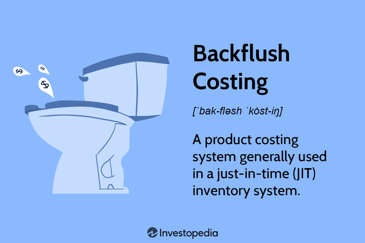

This article explores the intersection of backflush costing, inventory management, cost accounting, and algorithmic trading, highlighting their critical roles in modern business operations. Each of these methodologies contributes uniquely to the efficiency and financial success of a business. Backflush costing, a streamlined accounting method, simplifies the cost recording process in environments that employ just-in-time (JIT) inventory systems. Meanwhile, effective inventory management reduces carrying costs and enhances turnover rates, maximizing resource utilization.

Cost accounting plays a pivotal part by tracking and analyzing production costs, impacting financial decision-making and performance assessment. These methodologies collectively form a foundation for optimizing business processes, each addressing distinct aspects of operational efficiency.



Algorithmic trading, utilizing automated systems for executing trades based on predefined criteria, benefits greatly from precise and agile cost management mechanisms. The integration of accurate cost and inventory data can enhance the strategic decisions made by trading algorithms, leading to increased profitability and responsiveness to market fluctuations.

Understanding how these components synergize allows businesses to streamline operations, reduce waste, and improve financial performance. By outlining the fundamentals, benefits, and challenges associated with these methodologies, this article seeks to provide valuable insights into optimizing business processes through their integration. Through an examination of these interconnected elements, businesses can achieve a sustainable competitive advantage in a rapidly evolving marketplace.

## Table of Contents

## Understanding Backflush Costing

Backflush costing is an efficient accounting method primarily applied in just-in-time (JIT) inventory systems, designed to streamline the accounting process by deferring the recording of production costs until goods are completed. This method contrasts with traditional costing systems, which typically record costs at each stage of production, resulting in a more complicated and time-consuming process. Backflush costing simplifies this by eliminating interim entries, reducing administrative workload, and ensuring accounting records are up-to-date as inventory levels change.

Typically, backflush costing is employed by companies dealing with short production cycles and commoditized products—sectors where speed and efficiency are paramount, and thorough cost tracking at each production stage may not add substantial value. By aligning closely with JIT principles, backflush costing aids in maintaining lean inventory levels, thus minimizing the costs associated with holding excess inventory.

Mechanically, backflush costing works by accumulating costs in a temporary account during production. Once goods are completed, these costs are 'flushed back' from the cost accumulation account to the cost of goods sold and finished goods inventory accounts. This approach ensures that costs are matched precisely with the associated output, providing an accurate reflection of financial performance.

A key advantage of backflush costing is its ability to reduce complexities inherent in traditional costing methods. For instance, traditional costing requires detailed tracking of costs through various stages of production, often using job order or process costing methods. These traditional systems necessitate numerous manual entries, which can be error-prone and resource-intensive. In contrast, backflush costing minimizes these entries, focusing only on the costs directly associated with completed goods, thereby enhancing operational efficiency.

However, the trade-offs of backflush costing must be considered. Its reliance on deferred cost recording can pose challenges, especially in settings with lengthy or intricate production cycles. In such environments, the lack of interim cost tracking might obscure insights into production efficiencies or bottlenecks. Moreover, backflush costing may not always comply with the Generally Accepted Accounting Principles (GAAP), which require detailed cost verification and audit trails. As a result, businesses must carefully consider their operational context and regulatory environment before implementing backflush costing.

In comparison with traditional costing methods, backflush costing offers streamlined processes and potential cost savings. Yet, it may offer less granularity in tracking and analyzing production efficiencies. The choice between these methods should be informed by a company's specific operational needs, production cycles, and regulatory considerations, aiming to strike a balance between efficiency and thoroughness in cost management.

## Inventory Management in Modern Businesses

Effective inventory management is a cornerstone of operational efficiency and financial success for modern businesses. The primary aim is to reduce carrying costs—the expenses related to storing unsold goods—while increasing inventory turnover rates, thereby ensuring that products are sold before their costs surpass their revenue benefits. Key to this process is the integration of backflush costing with just-in-time (JIT) inventory management systems. Backflush costing records production costs only once goods are completed, providing a streamlined approach that aligns well with the principles of JIT. 

**Backflush Costing and JIT Inventory Management**

The synchronization of backflush costing and JIT inventory management is particularly advantageous for companies with short production cycles and commoditized products. JIT systems aim to reduce the duration goods spend as work-in-progress and eliminate excess inventory by producing just enough items to meet demand. Backflush costing complements this by minimizing the administrative burden of tracking costs throughout the production process. This synergy ensures consistent inventory levels, reducing the risk of overproduction or stockouts, which can adversely affect financial performance and customer satisfaction.

**Limitations in Complex Production Cycles**

However, the combination of backflush costing and JIT inventory management can face challenges in long or complex production cycles. In such scenarios, the delayed cost recording inherent in backflush costing could obscure real-time visibility into production expenses, potentially leading to inaccurate cost allocation and inventory evaluation. Moreover, for industries requiring detailed tracking of production inputs and outputs, traditional costing methods may be more appropriate due to the greater precision they offer in monitoring costs incrementally as they incur.

**Case Studies of Successful Implementation**

Several corporations exemplify the successful application of backflush costing within JIT frameworks. Toyota, a pioneer of the JIT philosophy, uses these methodologies to maintain lean operations, minimizing inventory levels without compromising production efficacy. Similarly, Dell has implemented a build-to-order production system combined with backflush accounting to optimize inventory turnover and reduce waste. These companies demonstrate that with the right alignment of production, accounting, and inventory management, significant efficiencies can be achieved.

Understanding the constraints and benefits of integrating backflush costing with modern inventory management practices allows businesses to tailor their strategies to their specific operational needs. This approach not only facilitates cost reduction and increases turnover rates but also supports more agile responses to market demand changes, positioning companies for sustained competitive advantage.

## Role of Cost Accounting

Cost accounting is an essential component of effective financial management, providing detailed insights into costs associated with various production processes. It is integral to understanding cost behavior, contributing to strategic decision-making, and enhancing operational efficiency. By tracking and analyzing cost data, businesses can allocate resources more effectively, identify areas for cost reduction, and improve profitability.

Backflush costing is a significant development in cost accounting, especially in environments that utilize Just-In-Time (JIT) production systems. This method streamlines the accounting process by deferring the recording of production costs until goods are completed. It simplifies the accounting processes by reducing the complexity and [volume](/wiki/volume-trading-strategy) of journal entries typically required in traditional cost accounting systems. By focusing on the end-product rather than every movement in the production process, backflush costing minimizes administrative tasks and the potential for errors.

Accurate cost allocation and variance tracking are critical to ensuring the integrity of financial information. Cost allocation involves assigning indirect costs to different cost objects, like products or departments. Variance tracking, on the other hand, identifies differences between expected (standard costs) and actual costs, enabling businesses to address inefficiencies. Discrepancies can occur due to various factors, including changes in production volumes, labor rates, or material costs, necessitating precise tracking to maintain financial accuracy and operational control.

Reconciling standard costs with actual expenses is another challenge in cost accounting. Standard costs are predetermined costs expected under normal operating conditions and serve as benchmarks for measuring performance. Actual expenses, however, may vary due to real-world complexities. The reconciliation process involves adjusting financial records to reflect these variances. This practice helps companies maintain accurate financial statements while providing insights into cost management performance and opportunities for efficiency improvements.

The potential challenges presented by backflush costing include creating reliable audit trails and adhering to Generally Accepted Accounting Principles (GAAP). In traditional costing methods, every transaction has a detailed record, facilitating audits and compliance efforts. However, backflush costing aggregates these transactions, posing difficulties in tracing costs back to their original source. This can complicate audits and ensure compliance with GAAP, which mandates detailed and accurate financial reporting. While backflush costing reduces operational burdens, companies must implement robust internal controls and documentation procedures to mitigate risks associated with limited audit trails.

In conclusion, cost accounting plays a pivotal role in the efficiency and transparency of financial management within organizations. As businesses seek to streamline operations through methodologies like backflush costing, careful attention must be paid to maintaining accurate cost allocation, variance tracking, and compliance with financial reporting standards. By addressing these challenges, companies can leverage cost accounting to enhance their competitive position in the evolving marketplace.

## Algorithmic Trading: A Brief Overview

Algorithmic trading employs automated systems to initiate and execute trading orders based on a series of predefined rules. These systems leverage high-speed data processing technologies to swiftly analyze market conditions and capitalize on inefficiencies that are often too transient for human traders to exploit. The core advantage of [algorithmic trading](/wiki/algorithmic-trading) is its ability to process a large volume of data and execute trades at a speed and frequency far exceeding human capability. This capacity enables market participants to implement complex trading strategies that optimize their performance and enhance profitability.

The fundamental concept of algorithmic trading is to use computational algorithms to solve complex trading problems typically characterized by mathematical models and statistical analysis. For example, one can employ a moving average crossover strategy, where buy or sell signals are generated when a short-term moving average crosses above or below a long-term moving average. The use of programming languages like Python allows for the efficient implementation of such strategies through simple coding. Below is a sample Python snippet for a basic moving average crossover strategy using historical price data:

```python
import pandas as pd

def moving_average(data, window):
    return data.rolling(window=window).mean()

def crossover_strategy(data, short_window, long_window):
    signals = pd.DataFrame(index=data.index)
    signals['price'] = data
    signals['short_mavg'] = moving_average(data, short_window)
    signals['long_mavg'] = moving_average(data, long_window)
    signals['signal'] = 0.0
    signals['signal'][short_window:] = \
        np.where(signals['short_mavg'][short_window:] > signals['long_mavg'][short_window:], 1.0, 0.0)
    signals['positions'] = signals['signal'].diff()
    return signals

# Example usage:
# price_data is a DataFrame with datetime index and a column 'Close' for closing prices
# results = crossover_strategy(price_data['Close'], short_window=40, long_window=100)
```

In algorithmic trading, seamless integration of inventory and cost management data can significantly enhance trading efficiencies. Proper inventory management ensures that the physical assets underlying certain financial instruments, such as commodities, are managed efficiently, thus enabling better decision-making in derivative trading.

Furthermore, cost data integration into trading algorithms serves as a performance booster by refining cost-related decision-making. For instance, understanding production and inventory costs via methodologies such as backflush costing allows a more nuanced approach to price setting, bid strategies, and timing precision in the markets.

The synergistic collaboration between algorithmic trading systems and well-structured cost management processes facilitates the optimization of trade execution, ultimately contributing to increased profitability and reduced risk exposure. This integration allows companies to make informed trading decisions, factoring in the various cost aspects that directly impact profit margins.

Considering these principles and integrations, algorithmic trading not only advances modern financial operations but, when coupled with efficient cost and inventory management, offers a robust framework for maximizing trading performance and achieving operational excellence in today's dynamic markets.

## Synergy Between Cost Management and Algorithmic Trading

Backflush costing and efficient inventory management play a crucial role in enhancing the capabilities of algorithmic trading systems. Backflush costing aligns cost accounting with production completion, thereby reducing the need for frequent inventory updates and simplifying the tracking of cost flows. This streamlined cost management ensures that algorithmic trading models have access to up-to-date and accurate cost data, supporting informed decision-making processes.

One potential integration involves the incorporation of cost accounting data into trading algorithms. By optimizing cost-related decisions, algorithms can determine the most profitable trading actions. For instance, an algorithm could use real-time cost data to decide whether to buy or sell assets based on their production costs relative to their market price. This dynamic approach allows companies to capitalize on cost efficiencies as they arise.

Considerations for successfully integrating cost management and trading algorithms include data accuracy, processing speed, and system interoperability. Accurate real-time data is critical; any discrepancies between recorded and actual costs may result in erroneous trading decisions. Thus, implementing robust data validation mechanisms is essential for maintaining data integrity.

Practically, companies like Tesla and Amazon have leveraged seamless integration between logistics, cost management, and trading systems to maintain a competitive edge. Tesla's practice of optimizing manufacturing costs in real time and incorporating this data into supply chain logistics allows for strategic purchasing decisions that maximize profit margins. Similarly, Amazon's sophisticated inventory management systems feed into their pricing algorithms, dynamically adjusting prices to reflect current inventory levels and related costs.

However, coordinating these processes poses significant challenges. Companies must ensure compatibility between systems handling different functions, such as cost accounting and trading, which often requires sophisticated middleware or comprehensive ERP solutions. Additionally, aligning strategic goals across departments—such as finance, production, and trading—remains a daunting task. It necessitates a clear communication framework and cross-functional collaboration to ensure synergies are effectively exploited without compromising operational cohesion.

Despite these challenges, the integration of cost management into algorithmic trading offers substantial benefits, presenting significant opportunities for businesses willing to invest in the necessary infrastructure and expertise. Such integration enables swift adaptation to market changes, ensuring sustained competitive advantage in increasingly dynamic environments.

## Conclusion

The integration of backflush costing, inventory management, cost accounting, and algorithmic trading offers businesses a multifaceted approach to achieving operational efficiency and financial optimization. A critical outcome of this integration is the streamlined process flow, where backflush costing reduces accounting complexity, and effective inventory management aligns with just-in-time (JIT) principles, minimizing waste and storage costs. These efficiencies translate into more accurate and dynamic cost accounting, equipping businesses with actionable insights.

Businesses striving for operational efficacy should focus on adopting best practices such as precise demand forecasting, using real-time data analytics, and maintaining robust auditing procedures to ensure compliance with accounting standards like Generally Accepted Accounting Principles (GAAP). By doing so, they can enhance their inventory turnover rates and cost management processes. Another key insight is the role of algorithmic trading, which leverages seamless inventory and cost data, allowing for quicker, more informed trading decisions and capitalizing on market irregularities.

Continuous monitoring and adaptability are crucial as market conditions and technologies evolve rapidly. Businesses must employ adaptive strategies and invest in scalable technologies to remain agile, allowing them to respond to changes effectively and maintain competitiveness. This adaptability is essential to not only sustain current operations but also to rebound quickly from unforeseen disruptions.

Looking forward, emerging trends such as [artificial intelligence](/wiki/ai-artificial-intelligence) and [machine learning](/wiki/machine-learning) present promising advancements in these areas. These technologies could further optimize cost and inventory management, enhancing algorithmic trading strategies through more sophisticated models and predictive analytics. Blockchain technology also holds potential for enhancing transparency and accuracy in cost and inventory records, offering further improvements in reliability and trust in financial reporting.

Promoting ongoing research and exploration into these synergies is vital. By fostering a culture of innovation and continuous improvement, businesses can unlock new opportunities and maintain their edge in a competitive market. Future explorations could delve into how such integrations could redefine broader business strategies and drive holistic transformations across industries.

## References & Further Reading

[1]: Horngren, C. T., Datar, S. M., & Rajan, M. V. (2012). ["Cost Accounting: A Managerial Emphasis"](https://archive.org/details/20240317_20240317_0811). Pearson.

[2]: Maskell, B. H., & Baggaley, B. L. (2004). ["Practical Lean Accounting: A Proven System for Measuring and Managing the Lean Enterprise"](https://www.taylorfrancis.com/books/mono/10.1201/b11454/practical-lean-accounting-brian-maskell-larry-grasso-bruce-baggaley). Productivity Press.

[3]: Womack, J. P., Jones, D. T., & Roos, D. (1990). ["The Machine That Changed the World: The Story of Lean Production"](https://www.jstor.org/stable/154923). Free Press.

[4]: Pinedo, M. L. (2016). ["Scheduling: Theory, Algorithms, and Systems"](https://link.springer.com/book/10.1007/978-3-031-05921-6). Springer.

[5]: Zhang, G. P. (2004). ["Neural Networks in Business Forecasting"](https://archive.org/details/neuralnetworksin0000unse_o4b2). Idea Group Publishing.