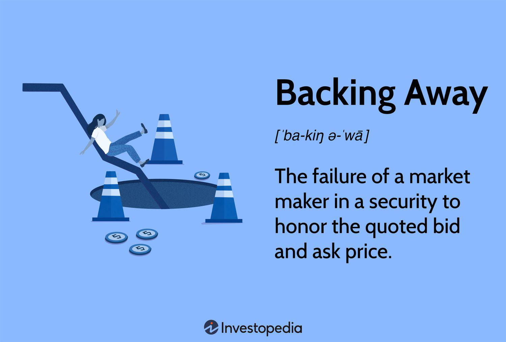

In the fast-paced world of financial markets, algorithmic trading, commonly known as algo trading, has surged in popularity due to its ability to execute trades at speeds and efficiencies unattainable by human traders. This method leverages complex algorithms to analyze market data and execute trades based on pre-defined criteria, often capitalizing on fleeting market opportunities. The rise of algo trading has transformed financial markets, enabling high-frequency trading firms and institutional investors to gain competitive advantages.

Despite these benefits, not every trader is keen to adopt algo trading strategies. A significant number of traders find themselves retreating, withdrawing, or even backing away from fully integrating algo trading into their operations. Concerns over the complexities involved in developing reliable trading algorithms, the need for extensive technological infrastructure, and the potential for substantial financial losses due to algorithmic errors contribute to this trend.



This article aims to explore the reasons behind the retreat from algo trading, examining not only the technical and financial hurdles but also the psychological and regulatory challenges that traders face. By shedding light on these aspects, the article seeks to provide insights into the multifaceted nature of algorithmic trading and its impact on market participants.

## Table of Contents

## The Rise of Algorithmic Trading

Algorithmic trading, colloquially known as algo trading, encompasses the use of computer programs to automatically execute trading strategies. These programs operate at speeds and frequencies far beyond human capabilities, capitalizing on minute changes in the market that would be imperceptible to human traders. The core advantages of algo trading revolve around precision, speed, and computational power. Such advantages have fostered its widespread adoption across various financial markets, including stocks, commodities, and cryptocurrencies.

The precision of algorithmic trading is rooted in its ability to execute trades at optimal prices by analyzing vast amounts of market data in real-time. The computer algorithms can place trades exactly when the market conditions match predefined criteria, minimizing human error and emotional influence. This is especially beneficial in high-frequency trading (HFT), where split-second decisions can lead to significant profits or losses.

Speed is another critical advantage that algo trading brings to the table. The traditional method of manual trading is constrained by the cognitive and physical limitations of human traders. In contrast, algorithms can react within milliseconds, allowing traders to capitalize on fleeting opportunities. This is particularly pertinent in markets with high volatility, where rapid price changes can occur within seconds. With an algorithmic approach, a trader can execute numerous trades simultaneously across multiple markets, a feat impossible for an individual trader to achieve manually.

Moreover, [algorithmic trading](/wiki/algorithmic-trading) platforms process vast quantities of market data, identifying trends and executing trades that would be difficult for human traders due to the data's sheer [volume](/wiki/volume-trading-strategy). Advanced algorithms use [machine learning](/wiki/machine-learning) techniques and statistical models to predict market movements, adapting to new market conditions with heightened accuracy. For example, algorithms can analyze historical data, calculate variables such as [volatility](/wiki/volatility-trading-strategies) and trading volumes, and generate strategies to forecast future price movements.

The adoption of algo trading has been exponential, extending beyond traditional stock markets to include commodities and cryptocurrencies. In commodity markets, algorithms facilitate the efficient execution of trades in resources such as oil and gold. Similarly, the nascent [cryptocurrency](/wiki/cryptocurrency) markets have witnessed significant algo trading adoption. Crypto exchanges operate around the clock, making them particularly conducive to automated trading systems that can function tirelessly without human intervention.

The algorithms' adaptability allows them to function across these various markets, adhering to specific regulations and efficiency standards, thereby offering traders a versatile tool to navigate the complexities of modern financial trading. As technology continues to evolve, the role of algorithmic trading is expected to become even more integral within global financial markets.

## Reasons for Retreat and Withdrawal from Algo Trading

Algorithmic trading, while lucrative and efficient, presents several challenges that can lead traders to pull back or withdraw from using such systems. A primary concern for individual traders is the complexity involved in creating and maintaining these algorithmic systems. Developing effective trading algorithms requires robust programming skills, a strong understanding of financial markets, and the ability to integrate complex mathematical models. This complexity can be overwhelming, particularly for traders who may lack specialized technical skills or resources to manage and continuously update their algorithms.

Moreover, market volatility introduces substantial risks to algorithmic traders. Algorithms are typically designed based on historical data and set parameters, making them susceptible to unexpected shifts in market conditions. High volatility can lead to significant deviations from expected outcomes, resulting in financial losses. Algorithmic systems may fail to adapt quickly to abrupt market changes, such as those seen during economic crises or unexpected geopolitical events, leading traders to question their reliability.

In addition to technical challenges and market volatility, regulatory requirements add another layer of complication. Regulatory bodies such as the U.S. Securities and Exchange Commission (SEC) and the Financial Industry Regulatory Authority (FINRA) have implemented strict guidelines that govern algorithmic trading practices. Traders must ensure their algorithms comply with these regulations to avoid legal repercussions and penalties. Meeting such regulatory demands requires a thorough understanding of legal frameworks and may necessitate engagement with legal experts, which can be expensive and time-consuming.

These factors collectively contribute to the hesitancy or decision of some traders to retreat from algorithmic trading. For those lacking the resources or expertise to navigate these challenges, traditional trading methods may appear more manageable and less risky. As a result, the prospect of algorithmic trading, despite its potential for increased efficiency and profitability, can be intimidating and lead to a strategic withdrawal.

## Backing Away: The Psychological and Financial Implications

Algorithmic trading, while offering significant advantages such as speed and precision, also presents psychological and financial challenges that can lead traders to hesitate or entirely withdraw from its use. One key psychological barrier is the fear of loss, often intensified by the perceived lack of control over automated systems. Unlike traditional trading, where decisions are made consciously by the trader, algorithmic systems execute trades automatically according to pre-defined criteria. This automation can create a sense of detachment from the trading process, leading to anxiety over potential losses caused by algorithmic errors or market unpredictability.

Financial implications play a substantial role in traders' reluctance to fully embrace algo trading. Algorithmic errors, which might occur due to bugs in the code, incorrect data inputs, or unforeseen market events, can lead to significant financial losses. For instance, small coding errors in algorithms can have amplified impacts, especially when high-frequency trading is involved. Consider a scenario where an algorithm is designed to buy a stock when its price crosses a certain threshold. If the code inadvertently reads the threshold incorrectly, it may execute numerous unplanned transactions, resulting in financial losses.

These psychological and financial challenges necessitate thorough understanding and strategies to mitigate risks inherent in algo trading. Building robust algorithms through rigorous testing, frequent updates, and comprehensive risk management strategies can help minimize the potential for losses. Moreover, traders should focus on maintaining psychological resilience, which can be achieved through education and understanding of the algorithmic systems in use, allowing for greater confidence in their functionality. Overall, recognizing and addressing these implications is essential for traders to make well-informed decisions regarding the use of algorithmic trading systems.

## Regulatory and Ethical Considerations

Regulatory bodies such as the U.S. Securities and Exchange Commission (SEC) and the Financial Industry Regulatory Authority (FINRA) impose stringent rules on algorithmic trading to ensure market integrity and protect investors. These regulations are designed to prevent manipulative practices, reduce systemic risk, and promote transparency within financial markets. For instance, algorithmic trading strategies must comply with the market manipulation rules and provide detailed reporting to authorities. The implementation of these regulations requires algorithmic traders to continuously adjust their systems to maintain compliance, which can be resource-intensive.

Traders must also contend with ethical considerations that play a significant role in algorithmic trading. Ensuring fair market practices is paramount; algorithms must not exploit or manipulate market inefficiencies in a manner that violates ethical standards. For example, high-frequency trading ([HFT](/wiki/high-frequency-trading-strategies)) strategies, which capitalize on tiny price movements executed at extremely high speeds, have been scrutinized for potentially creating unfair advantages and disrupting market stability. Ethical issues also extend to data privacy and the treatment of nonpublic information, whereby traders are obliged to use data responsibly and avoid any form of misuse or insider trading.

These regulatory and ethical requirements contribute to the hesitation some traders feel when considering algorithmic trading. Beyond technical challenges, compliance with these standards imposes an additional layer of complexity and cost. Navigating these complexities requires a deep understanding of both financial markets and evolving regulatory landscapes, making it essential for traders to remain informed and ensure their systems are both legally compliant and ethically sound. In this environment, collaboration with legal experts and dedicated compliance teams can be beneficial to effectively manage these challenges and gain confidence in utilizing algorithmic trading strategies responsibly.

## Strategies for Successfully Implementing Algo Trading

Implementing algorithmic trading strategies successfully requires a systematic approach, careful planning, and a willingness to adapt and learn over time. One effective strategy for overcoming the inherent challenges is to begin with simple algorithms and gradually increase their complexity. This incremental approach allows traders to gain confidence and understanding of the systems they are developing. Starting with simple algorithms might involve basic moving averages or trend-following strategies that rely on fewer data points and require less computing power. As traders become more comfortable, they can introduce more complex models such as machine learning algorithms that analyze patterns in large datasets.

Comprehensive testing and ongoing monitoring are critical components for mitigating the risks associated with algorithmic trading. Rigorous [backtesting](/wiki/backtesting) is essential to ensure that algorithms perform as expected under various market conditions. Backtesting involves running the algorithm on historical data to see how it would have performed in real trading scenarios. It helps in identifying potential issues and fine-tuning parameters to improve its effectiveness. Additionally, live testing, also known as paper trading, allows traders to observe how the algorithms function in real-time without committing actual capital. This phase is crucial for identifying and resolving any discrepancies between expected and actual performance.

Ongoing monitoring is equally important once the algorithm is deployed. Continuous supervision ensures that the system adapts to market changes and operates as intended. Traders can employ automated alerts and dashboards to track metrics such as profit/loss, slippage, latency, and error rates. By maintaining vigilance, traders can make prompt adjustments to the algorithm as necessary, thereby reducing potential losses.

Engaging with an experienced trading community can provide vital support and resources for traders venturing into algorithmic trading. Online forums, social media groups, and professional networks offer platforms for sharing knowledge, strategies, and experiences. Connecting with seasoned traders can provide valuable insights into best practices, potential pitfalls, and emerging trends in algorithmic trading. Additionally, participating in workshops and seminars can further enhance a trader's understanding and skills.

To support algorithm development and testing, traders might employ programming languages like Python, which is widely used due to its extensive libraries and frameworks tailored for financial analysis. For instance, libraries such as NumPy, pandas, and SciPy facilitate data manipulation and statistical analysis, while libraries like [backtrader](/wiki/backtrader) and Zipline offer tools for backtesting trading strategies.

Sample Python code for backtesting a simple moving average strategy might look like this:

```python
import pandas as pd
import numpy as np
import matplotlib.pyplot as plt

# Load historical data
data = pd.read_csv('historical_stock_data.csv', parse_dates=True, index_col='Date')

# Compute moving averages
data['SMA_50'] = data['Close'].rolling(window=50).mean()
data['SMA_200'] = data['Close'].rolling(window=200).mean()

# Generate signals
data['Signal'] = np.where(data['SMA_50'] > data['SMA_200'], 1, 0)

# Calculate returns
data['Returns'] = data['Close'].pct_change()
data['Strategy_Returns'] = data['Signal'].shift(1) * data['Returns']

# Plot strategy performance
data[['Returns', 'Strategy_Returns']].cumsum().apply(np.exp).plot(title='Strategy vs Market Returns')
plt.show()
```

Through strategic planning, diligent testing, and leveraging community insights, traders can enhance their capacity to implement successful algorithmic trading strategies. This methodical approach can significantly increase the likelihood of achieving sustainable profits while minimizing risks.

## Conclusion

In the fast-evolving landscape of financial markets, algorithmic trading presents a significant opportunity for those willing to navigate its complexities. Despite the retreat observed among some traders, the rewards for mastering algo trading can be substantial. Algorithmic trading harnesses the power of computer systems to execute trades with precision and speed, processing vast amounts of data and enabling strategies that transcend human limitations. This capability, when wielded wisely, can enhance trading efficiency and effectiveness.

Success in algorithmic trading is contingent upon a deep understanding of its intricate dynamics and meticulous preparation for the associated challenges. Traders must be equipped to design robust algorithms, which involves comprehensive testing and iterative improvement. It is crucial to consider not only the technical aspects but also to anticipate and mitigate potential financial and psychological barriers. By addressing these challenges head-on, traders can transform algorithmic systems into powerful tools that enhance their trading strategies.

For those inclined to embrace technological advancements, algorithmic trading opens a frontier of potential. With a strategic approach, continuous learning, and leveraging community insights, traders can capitalize on the benefits offered by algorithmic systems. Algorithmic trading, when approached with diligence and strategic foresight, can provide a competitive edge, enabling traders to thrive in today's complex financial markets.

## References & Further Reading

[1]: Bergstra, J., Bardenet, R., Bengio, Y., & Kégl, B. (2011). ["Algorithms for Hyper-Parameter Optimization."](https://dl.acm.org/doi/10.5555/2986459.2986743) Advances in Neural Information Processing Systems 24.

[2]: ["Advances in Financial Machine Learning"](https://www.amazon.com/Advances-Financial-Machine-Learning-Marcos/dp/1119482089) by Marcos Lopez de Prado

[3]: ["Evidence-Based Technical Analysis: Applying the Scientific Method and Statistical Inference to Trading Signals"](https://www.amazon.com/Evidence-Based-Technical-Analysis-Scientific-Statistical/dp/0470008741) by David Aronson

[4]: ["Machine Learning for Algorithmic Trading"](https://github.com/stefan-jansen/machine-learning-for-trading) by Stefan Jansen

[5]: ["Quantitative Trading: How to Build Your Own Algorithmic Trading Business"](https://www.amazon.com/Quantitative-Trading-Build-Algorithmic-Business/dp/1119800064) by Ernest P. Chan