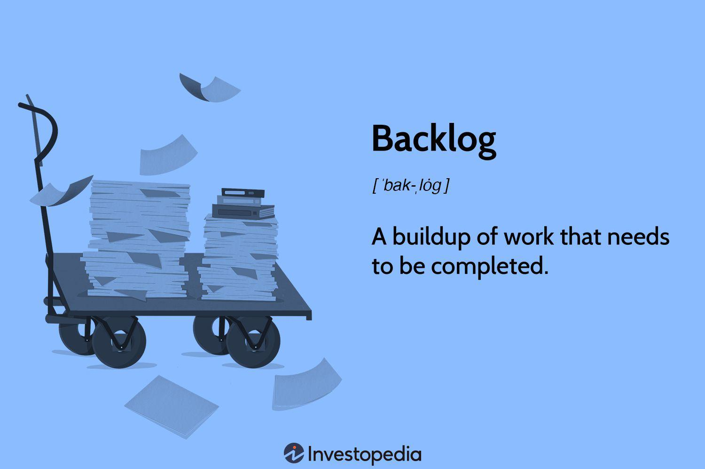

## Table of Contents

## What is a backlog in project management?

A backlog in project management is like a to-do list for a project. It's a collection of all the tasks, features, or requirements that need to be worked on. Think of it as a big list where you keep adding new things that need to be done as they come up.

Teams use the backlog to keep track of what needs to be done next. They can prioritize the items on the list, so the most important tasks get done first. It helps everyone stay organized and focused on what's most important for the project's success.

## Why is a backlog important for agile methodologies?

In agile methodologies, a backlog is super important because it helps teams stay flexible and focused. Agile is all about being able to change and adapt quickly. The backlog lets teams add new tasks or change priorities as things come up. This way, they can respond to new ideas or problems without messing up the whole project plan.

The backlog also helps teams plan their work in short cycles, called sprints. At the start of each sprint, the team picks a few items from the backlog to work on. This keeps everyone on track and makes sure they're always working on the most important things. By using the backlog, teams can make sure they're always moving forward and delivering value to customers as quickly as possible.

## How does a backlog differ from a to-do list?

A backlog and a to-do list are similar because they both keep track of things that need to be done. But a backlog is usually used for bigger projects, like in software development or business projects. It includes not just simple tasks, but also bigger goals and features that need to be worked on over time. A to-do list, on the other hand, is more for everyday personal tasks, like buying groceries or calling a friend.

Another difference is how they are used. A backlog is constantly changing and growing as new ideas or problems come up. Teams often prioritize items in the backlog, so they know what to work on next. This helps them stay flexible and adapt to changes. A to-do list is usually more static; you write down tasks and check them off as you complete them. It's simpler and doesn't usually change much once you've made it.

## What are the key components of a product backlog?

A product backlog is like a big list that has all the things a team needs to work on for a project. It includes user stories, which are short descriptions of what users need, and tasks, which are the specific jobs that need to be done to meet those needs. It also has bugs, which are mistakes in the product that need to be fixed, and technical work, like improving how the product works behind the scenes. Each item in the backlog has a description so everyone knows what it is about.

The backlog also includes priorities, which help the team know what to work on first. The most important things are at the top of the list. There are also estimates, which are guesses about how long each task will take. This helps the team plan their work. Sometimes, there are also acceptance criteria, which are the rules that say when a task is done right. All these parts together help the team keep track of everything they need to do and make sure they're always working on the most important things.

## How should items be prioritized in a backlog?

Prioritizing items in a backlog is all about deciding which tasks are the most important and should be worked on first. You can think about what will make the customers happiest or what will help the business the most. For example, if fixing a bug will make the product work better for lots of people, that might be a high priority. Or if adding a new feature will bring in more customers, that might be important too. The team often talks about what's most important and moves those items to the top of the list.

Another way to prioritize is by looking at how much work each task will take. If a task is quick and easy but will make a big difference, it might be a good idea to do it soon. On the other hand, if a task will take a long time and isn't that important, it might be better to put it lower on the list. The goal is to always be working on the things that will help the project the most, so the team can keep moving forward and making the product better.

## What is the role of a product owner in managing a backlog?

The product owner is like the captain of the backlog. They are in charge of making sure the backlog is always up to date and organized. This means they add new items when new ideas come up, and they also take out items that are no longer needed. The product owner talks to the team and the customers to understand what's most important and then puts those items at the top of the list. They make sure everyone knows what's in the backlog and why each item is there.

The product owner also helps the team understand what each item in the backlog means. They explain the user stories and the tasks so the team knows what they need to do. They also help the team guess how long each task will take and set goals for what they want to get done in each sprint. By keeping the backlog clear and well-organized, the product owner helps the team stay focused on what's most important and keeps the project moving forward.

## Can you explain the concept of a sprint backlog?

A sprint backlog is a smaller list that comes from the bigger product backlog. It's made at the start of each sprint, which is a short period of time, usually a few weeks, where the team works on specific tasks. The sprint backlog only includes the items from the product backlog that the team plans to work on during that sprint. This helps the team focus on a smaller set of tasks and make sure they can finish them in the time they have.

The team picks items for the sprint backlog based on what's most important and what they think they can get done. They might choose user stories, tasks, or bugs that need to be fixed. During the sprint, the team works together to complete everything on the sprint backlog. This helps them stay organized and make steady progress on the project. By the end of the sprint, they should have finished all the items on the sprint backlog, which moves the project forward and gets them closer to their goals.

## How often should a backlog be reviewed and refined?

A backlog should be reviewed and refined regularly, usually at least once per sprint. This helps keep the list up to date and makes sure the team is always working on the most important things. During these reviews, the team looks at what's in the backlog, adds new items, removes things that aren't needed anymore, and changes the order of the list to match new priorities.

Refining the backlog is also important. It means making the items clearer and more detailed so the team knows exactly what to do. This can happen during special meetings called backlog refinement sessions, which might happen once or twice a week. By keeping the backlog clean and well-organized, the team can work more smoothly and make sure they're always moving forward on the project.

## What are common challenges in backlog management?

One common challenge in backlog management is keeping the backlog organized and up to date. As new ideas and tasks come up, the backlog can get messy and hard to understand. It's easy for the list to get too long, making it tough to see what's most important. The team needs to spend time regularly cleaning up the backlog, removing old items, and making sure everything is clear and in the right order. If they don't, the backlog can become overwhelming and slow down the project.

Another challenge is making sure everyone agrees on what's most important. Different people might have different ideas about which tasks should be done first. The product owner needs to talk to the team and the customers to understand their needs and set the priorities. If there's disagreement, it can lead to arguments and delays. It's important for the team to communicate well and work together to keep the backlog focused on what will help the project the most.

Sometimes, the team might struggle with estimating how long tasks will take. If the estimates are wrong, it can mess up the plan for the sprint. The team needs to get better at guessing how much work each task will be and adjust their plans if things take longer than expected. Good estimation helps the team pick the right items for each sprint and keeps the project on track.

## How can a backlog help in managing stakeholder expectations?

A backlog helps manage stakeholder expectations by clearly showing what the team plans to work on and when. When stakeholders see the backlog, they can understand which features or fixes are coming up next. This helps them know what to expect and when they might see changes or improvements in the product. If stakeholders have new ideas or needs, they can share them with the product owner, who can add them to the backlog. This way, everyone's on the same page about what's important and what the team is working towards.

Keeping the backlog up to date and well-organized also helps manage expectations. When the team regularly reviews and refines the backlog, they can explain to stakeholders why certain items are prioritized over others. This transparency builds trust and keeps stakeholders informed about the project's progress. By showing that the team is actively working on the most important tasks, stakeholders feel more confident that their needs are being considered and addressed in a timely manner.

## What advanced techniques can be used to optimize backlog management?

One advanced technique to optimize backlog management is using the MoSCoW method to prioritize items. This method helps the team sort tasks into four groups: Must have, Should have, Could have, and Won't have. By doing this, the team can easily see which tasks are the most important and need to be done first. This makes it easier to focus on what really matters and keep the project moving forward. Another technique is using story mapping, which helps the team see the big picture of the project. They lay out all the user stories in a way that shows how they fit together to make the whole product. This can help find gaps or overlaps in the backlog and make sure everything is in the right order.

Another useful technique is applying the Kano model, which helps understand what features will make customers happy. The model sorts features into categories like basic needs, performance needs, and excitement needs. By knowing which category each feature falls into, the team can prioritize the backlog to focus on what will make the biggest impact on customer satisfaction. Additionally, using data-driven prioritization can help. This means looking at data like customer feedback, usage [statistics](/wiki/bayesian-statistics), and business goals to decide what to work on next. By using data, the team can make better decisions and keep the backlog aligned with what's most important for the project's success.

## Can you provide real-world examples of successful backlog management in large projects?

One great example of successful backlog management is how Spotify manages its product development. Spotify uses agile methods to keep their music streaming service fresh and exciting for users. They have a big backlog full of new features and fixes they want to add. Their product owners work closely with the teams to make sure the backlog is always up to date and focused on what users want most. They use data to decide what to work on next, like which songs people listen to the most or which features they use a lot. By keeping their backlog well-organized and prioritized, Spotify can quickly add new features and keep their users happy.

Another example is how Amazon manages their online shopping platform. Amazon has a huge backlog because they're always trying to improve their website and make shopping easier for customers. They use advanced techniques like the MoSCoW method to sort their tasks into what's most important. This helps them focus on the big things that will make a real difference, like making the checkout process faster or adding new ways to find products. Their product owners talk a lot with the teams and use data to make sure they're working on what matters most to their customers. By keeping their backlog clear and well-prioritized, Amazon can keep improving their service and stay ahead in the online shopping world.

## What are the implications of backlogs on algo trading performance?

Backlogs can significantly influence the performance of [algorithmic trading](/wiki/algorithmic-trading) systems, often acting as a double-edged sword. On one hand, a backlog of orders might suggest a robust demand for securities, which could be beneficial by indicating strong market interest. On the other hand, such backlogs could also point to underlying inefficiencies within the trading system that require immediate attention. These inefficiencies may stem from inadequate computational resources, suboptimal algorithms, or market anomalies.

Persistently high backlogs pose a considerable threat to the profitability of an algorithmic trading system. The main risk associated with these backlogs is the delayed execution of trades, which might cause the system to miss optimal trading windows. If an algorithm is designed to capitalize on fleeting [arbitrage](/wiki/arbitrage) opportunities or respond to rapid market fluctuations, any delay can lead to opportunity costs and reduced profitability.

Moreover, unresolved backlogs might escalate transaction costs. As orders wait in line to be executed, the prices at which trades occur can deviate significantly from the prices at which the algorithm initially intended to execute. This phenomenon is known as 'slippage'. Slippage occurs when the final execution price differs from the expected price due to market [volatility](/wiki/volatility-trading-strategies) or delays. In formulaic terms, slippage can be expressed as:

$$
\text{Slippage} = P_{\text{executed}} - P_{\text{intended}}
$$

where $P_{\text{executed}}$ is the price at which the trade is executed, and $P_{\text{intended}}$ is the price intended by the trading algorithm. Continual slippage decreases the overall return on investment, as the algorithm pays more than planned on buys or receives less than planned on sells over time.

Addressing these issues requires thorough system diagnostics and iterative improvements. Ensuring that computational capabilities match the required trading volumes, optimizing algorithm efficiency, and employing real-time analytics can help minimize the detrimental effects of backlogs on trading performance.

## References & Further Reading

[1]: Bergstra, J., Bardenet, R., Bengio, Y., & Kégl, B. (2011). ["Algorithms for Hyper-Parameter Optimization."](https://dl.acm.org/doi/10.5555/2986459.2986743) Advances in Neural Information Processing Systems 24.

[2]: ["Advances in Financial Machine Learning"](https://www.amazon.com/Advances-Financial-Machine-Learning-Marcos/dp/1119482089) by Marcos Lopez de Prado

[3]: ["Evidence-Based Technical Analysis: Applying the Scientific Method and Statistical Inference to Trading Signals"](https://www.amazon.com/Evidence-Based-Technical-Analysis-Scientific-Statistical/dp/0470008741) by David Aronson

[4]: ["Machine Learning for Algorithmic Trading"](https://github.com/stefan-jansen/machine-learning-for-trading) by Stefan Jansen

[5]: ["Quantitative Trading: How to Build Your Own Algorithmic Trading Business"](https://www.amazon.com/Quantitative-Trading-Build-Algorithmic-Business/dp/1119800064) by Ernest P. Chan