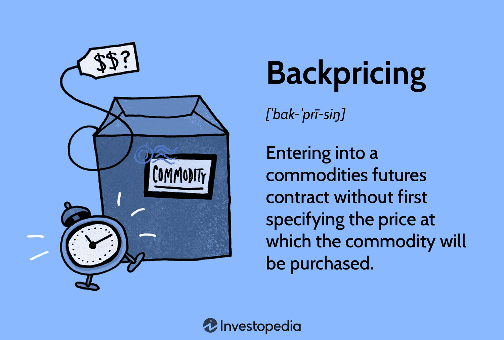

## Table of Contents

## What is backpricing and how does it differ from traditional pricing?

Backpricing is a pricing strategy where the price of a product is set based on what customers are willing to pay, rather than on the costs of making the product. It starts with understanding what price the market will accept and then works backward to see if the company can make and sell the product at that price. This approach is often used in competitive markets where companies need to be flexible with their prices to attract customers.

Traditional pricing, on the other hand, is more straightforward. It starts with calculating all the costs of making a product, like materials, labor, and overhead. Then, a profit margin is added to these costs to determine the final price. This method is simpler and more predictable but can sometimes result in prices that are too high for the market, making it harder to sell the product.

## Why is backpricing important for businesses?

Backpricing is important for businesses because it helps them stay competitive. By setting prices based on what customers are willing to pay, businesses can attract more buyers. In markets where many companies are selling similar products, backpricing allows a business to adjust its prices to be more appealing than its competitors. This can lead to more sales and a bigger share of the market.

Another reason backpricing is important is that it helps businesses understand their customers better. When a business uses backpricing, it has to do a lot of research to find out what prices people will accept. This research gives the business valuable information about what customers want and how much they are willing to spend. With this knowledge, the business can make better decisions about what products to offer and how to market them.

## How can backpricing be implemented in a small business?

Backpricing can be implemented in a small business by first figuring out what customers are willing to pay for their products. The business owner needs to talk to customers, do surveys, or look at what similar products are selling for at other stores. This helps them set a price that people will be happy to pay. For example, if a small bakery wants to sell a new type of bread, they might ask their regular customers how much they would be willing to spend on it.

Once the business knows what price customers will accept, they need to work backward to see if they can make and sell the product at that price. This means adding up all the costs like ingredients, labor, and other expenses to see if the price they set will cover these costs and still leave room for profit. If the costs are too high, the business might need to find ways to make the product cheaper, like buying ingredients in bulk or finding a less expensive supplier. By using backpricing, a small business can make sure their prices are right for their customers and still make money.

## What are the key components of a backpricing strategy?

The first key component of a backpricing strategy is understanding what customers are willing to pay. This means a business needs to do research to find out the price that people will accept for their product. They can talk to customers, send out surveys, or look at what similar products are selling for. By knowing this, a business can set a price that is attractive to customers and helps them stand out from competitors.

The second key component is figuring out if the business can make and sell the product at the price customers are willing to pay. This involves calculating all the costs like materials, labor, and overhead. The business then needs to see if the chosen price will cover these costs and still leave room for profit. If the costs are too high, the business might need to find ways to reduce them, like using cheaper materials or finding a more affordable supplier. By working backwards from the customer's price, the business can make sure their pricing strategy is both competitive and profitable.

## Can backpricing be used in online retail, and if so, how?

Yes, backpricing can be used in online retail. Online businesses can find out what customers are willing to pay by looking at data from their website. They can see how much people are willing to spend by checking the prices of similar products on other websites. They can also ask customers directly through surveys or feedback forms on their site. This helps them set a price that people will be happy to pay.

Once they know the right price, online retailers need to make sure they can sell their product at that price and still make a profit. They have to add up all the costs like the product itself, shipping, and any other fees. If the costs are too high, they might need to find cheaper ways to do things, like using less expensive shipping options or buying products in bulk. By using backpricing, online retail businesses can make sure their prices are good for customers and still make money.

## What are the potential risks and challenges associated with backpricing?

One big risk of backpricing is that it can be hard to make a profit. If a business sets a price based on what customers are willing to pay, but the costs to make the product are too high, the business might lose money. They have to find ways to lower costs, which can be tough. Also, if the market changes and people are not willing to pay the same price anymore, the business might have to keep lowering the price, which can hurt their profits even more.

Another challenge is that backpricing needs a lot of research. A business has to talk to customers and look at what other businesses are doing to find out the right price. This takes time and money. If the research is not done well, the business might set the wrong price and lose sales. It's a lot of work to keep checking what customers are willing to pay and changing prices to match, especially if the market is always changing.

Lastly, backpricing can lead to price wars with other businesses. If one business lowers its prices to attract customers, others might do the same. This can make prices go down so much that no one makes a profit. It's hard to keep up with other businesses and still make money. So, while backpricing can help a business be more competitive, it also comes with risks that need to be carefully managed.

## How does backpricing affect customer perception and behavior?

Backpricing can make customers feel like they are getting a good deal. When a business sets prices based on what people are willing to pay, they often end up lower than traditional prices. This can make customers happy because they feel like they are saving money. If customers see that a business is trying to give them fair prices, they might be more loyal and come back to buy more things in the future. They might also tell their friends about the good prices, which can bring in new customers.

But backpricing can also make customers think the product is not as good. If the price is much lower than other similar products, customers might wonder if there is something wrong with it. They might think it is cheaper because it is not as high quality. This can make them less likely to buy it, even if the price is good. So, businesses need to be careful how they use backpricing so it does not make customers doubt the value of their products.

## What legal and ethical considerations should be taken into account with backpricing?

When using backpricing, businesses need to think about the law. They have to make sure they are not breaking any rules about pricing. For example, they cannot work with other businesses to set prices, which is called price fixing and is against the law. Also, businesses need to be honest about their prices and not trick customers. If they change prices a lot, they need to tell customers clearly so no one gets confused or feels cheated.

There are also ethical things to consider. Backpricing should be fair to everyone. A business should not use it to take advantage of customers, like raising prices when there is a shortage of something. They should also treat all customers the same and not charge different prices to different people for the same product, which is called price discrimination and can be seen as unfair. By keeping these legal and ethical points in mind, businesses can use backpricing in a way that is good for them and their customers.

## How can data analytics enhance the effectiveness of backpricing?

Data analytics can make backpricing better by helping businesses understand what customers want to pay. By looking at lots of information from their sales and customer feedback, businesses can see patterns and figure out the best price for their products. For example, they can use data to see how people react to different prices and find the sweet spot where the price is low enough to attract customers but high enough to make a profit. This helps businesses set prices that are just right for their customers.

Also, data analytics can help businesses keep an eye on what their competitors are doing. By studying the prices of similar products from other companies, a business can make sure their prices are competitive. If they see that a competitor lowers their prices, they can use data to quickly adjust their own prices to stay in the game. This way, backpricing becomes more flexible and responsive to changes in the market, helping businesses stay ahead and make more sales.

## What advanced techniques can be used to optimize backpricing strategies?

One advanced technique to optimize backpricing strategies is using [machine learning](/wiki/machine-learning). Machine learning can look at a lot of data quickly and find patterns that humans might miss. For example, it can predict how customers will react to different prices based on past sales and feedback. This helps businesses set prices that are more likely to attract customers and make a profit. By using machine learning, a business can keep changing its prices to match what customers want and what the market is doing.

Another technique is A/B testing. This means trying out different prices with different groups of customers to see which price works best. A business can show one price to some customers and a different price to others, then compare how many people buy at each price. This helps them find the best price without guessing. A/B testing is a good way to make sure backpricing is working well and can help a business make more money by setting the right prices for their products.

## How does backpricing integrate with other pricing strategies like dynamic pricing?

Backpricing and dynamic pricing can work together to make a business's pricing strategy even better. Backpricing starts with finding out what customers are willing to pay and then figuring out if the business can make and sell the product at that price. Dynamic pricing, on the other hand, changes prices based on things like how much people want the product right now, the time of day, or even the weather. By using backpricing to set a starting price that customers like, a business can then use dynamic pricing to tweak that price to make more sales and profits as the market changes.

For example, a business might use backpricing to set a good base price for a new product after talking to customers and looking at the market. Then, they can use dynamic pricing to change that price a little bit every day based on how many people are buying the product. If more people want it, the price might go up a bit. If fewer people want it, the price might go down. This way, the business can keep the price just right for customers and still make money, even as things in the market change.

## What case studies or real-world examples illustrate successful backpricing implementations?

A great example of backpricing working well is how Amazon uses it for their products. Amazon looks at what people are willing to pay for things like [books](/wiki/algo-trading-books) or electronics by checking what similar items are selling for on their site and others. They then set a price that people will like. After setting this base price, Amazon uses dynamic pricing to change the price a little bit every day. This helps them sell more and make more money. By using backpricing to start with a good price and then tweaking it with dynamic pricing, Amazon keeps their prices just right for customers.

Another example is how airlines use backpricing for their tickets. Airlines do a lot of research to find out what people will pay for flights to different places at different times. They set their base prices based on this research. Then, they use dynamic pricing to change the ticket prices based on how many people want to fly and how close it is to the flight date. If a lot of people want to go somewhere, the price might go up. If not many people want to go, the price might go down. This way, airlines can fill up their planes and make more money by setting prices that people are happy to pay.

## References & Further Reading

[1]: Bergstra, J., Bardenet, R., Bengio, Y., & Kégl, B. (2011). ["Algorithms for Hyper-Parameter Optimization."](https://dl.acm.org/doi/10.5555/2986459.2986743) Advances in Neural Information Processing Systems 24.

[2]: ["Advances in Financial Machine Learning"](https://www.amazon.com/Advances-Financial-Machine-Learning-Marcos/dp/1119482089) by Marcos Lopez de Prado

[3]: ["Evidence-Based Technical Analysis: Applying the Scientific Method and Statistical Inference to Trading Signals"](https://www.amazon.com/Evidence-Based-Technical-Analysis-Scientific-Statistical/dp/0470008741) by David Aronson

[4]: ["Machine Learning for Algorithmic Trading"](https://github.com/stefan-jansen/machine-learning-for-trading) by Stefan Jansen

[5]: ["Quantitative Trading: How to Build Your Own Algorithmic Trading Business"](https://www.amazon.com/Quantitative-Trading-Build-Algorithmic-Business/dp/1119800064) by Ernest P. Chan