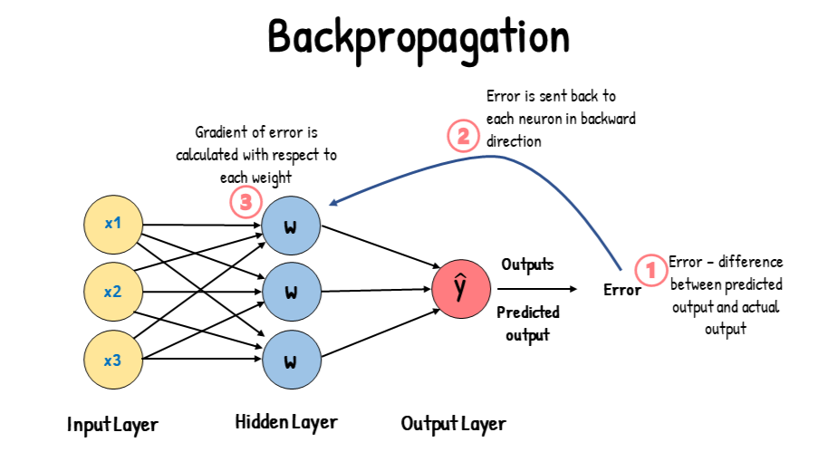

## Table of Contents

## What is backpropagation in the context of machine learning?

Backpropagation is a key method used in training neural networks, which are a type of machine learning model. It helps the network learn from its mistakes by adjusting the weights of the connections between neurons. Imagine you're trying to teach a neural network to recognize pictures of cats and dogs. When the network makes a mistake, like calling a cat a dog, backpropagation figures out how much each connection contributed to that mistake and then tweaks those connections to improve the network's performance next time.

The process of backpropagation works by first calculating the error at the output layer of the neural network. This error is then propagated backwards through the network, layer by layer, using the chain rule of calculus. For each neuron, the algorithm calculates how much it contributed to the final error and adjusts its weights accordingly. The goal is to minimize the total error of the network over time. Mathematically, if we denote the error function by $$E$$, the weight update for a weight $$w$$ can be expressed as $$w = w - \eta \frac{\partial E}{\partial w}$$, where $$\eta$$ is the learning rate that controls the size of the weight updates. This iterative process continues until the network's performance is satisfactory.

## How does backpropagation help in training neural networks?

Backpropagation is like a coach helping a neural network learn from its mistakes. When the network makes a wrong guess, backpropagation figures out which parts of the network caused the error and how to fix them. It does this by sending the error backwards through the network, starting from the output and moving towards the input. This way, each connection between neurons gets a little nudge to improve the network's performance next time. It's all about making the network better at guessing correctly by adjusting how strongly each neuron influences the others.

The math behind backpropagation involves calculating the error at the output and then using the chain rule to figure out how each connection contributed to that error. If we call the error function $$E$$, the weight update for a connection, or weight $$w$$, can be written as $$w = w - \eta \frac{\partial E}{\partial w}$$. Here, $$\eta$$ is the learning rate, which decides how big the adjustments to the weights should be. By repeating this process over and over, the network slowly learns to make better predictions, getting closer to the right answers with each round of training.

## What are the basic steps involved in the backpropagation algorithm?

Backpropagation helps a [neural network](/wiki/neural-network) learn by figuring out how to adjust the connections between its neurons to make better guesses. It starts with the network making a prediction, and then comparing that prediction to the actual correct answer to find the error. This error is then sent backwards through the network, starting from the output layer and moving towards the input layer. As the error travels back, the algorithm calculates how much each connection contributed to the mistake. It uses this information to tweak the connections, making them stronger or weaker to reduce the error next time.

The math behind backpropagation involves using the chain rule to figure out how to adjust the weights of the connections. If we call the error function $$E$$, the weight update for a connection, or weight $$w$$, can be written as $$w = w - \eta \frac{\partial E}{\partial w}$$. Here, $$\eta$$ is the learning rate, which decides how big the adjustments to the weights should be. By repeating this process over and over, the network slowly learns to make better predictions, getting closer to the right answers with each round of training.

## Can you explain the concept of gradient descent as it relates to backpropagation?

Gradient descent is like finding the lowest point in a valley by taking small steps downhill. In the context of backpropagation, it's used to adjust the weights of the connections in a neural network to minimize the error. When the network makes a prediction, we calculate the error, and then backpropagation figures out how each connection contributed to that error. Gradient descent uses this information to make small adjustments to the weights, nudging them in the direction that reduces the error. This process is repeated many times, with the network getting better at making predictions each time.

The math behind gradient descent in backpropagation involves calculating the gradient of the error function with respect to the weights. If we call the error function $$E$$ and a weight $$w$$, the update rule for the weight can be written as $$w = w - \eta \frac{\partial E}{\partial w}$$. Here, $$\eta$$ is the learning rate, which controls how big the steps are that we take downhill. By following the negative gradient, we move the weights in the direction that decreases the error, slowly guiding the neural network towards better performance.

## What is the role of the learning rate in backpropagation?

The learning rate is like a dial that controls how fast a neural network learns. In backpropagation, it decides how much to change the weights of the connections between neurons each time the network makes a mistake. If the learning rate is too high, the network might jump around too much and miss the best solution. If it's too low, the network might take too long to learn, moving very slowly towards the right answer.

The learning rate, often called $$\eta$$, is used in the weight update formula $$w = w - \eta \frac{\partial E}{\partial w}$$. Here, $$w$$ is the weight we're adjusting, and $$\frac{\partial E}{\partial w}$$ is how much that weight contributed to the error. The learning rate multiplies this error contribution, so it directly affects how big the weight changes are. Getting the learning rate right is important because it helps the network learn effectively, finding the best balance between speed and accuracy.

## How do you calculate the error in backpropagation?

In backpropagation, calculating the error is the first step to helping the neural network learn. When the network makes a prediction, you compare it to the correct answer to see how far off it was. This difference is what we call the error. If the network guessed a cat was a dog, the error would show how wrong that guess was. The error is usually calculated using a loss function, which is a mathematical way to measure how bad the network's mistake was.

The most common loss function used is the mean squared error (MSE). If you have a prediction $$y_{\text{pred}}$$ and the correct answer is $$y_{\text{true}}$$, the MSE can be calculated with the formula $$E = \frac{1}{n} \sum_{i=1}^{n} (y_{\text{pred},i} - y_{\text{true},i})^2$$. Here, $$n$$ is the number of predictions you're looking at. This formula squares the difference between each prediction and the correct answer, then averages all those squared differences. By using this error, backpropagation can figure out how to adjust the weights in the network to make better predictions next time.

## What are the differences between forward propagation and backpropagation?

Forward propagation is like a journey from the start to the end of a neural network. It takes the input data and passes it through the network, layer by layer, until it reaches the output. Each neuron in the network does a simple calculation, multiplying its inputs by weights and adding them up, then passing the result through an activation function. This process helps the network make a prediction based on the input. For example, if you're trying to recognize a picture of a cat, forward propagation would process the image data and give you an answer, like "cat" or "dog."

Backpropagation, on the other hand, is like going back through the network to learn from mistakes. After forward propagation gives you a prediction, you compare it to the correct answer to find the error. Backpropagation then sends this error back through the network, starting from the output and moving towards the input. It uses the error to figure out how much each weight in the network contributed to the mistake. The weights are then adjusted using a formula like $$w = w - \eta \frac{\partial E}{\partial w}$$, where $$w$$ is the weight, $$\eta$$ is the learning rate, and $$\frac{\partial E}{\partial w}$$ is how much the weight affected the error. This helps the network get better at making predictions over time.

## How does backpropagation handle multi-layer neural networks?

Backpropagation works with multi-layer neural networks by sending the error back through all the layers, starting from the output and moving towards the input. Imagine you have a neural network with an input layer, one or more hidden layers, and an output layer. When the network makes a prediction, you compare it to the correct answer to find the error. This error is then sent backwards through the network. For each layer, backpropagation calculates how much each connection contributed to the mistake and adjusts the weights accordingly. This way, every part of the network, no matter how deep, gets a chance to learn from the error and improve.

The math behind backpropagation in multi-layer networks uses the chain rule to figure out how to adjust the weights. If we call the error function $$E$$ and a weight in the network $$w$$, the update rule for the weight can be written as $$w = w - \eta \frac{\partial E}{\partial w}$$. Here, $$\eta$$ is the learning rate, which controls how big the adjustments are. By sending the error back through all the layers and adjusting the weights, backpropagation helps the entire network learn to make better predictions over time.

## What are some common challenges faced when implementing backpropagation?

Implementing backpropagation can be tricky because there are a few common challenges to watch out for. One big problem is choosing the right learning rate. If it's too high, the network might jump around too much and never find the best solution. If it's too low, the network might take forever to learn, moving very slowly towards the right answer. Another challenge is dealing with vanishing or exploding gradients, where the error signals get too small or too big as they move through the layers. This can make it hard for the network to learn, especially in deep networks with many layers.

Another issue is overfitting, where the network learns the training data too well but can't handle new data. This happens when the network gets too good at guessing the training examples but doesn't learn the general patterns it needs to recognize new examples. To fix this, people use techniques like regularization or early stopping. Finally, calculating the gradients correctly is important. If there's a mistake in the math or the code, the network won't learn properly. For example, the weight update formula is $$w = w - \eta \frac{\partial E}{\partial w}$$, and getting this wrong can mess up the whole learning process.

## Can you discuss the impact of activation functions on backpropagation?

Activation functions are like the decision-makers in a neural network. They help the network decide whether a neuron should be active or not. In backpropagation, these functions play a big role because they affect how the error is sent back through the network. Different activation functions have different ways of handling this error, which can make the network learn faster or slower. For example, the sigmoid function squashes the input between 0 and 1, and its derivative can make the error signal smaller as it goes back through the layers. This can lead to a problem called vanishing gradients, where the network has a hard time learning because the error signal gets too small.

On the other hand, the ReLU (Rectified Linear Unit) function is simpler and doesn't have this vanishing gradient problem. It just outputs the input if it's positive, and zero if it's negative. This makes it easier for the error to flow back through the network, helping the network learn faster. The choice of activation function can really change how well backpropagation works. For instance, if we use the sigmoid function, the weight update during backpropagation would involve its derivative, which is $$f'(x) = f(x)(1 - f(x))$$. With ReLU, the derivative is much simpler, being 1 for positive inputs and 0 for negative ones, which can make the learning process more straightforward and efficient.

## How does backpropagation work with convolutional neural networks?

Backpropagation in convolutional neural networks (CNNs) works a bit differently than in regular neural networks, but the main idea is the same. In a CNN, the network uses special layers called convolutional layers to find patterns in the data, like edges in an image. When the network makes a prediction, you compare it to the correct answer to find the error. This error is then sent back through the network, starting from the output and moving towards the input. As the error goes back through the convolutional layers, it helps figure out how to adjust the filters and weights to make the network better at finding patterns.

The math behind backpropagation in CNNs involves calculating how the error changes with respect to the weights and filters. If we call the error function $$E$$ and a weight or filter $$w$$, the update rule for the weight can be written as $$w = w - \eta \frac{\partial E}{\partial w}$$. Here, $$\eta$$ is the learning rate, which decides how big the adjustments to the weights should be. The tricky part is that the error has to be sent back through the convolutional layers, which means you need to use the chain rule to figure out how the error changes as it goes through each layer. By doing this, the network can learn to recognize patterns better, making it great for tasks like image recognition.

## What advanced techniques can be used to optimize backpropagation in deep learning?

One advanced technique to optimize backpropagation in [deep learning](/wiki/deep-learning) is called batch normalization. This technique helps the network learn faster and more stable by normalizing the inputs to each layer. Imagine you're trying to teach a network to recognize pictures, but the brightness of the images keeps changing. Batch normalization would help by making sure the network sees the images in a consistent way, no matter how bright or dark they are. This makes it easier for the network to learn the important patterns. The math behind batch normalization involves calculating the mean and variance of the inputs and then adjusting them. If we call the input to a layer $$x$$, the normalized input can be written as $$\hat{x} = \frac{x - \mu}{\sqrt{\sigma^2 + \epsilon}}$$, where $$\mu$$ is the mean, $$\sigma^2$$ is the variance, and $$\epsilon$$ is a small number to avoid division by zero.

Another technique is called gradient clipping, which helps prevent the problem of exploding gradients. When the error signals get too big as they move through the layers, the network can have a hard time learning. Gradient clipping fixes this by putting a limit on how big the gradients can get. If a gradient is too big, it gets cut down to a smaller size. This helps the network learn more smoothly and avoid jumping around too much. The way gradient clipping works is by checking the size of the gradients and adjusting them if they're too large. If we call the gradient $$\frac{\partial E}{\partial w}$$ and the threshold $$c$$, the clipped gradient can be written as $$\text{[clip](/wiki/clip)}(\frac{\partial E}{\partial w}, -c, c)$$. This means if the gradient is bigger than $$c$$ or smaller than $$-c$$, it gets set to $$c$$ or $$-c$$ respectively.

## References & Further Reading

[1]: Rumelhart, D. E., Hinton, G. E., & Williams, R. J. (1986). ["Learning Representations by Back-Propagating Errors."](https://www.nature.com/articles/323533a0) Nature, 323(6088), 533-536.

[2]: Goodfellow, I., Bengio, Y., & Courville, A. (2016). ["Deep Learning"](https://www.deeplearningbook.org/). MIT Press.

[3]: LeCun, Y., Bottou, L., Bengio, Y., & Haffner, P. (1998). ["Gradient-Based Learning Applied to Document Recognition."](https://ieeexplore.ieee.org/document/726791) Proceedings of the IEEE, 86(11), 2278-2324.

[4]: Nielsen, M. A. (2015). ["Neural Networks and Deep Learning"](http://neuralnetworksanddeeplearning.com/). Determination Press.

[5]: Bishop, C. M. (2006). ["Pattern Recognition and Machine Learning."](https://www.cs.uoi.gr/~arly/courses/ml/tmp/Bishop_book.pdf) Springer.

[6]: Ng, A. (2017). ["CS229 Lecture Notes: Backpropagation and Neural Networks."](https://cs229.stanford.edu/summer2020/cs229-notes-deep_learning.pdf) Stanford University.

[7]: Hecht-Nielsen, R. (1989). ["Theory of the Backpropagation Neural Network."](https://ieeexplore.ieee.org/document/118638) Neural Networks, IEEE Transactions on, 1(1), 19-27.