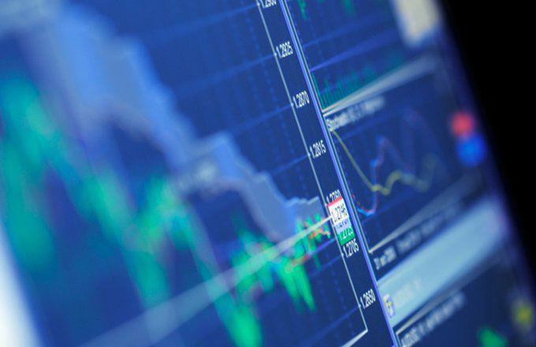

In the modern landscape of finance, trading strategies are pivotal for achieving financial goals while minimizing risks. Among these strategies, the use of backspread options and algorithmic trading stands out for their potential to navigate complex market environments. Backspread options, a sophisticated financial derivative strategy, enable traders to benefit from market volatility by positioning them to gain from significant asset price movements. This financial instrument is designed to exploit large price movements in either direction, offering an asymmetric payoff structure that can provide substantial returns if market predictions are accurate.

Algorithmic trading, on the other hand, has significantly transformed the trading industry by automating trade execution based on pre-set criteria, allowing traders to capitalize on optimal market conditions without manual intervention. This automation reduces the influence of human emotion on trading decisions and increases the speed and efficiency of executing trades. The integration of big data analysis and machine learning into algorithmic trading further refines these strategies by continually learning from market data to improve trading performance.



The implementation of advanced trading strategies like backspread options and algorithmic trading is crucial for traders aiming to optimize their financial growth. While backspread options offer an opportunity to leverage volatility, algorithmic trading enhances strategy execution speed and precision. Combining these strategies allows traders to craft a comprehensive approach to manage risks and maximize potential returns. As technology advances, the influence of algorithmic trading continues to grow, underscoring its importance in modern financial markets. In this article, we will explore these strategies in detail, examining their components, benefits, and the potential synergies they offer when thoughtfully integrated.

## Table of Contents

## Understanding Financial Strategies in Trading

Financial strategies in trading refer to systematic plans designed to achieve specific financial goals in the market. At their core, these strategies involve determining how, when, and what financial instruments to trade to maximize returns while managing risk. They are essential blueprints that provide traders with structured approaches to make informed decisions in various market conditions.

Robust financial strategies are vital for successful trading due to the inherently volatile nature of financial markets. A well-devised strategy offers a guideline for decision-making, helping traders navigate the fluctuations and uncertainties of the market. It aids in mitigating risks, capitalizing on market opportunities, and achieving consistency in returns. The absence of a sound strategy can lead to impulsive decisions driven by emotions such as fear or greed, often resulting in financial losses.

Different trading types can be integrated into financial strategies to align with specific objectives. For instance, traders might adopt a mix of short-term and long-term trading styles depending on their financial goals. Day trading, swing trading, and position trading are examples of strategies that differ in terms of duration and risk tolerance.

A comprehensive financial strategy often includes the use of specific trading techniques, such as backspread options and [algorithmic trading](/wiki/algorithmic-trading), to enhance its effectiveness. Backspread options involve strategies like call backspread and put backspread, allowing traders to benefit from market [volatility](/wiki/volatility-trading-strategies). This technique can be particularly effective in situations where large price movements are anticipated. The structure often involves selling a certain number of options and buying more options of the same class to create a net positive position in case of significant price movements.

Algorithmic trading, another critical component of financial strategies, uses pre-programmed rules to execute trades at lightning speed, thus negating human emotions and errors. Algorithms can process a massive amount of data and execute trades based on predefined criteria, which enhances efficiency and precision. By incorporating data analysis and [machine learning](/wiki/machine-learning), algorithmic trading refines the identification of profitable trading signals and patterns.

The integration of diverse trading techniques like backspread options and algorithmic trading into financial strategies empowers traders to address different market scenarios. While backspread options focus on leveraging volatility, algorithmic trading emphasizes execution precision and speed. Together, they provide a robust framework that balances risk and reward, catering to both conservative and aggressive trading objectives.

## Backspread Options: A Strategic Overview

Backspread options are a sophisticated trading strategy used to profit from significant market movements, typically involving options contracts. The primary objective of these strategies is to leverage volatility, allowing traders to amplify gains when the market moves substantially in either direction. 

## Structure and Purpose in Trading

A backspread option involves purchasing a larger number of options than you sell, all within the same expiration date, creating a net long or short position. This strategy comes in two main variants: the call backspread and the put backspread.

### Call Backspread

In a call backspread, a trader sells a smaller number of lower strike call options and buys a larger number of higher strike call options. For instance, selling one call option at Strike Price A and buying two call options at Strike Price B creates a call backspread. This strategy profits when the underlying asset's price rises significantly above the higher strike price, offering a leveraged position on bullish sentiment.

### Put Backspread

Conversely, a put backspread involves selling a smaller number of higher strike put options while purchasing a larger number of lower strike put options. For example, selling one put option at Strike Price C and buying two put options at Strike Price D. This setup is favorable when expecting a notable decline in the underlying asset, thereby capitalizing on bearish market trends.

## Capitalizing on Market Volatility

Backspread options excel in environments characterized by high volatility. The rationale is that when the market experiences sharp movements, either upward or downward, the numerous purchased options magnify gains, offsetting the cost of the fewer sold options. If the market remains stagnant or moves slightly, these strategies may incur losses, as the options' premium decay can outweigh any moderate gains.

## Risk and Reward Profile

Backspread options feature an asymmetric risk and reward profile. The potential profit can be unlimited if the market moves significantly in the expected direction, either up for call backspreads or down for put backspreads. However, if the market doesn't move as anticipated or remains within a range, losses can accrue, primarily limited to the net premium paid or received initially.

The payoff diagram for backspread options typically shows unlimited profit potential above or below the break-even points, depending on whether a call or put backspread is used. The loss is often capped at the premium paid if executed correctly, which makes it essential for traders to accurately predict market conditions and volatilities.

Given their complexity and the need for precise market forecasts, backspread options are generally more suitable for advanced traders with a good understanding of market dynamics and options trading. Traders need to be adept at assessing potential market volatility and have a clear [exit](/wiki/exit-strategy) strategy to effectively manage the associated risks.

## Algorithmic Trading: Revolutionizing Finance

Algorithmic trading has become a cornerstone in modern finance, gaining significant traction among traders due to its ability to execute trades with speed and precision. This rise in popularity is driven by the intrinsic advantages algorithmic trading offers over traditional methods, including enhanced efficiency, reduced transaction costs, and minimized emotional bias.

At its core, algorithmic trading utilizes computer programs to follow a predetermined set of instructions, or an algorithm, to [carry](/wiki/carry-trading) out a trading strategy. These algorithms are designed to operate with multiple variables, enabling complex decision-making processes to be executed rapidly. The primary advantage of algorithmic trading lies in its ability to process vast amounts of data and act on them far quicker than human traders could manage. This capability is particularly beneficial in volatile markets where timing is critical for capitalizing on price fluctuations.

A key feature of algorithmic trading is the ability to execute trades automatically, eliminating the need for constant human supervision. Algorithms can assess multiple market conditions and execute trades at speeds and frequencies far beyond the capabilities of a human trader. This automated approach not only allows for high-frequency trading but also ensures that trades are performed at the optimal times while minimizing manual errors and emotional decision-making.

The integration of data analysis and machine learning has further refined algorithmic trading strategies, enabling more sophisticated predictions and decision-making processes. Machine learning algorithms can analyze historical data to identify patterns or trends that might inform future trading decisions. These systems can also adapt and improve over time, enhancing the accuracy of predictions and the efficiency of trades. Python, a common programming language used in algorithmic trading, offers numerous libraries such as Pandas, NumPy, and Scikit-learn that facilitate data analysis and machine learning tasks. An example of a simple moving average crossover strategy using Python could look like this:

```python
import pandas as pd

# Load market data
data = pd.read_csv("market_data.csv")

# Calculate short-term and long-term moving averages
short_ma = data['Close'].rolling(window=20).mean()
long_ma = data['Close'].rolling(window=50).mean()

# Generate buy/sell signals
data['Signal'] = 0
data.loc[short_ma > long_ma, 'Signal'] = 1  # Buy signal
data.loc[short_ma < long_ma, 'Signal'] = -1 # Sell signal

# Execute trades based on signals
data['Position'] = data['Signal'].shift()
```

In this example, buy and sell signals are generated based on the crossover of short-term and long-term moving averages, a common strategy in algorithmic trading. Such strategies can be continuously refined through machine learning by adjusting parameters, testing them on historical data, and applying them in different market conditions.

The continual evolution of algorithmic trading is largely fueled by advancements in technology and analytics. As data availability and computational power continue to grow, so too will the capacity for developing more advanced and effective trading algorithms. This progression ensures that algorithmic trading remains at the forefront of innovation in financial markets.

## Integrating Backspread Options and Algo Trading for Optimal Strategies

Combining backspread options with algorithmic trading can significantly enhance trading strategies by leveraging the strengths of both approaches. Backspread options, a sophisticated derivative strategy, provide traders with the potential to capitalize on increased volatility, while algorithmic trading offers precision, speed, and efficiency in executing trades. 

### Complementarity of Strategies

Backspread options and algorithmic trading complement each other by addressing different aspects of risk and return management. Backspread options are designed to profit from significant movements in the underlying asset, with limited risk especially in bullish or bearish markets. Traders can use call backspread options in anticipation of a bullish trend or put backspread options for a bearish outlook. These options inherently manage risk due to their asymmetric payoff structure, where losses are predefined and gains can be substantial.

Algorithmic trading, on the other hand, excels in efficiency and execution speed. Algorithms can be programmed to identify opportunities for implementing backspread options based on real-time data analysis and market conditions. Algorithms can quickly adjust positions, ensuring that the backspread options are timed optimally to take advantage of market volatility.

### Practical Applications in Varied Market Conditions

In volatile markets, traders can employ a strategy where algorithms are designed to detect volatility spikes. For instance, a Python-based algorithm might use indicators such as Bollinger Bands or the Average True Range (ATR) to gauge volatility levels. When the volatility exceeds a predetermined threshold, the algorithm can automatically execute backspread options to capture potential profits from sudden market movements.

Here is an example in Python of a simplified algorithm using ATR to trigger backspread options:

```python
import pandas as pd
import numpy as np

# Assume df is your DataFrame with historical price data
# Compute the ATR
df['High-Low'] = df['High'] - df['Low']
df['High-Close'] = np.abs(df['High'] - df['Close'].shift(1))
df['Low-Close'] = np.abs(df['Low'] - df['Close'].shift(1))
df['ATR'] = df[['High-Low', 'High-Close', 'Low-Close']].max(axis=1).rolling(window=14).mean()

# Define a threshold for ATR
threshold = 1.5 * df['ATR'].mean()

# Trigger a backspread option strategy if current ATR exceeds the threshold
if df['ATR'].iloc[-1] > threshold:
    print("Execute Backspread Option Strategy")
```

In stable markets, algorithmic trading can also be leveraged to seek returns through small yet frequent price movements, while remaining poised with backspread options as a hedge for unexpected market shifts.

### Challenges and Considerations

Despite their potential, integrating backspread options with algorithmic trading poses challenges that require careful consideration. Firstly, designing and maintaining an algorithmic system that effectively identifies the right conditions for backspread options necessitates a deep understanding of both market dynamics and programming skills. Traders must also ensure that algorithms are robust and capable of handling diverse market conditions without succumbing to overfitting or excessive complexity.

Secondly, transaction costs can impact the profitability of frequent trades executed by algorithms, making it essential to optimize for cost efficiency. Additionally, the latency of trade execution and system failures can jeopardize the intended strategy, underscoring the need for reliable technological infrastructure.

Finally, regulatory constraints on derivative usage and algorithmic trading vary across jurisdictions, necessitating compliance with local laws and guidelines.

In summary, the amalgamation of backspread options and algorithmic trading offers a powerful strategy that can adapt to market conditions, enhancing both risk management and return optimization. Traders who successfully integrate these strategies stand to gain a significant edge in their trading endeavors, albeit while navigating the complexities involved.

## Conclusion

Financial strategies form the backbone of successful trading, as they guide decision-making and help mitigate risks. This article explored the relevance of understanding and effectively applying key strategies, such as backspread options and algorithmic trading, to enhance trading outcomes. Backspread options offer traders a way to adapt to market volatility, leveraging call and put spreads to potentially capitalize on significant price movements while balancing risk and reward. Algorithmic trading, on the other hand, has revolutionized financial markets by introducing automation, precision, and speed, enhancing traders' ability to execute strategies rapidly and with minimal human intervention.

Understanding these strategies is crucial, as the nuances involved in their implementation can greatly impact trading success. Backspread options allow for strategic adjustments based on market conditions, making them valuable for traders who can manage the inherent complexities. Algorithmic trading utilizes advanced data analysis and machine learning to optimize trading decisions, underscoring its effectiveness in navigating modern financial markets.

For traders aiming to achieve long-term success, ongoing education is indispensable. Financial markets are dynamic, and the tools available for trading are constantly evolving. By keeping abreast of the latest developments in trading strategies, traders can better position themselves to capitalize on opportunities and minimize risks. Engaging with professional trading communities, seeking mentorship, and consulting industry experts can offer valuable insights and guidance.

In conclusion, mastery of backspread options and algorithmic trading, alongside a commitment to continuous learning, can equip traders with the means to optimize their strategies. This approach not only enhances the potential for financial growth but also builds resilience against market uncertainties. As traders advance their knowledge and skills, they can make more informed decisions, leading to greater trading success in the ever-evolving financial landscape.

## References & Further Reading

[1]: Bergstra, J., Bardenet, R., Bengio, Y., & Kégl, B. (2011). ["Algorithms for Hyper-Parameter Optimization."](https://dl.acm.org/doi/10.5555/2986459.2986743) Advances in Neural Information Processing Systems 24.

[2]: ["Advances in Financial Machine Learning"](https://www.amazon.com/Advances-Financial-Machine-Learning-Marcos/dp/1119482089) by Marcos Lopez de Prado

[3]: ["Evidence-Based Technical Analysis: Applying the Scientific Method and Statistical Inference to Trading Signals"](https://www.amazon.com/Evidence-Based-Technical-Analysis-Scientific-Statistical/dp/0470008741) by David Aronson

[4]: ["Machine Learning for Algorithmic Trading"](https://github.com/stefan-jansen/machine-learning-for-trading) by Stefan Jansen

[5]: ["Quantitative Trading: How to Build Your Own Algorithmic Trading Business"](https://github.com/LucindaYa/quant-resources/blob/master/Quantitative%20Trading%20How%20to%20Build%20Your%20Own%20Algorithmic%20Trading%20Business.pdf) by Ernest P. Chan