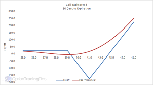

## Table of Contents

## What is a backspread in options trading?

A backspread in options trading is a strategy where you buy more options than you sell. It's used when you think the price of the stock will move a lot, but you're not sure which way it will go. For example, if you think the stock price will either go up a lot or down a lot, you might use a backspread. You usually buy more call options or put options than you sell, hoping that the big move in the stock price will make your bought options more valuable than the ones you sold.

There are two main types of backspreads: call backspreads and put backspreads. A call backspread involves selling a call option at a lower strike price and buying more call options at a higher strike price. This is good if you think the stock price will go up a lot. A put backspread is the opposite; you sell a put option at a higher strike price and buy more put options at a lower strike price. This is good if you think the stock price will go down a lot. Both types of backspreads can be profitable if the stock makes a big move, but they can also lose money if the stock price doesn't move enough.

## How does a backspread work?

A backspread in options trading is when you buy more options than you sell. It's a strategy you use when you think the price of a stock will move a lot, but you're not sure which way it will go. For example, if you think the stock might go way up or way down, you might use a backspread. You can do this with call options or put options. With calls, you sell one call at a lower price and buy more calls at a higher price. With puts, you sell one put at a higher price and buy more puts at a lower price.

The goal of a backspread is to make money if the stock makes a big move. If the stock goes up a lot, the calls you bought at the higher price will become more valuable than the one you sold at the lower price. If the stock goes down a lot, the puts you bought at the lower price will become more valuable than the one you sold at the higher price. But, if the stock doesn't move much, you might lose money because the options you bought won't be worth much more than the one you sold. So, backspreads are good when you expect a big move, but they can be risky if the stock stays still.

## What are the main components of a backspread?

A backspread in options trading has a few key parts. The first part is that you sell one option, which is usually at a price that's close to where the stock is now. This could be a call option if you think the stock might go up a lot, or a put option if you think it might go down a lot. The second part is that you buy more options than you sold. These options are at a different price, either higher for calls or lower for puts, and you buy more of them to make the backspread.

The main idea behind a backspread is to make money if the stock makes a big move. If the stock goes up a lot, the calls you bought at the higher price will be worth more than the one call you sold. If the stock goes down a lot, the puts you bought at the lower price will be worth more than the one put you sold. But, if the stock doesn't move much, you might lose money because the options you bought won't be worth much more than the one you sold. So, backspreads are good when you expect a big move, but they can be risky if the stock stays still.

## What are the different types of backspreads?

There are two main types of backspreads: call backspreads and put backspreads. A call backspread is used when you think the stock price will go up a lot. To do this, you sell one call option at a lower strike price and buy more call options at a higher strike price. For example, if the stock is at $50, you might sell one call option with a strike price of $50 and buy two call options with a strike price of $55. This way, if the stock goes above $55, the calls you bought will be worth more than the one you sold, and you can make a profit.

A put backspread is used when you think the stock price will go down a lot. To do this, you sell one put option at a higher strike price and buy more put options at a lower strike price. For example, if the stock is at $50, you might sell one put option with a strike price of $50 and buy two put options with a strike price of $45. If the stock goes below $45, the puts you bought will be worth more than the one you sold, and you can make a profit. Both types of backspreads can be profitable if the stock makes a big move, but they can also lose money if the stock price doesn't move enough.

## What is the difference between a call backspread and a put backspread?

A call backspread is a type of options strategy you use when you think a stock's price will go up a lot. To do this, you sell one call option at a lower price and buy more call options at a higher price. For example, if the stock is at $50, you might sell one call option with a strike price of $50 and buy two call options with a strike price of $55. If the stock goes above $55, the calls you bought will be worth more than the one you sold, and you can make a profit. This strategy is good when you're expecting a big move upward but not sure by how much.

A put backspread is the opposite; you use it when you think a stock's price will go down a lot. To set up a put backspread, you sell one put option at a higher price and buy more put options at a lower price. For example, if the stock is at $50, you might sell one put option with a strike price of $50 and buy two put options with a strike price of $45. If the stock goes below $45, the puts you bought will be worth more than the one you sold, and you can make a profit. This strategy is useful when you expect a big downward move but aren't certain about the exact amount of the drop.

## When should a trader consider using a backspread?

A trader should consider using a backspread when they think the stock price is going to move a lot, but they're not sure if it will go up or down. This means they expect a big change in the stock's price, but they're not sure which way it will go. A backspread can help them make money if the stock does make a big move in either direction. For example, if a trader thinks a stock that's currently at $50 could jump to $60 or drop to $40, a backspread might be a good choice.

Using a backspread is also smart when a trader wants to limit how much they could lose if the stock doesn't move much. While backspreads can lose money if the stock stays the same or doesn't move enough, the risk is usually less than if they just bought options hoping for a big move. So, if a trader thinks there's a good chance of a big price swing but wants to protect themselves a bit if they're wrong, a backspread can be a good strategy to use.

## What are the potential risks and rewards associated with backspreads?

Backspreads can be rewarding if the stock makes a big move. If you think the stock might go way up or way down, a backspread can help you make money in either case. For example, if you use a call backspread and the stock goes up a lot, the calls you bought at the higher price will become more valuable than the one you sold. If you use a put backspread and the stock goes down a lot, the puts you bought at the lower price will become more valuable than the one you sold. So, if you're right about a big move, you could make a good profit.

But backspreads also come with risks. If the stock doesn't move much, you could lose money. The options you bought might not become more valuable than the one you sold, and you'll lose the money you spent on the extra options. Also, if the stock moves against your main guess (like if you used a call backspread and the stock goes down), you might lose money too. So, while backspreads can be good when you expect a big move, they can be risky if the stock stays still or moves the wrong way.

## How do market conditions affect the performance of a backspread?

Market conditions play a big role in how well a backspread works. If the market is calm and the stock price doesn't move much, a backspread might lose money. That's because the options you bought won't become more valuable than the one you sold. For example, if you used a call backspread hoping the stock would go up a lot, but it stays the same, you'll lose the money you spent on the extra call options. So, backspreads are not good in quiet markets where big moves are not expected.

On the other hand, if the market is very active and the stock price moves a lot, a backspread can make money. If you think the stock might go way up or way down and it does, the options you bought will become more valuable than the one you sold. For example, if you used a put backspread and the stock drops a lot, the puts you bought at the lower price will be worth more than the one you sold. So, backspreads work best in markets where big moves are likely, but they can be risky if you guess wrong about the direction or size of the move.

## What are the key considerations for setting up a successful backspread?

When setting up a backspread, it's important to think about how much the stock might move. You want to use a backspread when you think the stock could go up a lot or down a lot, but you're not sure which way. So, pick the right type of backspread—call backspread if you think it might go up, put backspread if you think it might go down. Also, think about how far apart the strike prices should be. If you expect a really big move, you might want to choose strike prices that are further apart to give yourself more room to make money.

Another key thing to consider is the timing of your backspread. You need to set it up before the big move happens, but not too early that the options you bought lose too much value waiting for the move. Also, think about the cost. Backspreads can cost money to set up because you're buying more options than you're selling. Make sure you're okay with losing that money if the stock doesn't move enough. Lastly, keep an eye on the market conditions. Backspreads work best in markets where big moves are likely, so if the market is calm, a backspread might not be the best choice.

## How can a trader manage and adjust a backspread as market conditions change?

As market conditions change, a trader can manage and adjust a backspread by keeping a close eye on the stock's price and the options' values. If the stock starts moving in the direction you expected, you might not need to do much. But if the stock isn't moving enough, you might want to adjust your backspread. For example, if you set up a call backspread and the stock goes up a little but not as much as you hoped, you could buy more calls at an even higher strike price to increase your potential profit if the stock keeps going up. Or, if the stock moves against you, like if you set up a put backspread and the stock goes up instead of down, you might want to close out your position to limit your losses.

Another way to manage a backspread is to adjust the timing. If you think the big move you expected will happen later than you thought, you could roll your options to a later expiration date. This means selling the options you have now and buying new ones that expire later. This can give the stock more time to make the big move you're hoping for. Also, always keep an eye on the overall market. If the market gets less active and big moves seem less likely, you might want to close your backspread to avoid losing more money if the stock stays still. By watching the stock, adjusting your options, and being ready to close your position, you can better manage your backspread as market conditions change.

## What are some advanced strategies involving backspreads?

One advanced strategy involving backspreads is to use them as part of a bigger trading plan. For example, you might set up a call backspread and also buy some put options to protect yourself if the stock goes down instead of up. This way, if the stock goes up a lot, your call backspread can make money, and if it goes down, your put options can help limit your losses. It's like having a safety net. You can also use backspreads with other options strategies, like straddles or strangles, to make more complex trades that can profit from big moves in either direction.

Another advanced strategy is to adjust your backspread over time as the stock moves. If you set up a put backspread and the stock starts going down, you might buy more puts at an even lower strike price to increase your potential profit. Or, if the stock moves against you, you could close out part of your backspread to limit your losses. You can also roll your options to a later expiration date if you think the big move will happen later than you expected. By being flexible and adjusting your backspread as the market changes, you can try to make the most of the strategy.

## How can backspreads be used in conjunction with other options strategies?

Backspreads can be used with other options strategies to make more complex trades that can profit from big moves in either direction. For example, you might set up a call backspread and also buy some put options. This way, if the stock goes up a lot, your call backspread can make money. But if the stock goes down instead, your put options can help limit your losses. It's like having a safety net. You can also use backspreads with strategies like straddles or strangles. A straddle involves buying a call and a put at the same strike price, while a strangle involves buying a call and a put at different strike prices. Combining these with a backspread can give you more ways to make money if the stock moves a lot.

Another way to use backspreads with other strategies is to adjust them over time as the stock moves. If you set up a put backspread and the stock starts going down, you might buy more puts at an even lower strike price to increase your potential profit. Or, if the stock moves against you, you could close out part of your backspread to limit your losses. You can also roll your options to a later expiration date if you think the big move will happen later than you expected. By being flexible and adjusting your backspread as the market changes, you can try to make the most of the strategy.

## References & Further Reading

[1]: Bergstra, J., Bardenet, R., Bengio, Y., & Kégl, B. (2011). ["Algorithms for Hyper-Parameter Optimization."](https://dl.acm.org/doi/10.5555/2986459.2986743) Advances in Neural Information Processing Systems 24.

[2]: ["Advances in Financial Machine Learning"](https://www.amazon.com/Advances-Financial-Machine-Learning-Marcos/dp/1119482089) by Marcos Lopez de Prado

[3]: ["Evidence-Based Technical Analysis: Applying the Scientific Method and Statistical Inference to Trading Signals"](https://www.amazon.com/Evidence-Based-Technical-Analysis-Scientific-Statistical/dp/0470008741) by David Aronson

[4]: ["Machine Learning for Algorithmic Trading"](https://github.com/stefan-jansen/machine-learning-for-trading) by Stefan Jansen

[5]: ["Quantitative Trading: How to Build Your Own Algorithmic Trading Business"](https://github.com/LucindaYa/quant-resources/blob/master/Quantitative%20Trading%20How%20to%20Build%20Your%20Own%20Algorithmic%20Trading%20Business.pdf) by Ernest P. Chan