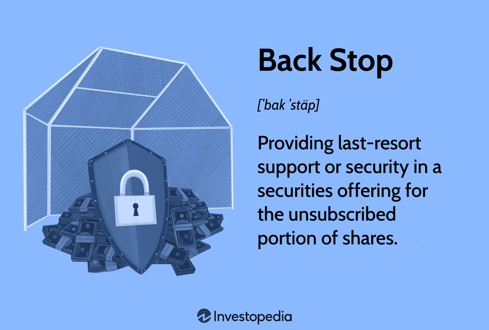

In financial markets, the concept of a backstop investment plays a crucial role in ensuring the successful completion of financial offerings. Backstop investments act as a safety net during security offerings, especially when certain conditions are unmet, or market demand falls short. These investments are typically provided by financial entities or investors who commit to purchasing any remaining securities from an offering, guaranteeing a minimum level of capital raise for the issuer.

Backstop investments are particularly significant in scenarios such as initial public offerings (IPOs) or rights issues, where the issuer seeks to raise capital by selling shares or securities to the public. If the demand for these securities does not meet expectations, a backstop provider steps in to buy the unsold portion, thus stabilizing the offering and ensuring the issuer achieves its desired financial goals. This mechanism not only mitigates the risk of a failed offering but also instills confidence in potential investors.

The strategic importance of backstop investments extends beyond simple risk management. In complex financial environments, these mechanisms interact with innovative technologies such as algorithmic trading strategies. Algorithmic trading involves using computer algorithms to automate trading decisions, allowing for rapid and efficient execution of trades, which can be particularly advantageous when implementing backstop agreements. This approach can enhance market liquidity, reduce transaction costs, and enable quick responsiveness to changing market conditions.

This article explores the nature of backstop investments, their function within financial offerings, and their intersection with algorithmic trading strategies, highlighting their indispensable role in modern finance.

## Table of Contents

## Understanding Backstop Investments

A backstop investment serves as a crucial safety mechanism within financial markets, primarily aimed at safeguarding securities offerings from potential failure. In typical scenarios, an issuing company seeks to raise capital by selling securities, such as stocks or bonds, to investors. However, if the market demand for these securities falls short, a backstop investment ensures that the offering can still succeed.

Typically, a backstop investment involves an agreement with a guarantor, often an investment bank or a consortium of investors, who commit to purchasing any unsold shares in a securities offering. This arrangement provides a safety net for the issuer, ensuring a minimum level of capital is raised regardless of the demand in the open market. The guarantor's commitment acts as a form of insurance, mitigating the risk of insufficient investor interest.

Mathematically, consider an offering of $x$ shares at a price $p$. If $n$ is the number of shares sold to the public, where $n < x$, the backstop guarantor agrees to purchase the remaining $x - n$ shares, thereby ensuring that the issuer receives $x \times p$ in total proceeds from the offering.

In practice, backstop agreements provide a sense of security and stability for the issuer, as they do not have to solely rely on market conditions to meet their capital-raising goals. The presence of a backstop investment can significantly enhance the attractiveness of an offering, as it demonstrates to potential investors that there is a strong commitment to the offering's success. This reassurance can, in turn, encourage further investment from the market, potentially leading to a more successful raise overall.

In conclusion, backstop investments are fundamental to maintaining confidence in financial markets by providing a robust mechanism to support and assure the success of securities offerings, regardless of fluctuating market conditions. These agreements enable issuers to secure necessary capital, reinforcing the resilience and stability of financial systems.

## How Backstop Investments Work

Backstop investments are critical in ensuring the success of financial offerings by providing a safety net when market demand is insufficient. In practice, these backstop agreements typically involve underwriters, who play a pivotal role by committing to purchase any leftover shares if a public offering falls short of its target. This arrangement is essential in firm-commitment underwriting, where underwriters agree to buy all unsold shares to guarantee a specific level of capital for the issuer.

The essence of a firm-commitment underwriting lies in shifting the risk from the issuing company to the underwriters. Underwriters assume full responsibility for any shares not acquired by the public, ensuring the issuer secures the necessary capital proceeds irrespective of external market conditions. This process helps to stabilize the offering by removing uncertainties related to investor interest and demand fluctuations.

In a typical backstop agreement, the underwriting firm evaluates the potential market risks and sets terms that enable them to manage these effectively while committing to the purchase. This often involves assessing factors such as the issuer's financial health, market conditions, and investor sentiment. The underwriting fee, a significant component of the agreement, compensates the underwriters for assuming this risk and conducting any due diligence required.

Furthermore, backstop provisions guarantee a minimum capital influx for the issuer by ensuring the allocation of shares is fully subscribed. This protection plays a crucial role in preventing the failure of the offering and maintaining confidence among stakeholders, including investors and the market at large. The presence of backstops can also bolster market perception, indicating the offer is deemed valuable enough to be fully underwritten.

In summary, backstop investments, through the mechanism of firm-commitment underwriting, play an indispensable role in securing financial offerings. By ensuring underwriters commit to buying unsold shares, they provide essential stability and certainty, guaranteeing that issuers achieve their [capital raising](/wiki/hedge-fund-capital-raising) goals even amid varying market conditions.

## Types of Backstop Investments

Backstop investments serve as a crucial component in the financial markets, offering a safety net for issuers during equity and bond offerings. These instruments typically differ based on the security being issued, providing specific frameworks to ensure successful capital raising.

In equity offerings, backstop arrangements are often employed to underwrite stocks, ensuring that any unsold shares are purchased, thereby guaranteeing the issuer achieves their capital target. Similarly, in bond offerings, backstops provide price stability and assurance by purchasing bonds that remain unclaimed in the market. This mechanism not only stabilizes the market during initial offerings but also reassures investors of the offering's viability.

A key element of backstop investments is the use of revolving credit loans and letters of credit. These financial tools act as a secondary support mechanism, ensuring [liquidity](/wiki/liquidity-risk-premium) for the issuer. Revolving credit loans allow issuers to access funds as needed, thus maintaining financial flexibility and mitigating risks associated with unsold securities. Letters of credit, on the other hand, function as guarantees from financial institutions, promising payment for any securities that fail to attract buyers. This guarantee enhances the offering's credibility and encourages broader investor participation.

Furthermore, backstop purchasers often place bids at a lower price, compensating for their risk-taking through fees or potential resale profits. By entering at a discounted rate, these investors obtain a margin of safety that justifies their commitment to purchasing unsold securities. The costs associated with these backstop arrangements, including any fees, are typically factored into the overall cost of the offering, influencing the issuer's financial strategy.

In practice, the decision to employ a backstop investment hinges on multiple factors, including market conditions, the issuer's financial health, and the offering's perceived risk. The strategic selection of backstop mechanisms, whether through revolving credit, letters of credit, or discounted bids, reflects a nuanced approach to addressing potential shortfalls in market demand. As financial markets continue to evolve, the ability to leverage these differentiated backstop approaches remains integral to successful offering executions.

## Examples of Backstop Investments in Action

Historical examples of backstop investments illustrate their essential role in maintaining stability during financial turbulences. Notably, during the 2008 financial crisis, backstop provisions were critical in stabilizing markets. These mechanisms were implemented to ensure that critical institutions did not collapse, which would have further destabilized the financial system. Backstop investments during this period took various forms, including capital infusions and guarantees, aimed at restoring market confidence and providing liquidity.

The Troubled Asset Relief Program (TARP) is a prominent example of backstop initiatives during the 2008 crisis. TARP authorized the U.S. Treasury to purchase distressed assets and inject capital directly into banks. By doing so, it ensured that financial institutions had enough liquidity to continue operating, thereby stabilizing the broader financial system. This form of backstop not only provided immediate relief but also established a framework for regaining market confidence.

Backstop investments are not confined to equity markets; they are equally vital in bond offerings. In such contexts, backstop provisions act as price guarantees for bonds that remain unsold following an issuance. By ensuring minimum purchase commitments, these provisions help maintain the issuer's capital objectives. The assurance provided by backstops in bond markets can reduce the risk of failed offerings, which might otherwise result in significant financial and reputational damage.

Moreover, backstop strategies have evolved to encompass diverse financial instruments and mechanisms such as revolving credit agreements and letters of credit. These tools allow issuers and guarantors to provide a financial safety net effectively, addressing shortfalls in expected market demand. Such instruments were particularly useful during the financial crisis when standard market operations were disrupted, enabling continued functioning of the credit markets.

In conclusion, backstop investments have repeatedly proven their importance in ensuring market stability and liquidity, especially during periods of stress. The adaptability and varied application of backstop strategies across different market conditions underscore their central role in the financial ecosystem.

## Algorithmic Trading and Its Role in Backstop Strategies

Algorithmic trading uses sophisticated algorithms to automate trading processes, significantly improving the operational efficiency of backstop strategies in financial markets. By employing complex mathematical models and high-speed data processing, [algorithmic trading](/wiki/algorithmic-trading) allows market participants to execute trades rapidly, highly valuable in backstop situations where timing and precision are critical.

Automation in trading minimizes human intervention, thereby reducing the risk of errors associated with manual operations, particularly under volatile market conditions. In a typical backstop scenario, swift decision-making and execution are necessary to fulfill the role of purchasing unsold shares or securities efficiently. Algorithmic trading systems can be programmed to instantly assess market conditions, evaluate ongoing trends, and execute trades that align with pre-defined backstop strategies. This rapid response capability is crucial in maintaining the integrity and stability of financial offerings.

The integration of algorithmic trading with backstop strategies significantly enhances decision-making capabilities. Algorithms can process vast amounts of market data in real-time to make informed decisions about the timing, pricing, and [volume](/wiki/volume-trading-strategy) of securities per pre-set criteria. This ensures that the backstop function is executed not only efficiently but also in a manner that maximizes potential returns or minimizes costs for the guarantor. Moreover, algorithms can be designed to adjust dynamically to changing market conditions, further optimizing the execution of backstop commitments.

In sum, the combination of algorithmic trading and backstop strategies represents a powerful synergy in financial markets, allowing for precise and automated execution of backstop roles. The efficiency and effectiveness provided by algorithmic trading ensure that backstop mechanisms fulfill their purpose of stabilizing markets and securing financial offerings.

## Key Takeaways and Future Implications

Backstop investments are pivotal in providing assurance and risk mitigation within financial markets, thereby ensuring the successful completion of securities offerings. Their role is particularly critical when market conditions are unfavorable, as they safeguard issuers against the risk of undersubscription. By agreeing to purchase any unsold securities, backstop investors guarantee that the issuer will achieve the necessary capital raise, which is essential for operational and strategic needs.

The integration of algorithmic trading with backstop strategies represents an evolution in execution capabilities. Algorithmic trading employs sophisticated algorithms to execute trades at optimal times and prices, maximizing efficiency and minimizing human error. This technology allows for swift response to dynamic market conditions, thus enhancing the stability that backstop investments seek to provide. In volatile markets, where rapid fluctuations are common, the speed and precision of automated trading systems significantly reduce the risk associated with executing large volume trades manually.

As financial markets become increasingly complex, the synergy between backstop mechanisms and technology, like algorithmic trading, is set to become more integral. This evolution is driven by the continuing advancement of technology and the ever-increasing complexity of financial products and markets. Future developments are likely to focus on refining these strategies further, incorporating [machine learning](/wiki/machine-learning) and data analytics to enhance predictive capabilities and optimize trade execution even further.

In conclusion, backstop investments, fortified by technological advancements, play a crucial role in contemporary financial markets. The ongoing integration of algorithmic trading into these strategies will likely enhance their effectiveness, offering robust solutions against market uncertainties and enhancing the overall resilience of financial offerings.

## References & Further Reading

[1]: Chen, L., Lesmond, D. A., & Wei, J. (2007). ["Corporate Yield Spreads and Bond Liquidity."](https://onlinelibrary.wiley.com/doi/abs/10.1111/j.1540-6261.2007.01203.x) The Journal of Finance, 62(1), 119-149.

[2]: Ljungqvist, A. P., & Wilhelm, W. J. (2003). ["IPO Pricing in the Dot-com Bubble"](https://www.jstor.org/stable/3094556). The Journal of Finance, 58(2), 723-752.

[3]: Narayanan, K. S., & Garfinkel, J. A. (1998). ["Forcing Firms to Talk: Financial Analysis and Financial Contracts as Monitoring Mechanisms."](https://papers.ssrn.com/sol3/Delivery.cfm?abstractid=3255766)00053-9) Journal of Financial Economics, 87(1), 73-101.

[4]: Hasbrouck, J. (2007). ["Empirical Market Microstructure: The Institutions, Economics, and Philosophy of Securities Trading."](https://archive.org/details/empiricalmarketm0000hasb) Oxford University Press.

[5]: Sraer, D., & Thesmar, D. (2007). ["Performance and Behavior of Family Firms: Evidence from the French Stock Market."](https://faculty.haas.berkeley.edu/dsraer/sraerthesmar.pdf) The Journal of Finance, 62(2), 675-729.