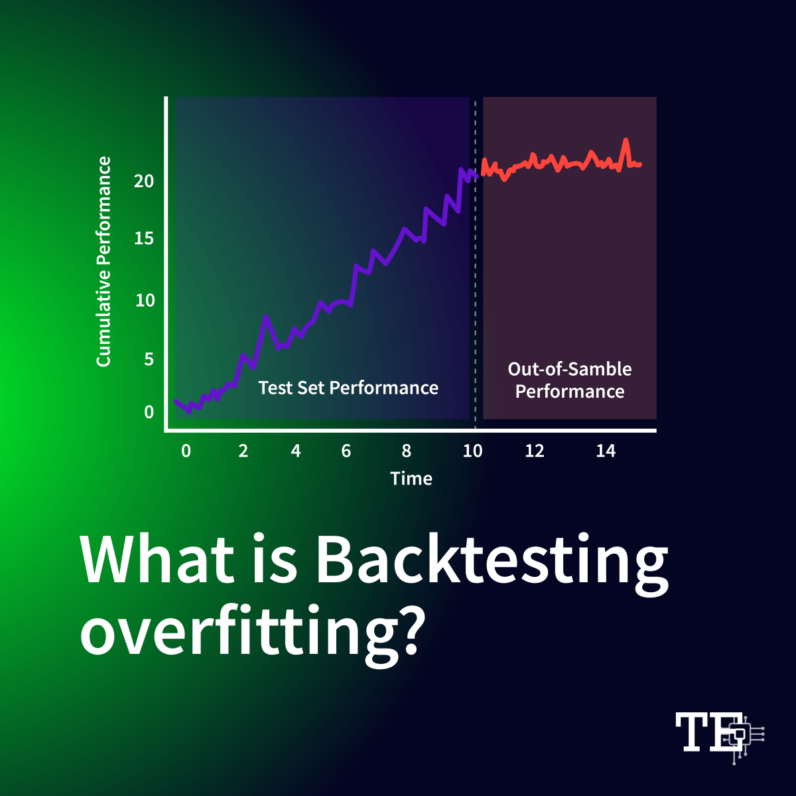

## Table of Contents

## What is backtest overfitting?

Backtest overfitting happens when a trading strategy is too perfectly tuned to past data. Imagine trying to predict the future by looking at old weather reports. If you adjust your prediction method to match every single past weather event exactly, it might work great for those old reports, but it won't be useful for future weather because it's too specific to the past.

This problem makes the strategy look better than it really is. When you test it on new, unseen data, it often fails because it was too customized to the old data. It's like memorizing a history test instead of understanding the subject; you might do well on that one test, but you won't be able to answer new questions about history. Avoiding overfitting is important for creating strategies that work well in the real world, not just in the past.

## Why is backtest overfitting a problem in trading and investing?

Backtest overfitting is a big problem in trading and investing because it makes a strategy look better than it really is. When you create a trading plan and test it on old data, you might keep changing the plan to make it fit that old data perfectly. This can trick you into thinking your strategy is amazing because it did so well in the past. But the real world doesn't follow the same patterns all the time, so when you use your strategy in the future, it might not work as well as you expected.

This can lead to big losses because the strategy was too focused on past events and not flexible enough for new situations. Imagine if you learned to drive only on sunny days and then suddenly had to drive in a storm; you'd be in trouble. In the same way, a strategy that's overfitted to past data won't handle new market conditions well. That's why it's important to avoid overfitting and make sure your trading plan can adapt to changes in the market.

## How can you identify backtest overfitting?

You can spot backtest overfitting by looking at how well your trading strategy does on new data that it hasn't seen before. If your strategy worked great on old data but then fails when you try it on new data, it might be overfitted. This is because the strategy was too focused on the past and can't handle new situations well.

Another way to identify overfitting is by checking how many changes you made to your strategy to make it fit the old data. If you kept tweaking and adjusting your plan to match every little detail of the past, it's a sign that your strategy might be overfitted. A good strategy should work well without needing too many changes to fit the data perfectly.

## What are common causes of backtest overfitting?

Backtest overfitting often happens because people keep changing their trading plan to make it fit old data perfectly. They might adjust the rules of their strategy over and over again until it matches every detail of the past. This makes the strategy look really good on old data, but it's not realistic because the market doesn't repeat the same patterns all the time. When you keep tweaking your plan to fit the past, you're making it too specific to those old events, and it won't work well when new things happen in the market.

Another common cause is using too many variables in your strategy. When you include a lot of different factors to predict what will happen, you're more likely to end up with a plan that's too complicated and tailored to the past. This is like trying to guess the weather by looking at too many things that happened before; it might work for those old weather reports, but it won't help you predict future weather. Keeping your strategy simple and not relying on too many variables can help you avoid overfitting and make your plan more useful for the future.

## What are the differences between in-sample and out-of-sample data?

In-sample data is the old data you use to create and test your trading strategy. It's like practicing a game with the same set of questions over and over again. You might get really good at answering those specific questions, but that doesn't mean you'll be good at new questions. When you keep adjusting your strategy to fit this in-sample data perfectly, you might end up with a plan that's too focused on the past and won't work well in the future.

Out-of-sample data, on the other hand, is new data that your strategy hasn't seen before. It's like taking a test with questions you've never seen. If your strategy does well on this out-of-sample data, it's a good sign that your plan can handle new situations and isn't just tailored to the past. The key to a good trading strategy is to make sure it works well on both in-sample and out-of-sample data, so you know it can adapt to changes in the market.

## How does data snooping contribute to backtest overfitting?

Data snooping is when you keep looking at the same old data over and over again to find patterns that make your trading strategy look good. It's like trying to guess the answers to a test by looking at the same old test papers. When you do this, you might start to see things that aren't really there, and you'll adjust your strategy to fit those patterns. This makes your strategy too focused on the past and not flexible enough for the future.

This kind of snooping can lead to backtest overfitting because you're making your strategy fit the old data too perfectly. It's like memorizing a history test instead of understanding the subject. Your strategy might do great on the old data, but when new data comes along, it won't work as well because it was too specific to the past. Avoiding data snooping helps you create a strategy that can handle new situations and not just the old ones you've seen before.

## What statistical methods can be used to detect backtest overfitting?

One common statistical method to detect backtest overfitting is called cross-validation. Imagine you have a bunch of old data, and you split it into different parts. You use some parts to build your trading strategy and other parts to test it. If your strategy works well on all the different parts, not just the ones you used to build it, then it's less likely to be overfitted. But if it only works well on the parts you used to build it and fails on the other parts, that's a sign of overfitting.

Another method is using a technique called the Sharpe Ratio test. This test looks at how well your strategy did compared to how much risk it took. If your strategy's performance looks too good to be true when you compare it to the risk, it might be overfitted. By looking at the Sharpe Ratio across different time periods and seeing if it stays consistent, you can get a better idea if your strategy is really good or just overfitted to the past data.

## How can walk-forward optimization help prevent backtest overfitting?

Walk-forward optimization is a way to test your trading strategy that helps prevent it from being too focused on the past. Instead of using all your old data at once to build your strategy, you break it into smaller parts. You use one part to build your strategy and then test it on the next part. This way, you're always checking if your strategy can work on new data it hasn't seen before. If it does well on these new parts, it's a good sign that your strategy isn't just memorizing the past but can adapt to the future.

By doing this step-by-step testing, walk-forward optimization makes sure your strategy stays flexible and realistic. It stops you from making too many changes to fit the old data perfectly, which is what causes overfitting. If your strategy keeps working well as you move forward through the data, you can be more confident that it will work in the real world, not just in the past. This method helps you build a strategy that can handle the ups and downs of the market without being too specific to old events.

## What role does cross-validation play in avoiding overfitting?

Cross-validation is like a way to double-check your trading strategy to make sure it's not just good at guessing the past but can also handle new situations. Imagine you have a bunch of old test papers. Instead of using all of them to study, you split them into different groups. You use some groups to learn and practice, and then you test yourself on the other groups that you didn't use for learning. If you do well on these new groups, it means your strategy isn't just memorizing the old data but can actually work on new data too.

By doing this, cross-validation helps you avoid overfitting because it stops you from focusing too much on the past. If your strategy only works well on the old data you used to build it and fails on the new data, that's a sign it's overfitted. But if it works well on all the different groups, you can be more confident that your strategy is flexible and can adapt to changes in the market. This way, you're more likely to have a trading plan that will work in the future, not just in the past.

## Can you explain the use of information criteria like AIC and BIC in managing overfitting?

Information criteria like AIC (Akaike Information Criterion) and BIC (Bayesian Information Criterion) are tools that help you find the right balance between how well your trading strategy fits the old data and how simple it is. When you're building a strategy, you might be tempted to make it really complicated to fit the past perfectly. But if your strategy is too complex, it's more likely to be overfitted, meaning it won't work well on new data. AIC and BIC help you avoid this by giving you a score that tells you how well your strategy fits the data while also punishing you for making it too complicated.

By using AIC and BIC, you can compare different versions of your strategy to see which one is the best. A lower score means the strategy fits the data well without being too complex. This helps you choose a strategy that's simple enough to work on new data, not just the old data you used to build it. So, these criteria are like a guide that helps you create a trading plan that's more likely to succeed in the future, not just look good in the past.

## How do machine learning techniques like regularization help in reducing overfitting in backtesting?

Machine learning techniques like regularization help reduce overfitting in backtesting by adding a penalty to the complexity of your trading strategy. Imagine you're trying to predict the weather. If you use too many factors, like the position of every cloud, you might end up with a prediction that's perfect for past weather reports but useless for future forecasts. Regularization stops you from using too many factors by making your strategy pay a price for being too complicated. This encourages you to keep your strategy simple, which makes it more likely to work well on new data, not just the old data you used to build it.

By using regularization, you're telling your strategy to focus on the most important factors and ignore the smaller details that might just be noise. This is like learning to drive by focusing on the road and traffic signals instead of every little thing on the side of the road. When you keep your strategy simple and focused, it's less likely to be overfitted to the past and more likely to handle new situations in the market. Regularization helps you create a trading plan that's more flexible and realistic, so you can be more confident it will work well in the future.

## What advanced strategies can be implemented to further mitigate the risk of backtest overfitting in complex financial models?

One advanced strategy to mitigate the risk of backtest overfitting in complex financial models is to use ensemble methods. Imagine you have a group of different strategies, each looking at the market in its own way. Instead of relying on just one strategy, you combine the results from all of them. This is like getting advice from a team of experts instead of just one person. By doing this, you can reduce the chance that your overall strategy is too focused on the past because the different strategies will balance each other out. If one strategy starts to overfit, the others can help keep things in check, making your final plan more robust and less likely to fail on new data.

Another strategy is to implement a technique called Monte Carlo simulation. This method involves running your trading strategy many times with slightly different starting conditions or random elements added to the data. It's like testing your strategy in lots of different possible futures. If your strategy does well across all these different scenarios, it's a good sign that it's not just overfitted to one specific set of past data. This approach helps you see how your strategy might perform under various market conditions, making it more adaptable and less likely to fail when real-world conditions change. By using Monte Carlo simulation, you can build confidence that your trading plan will hold up in the future, not just look good in the past.

## What are the signs of overfitting in algo trading?

Excessive complexity within trading models is a primary cause of overfitting, primarily arising when models comprise too many parameters. This complexity often results in a scenario where the model fits the training data exceptionally well, capturing even minor fluctuations that are merely noise rather than genuine market signals. However, such models typically exhibit poor performance when tested on out-of-sample data, which is a critical sign of overfitting.

One of the most apparent indicators of overfitting in [algorithmic trading](/wiki/algorithmic-trading) is a significant discrepancy between the model's performance on training data versus testing or validation data. In practical terms, a model may display high accuracy and returns during historical [backtesting](/wiki/backtesting), showcasing a high Sharpe ratio. The Sharpe ratio, calculated as:

$$
\text{Sharpe Ratio} = \frac{E[R-R_f]}{\sigma}
$$

where $E[R]$ is the expected return of the portfolio, $R_f$ is the risk-free rate, and $\sigma$ is the standard deviation of the portfolio's excess return, can be misleadingly inflated due to overfitting if primarily assessed on the training dataset. However, when deployed in live markets, these models often result in disappointing outcomes as they fail to generalize true market conditions, often leading to financial losses.

Another effective technique to ascertain overfitting in algorithmic trading is the use of walk-forward analysis during backtesting. This approach simulates an out-of-sample test by iteratively updating the model with new data as if in real-time, allowing traders to observe how model predictions hold up as new data comes in. Essentially, this method divides historical data into multiple training and testing periods, ensuring that the model remains dynamic and exploits genuine market inefficiencies rather than noise.

Recognizing these signs is crucial for traders who aim to ensure their models remain both effective and resilient across diverse and fluctuating market conditions. By understanding and identifying the manifestations of overfitting, traders can adjust their models to maintain performance in live trading environments, thus protecting their investments and optimizing their strategies for sustainability.

## What are Techniques to Prevent Overfitting?

Preventing overfitting in trading algorithms is crucial to ensure that models generalize well to unseen market data. Various techniques are employed to mitigate overfitting, ensuring model robustness and predictive accuracy.

Cross-validation is a powerful technique that helps verify model performance across different subsets of data. K-fold cross-validation, in particular, partitions the data into 'k' subsets or folds, training the model on 'k-1' folds while validating it on the remaining fold. This process is repeated 'k' times, with each fold serving as the validation set once. This ensures that the model's performance is not overly reliant on specific data splits and provides a more accurate assessment of its predictive power.

Regularization techniques such as L1 and L2 regularization introduce penalties for large coefficients in the model, discouraging excessive complexity. L1 regularization, or Lasso, adds a penalty equal to the absolute value of the magnitude of coefficients: 

$$
\text{Cost Function} = \text{Loss} + \lambda \sum_{i=1}^{n} |w_i|
$$

L2 regularization, or Ridge, penalizes the square of the magnitude of coefficients:

$$
\text{Cost Function} = \text{Loss} + \lambda \sum_{i=1}^{n} w_i^2 \] 

Here, $\lambda$ is the regularization parameter that controls the strength of the penalty. By constraining model complexity, regularization helps in focusing on the underlying trends rather than fitting to noise.

Simplifying models and selecting impactful features is another strategy. By reducing the number of parameters and focusing on the most significant features, models are more likely to capture true market signals rather than noise. Feature selection methods, such as recursive feature elimination or using feature importance metrics from ensemble methods, aid in determining which features contribute most to the model’s predictions.

Ensuring data diversity is also essential for preventing overfitting. Training models on a diverse dataset that captures a wide range of market scenarios enhances their robustness. This can involve incorporating data from different time periods or including a variety of market conditions to ensure comprehensive exposure.

Combining these strategies—cross-validation, regularization, model simplification, feature selection, and data diversification—helps in developing trading models that are both robust and predictive. By focusing on these approaches, traders can significantly reduce the risk of overfitting, enabling more effective decision-making in live trading environments.

## References & Further Reading

[1]: Bergstra, J., Bardenet, R., Bengio, Y., & Kégl, B. (2011). ["Algorithms for Hyper-Parameter Optimization."](https://papers.nips.cc/paper/4443-algorithms-for-hyper-parameter-optimization) Advances in Neural Information Processing Systems 24.

[2]: ["Advances in Financial Machine Learning"](https://www.amazon.com/Advances-Financial-Machine-Learning-Marcos/dp/1119482089) by Marcos Lopez de Prado

[3]: ["Evidence-Based Technical Analysis: Applying the Scientific Method and Statistical Inference to Trading Signals"](https://www.amazon.com/Evidence-Based-Technical-Analysis-Scientific-Statistical/dp/0470008741) by David Aronson

[4]: ["Machine Learning for Algorithmic Trading"](https://github.com/stefan-jansen/machine-learning-for-trading) by Stefan Jansen

[5]: ["Quantitative Trading: How to Build Your Own Algorithmic Trading Business"](https://www.amazon.com/Quantitative-Trading-Build-Algorithmic-Business/dp/0470284889) by Ernest P. Chan