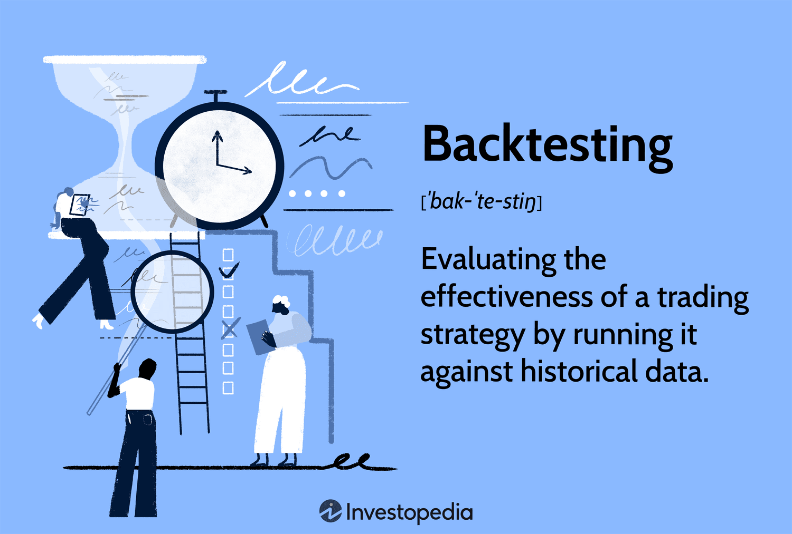

Algorithmic trading, commonly referred to as algo trading, has significantly transformed the trading industry by allowing traders to execute strategies using computational algorithms. This method leverages powerful computing capabilities to identify and exploit market opportunities with speed and precision that far surpass human capabilities. However, the effectiveness of these algorithmic strategies hinges critically on the process known as backtesting.

Backtesting involves using historical market data to simulate the execution of trading strategies, allowing traders to evaluate their potential performance without the risk of financial loss. It is the process by which traders can gain invaluable insight into how their strategies might behave in real trading environments. By analyzing past market conditions, backtesters enable traders to assess the viability of their strategies, exposing both strengths and weaknesses.

In algo trading, backtesters serve as indispensable tools, providing traders with the opportunity to refine and optimize their strategies prior to actual deployment in live markets. Through backtesting, traders can simulate trades over various market scenarios, helping them make informed decisions about the trade-offs and adjustments necessary for optimal outcomes. This analysis is crucial as it reduces the possibility of substantial financial losses that might occur from deploying untested strategies in live trading environments.

This article will examine the significance of backtesters in algorithmic trading, elucidating how they function and exploring their vital role in the toolkit of any algo trader. Understanding backtesters’ contribution to strategy development and risk management is crucial for achieving sustainable profitability in the evolving landscape of financial markets.

## Table of Contents

## Understanding Backtesters

A backtester is an essential software tool in [algorithmic trading](/wiki/algorithmic-trading), designed to simulate the performance of trading strategies by applying them to historical market data. The primary objective is to evaluate how a particular trading strategy might have performed in the past, which can provide insights into its potential future performance. 

Backtesting serves as a critical step in the development of trading strategies, as it allows traders to refine their approaches by identifying strengths and weaknesses without risking actual capital. By analyzing historical data, traders can adjust parameters and tweak their strategies to optimize for better outcomes. The insights gained from [backtesting](/wiki/backtesting) can guide decisions on risk management and strategy adjustments, enhancing the likelihood of achieving desired trading results.

To perform backtesting effectively, traders apply their strategies to a historical dataset, making hypothetical trades based on the strategy’s rules. During this process, they assess various metrics such as profitability, risk levels, and the overall potential of the strategy. The key measures often include returns, [volatility](/wiki/volatility-trading-strategies), drawdowns, and other risk-adjusted performance indicators.

A mathematical representation of this evaluation might involve calculating metrics like the Sharpe ratio to determine risk-adjusted returns. For instance, if $R_t$ represents the return of the trading strategy at time $t$, and $R_f$ is the risk-free rate, the Sharpe ratio can be expressed as:

$$
\text{Sharpe Ratio} = \frac{E[R_t - R_f]}{\sigma}
$$

where $E[R_t - R_f]$ is the expected value of the excess return, and $\sigma$ is the standard deviation of the strategy's excess return.

Furthermore, backtesters offer the flexibility to simulate trades under different market environments, providing a comprehensive view of how strategies might behave during periods of stability or volatility. By iterating on the strategy design and incorporating feedback from backtest results, traders can build robust strategies that stand a better chance of succeeding in live markets.

In summary, backtesters are indispensable tools for algo traders. They not only facilitate the detailed analysis and optimization of trading strategies but also pave the way for safer and more informed trading practices.

## The Need for Backtesters in Algo Trading

Backtesters are crucial for evaluating the viability of trading strategies across a spectrum of market conditions, which in turn bolsters trader confidence. They offer a comprehensive framework for understanding how these strategies perform during a variety of market environments, such as periods of high volatility or stability. This understanding is pivotal in developing robust strategies that can withstand different market dynamics.

Without backtesting, traders may inadvertently introduce strategies that are susceptible to significant financial loss when transitioned to live markets. Unverified strategies lack the rigorous validation provided by historical data analysis, leading to potentially costly misjudgments. Thus, backtesting acts as a safeguard, allowing traders to identify weaknesses and refine their strategies before actual capital is at risk.

Additionally, backtesting tools provide a platform for multiple scenario analyses. Traders can simulate a variety of market conditions and modify their strategies accordingly, ensuring they are well-suited to handle different market scenarios. This flexibility is invaluable, as it helps traders evaluate the comprehensive performance of their strategies, factoring in risk metrics and potential profitability.

In essence, backtesters not only assist in confirming the strategic viability but also in refining and optimizing strategies by allowing hypothetical trades in a controlled setting. They play an indispensable role in the proactive management of trading strategies, striving for enhanced reliability and effectiveness in actual trading environments.

## Popular Backtesting Tools and Platforms

Several platforms offer robust backtesting capabilities, catering to different levels of expertise and complexity in algorithmic trading strategies. Among these, TradingView, Backtrader, and QuantConnect stand out due to their features and adaptability to various trading needs.

Backtrader is a widely recognized open-source Python library designed for sophisticated strategy testing and optimization. It provides a flexible framework that allows traders to develop, test, and analyze their strategies efficiently. With capabilities such as comprehensive data feed integration and advanced order execution models, Backtrader supports extensive backtesting scenarios. Its ability to handle complex trading strategies and automated executions makes it ideal for traders seeking a high degree of control and customization in their testing environment. 

QuantConnect takes a different approach by offering a cloud-based backtesting solution. This platform is integrated with various data sources, allowing traders to access historical data across multiple markets. QuantConnect's cloud infrastructure supports large-scale testing and complex strategy development without the need for substantial local computational resources. This feature is particularly beneficial for developing intricate strategies that require extensive computational power and data storage. The platform also provides a collaborative environment with access to a community of traders and developers, facilitating the sharing and improvement of algorithmic strategies.

TradingView is another popular platform that simplifies backtesting for beginners. It offers a user-friendly interface with basic backtesting features, making it accessible to those new to algorithmic trading. TradingView's simplicity does not compromise its utility, as it provides essential tools for strategy visualization and performance analysis. The platform's emphasis on ease of use allows traders to quickly iterate and test ideas without extensive programming knowledge. Additionally, TradingView's strong social component enables traders to share insights and strategies, enhancing the learning process for newcomers.

Each platform presents unique advantages, from Backtrader's comprehensive Python integration to QuantConnect's cloud-based versatility, and TradingView's accessibility and community support. Choosing the appropriate platform depends on the trader’s specific requirements, such as the complexity of their strategies, preferred programming languages, and computational resources.

## Common Mistakes in Backtesting

Backtesting offers significant value in the development of algorithmic trading strategies, but traders must be aware of several common mistakes that can undermine its effectiveness. One of the most prominent errors is overfitting, which occurs when a strategy is excessively tuned to historical data, capturing noise rather than genuine market patterns. This tailoring results in strategies that perform well on past data but fail to generalize to unseen market conditions. A simple example of overfitting can be demonstrated when a strategy's parameters are adjusted to perfectly capture historical price movements, thereby misleading traders with an illusion of high past profitability.

Another prevalent error is look-ahead bias, where future information unintentionally influences the backtest results. This bias occurs when data that would not have been available at the time of trading is used to make decisions, thereby providing a distorted view of strategy performance. For instance, using closing prices for decision-making within the same trading day assumes access to information prematurely, which skews the results.

Neglecting to account for transaction costs, such as commissions and slippage, is another critical mistake. These costs can erode the profitability of a trading strategy, especially in high-frequency trading scenarios. To accurately evaluate a strategy's viability, it is essential to include realistic estimates of these costs. A backtest without transaction costs might show a strategy as profitable, while the actual execution in live markets could result in losses due to these overlooked expenses.

By recognizing and avoiding these pitfalls, traders can significantly improve the reliability and accuracy of their backtests. This not only helps in constructing more robust strategies but also ensures that traders are not misled by artificially enhanced results, ultimately leading to better decision-making and risk management in live trading environments.

## Conclusion

Backtesters are indispensable tools for algo traders, offering critical insights and a competitive advantage in crafting successful trading strategies. By utilizing historical data, traders can refine and optimize their strategies, ensuring they are well-tuned before entering live markets. This process allows for the identification of potential pitfalls and areas of improvement, contributing significantly to the overall effectiveness of trading strategies.

The continuous enhancement of backtesting methodologies is essential in developing more robust and resilient strategies. As markets evolve, so too must the techniques and tools used to simulate them. This ongoing development helps traders adapt to new challenges and exploit emerging opportunities, thus maintaining their edge in a competitive environment.

As the field of algo trading continues to grow and transform, backtesting serves as a foundational element for innovation and effective risk management. It underpins the development of strategies that not only aim for profitability but also manage and mitigate risks associated with market volatility and other uncertainties. In summary, backtesting stands as a cornerstone for sustained profitability and success in the dynamic and constantly changing landscape of algo trading.

## References & Further Reading

[1]: Bergstra, J., Bardenet, R., Bengio, Y., & Kégl, B. (2011). ["Algorithms for Hyper-Parameter Optimization."](https://papers.nips.cc/paper/4443-algorithms-for-hyper-parameter-optimization) Advances in Neural Information Processing Systems 24.

[2]: ["Advances in Financial Machine Learning"](https://www.amazon.com/Advances-Financial-Machine-Learning-Marcos/dp/1119482089) by Marcos Lopez de Prado

[3]: ["Evidence-Based Technical Analysis: Applying the Scientific Method and Statistical Inference to Trading Signals"](https://www.amazon.com/Evidence-Based-Technical-Analysis-Scientific-Statistical/dp/0470008741) by David Aronson

[4]: ["Machine Learning for Algorithmic Trading"](https://github.com/stefan-jansen/machine-learning-for-trading) by Stefan Jansen

[5]: ["Quantitative Trading: How to Build Your Own Algorithmic Trading Business"](https://books.google.com/books/about/Quantitative_Trading.html?id=j70yEAAAQBAJ) by Ernest P. Chan