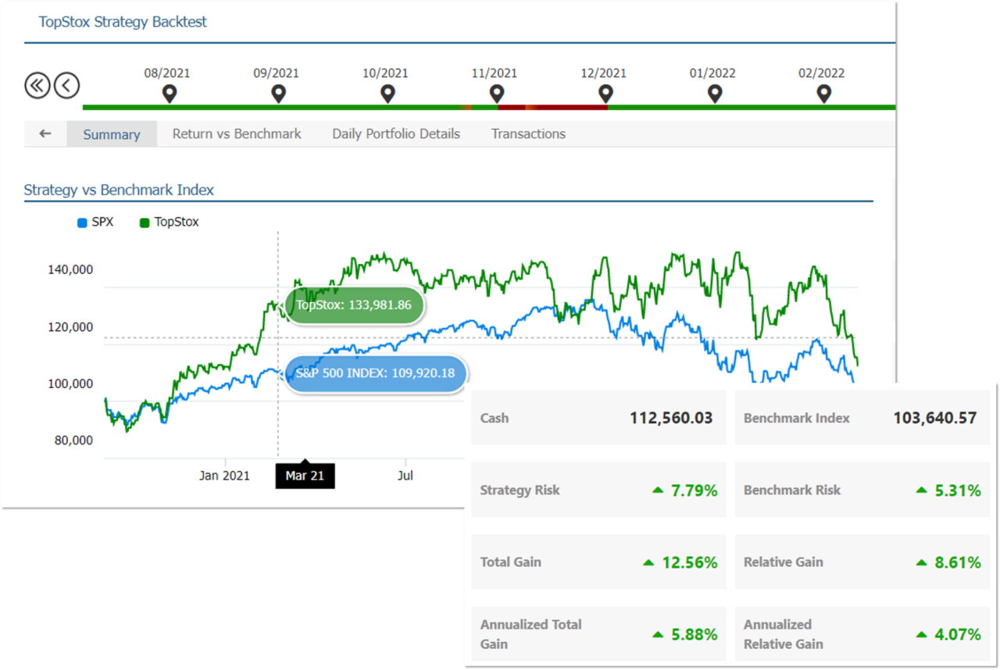

In algorithmic trading, backtesting execution strategies play a critical role in the validation and refinement of trading models. Backtesting involves the simulation of a trading strategy using historical data to assess its potential profitability and risks. By leveraging backtesting, traders can gain insights into how their strategies might have performed under past market conditions, offering a robust framework for informed decision-making prior to live trading.

The importance of backtesting lies in its ability to provide a historical performance benchmark, thereby allowing traders to calibrate their strategies for better alignment with market dynamics. This process helps identify strengths and weaknesses in trading models, facilitating the optimization of strategies for enhanced effectiveness.



In this guide, we explore the significance of backtesting within execution strategies and its contribution to the overall performance of algorithmic trading systems. We will detail the systematic steps involved in performing effective backtesting, discuss common pitfalls to be wary of, and illustrate practical examples using popular platforms like MQL4 and Tradetron.

Understanding the impact of historical data is crucial for any algorithmic trader. By simulating trades on past data sets, traders assess critical performance metrics such as net profit, win rate, drawdowns, and the Sharpe Ratio. These insights enable traders to make data-driven adjustments to their strategies, mitigating potential future risks and improving profitability.

Incorporating a robust backtesting process is indispensable for any trader aspiring to succeed in the fast-paced world of algorithmic trading. Identifying historical performance indicators paves the way for making strategic improvements, ensuring that when the time comes to transition from backtesting to live trading, traders are well-prepared to execute with confidence.

## Table of Contents

## Understanding Backtesting and Its Benefits

Backtesting is a crucial process in algorithmic trading that involves assessing a trading strategy's performance using historical data. This retrospective analysis enables traders to estimate how well a strategy might function in real market conditions, providing valuable insights into potential profitability and associated risks.

One of the primary benefits of [backtesting](/wiki/backtesting) is the ability to identify the potential profitability of a trading strategy. By simulating trades with historical data, traders can observe whether their strategies would have generated profits over a specific period. This analysis helps in determining if a strategy is worth deploying in live markets or requires further optimization.

Understanding risks is another fundamental aspect of backtesting. Traders can gain insights into the [volatility](/wiki/volatility-trading-strategies) and drawdowns a strategy may encounter, enabling them to assess if the risk levels align with their tolerance. Key metrics such as maximum drawdown, which measures the largest peak-to-trough decline during a particular period, are critical in risk assessment. A high drawdown could signal potential issues in the strategy's robustness.

Fine-tuning strategies for enhanced effectiveness is also enabled by backtesting. Traders can adjust various parameters based on backtesting feedback to improve strategy performance. Metrics such as net profit, win rate, and the Sharpe Ratio are instrumental in evaluating the effectiveness of a strategy. The net profit metric provides the total profit generated after subtracting losses, while the win rate indicates the percentage of successful trades. The Sharpe Ratio, defined as $\frac{E[R - R_f]}{\sigma}$, where $R$ is the return of the strategy, $R_f$ is the risk-free rate, and $\sigma$ is the standard deviation of the excess return, helps in understanding the risk-adjusted return of a strategy.

Accurate backtesting assists traders in avoiding common mistakes and aligning their strategies with market conditions. Ensuring that historical data accurately represents future market environments is essential to maximizing the reliability of backtest results. Furthermore, backtesting helps identify flaws in the strategy that could lead to suboptimal performance in live trading.

In conclusion, backtesting is indispensable for developing effective trading strategies. By offering insights into potential profitability and risks, and helping to fine-tune strategies, backtesting enables traders to optimize their approaches and make informed decisions, ultimately improving their chances of success in [algorithmic trading](/wiki/algorithmic-trading).

## Steps for Effective Backtesting

Effective backtesting is a structured process that enhances the reliability and performance of trading strategies. To ensure success, it is essential to follow a series of steps that start with defining clear and objective rules for your trading strategy. This involves specifying precise entry and [exit](/wiki/exit-strategy) signals, which form the foundation for consistent strategy evaluation.

The next critical step is the selection of appropriate historical data tailored to the asset and timeframe you intend to trade. This data selection process ensures that backtesting results reflect realistic market conditions and informs traders about how a strategy would perform under similar circumstances.

Once the data is selected, traders can employ platforms like MetaTrader 4 to simulate the performance of their strategies. MetaTrader 4, renowned for its robust backtesting capabilities, enables traders to execute strategy simulations by applying algorithms over the chosen historical data.

After running the simulations, it is necessary to analyze key performance metrics. The primary metrics include net profit, drawdown, and win rate. Net profit reflects the total gain or loss over the simulated period, while drawdown measures the strategy's largest peak-to-trough decline, offering insight into potential risks. A high win rate indicates a greater percentage of winning trades, though it should be considered alongside other metrics to truly gauge strategy effectiveness.

The insights gained from performance metrics should guide the optimization of trading strategies. Optimization involves adjusting strategy parameters to enhance performance. However, caution is necessary to avoid overfitting, where a strategy becomes excessively tailored to historical data patterns, risking poor future performance. Balancing parameter adjustment with general market applicability ensures a robust strategy capable of adapting to various conditions.

By adhering to these steps, traders can effectively backtest their algorithmic trading strategies, thereby improving their chances of achieving success in live trading environments.

## Common Pitfalls in Backtesting

In the process of backtesting trading strategies, several common pitfalls can undermine the reliability of the results. One of the primary challenges is overfitting, which occurs when a strategy is excessively tailored to the historical data it was tested on. This can lead to a model that performs well on past data but fails during actual trading due to its lack of adaptability to new market conditions. Overfitting often arises from having too many parameters relative to the amount of available data, resulting in a model that captures noise rather than the true underlying market signals.

Biases in backtesting are another significant issue. Data snooping bias occurs when a strategy is inadvertently influenced by the dataset it is tested on, leading to an overestimation of its profitability. This happens when multiple strategies are tested on the same data until one shows favorable results, without considering the likelihood of random success. Look-ahead bias is introduced when future information is incorrectly incorporated into the backtest, giving an unrealistic advantage to the strategy. Survivorship bias involves using data that only includes assets that have performed well historically, thereby ignoring those that have failed, which can result in overly optimistic performance estimates.

Another critical aspect to consider is the impact of real-world trading costs, such as slippage and commissions, which can significantly affect the profitability of a strategy. Slippage refers to the difference between the expected price of a trade and the actual price at which it is executed. It can occur due to market volatility or insufficient [liquidity](/wiki/liquidity-risk-premium) and can reduce the realized gains of a strategy during live trading. Commissions are the fees paid to brokers for executing trades, and failing to account for them can lead to an overestimation of net profits.

In implementing robust backtesting practices, it is essential to ensure that the strategy is not overly complex, use out-of-sample data for validation, and simulate realistic trading conditions. By doing so, traders can avoid common pitfalls and develop strategies with stronger potential for real-world success.

 to Optimizing Execution Strategies

Optimizing execution strategies in algorithmic trading involves adjusting strategy parameters to enhance performance based on the results obtained from backtesting. This process is crucial for ensuring that a trading strategy not only maximizes profitability but also maintains robustness across varying market conditions. Two primary techniques utilized in this endeavor are parameter optimization and walk-forward optimization, both aimed at mitigating the risk of overfitting.

Parameter optimization entails systematically adjusting the parameters of a trading strategy to achieve the best performance metrics, such as net profit or Sharpe Ratio, as observed in backtest results. This process often involves testing various parameter combinations to identify the optimal set that yields the highest returns with the least risk. For instance, in a moving average crossover strategy, parameters like the period length of moving averages may be adjusted. Here is a simple Python example illustrating parameter optimization:

```python
import numpy as np
import pandas as pd

def backtest_strategy(short_window, long_window, data):
    data['short_mavg'] = data['Close'].rolling(window=short_window).mean()
    data['long_mavg'] = data['Close'].rolling(window=long_window).mean()
    data['signal'] = 0
    data['signal'][short_window:] = np.where(data['short_mavg'][short_window:] > data['long_mavg'][short_window:], 1, 0) 
    data['positions'] = data['signal'].diff()
    initial_capital = float(100000.0)
    positions = pd.DataFrame(index=data.index).fillna(0.0)
    positions['stock'] = data['signal']
    portfolio = positions.multiply(data['Close'], axis=0)
    pos_diff = positions.diff()
    portfolio['holdings'] = (positions.multiply(data['Close'], axis=0)).sum(axis=1)
    portfolio['cash'] = initial_capital - (pos_diff.multiply(data['Close'], axis=0)).sum(axis=1).cumsum()   
    portfolio['total'] = portfolio['cash'] + portfolio['holdings']
    portfolio['returns'] = portfolio['total'].pct_change()
    return portfolio['total'].iloc[-1]

data = pd.read_csv('historical_data.csv')
best_profit = 0
best_params = (0, 0)

for short in range(5, 25, 5):
    for long in range(20, 60, 10):
        total = backtest_strategy(short, long, data)
        if total > best_profit:
            best_profit = total
            best_params = (short, long)

print(f"Best Parameters: Short Window = {best_params[0]}, Long Window = {best_params[1]}")
```

Walk-forward optimization is another powerful technique where the strategy is trained on a subset of historical data and tested on the subsequent out-of-sample data. This iterative process ensures that a strategy remains effective over time and different market environments. It provides a predictive validation by continuously updating the strategy parameters in a rolling fashion.

By implementing these optimization techniques, traders aim to strike a balance between risk and return. This involves evaluating trade-offs between maximizing potential returns and managing potential losses, ensuring that a strategy performs consistently well under a wide array of market conditions. This robustness is crucial for minimizing risks associated with unforeseen market movements and maintaining a steady path to profitability.

## Backtesting Example: MQL4 Simple Moving Average Crossover

The Simple Moving Average (SMA) crossover strategy is a fundamental approach in algorithmic trading that is frequently implemented using MQL4, a popular language for programming trading robots in MetaTrader 4. This strategy uses two SMAs: a fast moving average (shorter period) and a slow moving average (longer period). The decision to buy or sell depends on the crossover between these two lines. Specifically, a buy signal is generated when the fast moving average crosses above the slow moving average, indicating upward [momentum](/wiki/momentum). Conversely, a sell signal is initiated when the fast moving average crosses below the slow moving average, suggesting downward momentum.

To backtest this strategy effectively using MQL4, the historical price data of the asset is utilized. The platform enables the simulation of the strategy against past market conditions, allowing traders to assess the strategy's viability.

### Implementation Steps

1. **Define Parameters:**
   Set the time periods for the fast and slow moving averages. For example:
   ```mql4
   int fastPeriod = 10;
   int slowPeriod = 50;
   ```

2. **Calculate Moving Averages:**
   Use MQL4 functions to compute the moving averages for each bar in the dataset.
   ```mql4
   double fastMA = iMA(NULL, 0, fastPeriod, 0, MODE_SMA, PRICE_CLOSE, 0);
   double slowMA = iMA(NULL, 0, slowPeriod, 0, MODE_SMA, PRICE_CLOSE, 0);
   ```

3. **Generate Signals:**
   Implement logic to compare the two moving averages and generate buy/sell decisions.
   ```mql4
   if (fastMA > slowMA && previousFastMA <= previousSlowMA) {
       // Execute buy order logic
   } else if (fastMA < slowMA && previousFastMA >= previousSlowMA) {
       // Execute sell order logic
   }
   ```

4. **Performance Metrics:**
   During backtesting, critical performance metrics are captured. These include:

   - **Net Profit:** Total profit minus total loss over the testing period.
   - **Win/Loss Count:** The number of winning trades versus losing trades.
   - **Largest Drawdown:** The largest peak-to-trough decline before a new peak is achieved, indicating potential risk exposure.

The formula for calculating drawdown can be expressed as:
$$
\text{Drawdown} = \frac{\text{Peak Value} - \text{Trough Value}}{\text{Peak Value}} \times 100\%
$$

Among these metrics, net profit provides insight into the overall profitability, while the win/loss count helps evaluate the strategy's reliability. The largest drawdown calculation is crucial for understanding the risk involved.

### Output the Result
At the conclusion of the backtest, the results can be output as follows:

1. **Net Profit:**
   ```mql4
   Print("Net Profit: ", netProfit);
   ```

2. **Win/Loss Count:**
   ```mql4
   Print("Wins: ", winCount, " Losses: ", lossCount);
   ```

3. **Largest Drawdown:**
   ```mql4
   Print("Largest Drawdown: ", largestDrawdown, "%");
   ```

Backtesting this simple moving average crossover strategy in MQL4 provides crucial insights. By refining the periods of the fast and slow moving averages, traders can optimize the strategy to suit specific market conditions. Tracking performance metrics ensures a comprehensive understanding of the strategy's potential in live trading environments.

## Tips for Successful Backtesting and Optimization

Testing strategies on multiple timeframes and including realistic transaction costs are crucial in enhancing the accuracy and reliability of backtesting results. Robust backtesting ensures that a strategy performs well under various market conditions and not just overfitted to a particular data period.

**Testing Across Multiple Timeframes**

By evaluating strategies over multiple timeframes, traders gain insights into the consistency and adaptability of their strategies. This approach helps identify whether a strategy is limited to a specific timeframe or can be generalized across various periods. For instance, a strategy that performs well on a daily timeframe but poorly on an hourly one may need adjustments for shorter-term trading.

**Including Realistic Transaction Costs**

Incorporating transaction costs like slippage and commission is essential in simulating a realistic trading environment. These costs can significantly impact the net profitability of a strategy and are frequently underestimated in hypothetical backtests. For example, if a transaction involves a commission of $5 and an average slippage of 0.1%, these should be factored into the backtest calculations. A simple approach in Python might look like this:

```python
def backtest_with_costs(trades, commission, slippage_percent):
    net_profit = 0
    for trade in trades:
        profit = trade['profit']
        slippage_cost = trade['amount'] * slippage_percent
        net_profit += (profit - commission - slippage_cost)
    return net_profit
```

**Forward Testing for validation**

Conducting forward testing, also known as paper trading or out-of-sample testing, is another vital step. Unlike backtesting, which relies on historical data, forward testing applies the strategy in real-time market conditions without actual monetary risk. This process helps assess the strategy's real-world performance and adaptability. Forward testing can identify unforeseen market dynamics and psychological factors that backtesting might not capture.

In conclusion, successful backtesting and optimization rely heavily on testing strategies across different timeframes, incorporating realistic transaction costs, and validating with forward testing. These practices ensure a robust evaluation of trading strategies, enabling better decision-making in live markets.

## Conclusion

Backtesting is an essential component in algorithmic trading that offers invaluable insights for developing and refining trading strategies. By simulating the performance of trading models using historical data, traders can gauge potential profitability and risk exposures before deploying strategies in live markets. Understanding key backtesting metrics, such as net profit, win rate, drawdown, and the Sharpe Ratio, enables traders to assess the effectiveness of their strategies accurately.

Avoiding common pitfalls in backtesting, such as overfitting and biases, is crucial for maintaining the validity and reliability of the results. Overfitting involves tailoring strategies too closely to historical data, which can result in poor performance in live trading. Similarly, biases like data snooping and survivorship bias must be mitigated to prevent skewed outcomes.

The examples and techniques illustrated, including the use of platforms such as MQL4 and Tradetron for executing backtests, lay a strong foundation for further exploration of algorithmic trading strategies. Through careful backtesting and optimization, traders can enhance their strategy effectiveness, finding a balance between risk and return while ensuring robustness across varying market conditions. Engaging in forward testing as a follow-up to backtesting can further validate the strategy's performance, paving the way for successful application in real-world trading environments.

## References & Further Reading

[1]: ["Advances in Financial Machine Learning"](https://www.amazon.com/Advances-Financial-Machine-Learning-Marcos/dp/1119482089) by Marcos Lopez de Prado

[2]: ["Algorithmic Trading: Winning Strategies and Their Rationale"](https://github.com/prabakar2610/TradingBooks/blob/master/Algorithmic%20Trading%20-%20Winning%20Strategies%20and%20Their%20Rationale%202013.pdf) by Ernest P. Chan

[3]: ["Quantitative Trading: How to Build Your Own Algorithmic Trading Business"](https://www.amazon.com/Quantitative-Trading-Build-Algorithmic-Business/dp/1119800064) by Ernest P. Chan

[4]: ["Evidence-Based Technical Analysis: Applying the Scientific Method and Statistical Inference to Trading Signals"](https://www.amazon.com/Evidence-Based-Technical-Analysis-Scientific-Statistical/dp/0470008741) by David Aronson

[5]: ["Machine Learning for Algorithmic Trading"](https://github.com/stefan-jansen/machine-learning-for-trading) by Stefan Jansen

[6]: Aronson, D. R. (2007). ["Evidence-Based Technical Analysis"](https://onlinelibrary.wiley.com/doi/book/10.1002/9781118268315): Applying the Scientific Method and Statistical Inference to Trading Signals. Wiley.

[7]: Pardo, R. (2008). ["The Evaluation and Optimization of Trading Strategies"](https://onlinelibrary.wiley.com/doi/book/10.1002/9781119196969). Wiley.