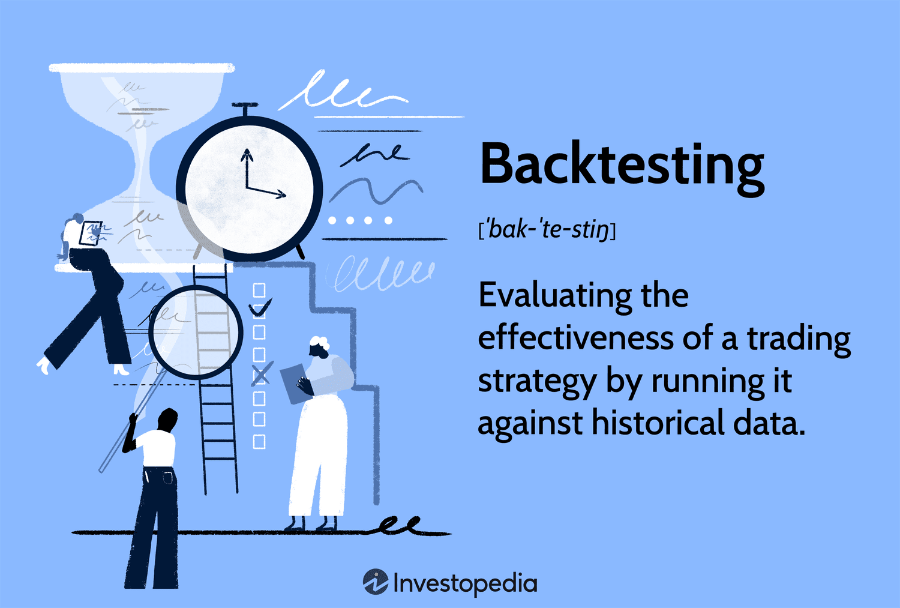

Algorithmic trading has revolutionized financial markets by enabling trades to be executed automatically based on predefined criteria. This sophisticated trading method leverages computational algorithms to make informed decisions, reducing human intervention and emotional bias in trading activities. A crucial component of developing a successful trading algorithm is rigorous testing, which predominantly involves backtesting and forward testing.

Backtesting allows traders to assess the potential effectiveness of their strategies by applying them to historical market data. This retrospective approach provides critical insights into how a strategy might have performed in the past, allowing traders to refine their algorithms without any financial risk. However, the practice of backtesting is not without its pitfalls, such as overfitting, where a strategy is overly adjusted to historical data patterns, potentially compromising its effectiveness in future markets.



Conversely, forward testing, often referred to as paper trading, involves applying the trading strategy in a simulated, real-time environment. This method evaluates the strategy's performance under current market conditions, including crucial factors like slippage and broker latency, which are often overlooked in historical data analysis. Forward testing provides additional validation of the strategy's resilience and adaptability in volatile market conditions, which backtesting alone might not accurately capture.

The correlation between backtesting and forward testing outcomes is central to ensuring the robustness of trading strategies. A strong correlation suggests that the strategy's performance is not merely a result of overfitting or model-specific biases, but is likely to yield consistent results in live markets. The ultimate objective is to develop a trading algorithm that is both reliable and profitable when deployed in actual trading environments, by understanding and leveraging the complementary insights provided by both backtesting and forward testing.

## Table of Contents

## Backtesting: The Foundation of Strategy Evaluation

Backtesting is a pivotal method in the development of trading strategies, serving as a simulation to evaluate the potential effectiveness of a trading system on historical data. This process allows traders to assess how their strategies might have performed in past market conditions, providing valuable insights without exposing any actual capital to risk. The primary goal is to validate the viability of a strategy by investigating its historical performance, thus informing future trading decisions.

Several popular trading platforms, such as MetaTrader, NinjaTrader, and TradeStation, offer robust tools that facilitate backtesting. These platforms enable traders to run simulations effortlessly, automating the analysis and comparison of different strategic approaches. By leveraging these technologies, traders can streamline the process of strategy evaluation, assessing performance metrics such as profit and loss, drawdowns, and various risk indicators.

However, [backtesting](/wiki/backtesting) is not without its challenges. One significant hurdle is over-optimization, commonly known as curve fitting. This occurs when a strategy is excessively tailored to match historical data perfectly, thereby inflating backtest performance metrics but potentially failing in live market conditions. The danger lies in creating a strategy more reflective of the historical data's peculiarities rather than representing a robust approach to different market scenarios.

To counter the risks of over-optimization, traders typically employ techniques such as in-sample and out-of-sample testing. In this method, historical data is divided into two parts: the in-sample data, used to develop and optimize the strategy, and the out-of-sample data, reserved for validation. Applying the strategy to out-of-sample data helps to confirm its performance in previously unseen data, ensuring that the strategy is adaptable and not merely a product of data-mining bias.

Mathematically, assessing a strategy's performance through backtesting can involve calculating various financial metrics. For instance, one might compute the Sharpe Ratio to measure the risk-adjusted return or use the formula for profit [factor](/wiki/factor-investing):

$$
\text{Profit Factor} = \frac{\text{Gross Profit}}{\text{Gross Loss}}
$$

In trading contexts, this formula provides insights into the profitability scale of the trading strategy when accounting for both winning and losing trades.

In conclusion, while backtesting is indispensable for the foundations of strategy evaluation, awareness of its limitations, such as overfitting, and the strategic application of in-sample and out-of-sample testing, enrich its outcomes. By integrating these practices, traders ensure a higher likelihood of achieving consistent results in live trading environments.

## Forward Testing: Bridging Theory with Reality

Forward testing, also known as paper trading, is a critical phase in the evaluation of a trading strategy. Unlike backtesting, which relies on historical data, forward testing allows traders to test their algorithms in a simulated environment that closely mirrors real-time market conditions. This approach provides an opportunity to observe how a strategy performs in the present market context, accounting for real-world factors such as slippage and broker latency.

Slippage refers to the difference between the expected price of a trade and the price at which the trade is actually executed. This discrepancy often occurs in high-[volatility](/wiki/volatility-trading-strategies) markets and can impact the profitability of a trading strategy. Broker latency, another significant factor in trading, pertains to the time delay between when an order is placed and when it is executed. Both of these elements are crucial for determining how well a strategy can perform in a live setting.

Forward testing allows traders to experience the realistic nuances of trading, including order execution delays and evolving market dynamics, which are not replicated in historical testing. These aspects are particularly important for high-frequency trading strategies, where execution speed can drastically affect outcomes. By handling these variables, a trading strategy can prove its resilience and adaptability to changes in the market.

One of the major advantages of forward testing is its ability to provide traders with a realistic performance assessment without exposing them to the financial risks inherent in live trading. This lower-risk environment enables traders to evaluate the effectiveness of their strategies, refine them, and address any weaknesses before capital is committed in the live markets. The effectiveness of forward testing is critical in building confidence in a trading strategy's capacity to generate consistent and reliable results. 

Overall, forward testing is an invaluable tool for traders who wish to transfer theoretical strategies into viable, live market models. It serves as a bridge between strategy conceptualization and real-world application, ensuring that the transition is both smooth and informed by a thorough understanding of market behavior.

## Correlation: The Key to Reliable Trading Systems

Correlation in [algorithmic trading](/wiki/algorithmic-trading) is essential for ensuring that a trading strategy's outcomes during the backtesting phase align consistently with those in the forward testing phase. This consistency is critical as it indicates that the strategy is not just a product of overfitting to past data or subject to model-specific biases. A robust correlation suggests that the strategy has a higher likelihood of achieving similar performance when applied in live market conditions.

Evaluating correlation involves a thorough comparison of the strategy's performance metrics during both testing phases. Some common performance metrics include the strategy's return, Sharpe ratio, and maximum drawdown. By comparing these metrics, traders can assess the alignment with expected performance outcomes. For example, if a strategy shows a Sharpe ratio of 1.5 during backtesting and maintains a similar ratio during forward testing, this suggests a strong correlation, indicative of a reliable strategy.

Discrepancies in the results between backtesting and forward testing phases can highlight potential weaknesses in the strategy. Such divergences necessitate further investigation into the strategy's components. For instance, if the forward test reveals a significantly lower return than the backtest, this could indicate overfitting, where the strategy is too finely tuned to past data and fails to adapt to new market conditions. This prompts refinement, potentially involving alterations to strategy parameters or the inclusion of additional market indicators.

Achieving and maintaining a good correlation is crucial for the viability of a trading strategy. Before deploying with real cash, traders seek confidence in the strategy's performance through reliable correlation. This involves iterative testing and refinement, ensuring that the strategy can handle different market environments while sustaining performance levels observed during testing. Tools like correlation coefficients, which numerically express the degree of correlation, can be invaluable. For example, a Pearson correlation coefficient close to 1 indicates a strong positive correlation, affirming the strategy's reliability.

In Python, calculating the Pearson correlation coefficient between backtest and forward test results might look like this:

```python
import numpy as np

# Example results from backtest and forward test
backtest_results = np.array([0.10, 0.15, 0.12, 0.14, 0.20])
forward_test_results = np.array([0.09, 0.16, 0.11, 0.13, 0.21])

# Calculate the Pearson correlation coefficient
correlation_matrix = np.corrcoef(backtest_results, forward_test_results)
correlation_coefficient = correlation_matrix[0, 1]

print(f"Pearson Correlation Coefficient: {correlation_coefficient}")
```

This code snippet sets up arrays of trading results from both testing phases and computes the Pearson correlation coefficient using NumPy's `corrcoef` function, thus providing a quantitative measure of correlation. Understanding these statistical relationships is crucial for traders seeking to enhance the reliability and profitability of their algorithmic trading strategies before live market deployment.

## Practical Steps for Conducting Backtesting and Forward Testing

When conducting backtesting and forward testing for a trading strategy, a systematic approach is essential to ensure thorough evaluation and optimization. Below are the practical steps involved in both processes:

**1. Defining the Trading Strategy Components:**
Start by clearly defining the elements of your trading strategy. This includes specifying the entry and [exit](/wiki/exit-strategy) points, risk management protocols, and the market conditions under which the strategy should operate. These components form the blueprint, guiding the subsequent testing phases.

**2. Backtesting:**
- **Data Collection:** Gather a comprehensive set of historical data. This dataset should be extensive enough to cover various market conditions and events that might influence trading performance. The data should include accurate prices, volumes, and other relevant market factors.

- **In-Sample and Out-of-Sample Data Separation:** Divide the collected historical data into two segments: in-sample for initial strategy development and optimization, and out-of-sample for independent validation. This ensures the strategy is not overly optimized to past data, risking poor future performance.

- **Executing Backtests:** Utilize dedicated trading software or platforms such as MetaTrader, QuantConnect, or custom Python scripts for backtesting. Here is a basic Python example using pandas and NumPy for a momentum-based strategy backtest:

  ```python
  import pandas as pd
  import numpy as np

  # Load historical data
  data = pd.read_csv('historical_price_data.csv', parse_dates=['Date'], index_col='Date')

  # Calculate moving averages
  short_window = 40
  long_window = 100
  data['Short_MA'] = data['Close'].rolling(window=short_window, min_periods=1).mean()
  data['Long_MA'] = data['Close'].rolling(window=long_window, min_periods=1).mean()

  # Generate signals
  data['Signal'] = np.where(data['Short_MA'] > data['Long_MA'], 1.0, 0.0)
  data['Position'] = data['Signal'].diff()

  # Calculate returns
  data['Strategy_Return'] = data['Position'].shift(1) * data['Close'].pct_change()
  ```

- **Analysis:** Evaluate the backtesting results to check for the strategy's robustness across different time periods and adjust for overfitting by varying parameters and observing the impact.

**3. Forward Testing:**
- **Setting Up a Paper Trading Account:** Employ a paper trading account with your broker. This setup replicates real-world trading without the financial risks, providing a platform to test the strategy in current market conditions.

- **Simulating Trades:** Implement the strategy in a simulated environment and execute trades to assess how it copes with real-time factors like slippage, spread variations, and latency.

- **Monitoring and Adjustment:** Continuously document and review the strategy’s performance, highlighting discrepancies between expected and actual outcomes to refine and adapt the strategy.

**4. Correlate and Validate:**
Lastly, compare the performance data from both backtesting and forward testing to evaluate consistency and correlation. Strong correlation suggests that the strategy is reliable and can be considered for live market deployment. Reducing discrepancies between the two testing phases ensures that the strategy maintains its integrity and increases the likelihood of profitability.

Through these meticulously conducted steps, traders can develop a robust trading algorithm with heightened confidence in its potential success in live markets.

## Conclusion

The journey from strategy development to live trading involves rigorous testing and validation through both backtesting and forward testing. Backtesting serves the crucial function of providing historical insights into how a trading strategy might have performed over past market scenarios. This retrospective analysis is indispensable for identifying potential strengths and weaknesses without incurring actual financial risk. However, it is forward testing that offers real-time validation, simulating trades based on current market conditions to surface practical considerations such as order execution delays or unexpected market dynamics that backtesting might not capture.

Understanding the correlation between the results of these testing methods is pivotal for traders aiming to enhance the reliability and profitability of their trading algorithms. A strong correlation suggests that a strategy is robust and not simply overfitted to historical data, reducing the likelihood of unforeseen performance issues when applied to live markets. It is through analyzing and reconciling these testing outcomes that traders can refine and optimize their strategies, ensuring that they are well-equipped to handle real market fluctuations and challenges.

While testing does not eliminate all risks inherent in trading, it significantly mitigates them, providing a structured and informed approach to strategy deployment. By confidently understanding the potential repercussions of market volatility and other unpredictable factors, traders can execute their strategies with greater assurance. Ultimately, the combination of thorough testing and a deep comprehension of market dynamics may unlock the path to sustainable trading success, allowing traders to navigate the complexities of the financial markets effectively.

## References & Further Reading

[1]: Bergstra, J., Bardenet, R., Bengio, Y., & Kégl, B. (2011). ["Algorithms for Hyper-Parameter Optimization."](https://dl.acm.org/doi/10.5555/2986459.2986743) Advances in Neural Information Processing Systems 24.

[2]: ["Advances in Financial Machine Learning"](https://www.amazon.com/Advances-Financial-Machine-Learning-Marcos/dp/1119482089) by Marcos Lopez de Prado

[3]: ["Evidence-Based Technical Analysis: Applying the Scientific Method and Statistical Inference to Trading Signals"](https://www.amazon.com/Evidence-Based-Technical-Analysis-Scientific-Statistical/dp/0470008741) by David Aronson

[4]: ["Machine Learning for Algorithmic Trading"](https://github.com/stefan-jansen/machine-learning-for-trading) by Stefan Jansen

[5]: ["Quantitative Trading: How to Build Your Own Algorithmic Trading Business"](https://github.com/LucindaYa/quant-resources/blob/master/Quantitative%20Trading%20How%20to%20Build%20Your%20Own%20Algorithmic%20Trading%20Business.pdf) by Ernest P. Chan