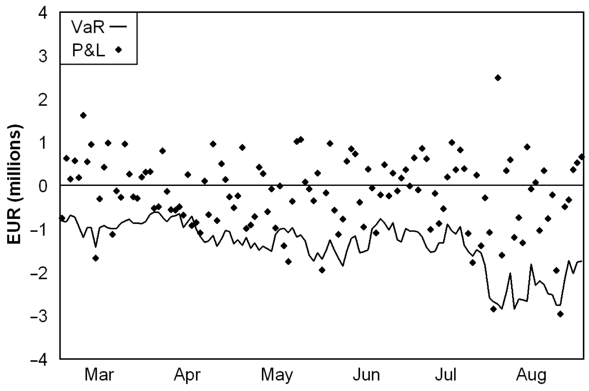

## Table of Contents

## What is backtesting in the context of Value at Risk (VaR)?

Backtesting in the context of Value at Risk (VaR) is a way to check if the VaR model is working correctly. It involves comparing the VaR predictions with what actually happened in the past. If a bank says that there is a 5% chance that losses will be more than a certain amount on any given day, backtesting will look at how often this actually happened in the past. If it happened more often than 5% of the time, the VaR model might not be accurate.

This process helps banks and financial institutions understand if their risk models are reliable. By looking at past data, they can see if their VaR calculations were too high or too low. If the model is not accurate, they can make changes to improve it. This is important because banks need to know how much risk they are taking and how much money they need to set aside to cover potential losses.

## Why is backtesting important for validating VaR models?

Backtesting is important for validating VaR models because it helps check if the predictions made by the model are correct. When a bank uses a VaR model, it wants to know how much money it might lose on a bad day. By looking at past data, backtesting compares these predictions with what actually happened. If the model says there's a 5% chance of losing more than a certain amount, backtesting will see if this happened more or less often than expected. This helps the bank see if the model is working well or if it needs to be fixed.

If the [backtesting](/wiki/backtesting) shows that the VaR model is not accurate, the bank can make changes to improve it. This is crucial because banks need to know how much risk they are taking and how much money they need to set aside to cover potential losses. Without backtesting, a bank might think it's safer than it really is, which could lead to big problems if a big loss happens. So, backtesting helps make sure that the VaR model is reliable and that the bank can trust it to manage risk properly.

## What are the basic steps involved in backtesting a VaR model?

Backtesting a VaR model involves a few important steps. First, you need to collect historical data on the financial assets or portfolio you are analyzing. This data should include the daily returns or losses for a period long enough to be meaningful, often several years. Next, you use this historical data to calculate the VaR for each day in the past. The VaR calculation tells you the maximum expected loss for a given confidence level, like 95% or 99%.

After calculating the VaR for each day, you compare these predictions with what actually happened. You count the number of times the actual loss was greater than the predicted VaR. If your VaR model is set at a 95% confidence level, you expect actual losses to exceed the VaR about 5% of the time. If this happens more or less often than expected, it might mean your model needs to be adjusted. This comparison helps you see if the VaR model is giving accurate predictions.

Finally, you analyze the results of the backtesting. If the model's predictions are too far off from what actually happened, you need to figure out why and make changes to the model. This could mean adjusting the statistical methods used or the assumptions about how the market behaves. By doing this, you can improve the model so it gives better predictions in the future. This process of backtesting and adjusting helps make sure the VaR model is reliable for managing risk.

## How do you select an appropriate historical data period for backtesting VaR?

When you're [picking](/wiki/asset-class-picking) the right amount of historical data for backtesting VaR, you need to think about how long a period you should look at. Usually, you want to use at least one to three years of data. This is because financial markets can change a lot, and you want to make sure your data includes different market conditions, like good times and bad times. If you use too short a period, you might miss important events that could affect your VaR model's accuracy. On the other hand, if you go too far back, the data might not be relevant anymore because markets and rules can change over time.

Once you've decided on the length of the period, you should also think about the type of data you're using. For example, if you're looking at stocks, you might want daily data. But if you're looking at less frequently traded assets, you might need to use weekly or monthly data. It's important to make sure the data period you choose covers a full economic cycle, which can help you see how your VaR model performs in different situations. By choosing the right historical data period, you can make your backtesting more reliable and your VaR model more accurate.

## What are the common statistical tests used in VaR backtesting?

There are a few common statistical tests used in VaR backtesting to check if the model is working well. One of these is the Kupiec test, also known as the Proportion of Failures (POF) test. This test looks at how often the actual losses are more than the VaR predictions. If the VaR is set at a 95% confidence level, the test checks if the actual losses are more than the VaR about 5% of the time. If it's too different from 5%, the model might need to be fixed.

Another test is the Christoffersen test, which checks if the times when the VaR is exceeded are happening randomly or if there's a pattern. This is important because if the VaR is exceeded more often during certain times, it could mean the model isn't capturing all the risks. Lastly, the Berkowitz test looks at how well the VaR model fits the actual data. It checks if the model's predictions match the real losses over time. These tests help make sure the VaR model is reliable and can be trusted to manage risk properly.

## How do you interpret the results of a VaR backtesting exercise?

When you do a VaR backtesting exercise, you're checking if your VaR model's predictions match what actually happened in the past. If your model says there's a 5% chance of losing more than a certain amount, you expect this to happen about 5% of the time. If it happens more often, like 10% of the time, it means your model might be too optimistic and not capturing all the risks. On the other hand, if it happens less often, like only 2% of the time, your model might be too cautious, and you could be setting aside too much money for potential losses.

To make sense of these results, you use statistical tests like the Kupiec test, which checks if the number of times the actual losses were more than the VaR matches what you expected. If the test shows a big difference, you need to look at why your model isn't working right. Maybe the data you used wasn't good enough, or maybe the way you calculated VaR needs to be changed. By understanding these results, you can make your VaR model better and more reliable for managing risk in the future.

## What are the differences between unconditional and conditional coverage tests in VaR backtesting?

Unconditional coverage tests, like the Kupiec test, look at how often the actual losses are more than the VaR predictions over the whole time period you're checking. If your VaR model says there's a 5% chance of losing more than a certain amount, the test checks if this happens about 5% of the time. It's all about making sure the number of times the VaR is exceeded matches what you expected. If it's too different, it means your model might not be working right, and you need to fix it.

Conditional coverage tests, like the Christoffersen test, go a step further. They not only check how often the VaR is exceeded but also look at when it happens. This test checks if the times when the VaR is exceeded are happening randomly or if there's a pattern. For example, if the VaR is exceeded more often during certain times, like at the end of the month, it could mean your model isn't capturing all the risks. By looking at both the frequency and the timing, conditional coverage tests give you a better idea of how well your VaR model is working.

## How can you adjust a VaR model based on backtesting results?

If backtesting shows that your VaR model isn't working right, you can make changes to fix it. One way to do this is by looking at the data you used. If the data doesn't cover enough different situations, like good times and bad times in the market, you might need to use a longer period or different types of data. Another way is to change how you calculate the VaR. For example, if the model is too optimistic and you're losing more than expected, you might need to use a different method that takes into account more risks.

After making these changes, you should do backtesting again to see if the model works better. If the new results show that the VaR predictions match what actually happened more closely, then your adjustments worked. But if the model is still off, you might need to keep trying different things until you find what works. This process helps make sure your VaR model is reliable and can help you manage risk better.

## What are the regulatory requirements for VaR backtesting in financial institutions?

Financial institutions have to follow certain rules when they do VaR backtesting. One big rule comes from the Basel Committee on Banking Supervision, which says banks need to do backtesting to make sure their VaR models are working right. The rules say banks should use at least one year of data for backtesting and check their VaR at least once a quarter. If the backtesting shows the VaR model isn't accurate, the bank might need to set aside more money to cover potential losses, which is called a capital charge.

Regulators like the Federal Reserve in the U.S. also have their own rules. They might ask banks to do backtesting more often or use different tests to check the VaR model. If a bank's VaR model fails the backtesting too many times, regulators might make the bank use a different method to calculate risk or even stop them from using VaR at all. This is to make sure banks are managing their risk properly and not taking too many chances with their money.

## How do you handle model risk and parameter uncertainty in VaR backtesting?

Handling model risk and parameter uncertainty in VaR backtesting means dealing with the chance that your VaR model might not be perfect. Model risk happens when the way you calculate VaR doesn't match how the market really works. To handle this, you can use different VaR models and compare their results. If they all give similar answers, you can feel more sure about your predictions. You can also test your model with different sets of data to see if it works well in different situations. This helps you understand if your model is too simple or if it's missing important risks.

Parameter uncertainty is about not being sure about the numbers you use in your VaR model. For example, you might not know the exact chance of a big loss happening. To deal with this, you can use something called stress testing, where you try out different numbers to see how they change your VaR predictions. Another way is to use a range of possible numbers instead of just one, which is called sensitivity analysis. This helps you see how much your VaR might change if your guesses about the market are a bit off. By doing these things, you can make your VaR model more reliable and better at managing risk.

## What advanced techniques can be used to improve the accuracy of VaR backtesting?

To make VaR backtesting more accurate, you can use something called Monte Carlo simulations. This technique involves creating a lot of different possible future scenarios for your portfolio based on past data. By running these simulations, you can see how often your VaR predictions are right and how often they're wrong. This helps you understand how well your model works in different market conditions. Another advanced method is using [machine learning](/wiki/machine-learning). Machine learning can look at a lot of data and find patterns that might be hard for a person to see. This can help you make your VaR model better at predicting risks.

Another way to improve VaR backtesting is by using a technique called bootstrapping. Bootstrapping takes your historical data and mixes it up to create new sets of data. This lets you see how your VaR model would do if the past had happened a bit differently. It's a good way to check if your model is too sensitive to small changes in the data. Also, you can use something called expected shortfall (ES) along with VaR. Expected shortfall looks at how bad the losses could be when they're worse than the VaR. By using both VaR and ES, you get a fuller picture of the risks you're facing. These advanced techniques can help you make your VaR model more accurate and reliable.

## How do you integrate stress testing with VaR backtesting to enhance risk management?

Integrating stress testing with VaR backtesting helps you see how your portfolio might do in really bad situations. Stress testing means looking at what could happen if the market goes crazy, like during a big crash or a sudden change in rules. You use these extreme scenarios to test your VaR model. If your VaR model says you won't lose more than a certain amount most of the time, stress testing checks if this is still true when things get really tough. By doing this, you can find out if your VaR model is strong enough to handle big shocks.

Using both stress testing and VaR backtesting together gives you a better way to manage risk. VaR backtesting looks at how well your model predicts normal day-to-day losses, while stress testing looks at how it handles big, unusual events. If your VaR model fails the stress test, it means you might need to change it or set aside more money to cover potential losses. This way, you're ready for both normal and extreme market conditions, making your risk management more complete and reliable.

## What is Value at Risk (VaR)?

Value at Risk (VaR) is a fundamental financial metric utilized for quantifying the potential risk of loss in investments. Essentially, it provides an estimate of the maximum expected loss in a portfolio over a predetermined time frame, at a specific confidence level, such as 95% or 99%. This tool is critical for investors and portfolio managers as it facilitates an understanding of their exposure to risk and aids in managing potential financial losses effectively. 

The calculation of VaR begins by determining the distribution of potential portfolio returns over the desired time horizon. For a given confidence level, VaR represents the point on this distribution that marks the threshold beyond which losses are considered acceptable under the model’s assumptions. Mathematically, VaR is often expressed as:

$$
\text{VaR}_\alpha = \inf \{ x \in \mathbb{R} : P(X \leq x) \geq \alpha \}
$$

where $\alpha$ is the confidence level, $P$ is the probability, and $X$ is the portfolio value.

Despite its widespread adoption, VaR does have limitations. One of the main criticisms is that it does not predict exact losses that exceed the VaR threshold. Therefore, while it identifies the level at which losses may exceed expectations within a certain confidence level, it offers no insight into the magnitude of such losses. This inadequacy necessitates complementary risk measures, such as Conditional Value at Risk (CVaR), or Expected Shortfall, which provides an average of the losses that occur beyond the VaR threshold, offering a more comprehensive view of the risk landscape. CVaR is calculated as:

$$
\text{CVaR}_\alpha = E[X \mid X \leq \text{VaR}_\alpha]
$$

These enhancements to the basic VaR model are essential for more accurately gauging risk, especially in volatile or non-normally distributed markets, thus enabling more robust financial risk management.

## What are the methods of calculating VaR?

Value at Risk (VaR) is calculated using three primary methodologies, each with distinct assumptions and applications suitable for different types of risk assessment in financial portfolios.

### Variance-Covariance Method

The Variance-Covariance method is a parametric approach that assumes the returns of financial assets follow a normal distribution. This method leverages statistical measures such as [volatility](/wiki/volatility-trading-strategies) (standard deviation) and correlation among asset returns to estimate potential loss. The mathematical expression typically used in the Variance-Covariance method is:

$$
VaR = \mu + z \cdot \sigma
$$

where $\mu$ is the mean return, $z$ is the z-score corresponding to the desired confidence level (e.g., -1.645 for 95% confidence), and $\sigma$ is the standard deviation of returns. While this method is computationally efficient and straightforward to implement, its reliance on the normal distribution assumption can be limiting, especially in markets characterized by fat tails and skewed returns.

### Historical Simulation

The Historical Simulation method is a non-parametric approach that uses actual historical returns to assess potential future risks. It does not assume any specific distribution for returns, making it a flexible option for analyzing portfolio risks. To implement this method, historical returns data is collected, and hypothetical changes in portfolio value are simulated based on these past returns. The VaR is then derived by arranging these values in order and selecting the loss at the desired confidence percentile. This method's strength lies in its ability to account for extreme events if they occurred within the historical dataset, though it may not perform well when such events are absent.

### Monte Carlo Simulation

Monte Carlo Simulation employs random sampling techniques to generate and analyze a multitude of potential future scenarios for asset price movements. This method can accommodate complex financial instruments and non-linear portfolios. The basic steps involve modeling the underlying processes that drive asset returns, often using stochastic differential equations, and simulating numerous paths for these processes to gauge potential losses. A simple implementation in Python might involve generating random samples from a specified distribution, such as:

```python
import numpy as np

# Assuming a portfolio with mean (mu) and standard deviation (sigma) of returns
np.random.seed(42)  # For reproducibility
mu = 0
sigma = 0.02
n_simulations = 10000

# Simulating returns
simulated_returns = np.random.normal(mu, sigma, n_simulations)

# Calculating portfolio values from simulated returns
initial_value = 1000000  # Initial portfolio value
portfolio_values = initial_value * (1 + simulated_returns)

# Calculating VaR at 95% confidence level
var_95 = np.percentile(initial_value - portfolio_values, 95)
print(f"95% VaR: {var_95}")
```

This approach is highly adaptable and can incorporate stochastic factors and varying distributions for returns. However, it is computationally intensive and requires careful model specification and parameter estimation.

Each of these methods has its advantages and limitations, making them suitable for different contexts within risk management processes. The choice among these methodologies depends on the specific characteristics of the portfolio under analysis and the market conditions expected to prevail.

## References & Further Reading

[1]: Bergstra, J., Bardenet, R., Bengio, Y., & Kégl, B. (2011). ["Algorithms for Hyper-Parameter Optimization."](https://dl.acm.org/doi/10.5555/2986459.2986743) Advances in Neural Information Processing Systems 24.

[2]: ["Advances in Financial Machine Learning"](https://www.amazon.com/Advances-Financial-Machine-Learning-Marcos/dp/1119482089) by Marcos Lopez de Prado

[3]: ["Evidence-Based Technical Analysis: Applying the Scientific Method and Statistical Inference to Trading Signals"](https://www.amazon.com/Evidence-Based-Technical-Analysis-Scientific-Statistical/dp/0470008741) by David Aronson

[4]: ["Machine Learning for Algorithmic Trading"](https://github.com/stefan-jansen/machine-learning-for-trading) by Stefan Jansen

[5]: ["Quantitative Risk Management: Concepts, Techniques, and Tools"](https://archive.org/details/quantitativerisk0000mcne) by Alexander J. McNeil, Rüdiger Frey, and Paul Embrechts

[6]: Basak, Suleyman, and Alexander Shapiro. ("Value-at-Risk-Based Risk Management: Optimal Policies and Asset Prices.")[https://www.sciencedirect.com/science/article/abs/pii/S0304405X99000618] Journal of Finance, 2001.

[7]: ["Quantitative Trading: How to Build Your Own Algorithmic Trading Business"](https://github.com/LucindaYa/quant-resources/blob/master/Quantitative%20Trading%20How%20to%20Build%20Your%20Own%20Algorithmic%20Trading%20Business.pdf) by Ernest P. Chan