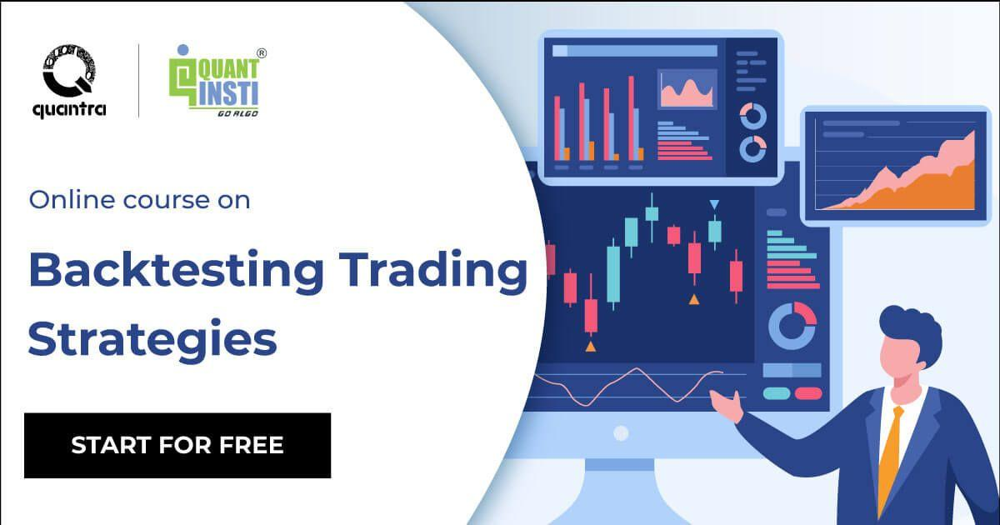

Algorithmic trading, commonly referred to as algo trading, utilizes computer programs to execute trades in financial markets with the aim of generating profits at speeds and frequencies impossible for human traders. These programs follow a predefined set of rules that can incorporate timing, price, quantity, or other mathematical models. The efficacy of these algorithms is predicated on their ability to process a large volume of market data in real-time to make swift trading decisions.

To verify and optimize the performance of trading strategies, traders employ two crucial simulation techniques: backtesting and market replay. Backtesting involves running a trading strategy against historical data to assess how it would have performed in past market conditions. This process aids traders in understanding the potential risks and returns associated with their strategies before deploying them in live trading scenarios. Market replay, on the other hand, provides traders with the opportunity to experience past market conditions as though they were occurring in real-time. This enables traders to refine their skills by practicing reaction times, decision-making, and emotional control without the financial risks associated with live trading.



This article will explore the significance and methodologies of backtesting and market replay in the context of algorithmic trading. It will also look at the key tools and platforms that facilitate these processes, allowing traders to enhance their performance and improve the robustness of their trading strategies.

## Table of Contents

## Understanding Backtesting

Backtesting is a fundamental process in [algorithmic trading](/wiki/algorithmic-trading), enabling traders to simulate their strategies using historical market data. This simulation helps assess the viability and potential performance of a strategy before it is applied in real market conditions.

The [backtesting](/wiki/backtesting) process starts with the definition of a clear trading strategy. A strategy typically includes specific rules for entry and [exit](/wiki/exit-strategy) points, risk management, and position sizing. Once a strategy is defined, the next step is gathering historical market data relevant to the assets being traded. This data often includes price, [volume](/wiki/volume-trading-strategy), and any other metrics crucial to the strategy.

After data collection, the strategy is implemented within a backtesting platform, which might be a proprietary system or one of many available platforms such as those mentioned in Section 5. Within the platform, the saved historical data is run through the algorithm. During this phase, the strategy's simulated trades are executed based on historical price movements, while adhering to the predefined rules of the trading strategy.

Analyzing the results of backtesting involves evaluating several performance metrics. Commonly used metrics include total return, the Sharpe ratio, maximum drawdown, and the win/loss ratio. These metrics help gauge the strategy's profitability, risk-adjusted performance, and overall robustness. For instance, the Sharpe ratio $S$, defined as:

$$
S = \frac{R_p - R_f}{\sigma_p}
$$

where $R_p$ is the expected portfolio return, $R_f$ is the risk-free rate, and $\sigma_p$ is the standard deviation of the portfolio returns, succinctly conveys how well the return of a strategy compensates for the risk taken.

Backtesting is not without its challenges. It is crucial to ensure the historical data used is accurate and reflects true market conditions to avoid misleading outcomes. Additionally, overfitting, a scenario where a strategy is too closely tailored to historical data, poses a significant risk. Overfitting might lead to excellent performance in backtests but poor results in live markets. To counter this, traders often divide the data into in-sample and out-of-sample datasets, testing the strategy on unseen data to validate its robustness. 

Ultimately, effective backtesting provides invaluable insights into a strategy's potential success, helping traders optimize and refine their methods before risking capital in live markets.

 to Market Replay

Market replay is a powerful tool for traders, offering the ability to simulate historical trading conditions in a manner akin to real-time market scenarios. It allows traders to "replay" market data on a bar-by-bar basis, which effectively mirrors the pace and rhythm of live market fluctuations. This capability is integral for traders seeking to hone their skills without the financial risks intrinsic to live trading.

One of the primary benefits of market replay is for discretionary traders—those who leverage their intuition and judgment rather than automated systems. This method provides a sandbox environment where they can practice making split-second decisions based on evolving market dynamics. By experiencing these conditions without real financial exposure, traders can develop and refine their strategies in a risk-free setting.

Market replay is instrumental in improving trading skills and understanding market mechanics. By simulating real-time conditions, traders gain firsthand exposure to market behaviors, enhancing their ability to react to sudden shifts and trends. This practical experience is invaluable, allowing traders to make more informed and intuitive decisions.

Furthermore, market replay aids in understanding the psychological aspects of trading, such as managing stress and maintaining discipline during volatile periods. By engaging in realistic practice sessions, traders can better prepare for the emotional challenges of actual trading environments. Overall, the market replay offers a realistic and practical approach to mastering trading skills, making it an essential tool for traders dedicated to achieving success in financial markets.

## Benefits and Limitations

Backtesting is an essential tool in algorithmic trading, allowing traders to evaluate their strategies against historical market conditions swiftly. This is particularly advantageous for systematic strategies that rely on precise, data-driven rules, enabling traders to assess performance across a wide array of market scenarios. However, a critical limitation of backtesting is its inability to perfectly replicate real-time market dynamics, such as market impact, slippage, and real-time decision making. These factors can lead to discrepancies between backtested results and actual trading outcomes.

Market replay serves as a complementary tool, offering a more hands-on approach to strategy evaluation. By simulating market conditions as if trading were occurring in real-time, market replay provides traders with an opportunity to experience the emotional and cognitive aspects of trading. This is particularly valuable for discretionary traders who incorporate human intuition into their strategies. The ability to practice in a risk-free environment helps traders refine their skills and develop better market intuition.

Despite these advantages, market replay does come with its drawbacks. The process can be time-consuming and manually intensive as each trade is evaluated in sequence, similar to real-time trading. Additionally, while market replay allows for a deeper understanding of the market's ebb and flow, it may not capture unforeseen market events or the psychological pressure of live trading with actual capital at risk.

In summary, both backtesting and market replay offer unique benefits and face specific limitations. Backtesting provides a fast, analytical approach to strategy evaluation, whereas market replay enhances experiential learning and skill refinement. Traders benefit from leveraging both methods to gain comprehensive insights into their trading strategies while acknowledging the inherent limitations of each approach.

## Key Tools and Platforms

Various platforms offer robust tools for backtesting and market replay, each with unique features tailored to different needs. Among these, TradingView, TrendSpider, Trade Ideas, and Databento are prominent choices for traders.

TradingView is well-known for its accessible backtesting capabilities, primarily through its intuitive scripting language, Pine Script. This platform is particularly favored by global traders engaging in diverse markets, including stocks, Forex, and cryptocurrencies. The flexibility and user-friendly nature of Pine Script allow traders to create and modify strategies with ease, facilitating a robust backtesting process that can be customized according to specific trading requirements.

TrendSpider provides an advanced technical analysis platform designed to augment the trading strategy development process. It supports automated backtesting features that enable traders to evaluate strategies against historical data without manual intervention. TrendSpider's algorithmic capabilities and intelligent charting tools make it a valuable asset for traders aiming to refine their strategies and improve their decision-making processes.

Trade Ideas presents a dynamic platform geared towards algorithmic and rule-based traders. It utilizes [artificial intelligence](/wiki/ai-artificial-intelligence) to offer real-time data analysis, aiding in both backtesting and strategy optimization. This platform is particularly beneficial for traders seeking an integrated environment for developing and implementing strategies with the support of cutting-edge technology.

Databento, a professional-grade platform, offers seamless transitions between backtesting and live trading. This is achieved through consistent data formats across historical and real-time interfaces, ensuring that strategies perform reliably when moved to live market conditions. The uniformity of the data format alleviates potential discrepancies, enhancing the trader’s ability to accurately evaluate and implement strategies in real-world scenarios.

Each of these platforms brings distinct advantages to the process of algorithmic trading development. By leveraging their specific capabilities, traders can enhance their analytical precision and strategic outcomes in various financial markets.

## Best Practices for Effective Backtesting and Market Replay

To optimize the effectiveness of backtesting and market replay in algorithmic trading, adhering to certain best practices is crucial. One primary consideration is the integrity and cleanliness of historical data. Clean data should accurately reflect market conditions, including precise time stamps, correct price executions, and realistic trading costs such as spreads and slippage. This ensures that simulations of trading strategies are as close to reality as possible, providing reliable insights into their potential performance.

Another critical practice is the division of data into in-sample and out-of-sample datasets, which serves to mitigate the risk of overfitting—a common problem where a strategy is tailored too closely to historical data, yielding suboptimal results in live trading. The in-sample dataset is used to develop and adjust the trading strategy, while the out-of-sample data tests the strategy's robustness and generalizability. This can help confirm that the strategy is not excessively attuned to the specificities of the historical data.

Customizing backtesting methods to align with the unique aspects of the trading strategy in question is also vital. This might entail adjusting parameters, such as the lookback period, or incorporating specific market conditions, such as [volatility](/wiki/volatility-trading-strategies) or [liquidity](/wiki/liquidity-risk-premium). Traders should analyze outcomes and performance metrics thoroughly, enabling adjustments and refinements to the strategy. By examining results like the Sharpe ratio, drawdowns, and win rate, traders can make informed decisions to enhance strategy performance.

Incorporating software and programming for deeper analysis is beneficial, as seen in this sample Python code for optimizing a simple moving average crossover strategy:

```python
import numpy as np
import pandas as pd

def backtest_strategy(data, short_window, long_window):
    data['Short_MA'] = data['Close'].rolling(window=short_window, min_periods=1).mean()
    data['Long_MA'] = data['Close'].rolling(window=long_window, min_periods=1).mean()
    data['Signal'] = np.where(data['Short_MA'] > data['Long_MA'], 1, 0)
    data['Position'] = data['Signal'].diff()
    return data

data = pd.read_csv('historical_data.csv')  # Replace with actual file path
short_window = 40
long_window = 100
results = backtest_strategy(data, short_window, long_window)
```

This code facilitates experimentation with different parameters, offering insights into which configurations yield the best results without the pitfalls of overfitting. By adhering to these practices, algorithmic traders can enhance the reliability and viability of their strategies, ultimately fostering better outcomes in live market conditions.

## Conclusion

Backtesting and market replay are essential methodologies for the development and refinement of trading strategies within algorithmic trading. By leveraging backtesting, traders simulate a strategy's performance using historical data, enabling an evaluation of its potential effectiveness before applying it in live financial markets. This process helps to reveal a strategy's strengths and weaknesses, allowing traders to make informed adjustments, thereby preventing costly mistakes in real-time trading scenarios.

Market replay, on the other hand, offers traders the ability to practice and refine their trading strategies under simulated real-time conditions. This hands-on approach allows traders to experience the market's dynamics and refine their tactics intuitively, without the financial risk associated with live trading.

The integration of these methodologies, supported by robust tools and platforms, enhances the trader's ability to develop and optimize strategies effectively. For instance, platforms like TradingView and TrendSpider facilitate comprehensive backtesting and market replay, providing a bridge from skill development to practical application. By adopting these strategies, traders can enhance their decision-making skills, improve performance, and ultimately, achieve greater success in the trading environment.

## References & Further Reading

[1]: Bergstra, J., Bardenet, R., Bengio, Y., & Kégl, B. (2011). ["Algorithms for Hyper-Parameter Optimization."](https://papers.nips.cc/paper/4443-algorithms-for-hyper-parameter-optimization) Advances in Neural Information Processing Systems 24.

[2]: ["Advances in Financial Machine Learning"](https://books.google.com/books/about/Advances_in_Financial_Machine_Learning.html?id=oU9KDwAAQBAJ) by Marcos Lopez de Prado

[3]: ["Evidence-Based Technical Analysis: Applying the Scientific Method and Statistical Inference to Trading Signals"](https://www.amazon.com/Evidence-Based-Technical-Analysis-Scientific-Statistical/dp/0470008741) by David Aronson

[4]: ["Machine Learning for Algorithmic Trading"](https://github.com/PacktPublishing/Machine-Learning-for-Algorithmic-Trading-Second-Edition) by Stefan Jansen

[5]: ["Quantitative Trading: How to Build Your Own Algorithmic Trading Business"](https://books.google.com/books/about/Quantitative_Trading.html?id=j70yEAAAQBAJ) by Ernest P. Chan