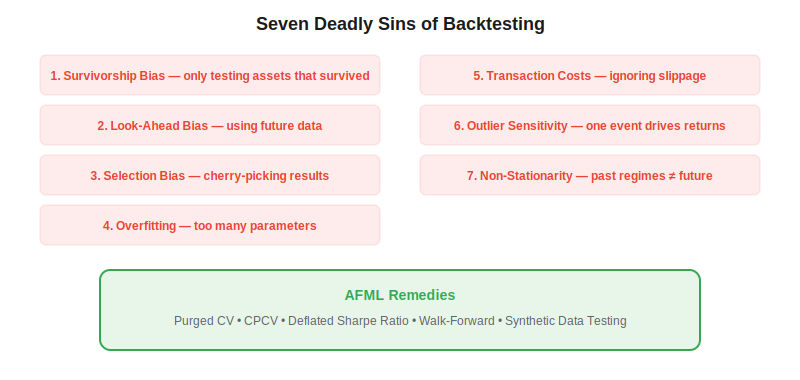
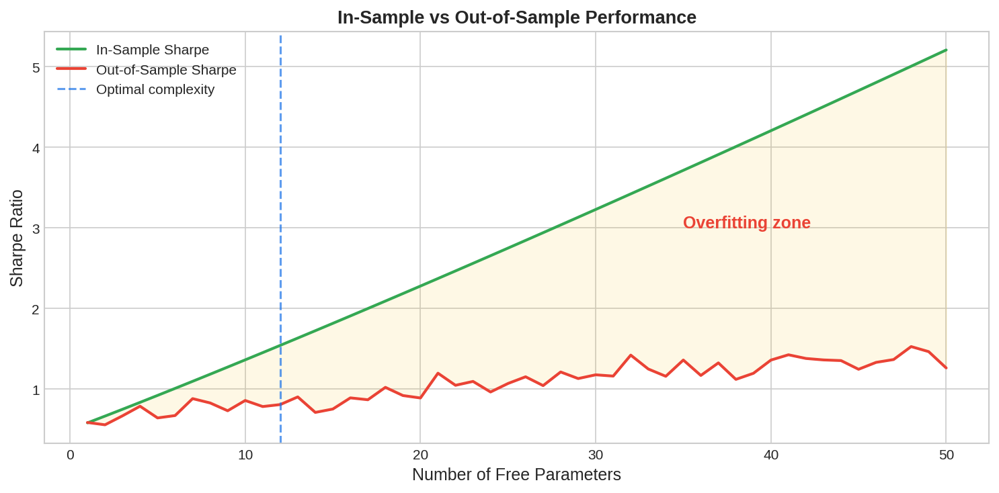

Backtesting is the process of evaluating a trading strategy on historical data — and it is where most quantitative strategies silently fail. In *Advances in Financial Machine Learning* (2018), Marcos Lopez de Prado identifies multiple systematic biases that make backtests unreliable, collectively responsible for the well-documented gap between paper performance and live trading results. Understanding and mitigating these pitfalls is essential for any algo trader.

## The Seven Deadly Sins of Backtesting



### 1. Survivorship Bias
Testing only on assets that exist today ignores delisted, bankrupt, or merged companies. A universe of "current S&P 500 stocks" backtested over 20 years includes only winners — the losers were removed along the way. **Fix:** Use point-in-time constituent lists.

### 2. Look-Ahead Bias
Using information that was not available at the time of the trading decision. Examples: using revised earnings data instead of initial estimates, or features computed from the full dataset. **Fix:** Strict timestamp discipline; no feature leaks across the train-test boundary.

### 3. Selection Bias (Data Snooping)
Testing many strategies and reporting only the best one. Even random strategies produce a few with high Sharpe ratios if you try enough. **Fix:** Use the [deflated Sharpe ratio](https://paperswithbacktest.com/wiki/deflated-sharpe-ratio) to correct for the number of trials.

### 4. Overfitting
A model with too many free parameters memorizes historical noise rather than learning generalizable patterns. The gap between in-sample and out-of-sample performance is the clearest symptom.

### 5. Transaction Cost Neglect
Ignoring bid-ask spreads, commissions, slippage, and market impact. Many strategies that look profitable before costs are unprofitable after. **Fix:** Model realistic transaction costs from the start.

### 6. Outlier Sensitivity
A single extreme event (e.g., the COVID crash) drives the entire backtest result. **Fix:** Test on [synthetic data](https://paperswithbacktest.com/wiki/backtesting-synthetic-data) and check sensitivity to individual observations.

### 7. Non-Stationarity
Financial markets change regimes — relationships that held in one period may reverse in another. **Fix:** Use [walk-forward optimization](https://paperswithbacktest.com/wiki/walk-forward-optimization) with re-training.



## AFML Remedies

Lopez de Prado's framework provides specific tools for each pitfall:

```python
# 1. Purged K-Fold CV — prevents label leakage
from sklearn.model_selection import KFold

# 2. CPCV — generates multiple backtest paths
# See: paperswithbacktest.com/wiki/combinatorial-purged-cross-validation-cpcv

# 3. Deflated Sharpe Ratio — corrects for N trials
from scipy.stats import norm
def deflated_sr(sr, n_trials, t_obs):
    sr0 = (1 - 0.5772 / (2*max(1, np.log(n_trials)))) * np.sqrt(2*max(1, np.log(n_trials)))
    return norm.cdf((sr - sr0) * np.sqrt(t_obs - 1))

# 4. Walk-forward with embargo
# Retrain model at each step, test on unseen future data

# 5. Monte Carlo backtesting on synthetic data
# Generate 1000 paths, compute distribution of strategy performance
```

## The Probability of Backtest Overfitting (PBO)

[CPCV](https://paperswithbacktest.com/wiki/combinatorial-purged-cross-validation-cpcv) enables computing the Probability of Backtest Overfitting (PBO) — the fraction of combinatorial train-test splits where the in-sample optimal strategy underperforms the median out-of-sample. A PBO above 0.5 means the strategy is more likely to be overfit than not.

## Key Parameters

| Diagnostic | Threshold | Interpretation |
|---|---|---|
| DSR | > 0.95 | Best SR likely genuine after N trials |
| PBO | < 0.30 | Low probability of overfitting |
| IS/OOS gap | < 30% | Reasonable generalization |
| Sharpe decay | < 50% over walk-forward | Strategy adapts to regimes |

## Conclusion

Every backtest is a hypothesis test, and every parameter you tune is an additional degree of freedom. The AFML toolkit — [purged CV](https://paperswithbacktest.com/wiki/purged-k-fold-cross-validation), [CPCV](https://paperswithbacktest.com/wiki/combinatorial-purged-cross-validation-cpcv), [deflated Sharpe](https://paperswithbacktest.com/wiki/deflated-sharpe-ratio), and walk-forward validation — provides the statistical rigor needed to distinguish genuine alpha from noise. Before deploying capital, always ask: "What would this backtest look like if my strategy had no edge?"

---

**Explore further on PapersWithBacktest:**
- Browse [backtested strategies](https://paperswithbacktest.com/strategies) with Python code and performance metrics
- Access [clean historical market data](https://paperswithbacktest.com/datasets) for equities, crypto, and futures
- Take the [algo trading course](https://paperswithbacktest.com/course) — 60+ video lessons and notebooks
- Related wiki pages: [Deflated Sharpe Ratio](https://paperswithbacktest.com/wiki/deflated-sharpe-ratio) · [CPCV](https://paperswithbacktest.com/wiki/combinatorial-purged-cross-validation-cpcv) · [Walk-Forward Optimization](https://paperswithbacktest.com/wiki/walk-forward-optimization)
