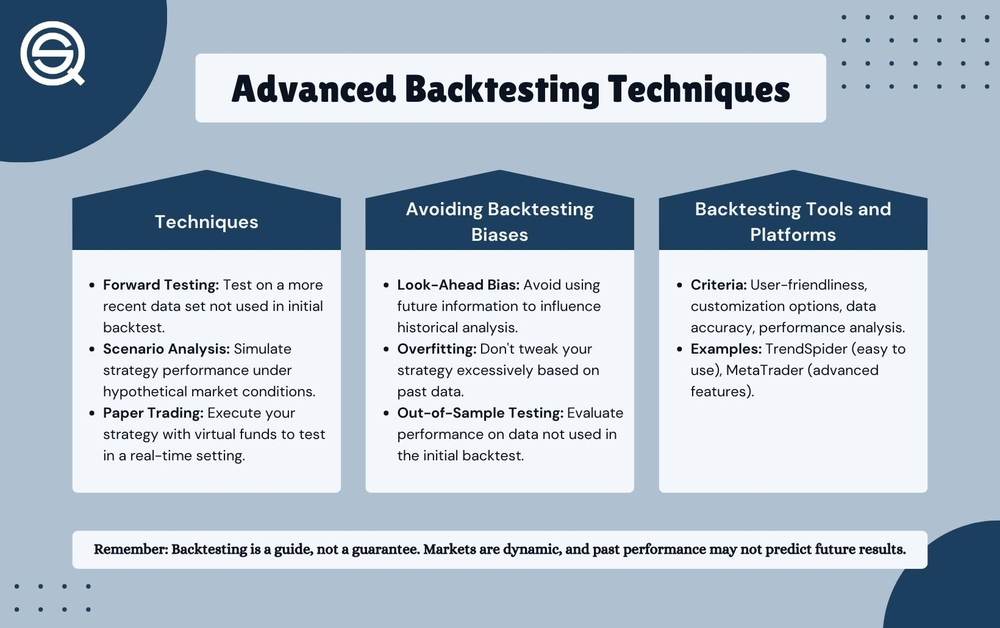

## Table of Contents

## What is backtesting and why is it important in trading and investing?

Backtesting is when you test a trading or investing strategy using past data. You pretend you are in the past and see how your strategy would have worked. This helps you see if your strategy could have made money or lost money in the past. It's like practicing with a time machine, but instead of changing history, you learn from it.

Backtesting is important because it helps you check if your strategy is good before you use real money. It can show you problems in your strategy that you might not see otherwise. By testing with past data, you can feel more confident that your strategy might work in the future. But remember, past results don't guarantee future success, so always be careful and keep learning.

## How does the backtesting process work step-by-step for beginners?

To start backtesting, first, you need to choose a trading or investing strategy that you want to test. This could be something simple like buying a stock when it goes up by 10% and selling it when it goes down by 5%. Once you have your strategy, you need to find historical data for the stocks, currencies, or other assets you want to test it on. You can usually get this data from financial websites or special software made for backtesting. After you have your data, you'll need to use a backtesting tool or software. There are many free and paid options available online, like TradingView or MetaTrader, which can help you run your tests.

Once you have your strategy, data, and tool ready, you can start the backtesting process. You'll input your strategy into the software and let it run through the historical data. The software will pretend to buy and sell based on your strategy and keep track of how much money you would have made or lost. After the test is done, you'll get a report showing how well your strategy worked. Look at things like how much money you made (or lost), how often you were right, and how big your wins and losses were. If your strategy didn't work well, you might need to change it and test it again until you find something that works better. Remember, backtesting is a way to practice and improve, so don't be afraid to try different things.

## What are the basic tools and platforms available for backtesting?

There are several basic tools and platforms that beginners can use for backtesting. One popular option is TradingView, which is a web-based platform that lets you write and test your trading strategies using a simple coding language called Pine Script. It's free to use and has a lot of historical data for different markets like stocks, forex, and cryptocurrencies. Another option is MetaTrader, which is widely used for forex trading. MetaTrader 4 and 5 come with a built-in strategy tester where you can write your strategies in MQL4 or MQL5 languages and test them on past data.

Another tool you might find useful is Amibroker, which is a powerful software used by many traders for backtesting and analysis. It's not free, but it's known for its speed and ability to handle large amounts of data. For those who prefer to use spreadsheets, Microsoft Excel can also be used for backtesting, though it might take more work to set up and may not be as fast as specialized software. There are also online platforms like Quantopian and Backtrader that allow you to backtest using Python, which can be a good option if you're interested in learning to code.

Choosing the right tool depends on what you're comfortable with and what kind of trading you want to do. If you're just starting out, a free and user-friendly platform like TradingView might be the best place to begin. As you get more experienced, you might want to try more advanced tools like Amibroker or even write your own code in Python.

## What data is required for effective backtesting and where can it be sourced?

For effective backtesting, you need historical price data for the assets you want to test your strategy on. This data should include open, high, low, and close prices, as well as volume information. Depending on your strategy, you might also need data on dividends, splits, and other corporate actions. The quality and completeness of this data are important because any gaps or errors can affect your backtesting results and lead to false conclusions about your strategy's performance.

You can source this data from various places. Many financial websites like Yahoo Finance and Google Finance offer free historical data for stocks and other assets. Specialized platforms like TradingView and MetaTrader also provide access to historical data, often with more detailed information and for a wider range of markets. If you need more specific or high-quality data, you might have to pay for it from data providers like Quandl or Bloomberg. Always make sure to check the data's accuracy and completeness before using it for backtesting.

## How can one avoid common pitfalls like overfitting when backtesting strategies?

Overfitting is a big problem in backtesting where your strategy works perfectly on past data but fails in real life. It happens when you make your strategy too complicated, trying to fit every little detail of the past data. To avoid overfitting, keep your strategy simple. Don't use too many rules or conditions. Instead of trying to make your strategy fit every tiny move in the past, focus on the big ideas that you think will work over time. Also, always test your strategy on different time periods and different markets. If it only works on one specific time or market, it might be overfitting.

Another way to avoid overfitting is to use out-of-sample testing. This means you set aside some of your historical data and don't use it when you're creating your strategy. After you've made your strategy, you test it on this out-of-sample data. If it still works well, it's a good sign that your strategy isn't just fitting the data you used to make it. Remember, the goal is to create a strategy that works well in the future, not just one that looks good on past data. So, always keep things simple and test in different ways to make sure your strategy is strong and reliable.

## What are the key performance metrics to look at during backtesting?

When you're backtesting a trading or investing strategy, you need to look at some key performance metrics to see how well it works. One important metric is the total return, which shows how much money you would have made or lost if you used your strategy in the past. Another key metric is the Sharpe Ratio, which helps you understand how much extra return you're getting for the risk you're taking. A higher Sharpe Ratio is usually better because it means you're getting more return for less risk. You should also look at the drawdown, which is the biggest drop in your account value from its highest point. A smaller drawdown is better because it means your strategy isn't losing too much money at any one time.

Another important metric is the win rate, which tells you how often your strategy makes money on a trade. A high win rate is good, but you also need to look at the average win and the average loss. If your wins are much bigger than your losses, you might still do well even if your win rate isn't that high. The profit factor is also useful; it's the total of all your winning trades divided by the total of all your losing trades. A profit factor above 1 means you're making more money than you're losing. Lastly, consider the number of trades your strategy makes. Too many trades can mean more costs from fees, while too few trades might not give you enough chances to make money.

## How do transaction costs and slippage impact backtesting results?

Transaction costs and slippage can really change how your backtesting results look. Transaction costs are the fees you pay every time you buy or sell something. If your strategy trades a lot, these costs can add up and eat into your profits. Slippage happens when the price you want to trade at isn't the price you actually get. This can happen because markets move fast or because there aren't enough buyers or sellers at your price. Both of these things can make your strategy look better in backtesting than it would in real life.

To get a more realistic picture, you should include these costs in your backtesting. Many backtesting tools let you add in transaction costs and slippage. By doing this, you can see if your strategy still makes money after these costs. If it doesn't, you might need to change your strategy to trade less often or find a way to reduce these costs. This way, you'll have a better idea of how your strategy might work in the real world.

## What are the limitations of backtesting in predicting future performance?

Backtesting is a great tool to see how a trading strategy might have worked in the past, but it's not perfect for predicting the future. One big reason is that markets change over time. What worked well in the past might not work the same way in the future because of new laws, big world events, or changes in how people trade. Also, backtesting usually doesn't account for real-world problems like not being able to buy or sell at the exact price you want, or the emotions you feel when you're actually trading with real money.

Another limitation is that backtesting can make your strategy look better than it really is if you're not careful. This is called overfitting, where you make your strategy fit the past data so well that it won't work in the future. You might also miss out on important things like transaction costs or the time it takes to make a trade. These can eat into your profits in real life. So, while backtesting is a useful practice tool, it's important to remember it's just one part of figuring out if a strategy will work in the future.

## How can advanced statistical methods enhance the reliability of backtesting?

Advanced statistical methods can make backtesting more reliable by helping you understand if your strategy's success is real or just by chance. One way to do this is by using something called statistical significance tests. These tests help you see if the profits you made in backtesting are likely to happen again in the future or if they were just a lucky fluke. Another useful method is called walk-forward optimization, where you test your strategy on different time periods to make sure it works well over time, not just in one specific period. This helps you avoid overfitting, where your strategy fits the past data too perfectly but doesn't work in the future.

You can also use something called Monte Carlo simulations to make your backtesting more realistic. This method runs your strategy many times with slightly different starting conditions to see how it might perform under different scenarios. It helps you understand how sensitive your strategy is to small changes in the market. By using these advanced statistical methods, you can get a better idea of how your strategy might perform in real life, making your backtesting results more trustworthy and useful for making decisions about your trading or investing strategy.

## What role does out-of-sample testing play in validating backtesting results?

Out-of-sample testing is a really important part of making sure your backtesting results are trustworthy. When you do backtesting, you use past data to see how your trading or investing strategy would have worked. But if you use all of your data to create the strategy, it might just fit that specific data too well, which is called overfitting. Out-of-sample testing helps you avoid this problem. You set aside some of your data and don't use it when you're making your strategy. Then, after you've made your strategy, you test it on this out-of-sample data to see if it still works well. If it does, it's a good sign that your strategy isn't just fitting the data you used to make it.

This kind of testing gives you more confidence that your strategy might work in the future. It's like a final check to see if your strategy can handle new situations that it hasn't seen before. By doing out-of-sample testing, you can see if your strategy is strong enough to work in different market conditions, not just the ones you used to build it. This way, you can be more sure that your backtesting results are a good guide for what might happen when you start using real money.

## How can machine learning be integrated into backtesting for more complex strategies?

Machine learning can make backtesting better by helping you find patterns in data that are hard to see with normal methods. You can use machine learning to create and test trading strategies that change and learn from new data. For example, you can use algorithms like neural networks to look at lots of past data and find out what factors make a good trade. These algorithms can then make predictions about what might happen next in the market. By using machine learning, you can make strategies that adapt to new information and might work better than simple rule-based strategies.

To use machine learning in backtesting, you need to start by getting a lot of good data. This data should include prices, volumes, and maybe even news or social media information. Then, you can split this data into training and testing sets. You use the training data to teach your machine learning model what to look for. After that, you test the model on the testing data to see if it can make good predictions. If it does well, you can use the model to backtest your strategy and see how it would have done in the past. Remember, even with machine learning, you should still use out-of-sample testing to make sure your strategy isn't just fitting the data you used to train it.

## What are the latest trends and future directions in backtesting methodologies?

The latest trends in backtesting methodologies are focusing more on using advanced technology like machine learning and artificial intelligence. These tools help traders and investors find patterns in big data sets that they might miss otherwise. For example, machine learning can look at lots of different information, like stock prices, news, and even social media, to make better predictions about the market. Another trend is using cloud computing to do backtesting faster and with more data. This means you can test your strategies on huge amounts of data quickly, which can give you a better idea of how they might work in different situations.

In the future, backtesting is likely to become even more advanced and personalized. We might see more use of real-time data and simulations that can change as new information comes in. This could help traders test their strategies in a way that feels more like real life. Also, there might be more focus on making backtesting tools easier to use for everyone, not just experts. This could mean more user-friendly software and better ways to understand and use the results of backtesting. Overall, the goal is to make backtesting more accurate and helpful for making smart trading and investing decisions.

## What is the Role of Financial Analysis?

Financial analysis is a critical component for evaluating a company's financial health and growth potential. It encompasses several key elements, including ratio analysis, trend analysis, and cash flow analysis, each of which provides unique insights into a firm's operations and future prospects.

**Ratio Analysis**

Ratio analysis involves calculating and interpreting various financial ratios from a company's financial statements. These ratios help stakeholders assess different aspects of financial performance, such as profitability, [liquidity](/wiki/liquidity-risk-premium), efficiency, and solvency. Commonly used ratios include:

- **Profitability Ratios:** These measure a company's ability to generate profit relative to its revenue, assets, or equity. Key profitability ratios include the Gross Profit Margin, Operating Margin, and Return on Equity (ROE).
$$
  \text{Return on Equity (ROE)} = \frac{\text{Net Income}}{\text{Shareholder's Equity}}

$$

- **Liquidity Ratios:** These assess a firm's capacity to meet short-term obligations. Examples are the Current Ratio and Quick Ratio.
$$
  \text{Current Ratio} = \frac{\text{Current Assets}}{\text{Current Liabilities}}

$$

- **Efficiency Ratios:** These indicate how effectively a company utilizes its assets and liabilities to generate sales and maximize profits. Examples include the Inventory Turnover and Receivables Turnover.

- **Solvency Ratios:** These examine a company's long-term stability and ability to sustain operations. The Debt to Equity Ratio is a prominent solvency measure.
$$
  \text{Debt to Equity Ratio} = \frac{\text{Total Debt}}{\text{Shareholder's Equity}}

$$

**Trend Analysis**

Trend analysis involves examining financial statements over multiple periods to identify patterns or trends in financial performance. By evaluating metrics such as revenue growth, expense patterns, and changes in net income, investors can predict future financial performance and identify potential areas of concern or opportunity.

**Cash Flow Analysis**

Cash flow analysis provides insights into the actual cash generated and used by a company during a specific period. The cash flow statement is divided into three sections: operating, investing, and financing activities. Understanding cash flow is vital as it reflects a company's liquidity and its ability to fund operations, repay debts, and return value to shareholders.

- **Operating Cash Flows:** Cash generated from regular business operations, indicating whether a company can generate sufficient cash to maintain and grow its operations.
- **Investing Cash Flows:** Shows cash used or generated from investment activities, such as the purchase or sale of assets.
- **Financing Cash Flows:** Reflects the cash flow from financing activities, such as issuing dividends, repaying debt, or issuing stock.

**Applications in Investment Strategy**

Financial analysis is instrumental in making well-informed decisions about stock selection and portfolio management. By utilizing ratio, trend, and cash flow analysis, investors can undertake a thorough assessment of potential investments, ensuring alignment with financial goals and risk tolerance.

Moreover, financial analysis serves as an essential tool in developing and refining investment strategies. It provides a solid foundation on which backtesting and [algorithmic trading](/wiki/algorithmic-trading) strategies can be built. Accurate analysis ensures that input data and assumptions are reliable, which is crucial for simulating past performance and predicting future outcomes using backtesting and algo trading techniques.

In summary, conducting thorough financial analysis enables investors to make data-driven decisions, optimize investment strategies, and enhance the precision of backtesting and algorithmic trading approaches.

## What is Backtesting?

Backtesting is a fundamental technique in modern finance that involves evaluating the performance of an investment strategy using historical data. This method allows investors to gain insights into how a strategy would have fared under past market conditions, thus providing a basis for forecasting potential future performance.

The process of backtesting begins by defining a set of rules or a strategy that will be tested against historical data. This strategy could range from simple trading rules, such as moving average crossovers, to more complex algorithmic trading strategies. By simulating the application of this strategy over historical data, investors can assess various metrics such as returns, [volatility](/wiki/volatility-trading-strategies), and drawdowns.

**Returns** are calculated to determine the profitability of the strategy. These returns can be expressed as a percentage of the initial investment or converted into annualized returns for easier comparison with alternative investments. For instance, if an investment grows from $1000 to $1,100 over a year, the annual return is 10%.

**Volatility** measures the degree of variation in the strategy's returns over time and is often expressed as the standard deviation of the returns. Lower volatility is preferred as it indicates more stable returns, while higher volatility suggests greater risk and potential for significant fluctuations in the value of the investment.

**Drawdowns**, on the other hand, represent the decline from a historical peak in the value of an investment strategy, indicating the potential risk of loss. A drawdown is calculated as:

$$
\text{Drawdown} = \frac{\text{Peak Value} - \text{Trough Value}}{\text{Peak Value}}
$$

These metrics collectively provide a comprehensive view of the strategy's potential effectiveness and associated risks. For example, a strategy with high returns but also high volatility and drawdown may be riskier compared to a strategy with moderate returns and lower volatility and drawdown.

Backtesting serves a critical role in strategy refinement. By analyzing the historical performance, investors can adjust their strategies to enhance profitability and reduce risk. For example, if a backtested strategy shows high drawdowns, an investor might refine the strategy to include stop-loss mechanisms or adjust position sizes to mitigate potential losses.

Investors and statisticians often use programming languages such as Python to automate backtesting processes, leveraging libraries like pandas for data manipulation and [backtrader](/wiki/backtrader) for executing backtests. A simple example in Python might look like this:

```python
import pandas as pd
import numpy as np

# Load historical data
data = pd.read_csv('historical_data.csv', parse_dates=True, index_col='Date')

# Define a simple moving average strategy
data['SMA10'] = data['Close'].rolling(window=10).mean()
data['SMA50'] = data['Close'].rolling(window=50).mean()

# Generate signals
data['Signal'] = 0
data.loc[data['SMA10'] > data['SMA50'], 'Signal'] = 1
data.loc[data['SMA10'] < data['SMA50'], 'Signal'] = -1

# Calculate returns
data['Strategy_Returns'] = data['Signal'].shift(1) * data['Close'].pct_change()

# Cumulative returns
data['Cumulative_Returns'] = (1 + data['Strategy_Returns']).cumprod()

# Display results
print(data[['Close', 'SMA10', 'SMA50', 'Signal', 'Cumulative_Returns']])
```

In conclusion, backtesting is an indispensable tool enabling investors to test and refine strategies against historical performance, providing critical insights that help optimize strategies before their real-world application. However, while backtesting offers significant benefits, it is essential to recognize that past performance is not always indicative of future results, and strategies should be continuously reevaluated as market conditions change.

## References & Further Reading

[1]: Cochrane, J. H. (2005). ["Asset Pricing."](https://www.johnhcochrane.com/asset-pricing) Princeton University Press.

[2]: Hull, J. C. (2017). ["Options, Futures, and Other Derivatives."](https://www.semanticscholar.org/paper/Options%2C-Futures%2C-and-Other-Derivatives-Hull/89bdee500c8623864fc9eb7a471546aa713acc44) Pearson Education.

[3]: Murphy, J. J. (1999). ["Technical Analysis of the Financial Markets: A Comprehensive Guide to Trading Methods and Applications."](https://archive.org/details/technicalanalysi0000murp) New York Institute of Finance.

[4]: Pardo, R. (2008). ["The Evaluation and Optimization of Trading Strategies."](https://onlinelibrary.wiley.com/doi/book/10.1002/9781119196969) Wiley.

[5]: Tucker Balch, M. (2012). ["Computational Investing, Part I."](https://www.youtube.com/watch?v=UJMTXaXyuxA) Georgia Tech (MOOC on Coursera).

[6]: Vidyamurthy, G. (2004). ["Pairs Trading: Quantitative Methods and Analysis."](https://archive.org/details/pairstradingquan0000vidy) Wiley Finance.