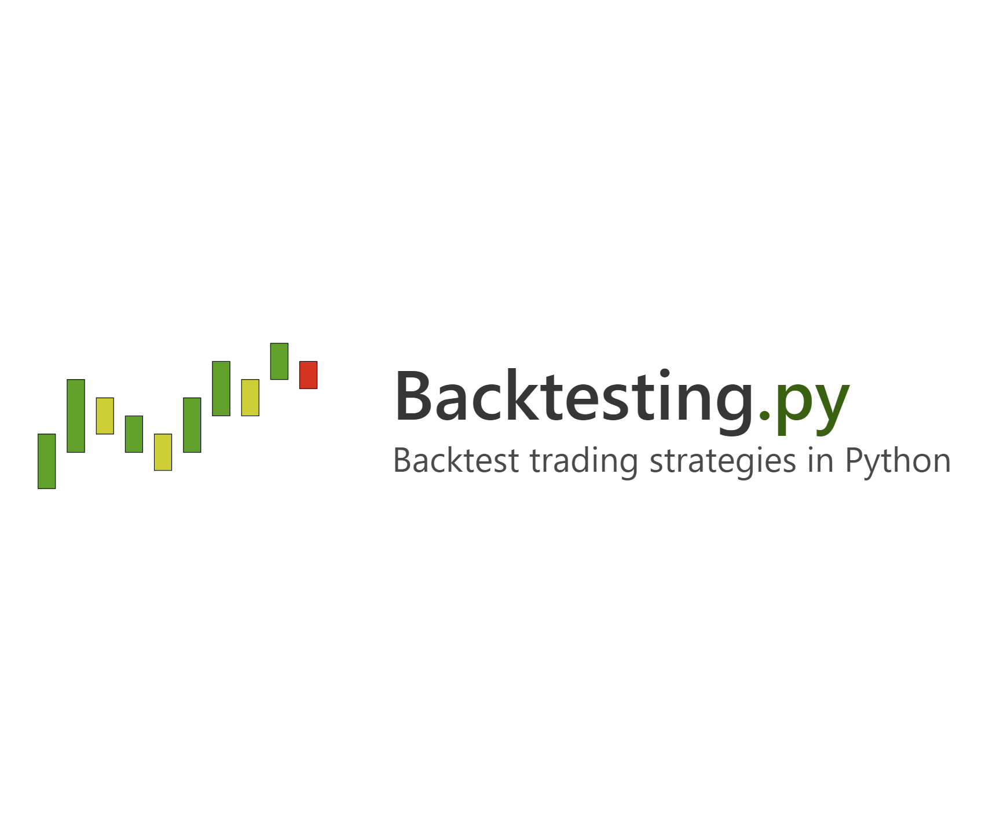

## Table of Contents

## What is Backtesting.py and why is it useful for traders?

Backtesting.py is a Python library that helps traders test their trading strategies using past market data. It lets you see how your strategy would have worked in the past, without risking real money. You can use it to check if your ideas about buying and selling would have made you money or not. It's like a time machine for trading, where you can go back and see what would have happened if you followed your plan.

This tool is very useful for traders because it helps them improve their strategies before using them in the real market. By testing with old data, traders can find mistakes and make their plans better. It also saves time and money because they don't have to guess or try things in the real market that might not work. Using Backtesting.py, traders can feel more confident that their strategies have a good chance of working when they start trading for real.

## How do you install Backtesting.py?

To install Backtesting.py, you need to use a command in your computer's terminal or command prompt. The command you type is "pip install backtesting". Pip is a tool that helps you add new software to Python, and it will download and set up Backtesting.py for you. Make sure you have Python installed on your computer first, because Backtesting.py needs Python to work.

Once you've typed the command and pressed enter, pip will start working. It might take a little time, depending on your internet speed. You'll see some messages on the screen as it downloads and installs the library. When it's done, you won't see any more messages, and Backtesting.py will be ready to use in your Python projects. If you see an error, it might mean you need to update pip or check your internet connection.

## What are the basic components of a Backtesting.py script?

A Backtesting.py script has a few important parts that work together to test a trading strategy. First, there's the data part. This is where you tell the script which past market data to use for the test. You need to load this data into the script so it knows what prices and other information to look at. Next, there's the strategy part. This is where you write down the rules for buying and selling. You tell the script things like when to buy, when to sell, and how much to buy or sell. This part is really important because it's the heart of your trading plan.

Then, there's the [backtesting](/wiki/backtesting) part. This is where the script actually runs your strategy on the past data. It goes through the data day by day or minute by minute, following your rules to see what would have happened. After that, there's the analysis part. Here, the script shows you the results. It tells you things like how much money you would have made or lost, and other useful numbers that help you understand if your strategy worked well. All these parts together help you see if your trading ideas are good without risking real money.

## How do you set up a simple trading strategy using Backtesting.py?

To set up a simple trading strategy using Backtesting.py, you first need to import the library and load some past market data. You can use the `pandas` library to read in data from a CSV file or another source. Once you have the data, you create a `Strategy` class. This class will have a method called `init`, where you set up any indicators or variables you need for your strategy. For example, you might use a moving average to help decide when to buy or sell. In the `init` method, you would create this moving average using the data you loaded.

Next, you need to define the `next` method in your `Strategy` class. This method tells the script what to do at each step of the backtest. You write rules here, like if the price goes above the moving average, then buy, or if it goes below, then sell. After setting up your strategy, you create a `Backtest` object, passing in your data and your strategy class. Then, you run the backtest using the `run` method of the `Backtest` object. This will go through all the data and follow your rules to see how your strategy would have worked. After it finishes, you can look at the results to see if your strategy made money or not.

## What types of data can be used with Backtesting.py for backtesting?

Backtesting.py can work with different types of data, like stock prices, [forex](/wiki/forex-system) rates, and [cryptocurrency](/wiki/cryptocurrency) values. You can use data that shows how prices changed over time, like daily or hourly prices. This data usually has columns for things like the opening price, highest price, lowest price, and closing price of a trading period. You can get this data from places like Yahoo Finance, which gives you free stock data, or from paid services that might give you more detailed information.

The data you use needs to be in a format that Backtesting.py can understand, like a pandas DataFrame. This means you might need to change the data a bit before you can use it. You can also add other information to your data, like trading volumes or technical indicators, if you think they will help your strategy. The main thing is that your data should have enough history so you can see how your trading ideas would have worked over a long time.

## How do you evaluate the performance of a strategy in Backtesting.py?

To evaluate the performance of a strategy in Backtesting.py, you look at the results after running the backtest. The script gives you numbers that tell you how well your strategy did. One important number is the total profit or loss, which shows if you made money or lost money overall. Another number is the return, which tells you how much your money grew over time. You also get to see the Sharpe Ratio, which tells you how good your returns are compared to the risk you took. A higher Sharpe Ratio means your strategy did better for the risk it took.

Besides these numbers, you can also look at charts and graphs that Backtesting.py makes. These visuals help you see how your strategy performed over time. You might see a chart that shows your money growing or shrinking as the backtest goes on. There are also graphs that show when you bought and sold, and how those decisions affected your results. By looking at all this information together, you can decide if your strategy is good enough to use in real trading or if you need to make some changes to improve it.

## What are common pitfalls to avoid when using Backtesting.py?

One common mistake when using Backtesting.py is overfitting your strategy. This happens when you make your trading rules too complicated, trying to fit every little detail in the past data. Your strategy might look perfect on the old data, but it won't work well in the real market because it's too specific to the past. To avoid this, keep your strategy simple and test it on different sets of data to make sure it works in different situations.

Another pitfall is not accounting for transaction costs and slippage. When you backtest, it's easy to forget about the fees you pay for buying and selling, or the small differences between the price you want and the price you actually get. These can add up and make your strategy less profitable than it looks on paper. Always include these costs in your backtest to get a more realistic picture of how your strategy will perform in the real world.

Lastly, be careful about data quality and time periods. If your data has mistakes or gaps, your backtest results won't be accurate. Also, if you only test your strategy on a short period or a very specific time, it might not work well in other times. Use good, clean data and test over long, varied time periods to make sure your strategy is strong and reliable.

## How can you optimize a trading strategy using Backtesting.py?

To optimize a trading strategy using Backtesting.py, you need to try different versions of your strategy to see which one works best. You can change things like the rules for buying and selling, or the numbers you use in your strategy. For example, if you use a moving average, you can test different lengths of time for it. Backtesting.py lets you run many tests quickly, so you can see how small changes affect your results. You might find that a small change makes a big difference in how much money you make or lose.

After you run these tests, you need to look at the results carefully. Backtesting.py gives you numbers like total profit, return, and the Sharpe Ratio, which tell you how well each version of your strategy did. Look for the version that gives you the best balance of making money and taking risk. But remember, just because a strategy worked well in the past doesn't mean it will work in the future. So, after you find a good version, test it on different sets of data to make sure it's strong and not just lucky.

## What advanced features does Backtesting.py offer for experienced users?

Backtesting.py has some cool features for people who know a lot about trading. One of these is the ability to use genetic algorithms to find the best settings for your strategy. This means the computer can try thousands of different combinations of numbers and rules to see which ones work the best. It's like having a smart helper that tries to make your strategy as good as possible without you having to do all the work yourself.

Another advanced feature is the ability to use different types of data at the same time. You can mix stock prices with other information like trading volumes or even news events to make your strategy smarter. Backtesting.py also lets you test your strategy in a way that's closer to real trading by including things like slippage and transaction costs. This helps you see if your strategy will really work when you use it with real money.

## How do you integrate external data sources into Backtesting.py?

To use data from other places with Backtesting.py, you first need to get that data into a format the library can understand. This usually means turning your data into a pandas DataFrame, which is like a table that Backtesting.py can read. You can get data from places like Yahoo Finance, which gives you stock prices for free, or from paid services that might have more detailed info. Once you have the data, you might need to clean it up a bit, making sure there are no mistakes or missing parts. After that, you can load it into Backtesting.py to use in your strategy tests.

Backtesting.py lets you mix different kinds of data together. For example, you can use stock prices along with trading volumes or even news events to make your strategy smarter. To do this, you just need to add these extra pieces of data to your DataFrame before you start the backtest. This way, your strategy can use all this information to make better decisions about when to buy or sell. By using more data, you can make your trading plan more detailed and possibly more successful.

## How can you use Backtesting.py to simulate real-time trading scenarios?

Backtesting.py can help you see how your trading strategy would work in real time by letting you add things like slippage and transaction costs to your tests. Slippage is when the price you want to buy or sell at isn't the same as the price you actually get. Transaction costs are the fees you pay for buying and selling. By including these, your backtest will be closer to what happens in real trading, so you can see if your strategy will still make money even with these extra costs.

You can also make your backtest more realistic by using data that comes in bit by bit, just like it does in real trading. Instead of looking at all the data at once, you can set up Backtesting.py to go through the data step by step, pretending it's happening in real time. This way, you can see how your strategy reacts to new information as it comes in, which is a lot like what happens when you're trading for real. By doing this, you get a better idea of how your strategy will perform in the actual market.

## What are the best practices for validating backtest results in Backtesting.py?

When you use Backtesting.py to test your trading ideas, it's important to make sure the results you get are good and trustworthy. One way to do this is by using different sets of data to test your strategy. If your strategy works well on different kinds of data from different times, it's more likely to be a good strategy for real trading. Also, you should always include things like fees and slippage in your tests. These are the extra costs you pay when you buy or sell, and they can change how much money your strategy makes. If you forget these, your results might look better than they really are.

Another good practice is to keep your strategy simple. If you make it too complicated, it might work perfectly on the data you used for the test, but it won't work well in the real market. This is called overfitting, and it's a big problem. So, always try to keep your rules easy to understand and test them on different data to make sure they're strong. Lastly, don't just look at how much money your strategy made. Look at other numbers too, like the Sharpe Ratio, which tells you how good your returns are compared to the risk you took. A good strategy should make money without taking too much risk.

## References & Further Reading

[1]: Bergstra, J., Bardenet, R., Bengio, Y., & Kégl, B. (2011). ["Algorithms for Hyper-Parameter Optimization."](https://papers.nips.cc/paper/4443-algorithms-for-hyper-parameter-optimization) Advances in Neural Information Processing Systems 24.

[2]: ["Advances in Financial Machine Learning"](https://www.amazon.com/Advances-Financial-Machine-Learning-Marcos/dp/1119482089) by Marcos Lopez de Prado

[3]: ["Evidence-Based Technical Analysis: Applying the Scientific Method and Statistical Inference to Trading Signals"](https://www.amazon.com/Evidence-Based-Technical-Analysis-Scientific-Statistical/dp/0470008741) by David Aronson

[4]: ["Machine Learning for Algorithmic Trading"](https://github.com/stefan-jansen/machine-learning-for-trading) by Stefan Jansen

[5]: ["Quantitative Trading: How to Build Your Own Algorithmic Trading Business"](https://books.google.com/books/about/Quantitative_Trading.html?id=j70yEAAAQBAJ) by Ernest P. Chan

[6]: ["Python for Algorithmic Trading: From Idea to Cloud Deployment"](https://www.amazon.com/Python-Algorithmic-Trading-Cloud-Deployment/dp/149205335X) by Yves Hilpisch

[7]: ["Python for Data Analysis"](https://wesmckinney.com/book/) by Wes McKinney

[8]: Fama, E. F., & French, K. R. (1992). ["The Cross‐Section of Expected Stock Returns."](https://www.jstor.org/stable/2329112) Journal of Finance, 47(2), 427-465.

[9]: Pojarliev, M., & Levich, R. M. (2010). ["Detecting Crowded Trades in Currency Funds."](https://www.nber.org/papers/w15698) Financial Analysts Journal, 66(2), 26-39.