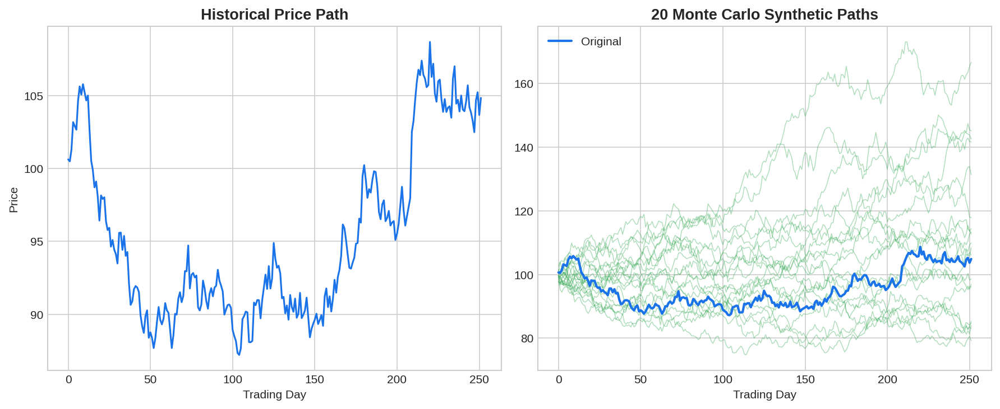
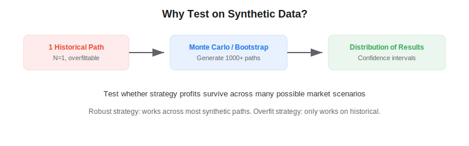

Backtesting on synthetic data is a technique for validating trading strategies by testing them across many artificially generated market scenarios rather than relying on a single historical path. Lopez de Prado (2018) argues that historical backtesting is inherently limited because we only observe one realization of market history — and strategies that work on that single path may fail on the infinitely many paths that could have occurred but didn't. Synthetic data testing addresses this by generating thousands of plausible market paths and measuring how consistently a strategy performs.

## The Single-Path Problem

A standard backtest evaluates a strategy on one historical price series. But this one path includes specific events (COVID crash, dot-com bubble, etc.) that may not recur. A strategy optimized for this path may be exploiting idiosyncratic features rather than genuine market dynamics. Synthetic data breaks this dependency.



## Methods for Generating Synthetic Data

### Monte Carlo Simulation

The simplest approach: estimate the return distribution (mean, volatility, and optionally skewness and kurtosis) from historical data, then generate new paths:

$$r_t^{(s)} \sim \mathcal{N}(\hat{\mu}, \hat{\sigma}^2) \quad \text{or} \quad r_t^{(s)} \sim \text{StudentT}(\hat{\nu}, \hat{\mu}, \hat{\sigma})$$

This preserves marginal distribution properties but destroys temporal dependencies.

### Block Bootstrap

Resample blocks of consecutive returns (preserving local serial correlation) with replacement:

$$\text{Path}^{(s)} = [\text{Block}_{i_1}, \text{Block}_{i_2}, \ldots, \text{Block}_{i_K}]$$

Block length is typically 5–20 bars. This preserves short-range dependencies while randomizing the sequence of regimes.

### Correlated Multi-Asset Simulation

For portfolio strategies, generate synthetic returns that preserve the cross-sectional correlation structure using the Cholesky decomposition of the covariance matrix.



## Python Implementation

```python
import numpy as np
import pandas as pd

def monte_carlo_paths(returns, n_paths=1000, path_length=None):
    if path_length is None:
        path_length = len(returns)
    mu = returns.mean()
    sigma = returns.std()
    paths = np.random.normal(mu, sigma, (n_paths, path_length))
    price_paths = 100 * np.cumprod(1 + paths, axis=1)
    return price_paths

def block_bootstrap_paths(returns, n_paths=1000, block_size=10):
    n = len(returns)
    paths = []
    for _ in range(n_paths):
        blocks = []
        while len(blocks) * block_size < n:
            start = np.random.randint(0, n - block_size)
            blocks.append(returns.values[start:start + block_size])
        path = np.concatenate(blocks)[:n]
        paths.append(100 * np.cumprod(1 + path))
    return np.array(paths)

def evaluate_strategy_on_synthetic(strategy_func, returns, n_paths=500):
    paths = monte_carlo_paths(returns, n_paths)
    sharpes = []
    for path in paths:
        path_returns = np.diff(path) / path[:-1]
        sr = strategy_func(pd.Series(path_returns))
        sharpes.append(sr)
    sharpes = np.array(sharpes)
    print(f"Mean SR: {sharpes.mean():.2f}, Std: {sharpes.std():.2f}")
    print(f"P(SR > 0): {(sharpes > 0).mean():.1%}")
    print(f"5th percentile SR: {np.percentile(sharpes, 5):.2f}")
    return sharpes
```

## Key Parameters

| Parameter | Typical Value | Effect |
|---|---|---|
| Number of paths | 500–10,000 | More paths = smoother distribution |
| Block size (bootstrap) | 5–20 bars | Preserves short-term autocorrelation |
| Distribution | Normal or Student-t | Student-t captures fat tails |

## Limitations and Risks

Synthetic data inherits the assumptions of the generation model. Monte Carlo with normal returns misses fat tails and volatility clustering; block bootstrap misses long-range dependencies. The most robust approach combines multiple generation methods and checks that strategy performance is consistent across all of them. Synthetic data should complement, not replace, historical backtesting.

## Conclusion

Testing on synthetic data turns a single-point backtest into a distribution of outcomes. A strategy that works on 90% of synthetic paths is far more trustworthy than one that works only on historical data. Combined with the [deflated Sharpe ratio](https://paperswithbacktest.com/wiki/deflated-sharpe-ratio) and [CPCV](https://paperswithbacktest.com/wiki/combinatorial-purged-cross-validation-cpcv), synthetic data testing completes the anti-overfitting toolkit for [systematic trading](https://paperswithbacktest.com/wiki/systematic-trading-strategies).

---

**Explore further on PapersWithBacktest:**
- Browse [backtested strategies](https://paperswithbacktest.com/strategies) with Python code and performance metrics
- Access [clean historical market data](https://paperswithbacktest.com/datasets) for equities, crypto, and futures
- Take the [algo trading course](https://paperswithbacktest.com/course) — 60+ video lessons and notebooks
- Related wiki pages: [Backtesting Pitfalls](https://paperswithbacktest.com/wiki/backtesting-pitfalls-overfitting) · [Deflated Sharpe Ratio](https://paperswithbacktest.com/wiki/deflated-sharpe-ratio) · [Walk-Forward Optimization](https://paperswithbacktest.com/wiki/walk-forward-optimization)
