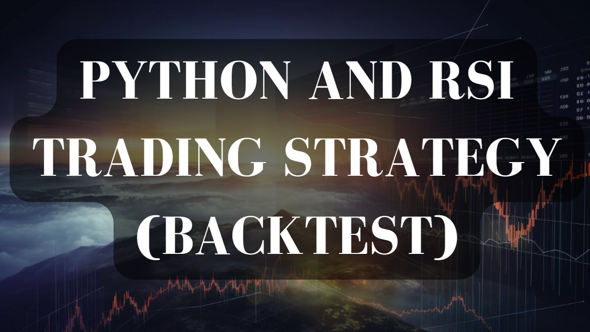

Algorithmic trading has transformed the landscape of financial markets. It allows traders and institutions to leverage automation and data-driven strategies to capitalize on market inefficiencies. Central to this transformation is backtesting, a process that evaluates the viability of trading strategies against historical data. This process involves simulating a strategy's performance over time, enabling traders to carefully analyze and refine their approaches before exposing capital in live markets.

Backtesting serves as a risk management tool by providing insights into a strategy's potential performance. It helps traders optimize strategy parameters and avoid potential losses due to unforeseen market conditions. The importance of backtesting in algorithmic trading cannot be understated, as it allows for a systematic approach to strategy validation and improvement.



Python has gained significant traction as a preferred programming language for backtesting due to its blend of simplicity and power. Its rich ecosystem of libraries, such as Pandas and NumPy, alongside specialized backtesting tools like PyAlgoTrade, Backtrader, and Zipline, offer comprehensive functionalities for traders. Python's flexibility and ease of use make it accessible for both professional and retail traders, facilitating the development and testing of complex trading algorithms.

This article examines the integration of Python in the backtesting process, exploring its advantages and providing practical examples of its application in algorithmic trading. Through this exploration, traders can gain insights into how Python can enhance their trading strategies by enabling robust and reliable backtest outcomes.

## Table of Contents

## Understanding Backtesting in Algorithmic Trading

Backtesting is a critical process in algorithmic trading that serves to evaluate the potential effectiveness and robustness of a trading strategy before it is applied in live markets. At its core, backtesting involves simulating a trading strategy's performance using historical data. This simulation helps traders assess how a strategy might have performed in the past, given the known price movements and market conditions. 

The importance of backtesting lies in its ability to provide insights into a strategy’s viability by analyzing historical performance. It allows traders to understand whether a particular strategy is likely to be profitable and helps identify potential pitfalls that could arise in real trading scenarios. Renowned for its ability to support data-driven decisions, backtesting enables traders to validate theories and refine strategic components such as entry and exit signals, position sizing, and risk management rules.

The process involves running the strategy on historical price data to observe outcomes such as total return, maximum drawdown, and the Sharpe ratio. By doing so, traders can refine their strategy parameters to optimize performance metrics and mitigate risk. For example, a trader may use [backtesting](/wiki/backtesting) to adjust stop-loss levels or to determine the optimal conditions for opening a long position.

A vital aspect of backtesting is the prevention of potential losses in live trading. Without backtesting, traders risk deploying strategies that are either poorly suited to current market conditions or overly complex, leading to increased susceptibility to market [volatility](/wiki/volatility-trading-strategies). By detecting issues in the backtest phase, traders can avoid significant financial losses and make necessary adjustments before capital is at risk.

Moreover, backtesting helps highlight overfitting—a situation where a strategy performs well on historical data but fails to generalize to new, unseen data. By iterating and refining parameters based on backtest results, traders can ensure that the strategy maintains a balance between complexity and simplicity, avoiding the dangers of overfitting and achieving a more generalized strategy suitable for future market conditions.

In conclusion, backtesting is an indispensable tool in [algorithmic trading](/wiki/algorithmic-trading). It provides a systematic method for evaluating and refining trading strategies using real historical data, enhancing their effectiveness and reducing the risk of financial losses in live environments. By establishing a strong foundation through backtesting, traders can gain confidence in their strategies and ensure readiness for the unpredictable nature of financial markets.

## Why Python for Backtesting?

Python has gained significant traction in the financial markets as a preferred language for backtesting, largely due to its robust ecosystem, ease of use, and versatility. These attributes make it an ideal choice for both seasoned financial professionals and amateur traders venturing into algorithmic trading.

Python’s comprehensive library ecosystem is instrumental in its popularity for backtesting. At its core are libraries like Pandas and NumPy, which provide efficient data structures and numerical operations essential for handling time-series data crucial in financial analysis. Pandas allows for the manipulation and analysis of structured data, which is foundational when preparing and analyzing historical data for backtesting. NumPy complements this by offering support for large, multi-dimensional arrays and matrices, along with a collection of mathematical functions to operate on these arrays, enhancing computational efficiency.

In addition to these core libraries, Python boasts specialized backtesting tools such as PyAlgoTrade, Backtrader, and Zipline. PyAlgoTrade is designed for simplicity and is efficient for small to medium-sized datasets, making it suitable for retail traders exploring backtesting without extensive resources. Backtrader, in contrast, caters to more advanced needs with its modular architecture and support for various asset classes, providing features like indicators and analyzers that are integral for comprehensive trading strategies. Zipline, backed by Quantopian, offers a robust and feature-rich environment intended for institutional-grade algorithmic trading and simulations, including support for live trading with some brokerage platforms. Each framework, while having unique features, significantly enhances a trader's ability to conduct thorough strategy validation before live deployment.

Python’s inherent flexibility and user-friendly nature further broaden its appeal. Its syntax is clear and readable, making it accessible even to those with limited programming experience. This simplicity does not come at the cost of power; Python is highly extensible and can be integrated with other languages and systems, enabling complex financial models to be implemented and tested with ease. Moreover, Python supports extensive community resources and documentation, providing a rich repository of shared knowledge that users can leverage when developing and refining their strategies.

The combination of Python's versatile libraries, dedicated backtesting platforms, and approachable programming environment underscores why it is favored for algorithmic trading. Python empowers traders to conduct efficient and effective backtesting, ensuring strategies are robust and poised for success in live markets.

## Popular Python Backtesting Frameworks

Python has become a preferred language for backtesting trading strategies due to its robust libraries and frameworks. Among these frameworks, PyAlgoTrade, Backtrader, and Zipline stand out, each offering distinct features and benefits.

### PyAlgoTrade

PyAlgoTrade is a simple yet powerful backtesting framework designed for algorithmic trading. It supports strategies that involve historical data and provides an easy-to-use API that simplifies the development of trading algorithms.

**Features**:
- **Ease of Use**: PyAlgoTrade is known for its straightforward approach, making it suitable for beginners.
- **Event-Driven Architecture**: This allows for efficient real-time trading simulations.
- **Data Handling**: It primarily supports feeds from CSV files and online sources.

**Use Cases**:
- Suitable for retail traders and developers looking for a quick setup.
- Ideal for educational purposes and testing basic trading ideas.

**Supported Asset Classes**:
- Primarily designed for equities and Forex markets.

**Pros**:
- Lightweight and easy to learn.
- Good documentation and community support.

**Cons**:
- Limited in features compared to more advanced frameworks.
- Less efficient with large datasets and complex strategies.

### Backtrader

Backtrader is a versatile and feature-rich backtesting framework popular among traders for its flexibility and extensive capabilities.

**Features**:
- **Multi-Data Support**: Allows for handling multiple data sources simultaneously.
- **Indicators and Strategies Library**: Comes with a range of pre-built indicators and support for custom scripts.
- **Optimization Tools**: Inbuilt features for strategy optimization and parameter tuning.

**Use Cases**:
- Favored by traders and analysts looking for comprehensive backtesting solutions.
- Suitable for complex strategies and strategies requiring multi-timeframe analysis.

**Supported Asset Classes**:
- Supports a wide range of asset classes including equities, Forex, and cryptocurrencies.

**Pros**:
- Highly flexible and customizable.
- Strong community and extensive documentation.

**Cons**:
- Steeper learning curve for beginners.
- Might be overkill for simple backtesting needs.

### Zipline

Zipline, the backtesting engine behind Quantopian (now inactive), is designed for both backtesting and live trading with a focus on accurate simulations.

**Features**:
- **Pipeline Framework**: Facilitates advanced data manipulation and strategy development.
- **Integration with Data Providers**: Supports integration with libraries such as Pandas, making it easier to analyze data.
- **Performance Tracking**: Offers comprehensive tools for performance analysis.

**Use Cases**:
- Ideal for traders and quantitative analysts focusing on technical and fundamental data.
- Used in institutional environments due to its robustness and accuracy.

**Supported Asset Classes**:
- Strong support for equities, with capabilities extended for other asset types through plugins.

**Pros**:
- Professional-grade capabilities.
- Accurate financial calculations and historical data fidelity.

**Cons**:
- Can be resource-intensive.
- Requires a higher level of technical expertise.

Each of these frameworks has its strengths and limitations, and the choice largely depends on the user's specific needs and level of expertise. PyAlgoTrade is suitable for newcomers and simple strategies, Backtrader offers depth and flexibility for more intricate analyses, and Zipline provides a robust platform suited for professional environments.

## How to Perform Backtesting with Python

Setting up a basic backtest with Python involves several key steps, including preparing your development environment, importing necessary libraries, cleansing and importing data, creating a trading strategy, and running the backtest. Below, we'll guide you through each of these steps using the Backtrader framework, which is well-suited for backtesting due to its user-friendliness and powerful features.

### Step 1: Importing Necessary Libraries

Before starting, ensure you have installed Python and the Backtrader library. You can install Backtrader using pip:

```bash
pip install backtrader
```

Here is a basic script to import essential libraries:

```python
import backtrader as bt
import pandas as pd
```

### Step 2: Data Preparation

Data cleansing and preparation are critical for an accurate backtest. Data should be free from errors and formatted correctly. In this example, we use a CSV file containing historical stock data. Here's how to import and clean your data:

```python
data = bt.feeds.YahooFinanceCSVData(
    dataname='path_to_your_csv.csv',
    fromdate=pd.Timestamp(2020, 1, 1),
    todate=pd.Timestamp(2021, 1, 1),
    reverse=False)
```

### Step 3: Strategy Creation

Crafting a trading strategy involves defining entry and [exit](/wiki/exit-strategy) points. For simplicity, consider a moving average crossover strategy where a short-term moving average crosses above a long-term moving average as a buy signal.

```python
class MovingAverageStrategy(bt.Strategy):
    def __init__(self):
        self.sma_short = bt.indicators.SimpleMovingAverage(self.data.close, period=10)
        self.sma_long = bt.indicators.SimpleMovingAverage(self.data.close, period=30)

    def next(self):
        if self.sma_short[0] > self.sma_long[0] and not self.position:
            self.buy()
        elif self.sma_short[0] < self.sma_long[0] and self.position:
            self.sell()
```

### Step 4: Running the Backtest

After setting up your data and strategy, run the backtest using Backtrader's built-in tools. First, you'll create a `Cerebro` engine, add the data and strategy, and execute the backtest.

```python
cerebro = bt.Cerebro()
cerebro.adddata(data)
cerebro.addstrategy(MovingAverageStrategy)
cerebro.run()
cerebro.plot()
```

### Explanation of Components

- **Libraries Import**: `backtrader` is used for the main backtesting framework. `pandas` may be used for data manipulation.
- **Data Import**: The `YahooFinanceCSVData` is a generic data loader that recognizes CSV files formatted like Yahoo Finance historical data.
- **Strategy Definition**: The `MovingAverageStrategy` class inherits from `bt.Strategy` and defines logic for buying and selling based on moving averages.
- **Backtest Execution**: The `Cerebro` class orchestrates the entire backtesting process, managing data, strategies, and plotting results.

By following these steps, you can implement a basic backtest using Python and Backtrader, providing a foundation to build more complex strategies. As you grow comfortable with the framework, consider exploring additional indicators, optimization features, and more nuanced data handling to enhance your trading models.

## Challenges and Considerations

Backtesting in algorithmic trading involves simulating a trading strategy's performance using historical data to assess its viability. However, the accuracy and usefulness of backtesting results can be undermined by several challenges. Data quality is a primary concern, as faulty or inaccurate data can lead to misguided conclusions. Traders must ensure they are working with clean, reliable historical data, free of errors and missing values. Tools like Python's Pandas library can assist in data cleaning processes, providing functions to handle missing or inconsistent data.

Another major issue is survivorship bias, which occurs when the data analyzed only includes assets that have survived until the end of the sample period, neglecting those that have been delisted or bankrupted. This can lead to over-optimistic backtest results, as historically successful assets are not necessarily representative of all market opportunities. Traders can mitigate this by including a comprehensive dataset that encompasses all assets available during the period under review, incorporating both active and defunct assets.

Overfitting represents another significant challenge. It arises when a trading strategy is excessively tailored to historical data, capturing noise rather than true underlying patterns. An overfitted strategy may show stellar backtest performance but fail in live trading. This risk can be reduced by using techniques such as cross-validation, where the dataset is split into training and test subsets to evaluate the strategy's robustness across different data samples. Additionally, incorporating parameters like the Sharpe ratio can help in assessing a strategy's risk-adjusted returns and its degree of overfitting.

When interpreting backtest results, it is vital to [factor](/wiki/factor-investing) in transaction costs and slippage, both of which can materially affect a strategy's profitability. Transaction costs include broker fees and taxes, whereas slippage refers to the difference between the expected price of a trade and the actual executed price. These factors can be incorporated into the backtest by adjusting the profit and loss calculations, ensuring a more realistic portrayal of achievable returns. In Python, this can be implemented by modifying trade execution functions to account for cost per trade and slippage percentages.

The realism of assumptions is critical for reliable backtest outcomes. Unrealistic assumptions, such as infinite [liquidity](/wiki/liquidity-risk-premium) or zero transaction costs, will distort results, leading to an inaccurate forecast of a strategy's real-world viability. Traders should aim to replicate market conditions as closely as possible and stress-test strategies under different scenarios to evaluate their resilience.

In summary, recognizing and addressing these challenges—data quality, survivorship bias, overfitting, transaction costs, and realistic assumptions—are essential for deriving meaningful insights from backtests in algorithmic trading. Implementing rigorous data validation, accounting for all trading costs, and ensuring strategies are not over-optimized are integral steps towards achieving robust, trustworthy backtesting outcomes.

## Real-World Applications and Case Studies

Algorithmic trading strategies that have been successfully backtested and applied in live markets typically incorporate a blend of quantitative analysis and [machine learning](/wiki/machine-learning) techniques to predict price movements and execute trades with precision. One notable example is the [momentum](/wiki/momentum) strategy, which relies on the principle that securities with strong performance over a specific period tend to continue their trajectory. These strategies can be easily implemented in Python using libraries like Pandas for data manipulation and Backtrader for backtesting.

A classic case study involves Renaissance Technologies, a quantitative [hedge fund](/wiki/hedge-fund-trading-strategies) known for its Medallion Fund, which has consistently delivered exceptional returns. Though the inner workings of their strategies are closely guarded, it's evident that they utilize backtesting extensively during development. Python frameworks allow for rapid iteration and testing of these complex models, ensuring robustness before they are deployed.

Another prominent example is the use of mean-reversion strategies in the stock market. This approach is based on the theory that prices and returns eventually move back towards the mean or average level of the entire dataset. Python's statistical libraries, such as NumPy and SciPy, empower traders to perform rigorous statistical tests necessary for these strategies. An implementation might involve calculating the Z-score of a price series and entering a trade when the price deviates significantly from its mean.

```python
import numpy as np
import pandas as pd

def z_score(series):
    return (series - series.mean()) / np.std(series)

# Example mean reversion strategy
data = pd.Series([1, 2, 1.8, 1.9, 2.2, 2.5, 2.3])  # Sample price data
z_scores = z_score(data)

# Enter trade when Z-score is significantly high or low
trade_signals = z_scores.apply(lambda x: 'Sell' if x > 2 else 'Buy' if x < -2 else 'Hold')
print(trade_signals)
```

Python's flexibility extends to machine learning-based strategies, like those employed by Two Sigma Investments, which apply predictive analytics to assess market indicators. These models require backtesting to validate predictive power over simulated environments, ensuring that their algorithms are adaptative to live market conditions. Python, with its machine learning libraries such as Scikit-learn and TensorFlow, serves as an essential tool for this process.

Case studies from retail trading also illustrate the practical applications of Python for backtesting. Individual traders often leverage strategies like pairs trading, where Python assists in testing historical correlations between paired assets to identify profitable trading opportunities. 

A notable example in retail trading would be developing an algorithm to track and trade [cryptocurrency](/wiki/cryptocurrency) [arbitrage](/wiki/arbitrage) due to price discrepancies on different exchanges. Python is particularly useful in this context, as libraries like CCXT enable interaction with multiple cryptocurrency exchange APIs, facilitating the backtesting and execution of trades based on live market data.

These instances indicate the vast potential of Python in algorithmic trading across various scales, from individual traders to large hedge funds. Implementing robust, backtested strategies can help mitigate risk and capitalize on complex financial market dynamics.

## Conclusion

Backtesting plays a critical role in algorithmic trading by ensuring that strategies are both robust and reliable before they are deployed in live trading environments. By leveraging historical data to simulate a strategy's performance, traders can identify potential weaknesses, optimize parameters, and reduce the risk of unforeseen losses. This process not only validates the strategy but also instills confidence in its ability to perform under real market conditions.

Python has established itself as an indispensable tool for backtesting and developing trading algorithms. Its extensive libraries and frameworks provide the necessary infrastructure to conduct sophisticated backtests with ease. Tools like Pandas and NumPy offer powerful data manipulation capabilities, while specialized backtesting libraries such as Backtrader and Zipline provide comprehensive platforms for simulating trading strategies. Python's simplicity and accessibility mean that it caters to both professional quants and individual traders, facilitating the broader democratization of algorithmic trading.

As financial markets continue to evolve, it is crucial for traders to pursue continuous learning and adaptation of their strategies. Market dynamics change, and what works today may not work tomorrow. Therefore, ongoing research, testing, and refinement of trading strategies are vital to maintain an edge. Backtesting, alongside Python, equips traders with the necessary means to adjust and refine their approaches as they encounter new patterns and market conditions. By staying informed and leveraging the right tools, traders can enhance their strategic execution and ultimately succeed in the competitive landscape of financial markets.

## References & Further Reading

[1]: Bergstra, J., Bardenet, R., Bengio, Y., & Kégl, B. (2011). ["Algorithms for Hyper-Parameter Optimization."](https://papers.nips.cc/paper/4443-algorithms-for-hyper-parameter-optimization) Advances in Neural Information Processing Systems 24.

[2]: ["Advances in Financial Machine Learning"](https://www.amazon.com/Advances-Financial-Machine-Learning-Marcos/dp/1119482089) by Marcos Lopez de Prado

[3]: ["Evidence-Based Technical Analysis: Applying the Scientific Method and Statistical Inference to Trading Signals"](https://www.amazon.com/Evidence-Based-Technical-Analysis-Scientific-Statistical/dp/0470008741) by David Aronson

[4]: ["Machine Learning for Algorithmic Trading"](https://github.com/stefan-jansen/machine-learning-for-trading) by Stefan Jansen

[5]: ["Quantitative Trading: How to Build Your Own Algorithmic Trading Business"](https://books.google.com/books/about/Quantitative_Trading.html?id=j70yEAAAQBAJ) by Ernest P. Chan