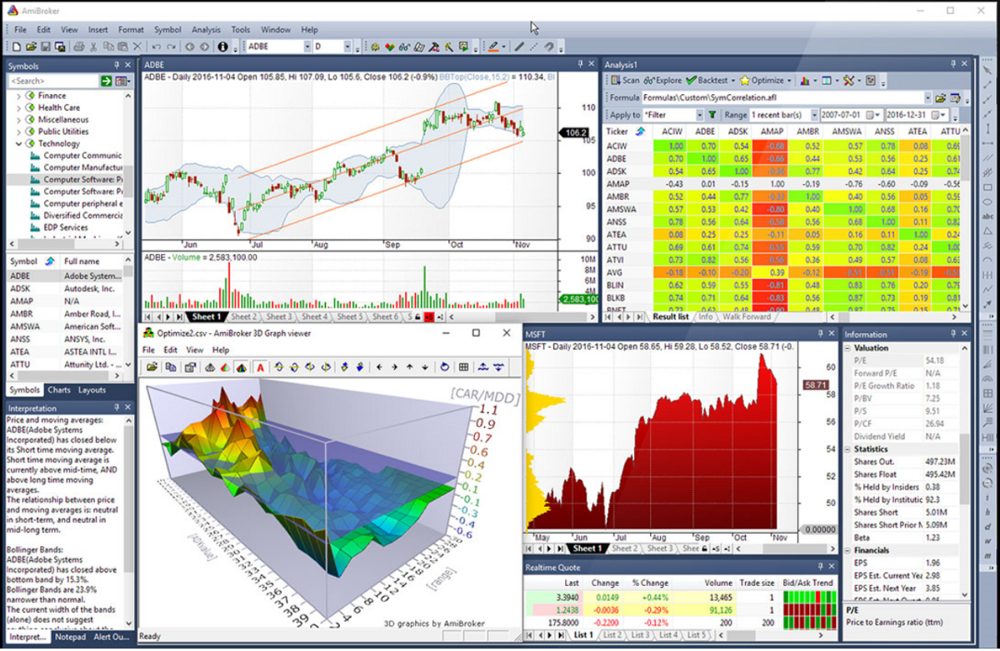

## Table of Contents

## What is backtesting in trading?

Backtesting in trading is when you test a trading strategy using old market data to see how it would have worked in the past. Imagine you have a plan for buying and selling stocks, and you want to know if it's a good plan. You use past stock prices to pretend you're trading with your strategy. This helps you see if your plan would have made money or lost money.

It's like practicing with a time machine. You can't change the past, but you can learn from it. Backtesting helps traders feel more confident about their strategies before they use real money. However, it's important to remember that just because a strategy worked in the past doesn't mean it will work in the future. Markets change, and what worked before might not work again.

Several backtesting tools and platforms facilitate this process, offering traders the capability to input specific trading rules and conditions to simulate trades based on historical data. These tools often include built-in functionalities to handle the complexities of trading algorithms, such as position sizing, leverage, and risk management techniques. Popular platforms include TradingView, QuantConnect, and Python libraries like Backtrader and Zipline. Here's a simple Python snippet using Backtrader to illustrate a basic backtesting setup:

```python
import backtrader as bt

# Create a subclass of Strategy to define the indicators and logic
class MyStrategy(bt.Strategy):
    def __init__(self):
        self.sma = bt.indicators.SimpleMovingAverage(period=15)

    def next(self):
        if self.sma > self.data.close:
            self.sell()
        elif self.sma < self.data.close:
            self.buy()

# Create a Cerebro engine
cerebro = bt.Cerebro()
cerebro.addstrategy(MyStrategy)

# Load data
data = bt.feeds.YahooFinanceData(dataname='AAPL', fromdate=datetime(2020, 1, 1), todate=datetime(2020, 12, 31))
cerebro.adddata(data)

# Set initial cash
cerebro.broker.setcash(10000)

# Run the backtest
cerebro.run()
cerebro.plot()
```

This script defines a simple moving average crossover strategy, integrates historical data for a backtest, and visualizes the results. Traders use such simulations to gauge their strategy's past performance, analyzing key metrics such as the net profit or loss, drawdowns, [volatility](/wiki/volatility-trading-strategies), and risk-adjusted returns. These insights are invaluable in assessing the strategy’s robustness and potential to withstand real-market conditions.

## Why is backtesting important for trading strategies?

Backtesting is important for trading strategies because it lets you see how your plan would have done in the past. It's like a practice run using old market data. By doing this, you can find out if your strategy would have made money or lost money. This helps you figure out if your plan is good or if you need to change it before you start trading with real money.

Also, [backtesting](/wiki/backtesting) can show you the weak spots in your strategy. You might see that your plan works well most of the time but fails during certain market conditions. Knowing this helps you make your strategy stronger. It's a way to learn from the past without risking your money in the present. Just remember, even if a strategy did well in backtesting, it's not a guarantee it will work in the future because markets can change.

## What are the basic steps to perform backtesting?

To start backtesting, you first need to pick a trading strategy you want to test. This could be something like buying stocks when they go down a certain amount and selling them when they go up. Once you have your strategy, you need to get old market data. This data should cover a long enough time to make sure your test is good. You can usually find this data from financial websites or through special software.

Next, you use a computer program or a backtesting tool to apply your strategy to the old data. The program will pretend to trade using your rules and show you how much money you would have made or lost. This step helps you see if your strategy works well or if it needs changes. You might find that your strategy works great in some times but not in others, which can help you improve it.

After running the backtest, you need to look at the results carefully. Check if your strategy made money overall and how it did during different market conditions. It's also important to think about how realistic your backtest is. Did you include things like trading fees and the time it takes to buy and sell? Once you've looked at everything, you can decide if your strategy is ready to use with real money or if you need to tweak it more.

## WHat are the key components of Backtesting?

Successful backtesting hinges on several essential components that collectively ensure the accuracy and reliability of the testing process. These components include precise historical data, a robust and well-defined trading strategy, and sophisticated backtesting software. Each element plays a vital role in the efficacy of backtesting and the ultimate optimization of trading strategies.

### Accurate Historical Market Data

The foundation of any effective backtesting process is the accumulation of accurate and comprehensive historical market data. This data serves as the empirical baseline against which trading strategies are evaluated. The accuracy of historical data is critical as it influences the predictive reliability of the backtest outcomes. Historical data should encompass various market conditions over longer periods to ensure that strategies are not only optimized for particular types of market behavior but are versatile enough to withstand different economic climates.

### Well-Defined Trading Strategy

A well-defined trading strategy is another crucial component of backtesting. The strategy should have clear parameters, such as entry and [exit](/wiki/exit-strategy) points, stop-loss limits, and position sizing. These parameters should be based on quantifiable market indicators and not on subjective judgment. The robustness of a trading strategy can be assessed by its transparency and replicability. 

### Backtesting Software

Advanced backtesting software is indispensable for executing effective backtests. The software provides platforms where traders can input their strategies and simulate trades using historical data. These platforms empower traders by offering capabilities to test complex strategies across different market scenarios, evaluate the strategies under varied conditions, and gauge their effectiveness with a high degree of precision. Key features of backtesting software often include:

- **Data Input and Analysis**: Capability to handle large datasets, real-time data integration, and flexible data input methods.

- **Performance Metrics**: Tools that calculate and display crucial performance metrics such as net profit or loss, Sharpe ratio, and maximum drawdown. These metrics offer insights into a strategy's effectiveness by quantifying aspects like return on investment, risk-adjusted performance, and consistency.

- **Simulation and Optimization**: Ability to simulate trades and optimize strategies iteratively, refining them for better outcomes.

Popular backtesting platforms include QuantConnect, Amibroker, and TradingView, each offering unique features suited to different levels of technical proficiency and strategic complexity.

### Performance Metrics

Performance metrics are invaluable in assessing the validity and strength of backtested strategies. Some of the most commonly employed metrics include:

- **Net Profit or Loss**: The simplest metric indicating the financial outcome of a strategy over a backtested period.
- **Volatility Measures**: Metrics like standard deviation or beta that quantify the risk associated with a strategy.
- **Win-Loss Ratio**: The ratio of profitable to unprofitable trades, providing a quick indicator of strategy success.
- **Risk-Adjusted Returns**: Measures such as the Sharpe ratio, which adjust returns based on the risk taken to achieve those returns, giving a more nuanced view of performance.

Accurate evaluation through these metrics ensures that trading strategies are not only theoretically viable but also pragmatically sound for deployment in the competitive financial markets. With the synergy of quality historical data, a well-crafted strategy, and robust backtesting software, traders can approach the markets with greater confidence in their system's potential success.

## What data is needed for effective backtesting?

For effective backtesting, you need good historical data about the market you want to trade in. This data should include prices of stocks, currencies, or whatever you're trading, and it should cover a long enough time. The more data you have, the better you can test your strategy. You also need data on trading volumes, which tells you how many shares or units were traded. This helps you understand how easy it would be to buy and sell at different times.

It's also important to include other details like dividends, splits, and any fees you would pay for trading. These things can change how much money you make or lose. Make sure the data is accurate and comes from a reliable source. If your data is wrong, your backtest won't be useful. Also, think about the time it takes to buy and sell, because this can affect your strategy too.

## How can you avoid overfitting when backtesting trading strategies?

Overfitting happens when your trading strategy works great on past data but not in real life. It's like making a plan that fits one puzzle perfectly but doesn't work for any other puzzle. To avoid overfitting, you need to test your strategy on different sets of data. One way to do this is by using a method called "out-of-sample testing." This means you test your strategy on data it hasn't seen before. If it still works well, you know it's not just fitting the old data too closely.

Another way to avoid overfitting is to keep your strategy simple. The more rules and conditions you add, the more likely you are to overfit. Stick to a few clear rules that make sense and don't try to make your strategy perfect for every little change in the market. Also, always think about how your strategy would work in different market conditions, not just the ones you've tested. By keeping things simple and testing in different ways, you can make sure your strategy is strong and not just a good fit for past data.

## What are common metrics used to evaluate backtesting results?

When you backtest a trading strategy, you look at some common numbers to see how well it did. One important number is the total return, which tells you how much money you would have made or lost overall. Another useful metric is the Sharpe Ratio, which shows how much return you got for the risk you took. A higher Sharpe Ratio means you got more return for less risk, which is good. You also want to check the maximum drawdown, which is the biggest drop in your money from the highest point to the lowest point. A smaller drawdown means your strategy is less risky.

Another thing to look at is the win rate, which tells you what percent of your trades made money. But, the win rate alone isn't enough because some losing trades can be very big. So, you should also look at the average win and the average loss to understand how big your wins and losses are. The profit [factor](/wiki/factor-investing) is another useful number; it's the total money made from winning trades divided by the total money lost from losing trades. A profit factor above 1 means you made more than you lost, which is good.

Lastly, it's helpful to look at the consistency of your strategy. Metrics like the calmar ratio, which is the annualized return divided by the maximum drawdown, can show how steady your returns are over time. Also, consider the number of trades and the time spent in the market, as these can affect how practical your strategy is. By looking at all these numbers together, you get a full picture of how your trading strategy performed during backtesting.

## What are the limitations of backtesting?

Backtesting has some big limits that traders need to know about. One big problem is that past data might not be a good guide for the future. Markets change all the time because of new rules, events, or technology. So, just because a strategy worked well in the past doesn't mean it will work the same way in the future. Also, backtesting can miss out on real-life things like how hard it is to buy or sell quickly, or how emotions can make traders do things they didn't plan to do.

Another limit is that backtesting can make a strategy look better than it really is. This can happen if you test it too much on the same old data, which can lead to overfitting. Overfitting means your strategy is too perfect for the past but won't work well in new situations. Also, backtesting often doesn't include all the costs of trading, like fees and taxes, which can make a big difference in how much money you actually make or lose. So, while backtesting is a helpful tool, it's important to remember its limits and not rely on it too much.

## How can you use Python for backtesting trading strategies?

You can use Python to backtest trading strategies because it's a powerful programming language that's easy to learn. To start, you need to get historical market data. You can use libraries like `pandas` to load and organize this data. Once you have your data ready, you can write your trading strategy as a set of rules in Python. For example, you might write a rule that says, "Buy this stock when its price goes up by 5% in one day." Then, you can use a backtesting library like `Backtrader` or `Zipline` to run your strategy on the old data. These libraries help you see how your strategy would have done in the past, showing you things like how much money you would have made or lost.

After running your backtest, you need to look at the results carefully. Python makes it easy to calculate important numbers like total return, Sharpe Ratio, and maximum drawdown. You can use `pandas` and `matplotlib` to make charts and graphs that help you understand your strategy's performance better. It's also important to check for overfitting by testing your strategy on different sets of data. Python's flexibility lets you change your strategy easily and test it again to see if it gets better. By using Python for backtesting, you can learn a lot about your trading strategy before you use it with real money.

## What advanced techniques can enhance backtesting accuracy?

To make backtesting more accurate, you can use something called walk-forward optimization. This means you split your old data into two parts: one part to make your strategy and another part to test it. You keep moving forward in time, using new data to see if your strategy still works. This helps make sure your strategy isn't just good for the past but might work in the future too. It's like checking your plan in different time periods to see if it's strong enough.

Another way to improve backtesting is by using more realistic data. This means including things like trading fees, taxes, and how long it takes to buy or sell. These things can make a big difference in how much money you make or lose. Also, you can use Monte Carlo simulations, which test your strategy many times with small changes to the data. This helps you see how your strategy might do in different situations, not just the one you tested. By using these advanced techniques, you can get a better idea of how your trading strategy will really work.

## How do you incorporate transaction costs and slippage into backtesting?

To make your backtesting more real, you need to include things like transaction costs and slippage. Transaction costs are the fees you pay every time you buy or sell something. These can be a big deal because they take away from your profits. To add them to your backtest, you just take a little bit of money out of your total whenever you make a trade. This helps you see how much these costs would affect your strategy in real life.

Slippage is another thing to think about. It happens when you can't buy or sell at the price you want because the market moves too fast. To include slippage in your backtest, you can add a small change to the price you're using. For example, if you want to buy a stock at $100, you might actually get it at $100.10 because of slippage. By adding both transaction costs and slippage, your backtest will be more like what you'd see in the real world, helping you make better trading plans.

## What are walk-forward optimization and its benefits in backtesting?

Walk-forward optimization is a way to make sure your trading strategy works well not just in the past but also in the future. You do this by splitting your old data into two parts. You use the first part to make your strategy, and then you test it on the second part, which is data it hasn't seen before. You keep doing this, moving forward in time, to see if your strategy keeps working as new data comes in. This helps you avoid overfitting, where your strategy fits the past data too perfectly but won't work in new situations.

The big benefit of walk-forward optimization is that it makes your backtesting more realistic. By testing your strategy on different sets of data over time, you get a better idea of how it might do in the future. This method helps you see if your strategy can adapt to changing market conditions. It's like practicing with different puzzles to make sure your strategy can solve them all, not just the one you started with. This way, you can feel more confident about using your strategy with real money.

## How can you compare different trading strategies using backtesting results?

To compare different trading strategies using backtesting results, you need to look at some key numbers. First, check the total return for each strategy to see how much money it would have made or lost overall. Then, look at the Sharpe Ratio, which tells you how much return you got for the risk you took. A higher Sharpe Ratio means a strategy did better at making money with less risk. Also, consider the maximum drawdown, which is the biggest drop in money from the highest point to the lowest point. A smaller drawdown means a strategy is less risky. By comparing these numbers, you can see which strategy made the most money, took the least risk, and had the smallest losses.

Another thing to think about is the consistency of each strategy. Look at the win rate, which shows what percent of trades made money, and the profit factor, which is the total money made from winning trades divided by the total money lost from losing trades. A profit factor above 1 means you made more than you lost. Also, consider how often the strategy trades and how long it spends in the market, as these can affect how practical it is to use. By looking at all these numbers together, you get a full picture of how each strategy performed during backtesting. This helps you decide which strategy might be the best one to use with real money.

## References & Further Reading

[1]: Bergstra, J., Bardenet, R., Bengio, Y., & Kégl, B. (2011). ["Algorithms for Hyper-Parameter Optimization."](https://dl.acm.org/doi/10.5555/2986459.2986743) Advances in Neural Information Processing Systems 24.

[2]: ["Advances in Financial Machine Learning"](https://www.amazon.com/Advances-Financial-Machine-Learning-Marcos/dp/1119482089) by Marcos Lopez de Prado

[3]: ["Evidence-Based Technical Analysis: Applying the Scientific Method and Statistical Inference to Trading Signals"](https://www.amazon.com/Evidence-Based-Technical-Analysis-Scientific-Statistical/dp/0470008741) by David Aronson

[4]: ["Machine Learning for Algorithmic Trading"](https://github.com/stefan-jansen/machine-learning-for-trading) by Stefan Jansen

[5]: ["Quantitative Trading: How to Build Your Own Algorithmic Trading Business"](https://www.amazon.com/Quantitative-Trading-Build-Algorithmic-Business/dp/1119800064) by Ernest P. Chan