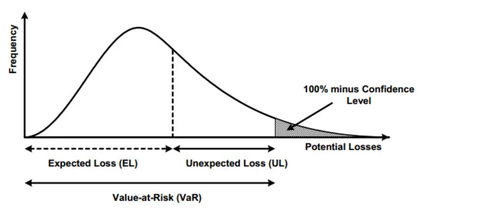

## Table of Contents

## What is Value-at-Risk (VaR) and why is it important in finance?

Value-at-Risk, or VaR, is a measure used in finance to estimate how much money an investment or portfolio could lose over a certain period of time, given normal market conditions. It's usually expressed as a dollar amount or a percentage and is calculated for a specific confidence level, like 95% or 99%. For example, if a portfolio has a one-day 95% VaR of $1 million, it means that there is a 95% chance that the portfolio will not lose more than $1 million in a single day.

VaR is important in finance because it helps investors and financial institutions understand and manage risk. By knowing the potential loss, they can make better decisions about their investments and take steps to protect themselves. For instance, banks use VaR to determine how much capital they need to hold to cover potential losses, and investment managers use it to adjust their portfolios to meet risk tolerance levels. Overall, VaR provides a clear and standardized way to assess risk, which is crucial for maintaining stability in financial markets.

## How does backtesting work in the context of Value-at-Risk?

Backtesting in the context of Value-at-Risk (VaR) is a way to check if the VaR model is working correctly. It involves looking at past data to see if the losses predicted by the VaR model actually happened. Imagine you have a VaR model that says there's a 95% chance your portfolio won't lose more than $1 million in a day. You would then go back and look at what actually happened on past days. If your portfolio lost more than $1 million on more than 5% of those days, your VaR model might not be very accurate.

By doing backtesting, you can see if your VaR model is too optimistic or too pessimistic. If it's too optimistic, it might not be warning you about big losses that could happen. If it's too pessimistic, it might be scaring you away from good investments. Backtesting helps you adjust your VaR model to make it more reliable. This way, you can trust the VaR numbers more when making decisions about your investments.

## What are the basic steps to perform a VaR backtesting?

To perform a VaR backtesting, you start by choosing a time period to look at, like the last year or the last few years. Then, you calculate the VaR for each day in that time period using your VaR model. For example, if you're using a one-day 95% VaR, you figure out what the model says is the maximum loss for each day at that confidence level.

Next, you compare these VaR numbers to what actually happened each day. You count the number of days where the actual loss was more than the VaR predicted. If you're using a 95% VaR, you expect this to happen about 5% of the time. If it happens more often, your VaR model might be too optimistic. If it happens less often, your model might be too pessimistic.

After comparing, you can adjust your VaR model to make it more accurate. This might mean changing the way you calculate VaR or using different data. By doing this, you make sure your VaR model gives you a good idea of the risks you're facing, helping you make better decisions about your investments.

## What are the common methods used to calculate VaR?

There are three common ways to calculate Value-at-Risk (VaR): the historical method, the variance-covariance method, and the Monte Carlo simulation method. The historical method looks at what happened in the past. You take the losses from past days, sort them from smallest to biggest, and then find the loss at the point that matches your confidence level. For example, if you're using a 95% VaR, you look at the 5th worst day out of 100 days. This method is easy to understand but assumes the future will be like the past.

The variance-covariance method, also called the parametric method, uses math formulas to calculate VaR. It assumes that returns follow a normal distribution, which means they are predictable in a certain way. You need to know the average return and how much returns usually vary (the standard deviation). Then, you use these numbers in a formula to find the VaR. This method is quick and works well when returns are normally distributed, but it might not be accurate if returns behave differently.

The Monte Carlo simulation method uses computer power to run many different scenarios. It creates lots of possible future paths for your investments, based on how they've moved in the past. Then, it looks at all these paths to see what the worst losses might be at your chosen confidence level. This method can handle complex situations and doesn't assume returns are normally distributed, but it takes more time and computer power to run.

## How do you interpret the results of a VaR backtest?

When you do a VaR backtest, you're checking if your VaR model is good at predicting losses. You look at how often the actual losses were bigger than what the VaR said they would be. If you're using a 95% VaR, you expect the actual losses to be bigger than the VaR about 5% of the time. If it happens more often than that, your VaR model might be too optimistic and not warning you enough about big losses. If it happens less often, your model might be too careful and could be scaring you away from good investments.

Based on what you find, you can make your VaR model better. If the actual losses are bigger than the VaR too often, you might need to change how you calculate VaR or use different data to make it more accurate. If the actual losses are bigger than the VaR less often than expected, you might be able to take more risks because your model is being too cautious. By adjusting your VaR model, you can trust it more to help you make smart decisions about your investments.

## What are the key statistical tests used in VaR backtesting?

When you backtest a VaR model, you use some key statistical tests to see if it's working right. One common test is the Kupiec test, also called the proportion of failures test. It checks if the number of times the actual loss was bigger than the VaR matches what you expect. For a 95% VaR, you expect this to happen about 5% of the time. If it happens a lot more or a lot less than that, your VaR model might need fixing. Another test is the Christoffersen test, which looks at how the times when the VaR is broken are spread out. It checks if these times are random or if they happen in clumps, which could mean your VaR model isn't good at predicting when big losses might happen.

Another useful test is the Berkowitz test, which looks at how well the VaR model fits the actual data. It checks if the losses follow the pattern the VaR model says they should. If they don't, your model might not be describing the risks correctly. These tests help you see if your VaR model is too optimistic or too pessimistic, so you can make it better. By using these tests, you can trust your VaR model more when making decisions about your investments.

## What are the limitations and challenges of backtesting VaR?

Backtesting VaR has some limitations and challenges. One big problem is that past data might not tell you much about the future. Markets can change a lot, and what happened before might not happen again. This makes it hard to trust that your VaR model will work well going forward. Also, VaR only tells you about losses that happen a lot, not the really big ones that don't happen often. These rare, big losses can be the most dangerous, and VaR might not warn you about them.

Another challenge is that backtesting can be tricky to do right. You need a lot of good data to make it work, and sometimes that data is hard to get or not very reliable. Plus, the way you set up your backtest can affect the results. If you make small changes to how you do it, you might get different answers. This can make it hard to know if your VaR model is really working well or if it just looks good because of how you tested it.

## How can historical simulation improve the accuracy of VaR backtesting?

Historical simulation can help make VaR backtesting more accurate by using real past data to see how well the VaR model works. Instead of guessing how the market might move, historical simulation looks at what actually happened in the past. This means you can see if your VaR model would have predicted the losses that really occurred. By using real data, you get a better idea of whether your VaR model is too optimistic or too pessimistic about the risks you face.

However, historical simulation also has its limits. It assumes that the future will be a lot like the past, which might not always be true. Big events, like financial crises, can happen out of the blue and might not show up in your historical data. So, while historical simulation can give you a good sense of how your VaR model has worked before, it might not be perfect for predicting what could happen next. Still, it's a useful tool to help you check and improve your VaR model.

## What role does the choice of confidence level play in VaR backtesting?

The choice of confidence level in VaR backtesting is really important because it tells you how sure you want to be about your predictions. If you pick a 95% confidence level, you're saying you want to be right 95 times out of 100. When you backtest, you check if the actual losses were bigger than what the VaR said they would be about 5% of the time. If it happens more often, your VaR model might be too optimistic. If it happens less often, your model might be too careful.

Choosing the right confidence level can be tricky. A higher confidence level, like 99%, means you're being very careful and want to be right almost all the time. But it also means your VaR numbers might be bigger, and you might miss out on good investments because you're being too cautious. A lower confidence level, like 90%, means you're okay with being wrong a bit more often, but it might not warn you enough about big losses. So, the confidence level you pick affects how you see the risks and how you adjust your VaR model to make it better.

## How do regulatory requirements influence VaR backtesting practices?

Regulatory requirements play a big role in how financial institutions do VaR backtesting. Rules from groups like the Basel Committee on Banking Supervision tell banks how often they need to check their VaR models and what tests they should use. These rules are there to make sure banks are being careful with their money and not taking too many risks. If a bank's VaR model doesn't pass the backtesting, regulators might make them hold more money to cover possible losses. This pushes banks to keep their VaR models up to date and accurate.

Because of these rules, banks have to do a lot of work to make sure their VaR backtesting is done right. They need to use the right statistical tests, like the Kupiec and Christoffersen tests, to check if their VaR models are working well. If the backtesting shows the VaR model is too optimistic or too pessimistic, banks have to fix it. This helps keep the financial system stable and makes sure banks are ready for any big losses that might come up.

## What advanced techniques can be used to enhance VaR backtesting?

One advanced technique to make VaR backtesting better is using something called conditional VaR, or CVaR. CVaR looks at the average of the losses that are bigger than the VaR. This helps you understand not just how often big losses happen, but also how bad they can be. By adding CVaR to your backtesting, you get a fuller picture of the risks you're facing. This can help you make your VaR model more accurate and better at warning you about big losses.

Another technique is using machine learning to improve VaR backtesting. Machine learning can look at a lot of data and find patterns that might be hard for people to see. It can help you predict how the market might move and make your VaR model more accurate. By using machine learning, you can keep your VaR model up to date with the latest market trends and make sure it's working well. This can help you trust your VaR model more when making decisions about your investments.

## How can machine learning models be integrated into VaR backtesting for better predictions?

Machine learning can help make VaR backtesting better by looking at a lot of data and finding patterns that might be hard for people to see. You can use machine learning to predict how the market might move and make your VaR model more accurate. For example, machine learning can look at things like stock prices, news, and even social media to see what might affect the market. By using all this information, machine learning can help you understand the risks better and make your VaR model more reliable. This way, you can trust your VaR model more when making decisions about your investments.

To use machine learning in VaR backtesting, you start by training a machine learning model with past data. This model learns how the market has moved before and can predict how it might move in the future. Then, you use this model to calculate VaR and compare it to what actually happened. If the machine learning model's predictions are more accurate than your old VaR model, you can use it to make your VaR model better. By doing this, you can keep your VaR model up to date with the latest market trends and make sure it's working well.

## What is Understanding Value at Risk (VaR)?

Value at Risk (VaR) is a widely used statistical measure in financial risk management that quantifies the potential loss in an investment portfolio over a specified time horizon, at a given confidence level. The measure is instrumental for investors and risk managers because it provides a clear estimate of the worst expected loss under normal market conditions. VaR is expressed as a threshold value such that the probability of the loss on the portfolio exceeding this value is the specified confidence level. For example, a one-day VaR of $1 million at a 95% confidence level implies that there is a 5% chance that the portfolio will lose more than $1 million in a single day.

Mathematically, VaR can be represented as follows:

$$
\text{VaR}_{\alpha} = - \inf \{ x \in \mathbb{R} : P(L \leq x) \geq \alpha \}
$$

where $L$ is the loss, $\alpha$ is the confidence level, and $\inf$ denotes the greatest lower bound. This formula emphasizes that VaR is not concerned with the maximum possible loss, but rather with the loss that has a certain probability of not being exceeded.

Despite its widespread adoption, VaR has certain limitations. Notably, it does not provide any information regarding the potential size of losses exceeding the VaR threshold, which means it does not predict the worst-case scenario. This shortcoming is sometimes referred to as the "tail risk," which VaR does not account for. Additionally, VaR assumes normal market conditions and historical data may not be fully reflective of future [volatility](/wiki/volatility-trading-strategies) or market movements.

VaR is crucial in the financial sector as it helps in setting limits and determining the amount of capital to hold in reserve for trading activities, thereby ensuring that financial institutions can withstand losses without severely impacting their operations. The simplicity of its concept and ease of communication make VaR a favored risk metric among financial professionals, though it is often complemented with other measures like Expected Shortfall, which considers the average loss beyond the VaR threshold for a more comprehensive risk assessment.

## How accurate are VaR models when backtested?

Backtesting is an essential process for evaluating the accuracy and reliability of Value at Risk (VaR) models. This validation technique involves comparing the estimated VaR with actual historical losses to gauge how well the model predicts risk. A successful backtest indicates that the model accurately forecasts potential losses within the defined confidence interval.

To conduct a backtest, a set of historical data is divided into two segments: an estimation window used to calculate VaR and a backtesting window where the estimated VaR is compared against actual returns. For instance, if a one-day VaR at the 95% confidence level is calculated, the expectation is that actual portfolio losses should not exceed the VaR estimate on more than 5% of trading days. 

Several statistical tests are employed to determine if a backtest has passed or failed. The Kupiec Proportion of Failures (POF) test is a commonly used method, which evaluates if the number of days the actual losses exceed the VaR estimate aligns with the expected violation rate. The test statistic is calculated using:

$$

LR_{POF} = -2 \ln \left( \frac{(1-p)^n}{(1-\hat{p})^x \hat{p}^{n-x}} \right) 
$$

where $p$ is the confidence level, $n$ is the total number of observations, $x$ represents the number of exceedances, and $\hat{p} = x/n$ is the empirical failure rate. The test statistic follows a chi-squared distribution with one degree of freedom. If $LR_{POF}$ exceeds the critical value from the chi-squared distribution, the model may be deemed unreliable.

Another approach, the Christoffersen Traffic Light Test, extends the POF test by evaluating not only the frequency of failures but also their independence. The purpose is to ensure that violations do not cluster, which would suggest model inadequacy during specific market conditions.

Moreover, in modern applications, computational tools facilitate backtesting by automating the comparison and statistical evaluation processes. Python, comprising libraries such as NumPy and pandas, allows efficient data handling and statistical computation, providing robust frameworks for backtesting VaR models.

In summary, backtesting serves as a crucial feedback mechanism for assessing the performance of VaR models. By validating the model's predictions against historical data, financial institutions can either reaffirm their current risk management strategies or make adjustments to improve their accuracy, thus ensuring robust risk assessment frameworks.

## What are the methods for calculating VaR?

Value at Risk (VaR) can be computed using several methodologies, each offering its own advantages and challenges. Choosing the appropriate method depends on the characteristics of the portfolio, the nature of the assets involved, and the computational resources available.

The Variance-Covariance method assumes that returns are normally distributed. This approach uses the standard deviation and mean of asset returns to determine the VaR. The formula for calculating VaR using this method is expressed as:

$$
\text{VaR} = \left( \mu - z \times \sigma \right) \times \text{Portfolio Value}
$$

where $\mu$ is the mean return, $z$ is the z-score corresponding to the desired confidence level, and $\sigma$ is the standard deviation of returns. This method is relatively straightforward and computationally efficient, making it suitable for portfolios with linear derivatives. However, it may not capture non-normal distributions or fat tails accurately.

Historical Simulation involves analyzing actual historical returns to estimate the VaR. Under this method, portfolio losses are calculated for each historical return period, and the VaR is determined by identifying the loss at the chosen percentile of historical data. This method does not assume distributional properties and captures actual historical patterns, making it advantageous for portfolios with simple structures. However, it relies heavily on the relevance of historical data and may not react well to unprecedented market conditions.

The Monte Carlo Simulation method uses random sampling and statistical modeling to estimate the VaR. This approach generates a wide range of potential future price scenarios using random numbers and evaluates the resulting portfolio values to estimate potential losses. Monte Carlo Simulation is highly flexible and can model complex portfolios with non-linear characteristics. It accommodates varying distributions and allows for scenario analysis. However, it is computationally intensive and requires significant computational resources, which can be a constraint for real-time applications.

Each of these methods has its specific use cases and limitations. The choice of method should be carefully considered, balancing computational efficiency against the need for model accuracy and the complexity of the portfolio being analyzed.

## References & Further Reading

[1]: Jorion, P. (2006). ["Value at Risk: The New Benchmark for Managing Financial Risk."](https://books.google.com/books/about/Value_at_Risk_3rd_Ed.html?id=nnblKhI7KP8C) McGraw-Hill.

[2]: Dowd, K. (2001). ["Measuring Market Risk."](https://onlinelibrary.wiley.com/doi/book/10.1002/9781118673485) John Wiley & Sons.

[3]: Lopez de Prado, M. (2018). ["Advances in Financial Machine Learning."](https://www.amazon.com/Advances-Financial-Machine-Learning-Marcos/dp/1119482089) Wiley.

[4]: Christoffersen, P. (2012). ["Elements of Financial Risk Management."](https://www.sciencedirect.com/book/9780123744487/elements-of-financial-risk-management) Academic Press.

[5]: Basel Committee on Banking Supervision (2013). ["Fundamental Review of the Trading Book: A Revised Market Risk Framework."](https://www.bis.org/publ/bcbs265.htm)

[6]: McNeil, A. J., Frey, R., & Embrechts, P. (2015). ["Quantitative Risk Management: Concepts, Techniques, and Tools."](https://www.researchgate.net/publication/235622467_Quantitative_Risk_Management_Concepts_Techniques_and_Tools) Princeton University Press.

[7]: Alexander, C. (2008). ["Market Risk Analysis, Volume IV: Value at Risk Models."](https://pdfs.semanticscholar.org/afba/364297b19e15f646f9964a7f319225984fe9.pdf) Wiley.