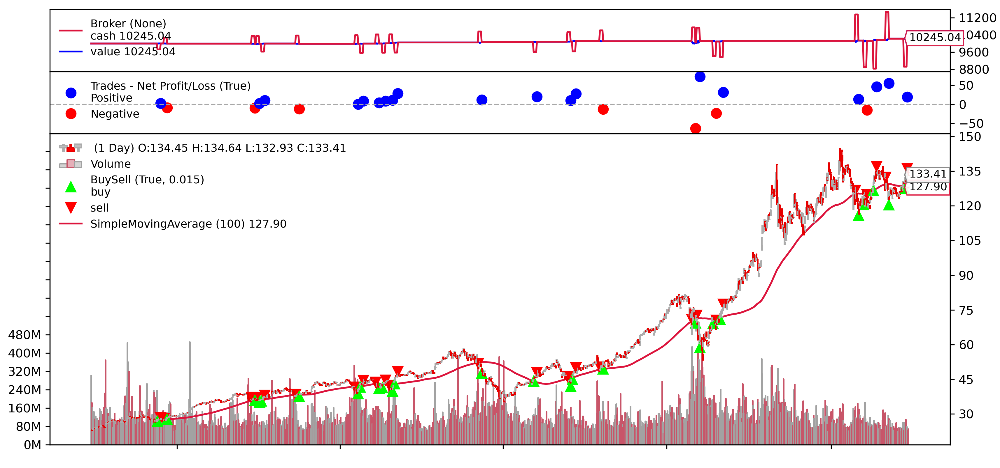

Backtesting is the backbone of validating any trading strategy. Before deploying a strategy in the real world, where financial capital is at risk, it's imperative to understand its theoretical performance in past scenarios. By re-running a strategy on historical data, traders can gain insights into the potential profitability, risks, and vulnerabilities of a strategy. Hence, backtesting is not just an optional step but a necessary bridge between theoretical strategy and practical execution.



With its intuitive syntax and an abundant ecosystem of libraries and tools, Python has become the go-to language for many traders and financial analysts. It caters to both beginners, who may be writing their first lines of code, and to seasoned developers who require advanced tools for quantitative analysis. This democratization of tools means that one doesn't need a Wall Street budget to validate their trading ideas – a laptop, some data, and Python can go a long way.

But why has Python become so popular in this domain? Its flexibility is a significant factor. Whether you're dealing with a simple moving average crossover strategy or delving into the complexities of neural network-based forecasting, Python has libraries that cater to both ends of this spectrum. Moreover, the active and ever-growing community ensures that as financial markets evolve, Python's tools evolve with them.

In this guide, we'll explore the depths of backtesting with Python, starting from the basics and moving to more advanced topics. Let's embark on this journey to master backtesting with Python.

## Table of Contents

## Why Python for Backtesting?

Python's ascendancy in financial [backtesting](/wiki/backtesting) is not accidental; it's rooted in the intrinsic characteristics of the language and the ecosystem built around it. Let's deep dive into the core reasons behind Python's popularity in this domain.

**The Flexibility of Python**

Python's syntax is designed for clarity and readability, enabling developers to express complex ideas in fewer lines of code. This clarity is especially beneficial in the domain of finance and trading, where algorithms can quickly become intricate. Moreover, Python is dynamically typed, which allows for faster iteration – a valuable asset when tweaking and refining trading strategies.

**Rich Libraries and Frameworks**

Python boasts an extensive collection of libraries tailored for quantitative analysis, data manipulation, and backtesting. Libraries like Pandas simplify data manipulation, while NumPy and SciPy cater to numerical and scientific computing needs. For backtesting specifically, libraries such as Backtesting.py, Backtrader, and Zipline provide tools that range from basic strategy validation to complex simulations involving slippage, commission, and multiple data sources.

**Active Community Support**

Perhaps one of the most compelling reasons to choose Python is its vibrant community. There are countless forums, blogs, and online communities where enthusiasts, professionals, and experts discuss, troubleshoot, and share strategies. This wealth of shared knowledge not only aids in resolving issues but also fosters innovation. Furthermore, the open-source nature of many Python tools means that they are continually being refined and expanded by this community[1].

In essence, Python offers a confluence of flexibility, tools, and collective knowledge, making it an unrivaled choice for traders and developers venturing into the world of backtesting.

## Deep Dive into Backtesting.py

### Brief on what Backtesting.py is and its significance

Backtesting.py is a Python library dedicated to the backtesting of trading strategies. In financial markets, ensuring a strategy's efficacy is crucial before deploying it with real capital, and that's where backtesting shines. This library offers a platform to transform theoretical trading ideas into quantifiable results by simulating trades on historical data. By providing traders and researchers a clear, concise tool for this process, Backtesting.py plays a pivotal role in the trading ecosystem. Its streamlined design makes it accessible for both beginners and seasoned quants, thereby democratizing the process of strategy validation[2].

### Core features of Backtesting.py

Backtesting.py is engineered to be both intuitive for beginners and robust for experts, providing a suite of features that makes the backtesting process thorough and efficient. Here's an exploration of its core offerings:

1. **Vectorized Backtesting**: Unlike traditional event-driven systems, Backtesting.py uses a vectorized approach. This means it efficiently processes trading signals over arrays of data rather than tick-by-tick, resulting in faster simulation speeds[3].
2. **Integrated Performance Metrics**: Post-simulation, the library automatically calculates numerous performance metrics like the Sharpe ratio, drawdown, annual returns, and more, providing a holistic view of strategy performance.
3. **Custom Strategy Definition**: Users have the liberty to define their custom strategies by merely specifying entry and exit rules. This makes it adaptable for a wide range of trading theories.
4. **Broker Integration**: The library simulates broker mechanics, like slippage and trading commissions, ensuring that the backtest is as close to real-life trading conditions as possible.
5. **Versatile Data Handling**: It supports various data formats, including CSV and pandas DataFrame, ensuring seamless integration with many data sources.
6. **Technical Indicators**: Users can integrate various technical indicators easily, thanks to its compatibility with libraries like TA-Lib[4], aiding in strategy formulation.
7. **Built-in Optimization**: Strategies often have parameters (like moving average periods) that need fine-tuning. Backtesting.py incorporates optimization tools that hunt for the most promising parameter combinations based on desired performance metrics.
8. **Visualization**: After backtesting, visual representation is key for analysis. This library provides built-in plotting capabilities, allowing users to visualize trades, equity curves, and other vital statistics effortlessly.
9. **Flexibility in Order Types**: Apart from the basic market orders, users can simulate different order types, increasing the sophistication of the strategy testing.
10. **Diverse Timeframes**: Whether a user is interested in high-frequency intraday trading or long-term strategies, Backtesting.py supports a wide range of timeframes.

In essence, Backtesting.py combines performance with versatility, catering to both novices and professionals aiming to validate their trading strategies against historical data.

### Benefits and potential drawbacks

Backtesting.py stands as a notable player in backtesting libraries due to its range of beneficial attributes. However, like any tool, it comes with its set of limitations. Here's an unbiased look into its advantages and challenges:

#### Benefits:

1. **User-Friendly**: Designed with both beginners and experts in mind, its straightforward syntax makes strategy definition and backtesting relatively uncomplicated.
2. **Speed**: Thanks to its vectorized approach, backtesting simulations are faster when compared to many event-driven systems.
3. **Versatile Data Integration**: Whether you're importing CSV files or pandas DataFrames, Backtesting.py easily interfaces with multiple data formats.
4. **Comprehensive Performance Metrics**: Post-simulation, the library furnishes a range of metrics, aiding traders in assessing strategy robustness without the need for additional tools.
5. **Visualization**: Integrated plotting capabilities offer a clear view of trades, equity progression, and other essential data, eliminating the need for third-party visualization libraries.
6. **Customization**: From defining slippage to trading commissions, users can simulate real-world trading conditions, enhancing the credibility of the backtesting results.

#### Drawbacks:

1. **Limitation of Vectorized Backtesting**: While the vectorized model is faster, it may not be as realistic as event-driven models, especially for high-frequency trading strategies where order execution timing is crucial.
2. **Scalability Concerns**: For complex strategies or when handling vast datasets, the library might not scale as efficiently as some enterprise-level solutions.
3. **Lack of Multi-Asset Backtesting**: Backtesting.py is primarily designed for single-asset strategies, limiting its applicability for portfolio strategies or multi-asset systems.
4. **Dependency on External Libraries for Advanced Analysis**: For sophisticated technical indicators or advanced analytics, one might need to lean on external libraries like TA-Lib, introducing an added layer of complexity.
5. **Limited Broker and Data Source Integrations**: Unlike some other backtesting platforms, Backtesting.py doesn't have built-in integrations with live brokers or data providers, meaning real-time testing or deployment requires additional work.

While Backtesting.py offers a robust foundation for backtesting endeavors, it's essential for users to weigh its capabilities against their unique needs, ensuring it aligns with the complexities and nuances of their trading strategies.

### Getting started: Installation and basic setup

Embarking on your journey with Backtesting.py is simple and straightforward. Here’s a step-by-step guide to get you up and running:

1. **Installing the Library**:
    
    To begin with, ensure you have Python installed on your system. With Python in place, installation of the library can be executed via pip:
    
    ```bash
    pip install backtesting
    ```
    
2. **Importing Necessary Modules**:
    
    Once installed, you'll need to import the library in your Python script or Jupyter notebook:
    
    ```python
    from backtesting import Backtest, Strategy
    ```
    
3. **Fetching Historical Data**:
    
    Backtesting.py operates on historical data, usually in the form of a pandas DataFrame. If you already have data in CSV or Excel formats, you can utilize the pandas library to read and structure this data appropriately. An example using [Papers With Backtest data](https://paperswithbacktest.com/datasets):
    
    ```python
    import pwb_toolbox.datasets as pwb_ds  # see https://paperswithbacktest.com/datasets
    
    data = pwb_ds.load_dataset("Stocks-Daily-Price", ["AAPL"])
    data.rename(columns={"date": "Date", "open": "Open", "high": "High", "low": "Low", "close": "Close", "volume": "Volume"}, inplace=True)
    data.set_index("Date", inplace=True)
    ```
    
    The above code ensures your data columns are appropriately labeled as 'Open', 'High', 'Low', 'Close', and 'Volume'[5].
    
4. **Defining Your Strategy**:
    
    Prior to running any backtests, a trading strategy needs to be defined. With Backtesting.py, this is done by subclassing the `Strategy` class and setting up the logic within:
    
    ```python
    class MyStrategy(Strategy):
        def init(self):
            # Initialization logic, e.g. indicator setup
            pass
    
        def next(self):
            # Strategy logic goes here, e.g.:
            if some_condition:
                self.buy()
            elif another_condition:
                self.sell()
    ```
    
5. **Initiate Backtesting**:
    
    With your historical data and strategy in place, it’s time to commence the backtesting process:
    
    ```python
    bt = Backtest(data, MyStrategy, cash=10000, commission=.002)
    output = bt.run()
    print(output)
    ```
    
6. **Visualization**:
    
    For a more intuitive grasp of the backtest results, a plot can be generated, showcasing trades, equity progression, and more:
    
    ```python
    bt.plot()
    ```
    

And there you have it. You've successfully installed [Backtesting.py](http://backtesting.py/), set up your data, defined a rudimentary strategy, and performed your inaugural backtest. As you deep dive deeper into strategy development and optimization, remember to refer to the [official documentation](https://kernc.github.io/backtesting.py/doc/backtesting/index.html) for comprehensive details and advanced use-cases.

### Importing data into Backtesting.py

For the efficacy of any backtest, accurate and comprehensive historical data serves as the foundation. In Backtesting.py, this data predominantly assumes the form of a pandas DataFrame. Here's how to smoothly import and structure this indispensable data:

1. **Utilizing Existing Data Files**:
    
    If you possess data in familiar formats like CSV or Excel, pandas is your go-to tool. This will ensure that the data aligns with Backtesting.py's expectations:
    
    ```python
    import pandas as pd
    
    data = pd.read_csv("path_to_your_data.csv")
    ```
    
    Make certain that your DataFrame columns are labeled as 'Open', 'High', 'Low', 'Close', and 'Volume' to facilitate seamless integration.
    
2. **Fetching Data from Online Sources**:
    
    Various Python libraries enable real-time fetching of historical market data. For instance, using `pwb_toolbox` facilitates access to [Papers With Backtest's data](https://paperswithbacktest.com/datasets) troves:
    
    ```python
    import pwb_toolbox.datasets as pwb_ds  # see https://paperswithbacktest.com/datasets
    
    data = pwb_ds.load_dataset("Stocks-Daily-Price", ["AAPL"])
    data.rename(columns={"date": "Date", "open": "Open", "high": "High", "low": "Low", "close": "Close", "volume": "Volume"}, inplace=True)
    data.set_index("Date", inplace=True)
    ```
    
3. **Data Cleaning**:
    
    In the financial domain, encountering gaps or inconsistencies in datasets is not rare. Here's how to address such anomalies:
    
    - Removing any rows with null values:
        
        ```python
        data.dropna(inplace=True)
        ```
        
    - Ensuring data is sorted chronologically, critical for time-series analysis:
        
        ```python
        data.sort_index(inplace=True)
        ```
        
4. **Resampling Data**:
    
    Perhaps your data is at a daily frequency, but your strategy demands a minutely or hourly viewpoint. Pandas offers a resampling feature:
    
    ```python
    # Resampling to hourly data
    data = data.resample('H').mean()
    ```
    
5. **Additional Data Sources**:
    
    Beyond Yahoo Finance, several other platforms like Quandl, Alpha Vantage, or Intrinio can be tapped for data, with dedicated Python libraries or APIs to fetch them. Remember, the data's granularity, range, and accuracy can significantly impact backtesting outcomes.
    
6. **Custom Indicators**:
    
    If your data encompasses custom indicators or signals, ensure they're part of the DataFrame. This way, when defining your strategy in Backtesting.py, these indicators are readily accessible.
    

To reiterate, the quality of your backtest is intimately tied to the quality of your data. Ensuring its accuracy, consistency, and relevance is paramount. As you further acquaint yourself with the nuances of Backtesting.py, frequent reference to the [official documentation](https://kernc.github.io/backtesting.py/doc/backtesting/index.html) can prove invaluable.

### Applying technical indicators

Technical indicators play an instrumental role in quantifying and visualizing various market metrics. In backtesting, these indicators can decisively influence trade signals. Backtesting.py, while not innately supplying these indicators, effortlessly integrates with Python's robust ecosystem to fetch them. Here's your guide to integrating and employing these essential tools:

1. **Utilizing TA-Lib**:
    
    TA-Lib, a premier library for technical analysis, houses over 150 trading indicators. Integrating it with your data is straightforward:
    
    ```python
    import talib
    
    data['RSI'] = talib.RSI(data['Close'])
    data['SMA'] = talib.SMA(data['Close'], timeperiod=20)
    ```
    
    With the above, you've just calculated the Relative Strength Index (RSI) and a 20-period Simple Moving Average (SMA) for your data.
    
2. **Pandas for Custom Indicators**:
    
    Beyond standard indicators, you might need custom calculations. Pandas excels here:
    
    ```python
    # Calculating a rolling mean
    data['Rolling_Mean'] = data['Close'].rolling(window=50).mean()
    
    # Bollinger Bands
    data['Rolling_STD'] = data['Close'].rolling(window=50).std()
    data['Upper_Band'] = data['Rolling_Mean'] + (data['Rolling_STD']*2)
    data['Lower_Band'] = data['Rolling_Mean'] - (data['Rolling_STD']*2)
    ```
    
3. **Utilizing finta**:
    
    `finta`, another Python library, offers a variety of technical indicators and is an alternative to TA-Lib. Here’s how to integrate it:
    
    ```python
    from finta import TA
    
    data['WMA'] = TA.WMA(data, period=10)
    data['Stoch'] = TA.STOCH(data)
    ```
    
    This adds a 10-period Weighted Moving Average (WMA) and Stochastic Oscillator to your DataFrame[6].
    
4. **Incorporating Indicators in Your Strategy**:
    
    With your indicators set up, they can be used in [Backtesting.py](http://backtesting.py/) to craft entry and [exit](/wiki/exit-strategy) signals. For example, consider a strategy where you buy when the RSI is below 30 (oversold) and sell when it surpasses 70 (overbought):
    
    ```python
    def strategy(data):
        entry = data['RSI'] < 30
        exit = data['RSI'] > 70
        return entry, exit
    ```
    
5. **Visualization**:
    
    While [Backtesting.py](http://backtesting.py/) offers visualization for trades, to get a clear picture of how indicators behave over time, consider plotting them using libraries like `matplotlib` or `plotly`.
    
6. **Efficiency Tips**:
    - Ensure the period of your indicator doesn’t exceed the data's length.
    - While it’s tempting to employ numerous indicators, more isn't always better. Collating too many can lead to overfitting.

The key takeaway: Technical indicators, when correctly applied, can provide insightful dimensions to your trading strategy. Whether you’re harnessing [momentum](/wiki/momentum) oscillators, trend-following metrics, or [volatility](/wiki/volatility-trading-strategies) indicators, it’s their synergy with your data and strategy that ultimately crafts a well-oiled backtesting machine.

### Defining entry and exit strategies

Defining precise entry and exit strategies is the linchpin of any successful trading system. These rules dictate when to open and close positions, framing the lifecycle of a trade. In Backtesting.py, implementing these strategies is both intuitive and adaptable, giving traders the flexibility to craft intricate models based on their analytical insights.

1. **Setting Up the Basics**:
    
    At its core, an entry strategy identifies opportune moments to take a position, while an exit strategy determines when to close it. These decisions can be based on price patterns, technical indicators, or any other data-based trigger:
    
    ```python
    def strategy(data):
        entry = data['Close'] > data['SMA']
        exit = data['Close'] < data['SMA']
        return entry, exit
    ```
    
    The above strategy buys (enters) when the closing price surpasses the Simple Moving Average (SMA) and sells (exits) when it falls below the SMA.
    
2. **Combining Multiple Conditions**:
    
    For more nuanced strategies, combine multiple conditions using logical operators. For instance, if you want to buy when the RSI indicates oversold conditions and the price is above the SMA:
    
    ```python
    entry = (data['RSI'] < 30) & (data['Close'] > data['SMA'])
    ```
    
3. **Setting Stop Losses and Take Profits**:
    
    Mitigating risk is crucial. With [Backtesting.py](http://backtesting.py/), you can implement stop loss and take profit rules:
    
    ```python
    def stop_loss_take_profit(data):
        stop_loss = data['Close'] * 0.95  # 5% below entry price
        take_profit = data['Close'] * 1.10  # 10% above entry price
        return stop_loss, take_profit
    
    ```
    
    This will close a trade if the price drops 5% from the entry or rises 10%.
    
4. **Trailing Stops**:
    
    Trailing stops allow profits to run, adjusting the stop level as the price moves favorably:
    
    ```python
    def trailing_stop(data):
        return data['High'].rolling(window=10).max() - data['ATR']*1.5
    ```
    
    The above defines a trailing stop as the 10-period high minus 1.5 times the Average True Range (ATR)[7].
    
5. **Incorporating Time Conditions**:
    
    Sometimes, strategies revolve around time – like selling if no profit is realized within a certain period. This can be captured by considering the number of bars since the entry.
    
6. **Custom Exit Logic**:
    
    Exit strategies can also hinge on non-price events. For instance, exiting a position in a stock if news sentiment turns negative can be coded if you have integrated sentiment analysis metrics.
    
7. **Event-driven Strategies**:
    
    For traders focusing on macroeconomic events or company [earning](/wiki/earning-announcement)s, Backtesting.py can accommodate. By incorporating date-checking logic, trades can be executed in response to specific calendar events.
    
8. **Feedback Loop**:
    
    The real advantage of Backtesting.py comes into play once you have defined your strategies. By running the backtest, you can swiftly gauge the efficacy of your strategies and iteratively refine them for optimal results.
    

Strategies can range from the extremely simple to the highly complex. Regardless of the intricacy, the real test lies in their efficacy in the real world. Proper backtesting provides traders a simulation of this real-world performance, arming them with insights to tweak, adjust, and ultimately perfect their strategies.

### Strategy types supported

In the domain of trading and investment, there are a myriad of strategy archetypes, each tailored to different market conditions, risk appetites, and investment horizons. Python, through its versatile library Backtesting.py, has the capability to support and implement a vast array of these strategies. Here's a rundown of the primary types of trading strategies that you can readily code, backtest, and refine using this library:

1. **Momentum Strategies**: These strategies seek to capitalize on assets that are moving in a particular direction, with the assumption that the asset will continue in the same direction. Often used in conjunction with indicators such as Moving Averages or the Relative Strength Index (RSI).
2. **Mean-Reversion Strategies**: Operates on the principle that prices, or returns, will revert to their mean or some other level over time. A common example is the pairs trading, where two historically correlated assets are compared, and trades are made when their price ratio diverges from the historical mean.
3. **Trend Following**: Distinct from momentum strategies, trend followers aim to seize longer-term price movements. They often employ indicators like Moving Average Convergence Divergence (MACD) or Bollinger Bands to pinpoint potential trend continuations or reversals.
4. **Breakout Strategies**: This strategy capitalizes on price moves that break beyond a defined range, signaling a potential strong move in the breakout direction. It's common to use support and resistance levels or channels to identify these breakout points.
5. **Arbitrage Strategies**: Seeks to exploit price discrepancies of the same asset in different markets or between different but closely related assets. This strategy requires high-frequency trading tools given the small margins and speed at which discrepancies are corrected.
6. **Scalping**: A high-frequency strategy, scalpers aim to grab small price gaps that are usually created by order flows or spreads. Given its rapid nature, efficient coding and backtesting are essential.
7. **Statistical Arbitrage**: Uses mathematical modeling and computations to identify trading opportunities arising from price inefficiencies.
8. **News-Based Strategies**: In an age of algorithmic trading, strategies that respond in real-time to news announcements can offer significant upside. This typically requires integration with real-time news APIs and the ability to parse and interpret news data swiftly.
9. **Fundamental Analysis**: While primarily a discretionary approach, elements of fundamental analysis, like earnings announcements, can be coded into algorithmic strategies.
10. **Sentiment Analysis**: With the rise of social media platforms and sentiment analysis tools, strategies that gauge market sentiment from tweets, news, or other media sources can be effectively implemented and backtested.

While this is by no means an exhaustive list, it underscores the flexibility and adaptability of Backtesting.py.

### A step-by-step guide to coding a mean-reversion strategy

Mean-reversion strategies are predicated on the belief that asset prices and returns tend to revert to their historical mean. When prices deviate significantly from this mean, trades are placed under the assumption that they'll revert back. Here's a concise step-by-step guide to coding a mean-reversion strategy using the Backtesting.py library:

1. **Install Backtesting.py**: If you haven't already, make sure you have the library installed.
    
    ```python
    pip install backtesting
    ```
    
2. **Import Necessary Libraries**:
    
    ```python
    import numpy as np
    from backtesting import Backtest, Strategy
    from backtesting.lib import crossover
    ```
    
3. **Load Your Data**: Ideally, you'd fetch historical price data from reliable sources[8]. For this guide, let's assume you have a pandas DataFrame `df` with 'Open', 'High', 'Low', 'Close', and 'Volume' columns.
4. **Define the Mean-Reversion Strategy**:
    
    ```python
    class MeanReversionStrategy(Strategy):
        # Define the two moving average windows
        short_window = 10
        long_window = 50
    
        def init(self):
            # Compute short and long moving averages
            self.short_ma = self.I(df['Close'].rolling(self.short_window).mean)
            self.long_ma = self.I(df['Close'].rolling(self.long_window).mean)
    
        def next(self):
            # If short MA is below long MA and we don't have any open trades, buy
            if crossover(self.short_ma, self.long_ma):
                self.buy()
    
            # If short MA is above long MA, close any existing trades
            elif crossover(self.long_ma, self.short_ma):
                self.sell()
    ```
    
5. **Initialize Backtest**:
    
    ```python
    bt = Backtest(df, MeanReversionStrategy, cash=10000, commission=.002)
    ```
    
6. **Run the Backtest**:
    
    ```python
    output = bt.run()
    print(output)
    ```
    
7. **Visualize the Results**:
    
    ```python
    bt.plot()
    ```
    
8. **Tuning**: This is a basic mean-reversion strategy. It can be further refined by incorporating additional indicators, adjusting parameters, or implementing risk management techniques.

This guide outlines a foundational mean-reversion strategy. To enhance its robustness, consider incorporating volatility filters, optimizing parameters, or even introducing [machine learning](/wiki/machine-learning) models to predict price reversals.

Remember, while backtesting provides valuable insights, past performance is not always indicative of future results. Always ensure rigorous testing before deploying any strategy in live markets.

### Execution: Running a backtest

Executing a backtest effectively ensures that your strategy is tested under historical conditions, thereby giving you an idea of its potential performance in real trading. With Backtesting.py, running a backtest is relatively straightforward, yet it's crucial to understand each step for accurate results.

1. **Initialize Your Strategy**: Before you run a backtest, you should have a strategy defined. This strategy dictates when you buy, sell, or hold based on the historical data provided.
    
    ```python
    from backtesting import Backtest, Strategy
    
    class MyStrategy(Strategy):
        def init(self):
            # Define your indicators, signals here
            pass
    
        def next(self):
            # Define your buy/sell logic here
            pass
    ```
    
2. **Set Up the Backtest Parameters**: Once your strategy is ready, you can initialize a backtest by setting various parameters like initial cash, commission, and slippage.
    
    ```python
    bt = Backtest(data, MyStrategy, cash=10000, commission=0.001)
    ```
    
    Here, `data` is a pandas DataFrame containing your historical data with columns like 'Open', 'High', 'Low', 'Close', and optionally 'Volume'.
    
3. **Run the Backtest**: With your backtest object (`bt`) ready, execute the backtest to see how your strategy performs.
    
    ```python
    results = bt.run()
    ```
    
    This will return a series of [statistics](/wiki/bayesian-statistics), such as the net profit, number of trades, win rate, and drawdown, among others.
    
4. **Analyze Results**: Once you have the `results`, it's important to scrutinize the numbers. A strategy with high returns but large drawdowns might be riskier than one with moderate returns but consistent profitability.
5. **Visualize the Performance**: Beyond the numbers, visual representation can provide a clearer picture of how the strategy performed over time.
    
    ```python
    bt.plot()
    ```
    
    This will generate an interactive plot, showcasing your strategy's trades against the price data and a plot of equity over time.
    
6. **Iterate and Refine**: Rarely does a strategy work perfectly on its first run. Based on your results, go back to your strategy, adjust its parameters or logic, and run the backtest again.
7. **Consider External Factors**: Real-world trading can introduce elements like slippage, latency, and human psychology. While backtesting gives you a solid foundation, always consider these factors before implementing a strategy live[9].

Efficient backtesting is not just about seeing high returns in historical data but understanding the strategy's behavior, risks, and potential pitfalls. It forms the bedrock on which successful [quantitative trading](/wiki/quantitative-trading) is built.

### Optimization techniques

Optimization is the process of fine-tuning the parameters of a trading strategy to maximize its potential return for a given level of risk. When working with Backtesting.py, various optimization techniques can be leveraged to enhance the performance of trading algorithms.

1. **Grid Search**: This is the most basic form of optimization where you test the strategy across a range of parameter values. For instance, if you're using moving averages, you might want to test various lengths to see which provides the best results.
    
    ```python
    from backtesting import Backtest, Strategy
    from backtesting.lib import crossover
    
    class MovingAverageStrategy(Strategy):
        def init(self):
            price = self.data.Close
            self.ma1 = self.I(SMA, price, 10)
            self.ma2 = self.I(SMA, price, 50)
    
        def next(self):
            if crossover(self.ma1, self.ma2):
                self.buy()
            elif crossover(self.ma2, self.ma1):
                self.sell()
    
    bt = Backtest(data, MovingAverageStrategy)
    params = dict(ma1=range(5, 15), ma2=range(40, 60))
    best_strats = bt.optimize(**params, maximize='Equity')
    
    ```
    
2. **Random Search**: Instead of testing every possible combination like in grid search, random search randomly selects a set of parameters within specified bounds. This can be more efficient when dealing with a large parameter space[10].
3. **Genetic Algorithms**: These are inspired by the process of natural selection. Parameters are encoded as "genes," and over multiple "generations," the algorithm selects the best parameters based on performance. Libraries such as `deap` in Python can assist in this optimization process.
4. **Bayesian Optimization**: This probabilistic model-based approach aims to find the global optimum in the least number of steps. Libraries like `scikit-optimize` offer tools for Bayesian optimization. It's particularly useful when backtesting is computationally expensive[11].
5. **Regularization Techniques**: These help prevent overfitting during optimization. Techniques like L1 (Lasso) and L2 (Ridge) regularization add penalty terms to the optimization process, thereby ensuring that the strategy doesn't become too complex and fit noise in the data.
6. **Out-of-sample Testing**: Always keep a portion of your data separate from the optimization process. Once your strategy is optimized on the training data, test its performance on this out-of-sample data to ensure its robustness.
7. **Walk-forward Optimization**: This dynamic approach involves optimizing the strategy on a rolling basis. You optimize on a segment of data, then test on the subsequent segment, and continue this process as you "walk" forward through the dataset[12].

Remember, while optimization can improve strategy performance, there's a danger of overfitting — where your strategy performs exceptionally well on historical data but fails in real-time trading. It's essential to use optimization in conjunction with other best practices to ensure the strategy's robustness and reliability.

### Multi-timeframe analysis

Multi-timeframe analysis is a technique employed by traders to observe and analyze a particular asset or instrument across different time horizons. By integrating multiple temporal perspectives, traders can better understand the broader trend and the more immediate price dynamics concurrently, allowing for a more informed decision-making process.

In backtesting with Python, especially when using tools like Backtesting.py, incorporating multi-timeframe analysis can drastically improve the robustness of a strategy. Here's how:

1. **Broad to Narrow Perspective**: Start with a higher timeframe to understand the overarching trend or market phase. For instance, a daily chart might show a clear uptrend, while a 1-hour chart might show minor retractions within that larger bullish context. Trading strategies can be designed to capitalize on these intra-trend opportunities, ensuring that shorter-term trades align with the longer-term outlook.
2. **Indicator Confluence**: Apply technical indicators across timeframes. A moving average might be bullish on a 4-hour chart but still bearish on a daily chart. A strategy could require confirmation from both timeframes before executing a trade, reducing the likelihood of false signals.
3. **Incorporating in Backtesting.py**: When defining your strategy, use multiple timeframes in your indicators and decision logic. For instance:
    
    ```python
    class MultiTimeframeStrategy(Strategy):
        def init(self):
            higher_timeframe_data = resample_data(self.data, 'D')
            self.daily_ma = self.I(SMA, higher_timeframe_data.Close, 50)
            self.hourly_ma = self.I(SMA, self.data.Close, 20)
    
    ```
    
    The above snippet resamples the primary data to a daily frequency for a broader perspective while still analyzing hourly data.
    
4. **Correlation Checks**: It's common for assets to have varying behaviors across timeframes. Ensure that the chosen timeframes have a significant correlation or a clear relationship to make decisions based on the combined analysis.
5. **Execution Timing**: While higher timeframes can give directional cues, lower timeframes can provide precise entry and exit points. This layering approach can enhance the risk-reward ratio of trades.
6. **Avoid Overcomplication**: While multi-timeframe analysis can be valuable, integrating too many timeframes can make a strategy overly complex and challenging to debug or optimize. It's a balance between granularity and simplicity.
7. **Backtest Period Consideration**: When backtesting with multi-timeframe strategies, ensure the data's length accommodates the highest timeframe used. A strategy using weekly and daily charts would require several years of data for a meaningful backtest.

Incorporating multi-timeframe analysis can offer a more holistic view of the market, allowing traders to synchronize with both long-term trends and short-term movements[13]. By understanding and respecting the nuances of different time horizons, traders can design strategies that are more in sync with the market's rhythm, leading to potentially better performance and reduced risk.

## Exploring Other Python Backtesting Libraries

### PyAlgoTrade

PyAlgoTrade is an easy-to-use, event-driven [algorithmic trading](/wiki/algorithmic-trading) library written in Python. With its user-friendly API and vast functionality, it allows both novice and advanced traders to develop and backtest trading strategies without diving deep into complex event-handling mechanics[14].

**Example in Python**:

```python
from pyalgotrade import strategy
from pyalgotrade.barfeed import yahoofeed
from pyalgotrade.technical import ma

class SimpleMovingAverageStrategy(strategy.BacktestingStrategy):
    def __init__(self, feed, instrument, sma_period):
        super(SimpleMovingAverageStrategy, self).__init__(feed)
        self.__sma = ma.SMA(feed[instrument].getCloseDataSeries(), sma_period)
        self.__instrument = instrument

    def onBars(self, bars):
        bar = bars[self.__instrument]
        if self.__sma[-1] is not None and self.__sma[-2] is not None:
            if self.__sma[-1] > bar.getClose() > self.__sma[-2]:
                self.marketOrder(self.__instrument, 1)
            elif self.__sma[-1] < bar.getClose() < self.__sma[-2]:
                self.marketOrder(self.__instrument, -1)

feed = yahoofeed.Feed()
feed.addBarsFromCSV("some_instrument", "path_to_your_data.csv")
strategy_instance = SimpleMovingAverageStrategy(feed, "some_instrument", 40)
strategy_instance.run()
```

In this example, a simple moving average crossover strategy is developed. Trades are triggered based on the relation of the closing price of an instrument and its moving average.

**Features**:

- **Event-Driven Backtesting**: Built on an event-driven system which allows more realistic simulation of live trading scenarios.
- **Technical Indicators Support**: Comes with an array of built-in technical indicators, allowing a wide range of strategy development.
- **Optimization API**: Enables strategy parameter optimization using brute-force and genetic algorithms.

**Strengths**:

- **Versatility**: Can handle not just equities but also futures, commodities, and forex pairs.
- **Extensibility**: Can be extended with custom indicators and data sources.
- **Performance Metrics**: Integrated performance analytics to provide insights like Sharpe ratio, returns, drawdowns, etc.

**Use-Cases**:

- **Beginner-Friendly Development**: Perfect for those new to algorithmic trading due to its straightforward API.
- **Strategy Optimization**: For traders looking to refine and optimize their strategies based on a set of parameters.
- **Live Trading**: PyAlgoTrade supports live trading with Bitstamp, making it a good choice for cryptocurrency traders.

### bt - Backtesting for Python

bt, known as Backtesting for Python, is a versatile framework designed for strategy research, development, and testing. Leveraging the power of pandas, bt aims to provide a seamless experience in crafting algorithmic trading strategies, enabling both backtesting and forward testing[15].

**Example in Python**:

```python
import bt
import pandas as pd

## Sample data (for demonstration purposes)
data = pd.DataFrame({
    'asset1': [100, 101, 102, 103, 104],
    'asset2': [100, 99, 98, 97, 96]
})

## Define strategy
s = bt.Strategy('simple_moving_avg',
                [bt.algos.RunAfterDate('2000-01-02'),
                 bt.algos.SelectAll(),
                 bt.algos.WeighEqually(),
                 bt.algos.Rebalance()])

## Create backtest and run it
test = bt.Backtest(s, data)
res = bt.run(test)

## Display results
print(res.display())
```

In this example, a simple strategy is constructed where assets are rebalanced equally after a specific date.

**Features**:

- **Pandas Integration**: Seamless integration with pandas making data manipulation and analysis straightforward.
- **Modular Approach**: Strategies are built using a set of predefined or custom "algos" which dictate the backtest's behavior.
- **Multi-Asset Support**: Allows backtesting of strategies across different assets, taking into account their correlation.

**Strengths**:

- **Extensibility**: Easily extensible with custom algorithms, enabling bespoke strategy development.
- **Performance Analysis**: Provides detailed performance metrics like drawdown, returns, and volatilities out of the box.
- **Efficient**: Designed to be memory-efficient, even when handling large datasets.

**Use-Cases**:

- **Portfolio Optimization**: Ideal for developing and testing portfolio construction and optimization techniques.
- **Strategy Development**: From simple moving average strategies to more complex, multi-factor models, bt is versatile enough to handle a range of trading strategies.
- **Risk Analysis**: Given its comprehensive performance metrics, bt can be instrumental in risk assessment and management.

### Backtrader

Backtrader is a prominent and comprehensive Python library for backtesting and trading. It is characterized by its ability to swiftly develop and simulate trading strategies across various asset classes. With its object-oriented design, users can extend and adapt components to their specific needs, making it a favorite among many algorithmic traders[16].

**Example in Python**:

```python
import backtrader as bt

class SimpleMovingAverageStrategy(bt.Strategy):
    params = (('ma_period', 20),)

    def __init__(self):
        self.data_close = self.datas[0].close
        self.order = None
        self.buy_price = None
        self.sma = bt.indicators.SimpleMovingAverage(
            self.datas[0], period=self.params.ma_period)

    def next(self):
        if not self.position:
            if self.data_close[0] > self.sma[0]:
                self.order = self.buy()
        else:
            if self.data_close[0] <= self.sma[0]:
                self.order = self.sell()

if __name__ == '__main__':
    cerebro = bt.Cerebro()
    data = bt.feeds.YahooFinanceData(dataname='AAPL', fromdate='2017-01-01', todate='2020-12-31')
    cerebro.adddata(data)
    cerebro.addstrategy(SimpleMovingAverageStrategy)
    cerebro.run()
    cerebro.plot()
```

This example implements a simple moving average crossover strategy on AAPL's stock data.

**Features**:

- **Visual Analysis**: Integrated plotting capabilities for insightful visualization.
- **Built-in Indicators**: Offers a variety of pre-built technical indicators.
- **Custom Indicators**: Facility to create custom indicators and strategies using object-oriented design.
- **Multi-data Feeds**: Supports multiple data feeds and formats, including live data.

**Strengths**:

- **Flexibility**: Highly adaptable to different strategies, be it simple moving average crossovers or complex multi-asset strategies.
- **Broker Integration**: Seamless integration with live brokers, facilitating real trading.
- **Optimization Tools**: Offers tools for strategy parameter optimization, enhancing the strategy's efficiency.

**Use-Cases**:

- **Event-Driven Strategies**: Backtrader’s architecture is suited for event-driven trading systems.
- **Multi-Asset Strategies**: The platform can handle multiple data streams, making it apt for strategies spanning various assets.
- **Live Trading**: With broker integration, one can shift from backtesting mode to live trading effortlessly.

### pysystemtrade

pysystemtrade is an open-source systematic trading system, initially developed by Rob Carver. It's designed for futures trading but can be easily adapted to other asset classes. The library has a strong emphasis on a research-driven approach to systematic trading, prioritizing transparency and reproducibility[17].

**Example in Python**:

```python
from systems.provided.futures_chapter15.estimatedsystem import futures_system
from systems.forecasting import TradingRule
from syscore.pdutils import align_to_contract_frequency
import pandas as pd

## Load the system
system = futures_system()

## Add a new trading rule
rule = TradingRule(
    dict(
        function="systems.forecasting.rolling_mean",
        data=["price"],
        name="rolling_mean",
        lookback=10
    )
)
system.rules.get_raw_forecasts("EDOLLAR").update({"rolling_mean": rule})

## Get the forecast for the 'EDOLLAR' instrument
forecast = system.rules.get_raw_forecast("EDOLLAR", "rolling_mean")

print(forecast.tail())

```

This example demonstrates how to load the built-in futures trading system, add a simple rolling mean trading rule, and get the forecast for the 'EDOLLAR' instrument.

**Features**:

- **Research-Driven Design**: pysystemtrade emphasizes a research-based approach, providing tools for testing and analyzing strategies scientifically.
- **Transparency**: The library encourages a clear understanding of the underlying mechanisms, minimizing "black-box" operations.
- **Data Management**: Offers built-in functionalities to handle futures data seamlessly.
- **Diversified Portfolio Handling**: Designed to work best with portfolios of futures, capturing diversification benefits.

**Strengths**:

- **Extensive Documentation**: pysystemtrade has a thorough documentation set that aids both beginners and experienced traders.
- **Research-Oriented Workflow**: Its design supports a workflow that iterates between research and live trading, facilitating constant improvement of trading strategies.
- **Transparency**: The library's open nature and its emphasis on understanding the inner workings ensure that users are never in the dark about what's happening under the hood.

**Use-Cases**:

- **Futures Trading Systems**: pysystemtrade is specifically tailored for developing, backtesting, and deploying systematic futures trading strategies.
- **Research & Strategy Development**: With its research-driven design, traders and researchers can utilize pysystemtrade to innovate and refine trading strategies based on empirical evidence.
- **Portfolio Optimization**: Traders looking to diversify their portfolios can leverage pysystemtrade's capabilities to handle portfolios of futures efficiently.

### Zipline

Zipline is one of the most popular open-source algorithmic trading libraries in Python. Originated by Quantopian, a platform for building and testing quantitative trading strategies, Zipline has since gained widespread adoption in the trading community[18].

**Example in Python**:

```python
from zipline.api import order, record, symbol
from zipline.algorithm import TradingAlgorithm
from zipline.utils.factory import create_simulation_parameters
import pandas as pd

data = pd.DataFrame({
    'AAPL': {
        '2015-12-28': 106.82,
        '2015-12-29': 108.74,
        '2015-12-30': 107.32,
        '2015-12-31': 105.26,
        '2016-01-04': 105.35
    }
})

def initialize(context):
    context.asset = symbol('AAPL')

def handle_data(context, data):
    order(context.asset, 10)
    record(AAPL=data.current(context.asset, 'price'))

algo = TradingAlgorithm(initialize=initialize, handle_data=handle_data)
results = algo.run(data)
print(results['starting_cash', 'ending_cash', 'ending_value']])
```

This basic example demonstrates the initialization of an algorithm with Zipline, ordering ten units of Apple Inc. ('AAPL') every time `handle_data` is called, and recording its price.

**Features**:

- **Event-Driven System**: Zipline uses an event-driven system, making it highly suitable for strategies that respond to individual market events.
- **Data Integration**: Comes integrated with a wide range of financial data, both free and premium.
- **Performance Metrics**: Provides detailed performance metrics and visualization tools for analysis.

**Strengths**:

- **Community and Ecosystem**: Originally being from Quantopian means Zipline has a strong community base and many resources available.
- **Flexibility**: Supports both minute-level and daily-level data, allowing for high granularity backtesting.
- **Extensibility**: Zipline can be extended to support other sources of financial data or even custom data sources.

**Use-Cases**:

- **Quantitative Research**: As a part of the Quantopian ecosystem, Zipline is tailored for those looking to perform rigorous quantitative research and strategy development.
- **Portfolio Management**: With its detailed performance metrics, Zipline is apt for those aiming to manage and optimize their portfolios.
- **Education**: Its widespread adoption means many educational resources, tutorials, and courses use Zipline as the primary tool for teaching algorithmic trading.

### QSTrader

QSTrader is a free, open-source backtesting software designed for portfolio and instrument-level systematic trading strategies. It is designed to be lightweight, easily extensible, and scalable[19].

**Example in Python**:

```python
from qsforex.execution.execution import SimulatedExecution
from qsforex.portfolio.portfolio import Portfolio
from qsforex.settings import settings
from qsforex.trading.trading import Trading
from qsforex.data.price import HistoricCSVPriceHandler

def run_backtest():
    ticker = "EURUSD"
    events_queue = queue.Queue()
    csv_dir = settings.CSV_DATA_DIR
    initial_equity = 100000.00

    prices = HistoricCSVPriceHandler(csv_dir, events_queue, ticker)
    portfolio = Portfolio(prices, events_queue, start_date, initial_equity)
    execution = SimulatedExecution(portfolio)
    strategy = SimpleMovingAverageStrategy(prices, events_queue)
    backtest = Trading(prices, strategy, portfolio, execution)
    backtest.simulate_trading()

run_backtest()
```

This simple script employs QSTrader to backtest a hypothetical moving average strategy on the EUR/USD currency pair using historical CSV data.

**Features**:

- **Modularity**: Designed in a modular fashion to allow replacement of any component without affecting other parts of the system.
- **Risk Management**: Comes with a risk manager module, allowing for customizable risk management rules.
- **Event-Driven Architecture**: Suitable for strategies that act on new market data or other external events.

**Strengths**:

- **Transparency**: Being open-source allows traders and developers to inspect all aspects of the system to ensure it behaves as expected.
- **Performance Metrics**: Provides in-depth metrics post-backtest, including drawdowns, returns, and portfolio values.
- **Simulation Capabilities**: QSTrader includes both historical backtesting and live paper trading capabilities.

**Use-Cases**:

- **Instrument and Portfolio-Level Backtesting**: Traders looking to test strategies on individual instruments or complete portfolios.
- **Educational Purposes**: Its simplicity and structure make it a great tool for those learning algorithmic trading concepts.
- **Rapid Strategy Development**: With its modular architecture, strategies can be quickly prototyped and tested.

### VectorBT

VectorBT (Vectorized Backtesting) is a Python library that offers a high-performance infrastructure for developing and researching financial strategies. Building upon the power of data manipulation libraries like Pandas and NumPy, VectorBT streamlines the process of backtesting and analyzing trading strategies, making the vectorized approach more accessible[20].

**Example in Python**:

```python
import vectorbt as vbt
import pandas as pd

## Sample data
price = pd.Series([1, 2, 3, 4, 5, 6], name='price')
sma_short = price.vbt.rolling(window=2).mean()
sma_long = price.vbt.rolling(window=4).mean()

## Generate signals
entries = sma_short > sma_long
exits = sma_short < sma_long

## Run the backtest
portfolio = vbt.Portfolio.from_signals(price, entries, exits)
print(portfolio.total_return())
```

In this example, a simple dual moving average crossover strategy is backtested. The backtest determines the periods when the short moving average is above the long moving average to trigger a buy and vice-versa for a sell.

**Features**:

- **Vectorized Approach**: Enables super-fast backtesting by leveraging the computational power of arrays and matrices.
- **Flexibility**: It has a modular structure, enabling users to customize almost every component and aspect of the backtesting and research process.
- **Wide Array of Built-in Metrics**: Offers a host of metrics such as drawdown, Sharpe ratio, returns, and more.

**Strengths**:

- **Performance**: The vectorized operations allow for significantly faster computations compared to traditional iterative backtests.
- **Integration**: Seamless compatibility with popular Python data analysis libraries, particularly Pandas and NumPy.
- **Visualization**: Built-in plotting functions based on Plotly for interactive visualization of data and backtesting results.

**Use-Cases**:

- **Rapid Strategy Prototyping**: Ideal for traders and researchers who want to quickly test out various hypotheses and strategy tweaks.
- **Large Scale Analysis**: Perfect for running large scale simulations, including parameter scans, due to its fast computational capabilities.
- **Educational Purposes**: Its clear syntax and integration with popular Python libraries make it suitable for educational demonstrations and tutorials.

### Bt

Bt is a flexible Python library designed for backtesting and optimizing portfolio-based strategies. It places emphasis on multi-asset portfolio construction, facilitating the development of strategies that span across asset classes[21].

**Example in Python**:

```python
import bt
import pandas as pd

## Sample data fetching
data = bt.get('aapl,msft', start='2020-01-01', end='2022-01-01')

## Define a strategy
s1 = bt.Strategy('S1', [bt.algos.RunMonthly(),
                        bt.algos.SelectAll(),
                        bt.algos.WeighEqually(),
                        bt.algos.Rebalance()])

## Create a backtest and run it
test = bt.Backtest(s1, data)
result = bt.run(test)

## Display results
result.plot()
```

This simple example fetches data for Apple and Microsoft, then creates an equally-weighted monthly rebalanced strategy.

**Features**:

- **Multi-Asset Focus**: Bt is centered around portfolio-based strategies, supporting various assets.
- **Modular Design**: Strategies can be built using predefined components (algos) or by defining custom ones.
- **Optimization Capabilities**: It has built-in functions to assist with portfolio optimization.
- **Risk and Performance Analytics**: Provides detailed analytics for analyzing strategy performance.

**Strengths**:

- **Extensibility**: Algos can be created or modified easily, making it adaptable to various strategy designs.
- **Integration with Pandas**: Designed to work seamlessly with pandas DataFrames.
- **Efficient**: Handles a vast amount of data efficiently, ideal for large-scale backtests.
- **Intuitive Syntax**: Logical and clean syntax that streamlines strategy development.

**Use-Cases**:

- **Portfolio Optimization**: With its multi-asset focus, Bt shines when backtesting strategies involving multiple securities, like sector or country ETFs.
- **Research**: Ideal for quantitative research and strategy design owing to its extensibility.
- **Asset Allocation Models**: Designing and testing models like risk parity or minimum variance.

### Pybacktest

Pybacktest is a Python library streamlined for simplicity and quick prototyping. It puts the user in the driver's seat by allowing the use of native pandas objects, minimizing the learning curve for those familiar with the pandas ecosystem. This feature empowers rapid development and testing of strategies by utilizing Boolean pandas.Series as signals[22].

**Example in Python**:

```python
import pandas as pd
import pybacktest as pb
import yfinance as yf  # For more datasets, visit: https://paperswithbacktest.com/datasets

## Fetching data for sample
data = yf.download('AAPL', start='2020-01-01', end='2022-01-01')
ohlc = data['Open', 'High', 'Low', 'Close']]

## Strategy: Simple Moving Average Crossover
short_ma = ohlc.Close.rolling(40).mean()
long_ma = ohlc.Close.rolling(100).mean()

signals = pd.DataFrame(index=ohlc.index)
signals['long_signal'] = short_ma > long_ma
signals['short_signal'] = short_ma < long_ma

## Backtest
bt = pb.Backtest(ohlc=ohlc, signal=signals['long_signal'], sigprice=ohlc.Close)
report = bt.summary()

print(report)
```

In this basic example, a simple moving average crossover strategy is implemented. When the short MA goes above the long MA, a buy signal is generated and vice versa.

**Features**:

- **Minimalist Approach**: Pybacktest focuses on delivering core backtesting capabilities without the bells and whistles.
- **Intuitive for Pandas Users**: Works directly with pandas DataFrame and Series objects.
- **Quick Prototyping**: Ideal for quickly testing ideas without the need for extensive setup.

**Strengths**:

- **Simple Syntax**: One of the main selling points is its easy-to-understand syntax.
- **Performance Reporting**: Generates a concise report detailing trades, their outcomes, and overall performance.
- **Visualization**: Allows for plotting equity curves, trades on price charts, and more.

**Use-Cases**:

- **Rapid Strategy Prototyping**: Given its design, it's a perfect tool for those moments when you want to quickly test an idea without delving into the intricacies of a more complex backtesting framework.
- **Educational Purposes**: Owing to its simplicity, it's a great choice for those new to backtesting and strategy design, especially if they're already familiar with pandas.

### Blueshift by QuantInsti

Blueshift, developed by QuantInsti, stands out as an algorithmic and quantitative trading platform that provides a seamless experience for strategy development, backtesting, and live trading. Designed primarily for quants and algorithmic traders, Blueshift integrates a cloud-based backtesting engine with a comprehensive data library, making it a distinctive choice for those in the algo-trading domain[23].

**Example in Python**:

```python
from blueshift_library.technicals.indicators import moving_average
from blueshift_library.technicals.factors import crossover

def initialize(context):
    context.asset = context.symbol('AAPL')

def handle_data(context, data):
    short_ma = moving_average(data[context.asset].close, 40)
    long_ma = moving_average(data[context.asset].close, 100)

    buy_signal = crossover(short_ma, long_ma) > 0
    sell_signal = crossover(short_ma, long_ma) < 0

    if buy_signal:
        order_target_percent(context.asset, 1)
    elif sell_signal:
        order_target_percent(context.asset, 0)
```

In the given code, a basic moving average crossover strategy is illustrated for Apple's stock. The strategy buys when a short-term moving average crosses above a long-term moving average and sells when the reverse occurs.

**Features**:

- **Cloud-Based Environment**: Enables users to code, backtest, and deploy algorithms in the cloud.
- **Comprehensive Data Integration**: Offers a wide range of data from various global exchanges, fundamental data, and alternative data sets.
- **Interactive Notebooks**: Allows for a Jupyter-like experience where you can code, visualize, and analyze all in one place.
- **Integration with QuantInsti's Courses**: Designed to work smoothly with QuantInsti's educational offerings, providing a hands-on experience for learners.

**Strengths**:

- **Scalability**: Since it’s cloud-based, it can handle large-scale backtests and data-heavy strategies efficiently.
- **Extensive Data Coverage**: Offers global equities, futures, options, and FX data out-of-the-box.
- **User-Friendly Interface**: The platform provides an intuitive UI making it easy even for those new to algorithmic trading.
- **Live Trading Capabilities**: Allows seamless transition from backtesting to live trading with supported brokers.

**Use-Cases**:

- **Educational Tool**: Given its integration with QuantInsti's courses, it's a top pick for those learning algo-trading.
- **Professional Algo Development**: Suited for professional quants looking to develop, backtest, and deploy strategies.
- **Research and Analysis**: The platform’s data-rich environment and interactive notebooks make it apt for research and strategy analysis.

### Lean(Quantconnect)

Lean, the open-source algorithmic trading engine developed by QuantConnect, provides traders with a versatile platform to design, test, and execute strategies across [forex](/wiki/forex-system), equities, futures, options, and cryptocurrencies. Powered by C# at its core, Lean also facilitates Python developers through its inclusive Python API, ensuring a seamless experience[24].

**Example in Python**:

```python
from AlgorithmImports import *

class MovingAverageCrossAlgorithm(QCAlgorithm):

    def Initialize(self):
        self.SetStartDate(2019, 1, 1)
        self.SetEndDate(2019, 12, 31)
        self.SetCash(100000)
        self.AddEquity("AAPL", Resolution.Daily)

        self.fast = self.EMA("AAPL", 50, Resolution.Daily)
        self.slow = self.EMA("AAPL", 200, Resolution.Daily)
        self.previous = datetime.min

    def OnData(self, data):
        if not data.ContainsKey("AAPL"): return

        if self.Time - self.previous < timedelta(1): return
        self.previous = self.Time

        if not self.Portfolio.Invested:
            if self.fast.Current.Value > self.slow.Current.Value:
                self.SetHoldings("AAPL", 1.0)
        elif self.fast.Current.Value < self.slow.Current.Value:
            self.Liquidate("AAPL")

```

In this example, an Exponential Moving Average (EMA) crossover strategy is presented for Apple stock. The algorithm buys the stock when the 50-day EMA goes above the 200-day EMA, and it sells when the 50-day EMA falls below the 200-day EMA.

**Features**:

- **Multi-Asset Class**: Provides access to equities, futures, forex, options, and crypto across international exchanges.
- **Modular Infrastructure**: A component-based architecture that allows integration with various data sources and brokerage APIs.
- **Web-Based IDE**: QuantConnect offers a cloud-based integrated development environment with Lean.
- **Open Source**: Lean's codebase is available on GitHub, fostering collaboration and transparency.

**Strengths**:

- **Scalability**: Designed to scale with increasing data size and complexity.
- **Customizability**: Being open-source, traders can modify and adapt the platform to their specific needs.
- **Community and Documentation**: Backed by a vibrant community and detailed documentation, easing the onboarding process for new users.
- **Live Trading Integration**: Enables seamless transition from backtesting to live trading with numerous brokerages.

**Use-Cases**:

- **Institutional Trading**: Suited for firms seeking a robust and scalable solution for their algorithmic trading endeavors.
- **Independent Algo-Traders**: Ideal for individuals aiming for a blend of customization and power in their trading engine.
- **Research and Strategy Development**: With its web IDE, researchers and strategists can test hypotheses quickly and efficiently.

### finmarketpy

finmarketpy is a Python-based library designed primarily for financial market analytics, offering users a set of tools to analyze market data and backtest trading strategies. By utilizing pandas at its core, it provides an intuitive interface for time-series data analysis[25].

**Example in Python**:

```python
from findatapy.market import Market, MarketDataRequest, MarketDataGenerator
from finmarketpy.economics import TechIndicator, TechParams
from finmarketpy.backtest import Backtest, BacktestRequest

## Load the data for Apple stock
md_request = MarketDataRequest(start_date="2019-01-01", finish_date="2019-12-31",
                                tickers=["AAPL"], data_source="quandl", freq='daily')
market = Market(market_data_generator=MarketDataGenerator())
df = market.fetch_market(md_request)

## Create a simple Moving Average strategy
tech_params = TechParams()
tech_ind = TechIndicator(tech_params=tech_params)
tech_ind.create_tech_ind(df, 'SMA', tech_params=tech_params)
signal = tech_ind.get_techind()

## Backtest the strategy
backtest = Backtest()
br = BacktestRequest(start_date="2019-01-01", finish_date="2019-12-31")
results = backtest.construct_strategy(br, signal)
```

This example shows the process of loading Apple stock data, creating a Simple Moving Average (SMA) technical indicator, and then backtesting a trading strategy based on that indicator using finmarketpy.

**Features**:

- **Data Aggregation**: Integrates with multiple data sources such as Bloomberg, Quandl, and others.
- **Technical Indicators**: Provides a set of common technical indicators for strategy formulation.
- **Risk Analysis**: Contains tools to analyze strategy performance and understand associated risks.

**Strengths**:

- **Flexibility**: Built upon pandas, making data manipulation intuitive and straightforward.
- **Extensibility**: Allows users to define custom strategies and analytics beyond the built-in tools.
- **Visualization**: Integrates seamlessly with popular plotting libraries for visual analysis of strategies.

**Use-Cases**:

- **Strategy Development**: Ideal for traders and quantitative researchers to validate and develop their strategies.
- **Risk Management**: Suitable for portfolio managers to understand the risk-return dynamics of a particular strategy.
- **Academic Research**: Given its Pythonic approach, it's suitable for academic researchers looking to validate financial theories or concepts.

### Fastquant

Fastquant is an innovative Python library, developed with the aim to simplify the quantitative finance workflow, especially for individuals with limited programming expertise. Rooted in its philosophy of making finance and data science accessible to everyone, Fastquant offers a fast track approach to backtesting and strategy development[26].

**Example in Python**:

```python
from fastquant import backtest, get_stock_data

## Fetch stock data
df = get_stock_data("AAPL", "2019-01-01", "2019-12-31")

## Backtesting a simple moving average strategy
results = backtest("smac", df, fast_period=15, slow_period=40, verbose=False)

print(results['strategy', 'annual_return']])
```

In this brief example, we fetch stock data for Apple from 2019, and then backtest a Simple Moving Average Crossover (SMAC) strategy using Fastquant's inbuilt function.

**Features**:

- **Data Access**: Built-in functions to easily pull data from popular sources like Yahoo Finance.
- **Predefined Strategies**: Comes equipped with several out-of-the-box trading strategies for immediate backtesting.
- **Minimalistic API**: Designed with simplicity in mind, most tasks can be accomplished with very few lines of code.

**Strengths**:

- **User-Friendly**: Tailored for individuals without a deep coding background, making it ideal for beginners in quantitative finance.
- **Fast Prototyping**: Allows users to quickly test ideas and strategies without getting bogged down by the complexities of coding.
- **Integration**: Built on top of the powerful backtrader library, allowing users to dive deeper if they wish.

**Use-Cases**:

- **Rapid Strategy Testing**: Perfect for traders looking to quickly test out and validate a trading hypothesis.
- **Educational Tool**: Given its ease of use, it's a great tool for educators teaching financial strategies and data analytics.
- **Prototyping for Developers**: For developers looking to quickly prototype a strategy before implementing it in a more complex environment.

## How to Choose the Right Backtesting Library?

When diving into the world of backtesting, selecting the optimal library can make a significant difference in both the development process and the accuracy of results. With a multitude of options available in Python, making an informed decision is paramount.

**Factors to Consider**:

1. **Ease of Use**: As with any tool, the user-friendliness of the library is pivotal. A library that offers an intuitive interface, clear documentation, and logical structure can drastically reduce the learning curve and development time.
2. **Speed**: Time is money. The efficiency of a backtesting engine becomes even more critical when testing strategies that require high-frequency data or when optimizing parameters across a broad range.
3. **Community Support**: A strong community can accelerate problem-solving and provide valuable insights. Libraries with active communities often have readily available forums, tutorials, and contributions, enhancing the user experience.
4. **Extensibility**: The ability to extend the library to meet specific requirements is crucial for advanced users. While pre-built strategies and functions are beneficial, there might be occasions when custom features or metrics are needed.
5. **Real-world Applicability**: The primary purpose of backtesting is to simulate real-world trading. Therefore, the library should support features like realistic slippage, transaction costs, and order delays. It should also handle various data types and sources seamlessly.

In conclusion, the choice of a backtesting library boils down to individual needs, the complexity of the strategy, and personal preference. Taking the time to evaluate different options based on the [factor](/wiki/factor-investing)s mentioned above will pave the way for a smoother and more productive backtesting experience.

## Backtesting Best Practices

Backtesting is a critical component in the validation of any trading strategy. However, its reliability heavily relies on the methodology applied. To ensure that the backtesting process provides a true reflection of a strategy's potential, consider the following best practices:

1. **Importance of High-Quality Data**: The foundation of any reliable backtest is the data it's based on. Ensure you're using clean, accurate, and high-resolution data. Be wary of survivorship bias; this occurs when only assets that have 'survived' till the present day are considered, leading to over-optimistic results[27]. Always aim to source your data from reputable providers, and perform necessary checks to ensure its consistency and accuracy.
2. **Avoiding Overfitting and Data Snooping**: Overfitting is the practice of tailoring a strategy too closely to past data, making it less likely to succeed in real-world conditions[28]. To avoid this, keep the strategy simple and ensure that the number of parameters you're optimizing doesn't disproportionally grow with the amount of data you have. Data snooping is closely related, where multiple strategies are tested until one that works for a specific dataset is found. Both practices give an illusion of success but perform poorly in live trading.
3. **Ensuring Realistic Slippage and Commission Modeling**: In the real world, trades don't always get executed at the expected prices due to market volatility. This difference is known as slippage. Additionally, trades aren't free; they often come with commissions or fees. Ignoring slippage and commissions in your backtest can paint an overly rosy picture of a strategy's performance. Always factor in a realistic model for both to get a more accurate view of net profits or losses.
4. **Significance of Out-of-Sample Testing**: Even if a strategy performs well in backtesting on a specific dataset (in-sample data), it's no guarantee of future success. Therefore, it's advisable to split your data into two parts: one for strategy development and another (out-of-sample) to validate the strategy. If the strategy performs well on both, it's a positive indicator of its robustness.

By adhering to these best practices, traders and developers can ensure that their backtested strategies are more likely to perform reliably in live trading environments, avoiding pitfalls and common errors that can skew results.

## Python's Edge in Strategy Visualization

Visualization serves as a bridge between complex trading algorithms and human intuition. By graphically representing strategies and their performance, traders can spot patterns, anomalies, and areas for improvement, turning raw data into actionable insights. Python, with its plethora of visualization tools, stands at the forefront of this domain.

Python's extensive range of visualization libraries, such as **Matplotlib**, **Seaborn**, **Plotly**, and **Bokeh**, offers a multitude of options for traders[1]. Each library has its strengths:

- **Matplotlib** provides a granular control over every aspect of a plot, ideal for those who require bespoke charting.
- **Seaborn** builds on Matplotlib's foundations but abstracts away much of the complexity, making intricate visualizations easier to achieve.
- **Plotly** and **Bokeh** shine when it comes to interactive visualizations, allowing traders to zoom, pan, and hover over their data, making the exploration of intricate backtesting results intuitive.

These libraries support various charts, including time series, scatter plots, bar charts, and heatmaps, among others. This versatility enables traders to visualize not just the equity curve of a strategy but also other vital metrics such as drawdowns, trade durations, and profit factors.

Beyond these standard libraries, specialized visualization tools like **ffn - Financial Functions**[29] library further simplify the process. ffn offers functions tailored for finance, such as plotting a strategy's equity curve, drawdown periods, and histograms of returns with just a few lines of code.

The importance of visualization in analyzing backtesting results cannot be overstated. A numerical summary might indicate a strategy's overall profit or Sharpe ratio, but a visual representation will immediately highlight periods of extended drawdown, volatile equity curves, or inconsistent performance across different market conditions. Furthermore, by overlaying the strategy's trades on a price chart, traders can gain insights into where the algorithm performs well and where it might be making mistakes[30].

In essence, while backtesting provides the empirical performance of a strategy, visualization humanizes this data, making it interpretable and actionable. With Python's rich visualization ecosystem, traders have unparalleled tools at their disposal to dissect, understand, and refine their trading algorithms.

## Integrating Machine Learning in Backtesting with Python

Machine Learning (ML) has emerged as a game-changer in algorithmic trading. By leveraging ML, traders can unearth patterns in vast datasets that would be inscrutable to the human eye or traditional quantitative methods.

One way ML enhances strategy development is through feature engineering and selection. Large financial datasets often possess a myriad of potential predictors, but not all are useful. ML algorithms can efficiently sift through these and pinpoint the most predictive features for a given trading strategy[31]. Additionally, ML models, especially those based on [deep learning](/wiki/deep-learning), have the capacity to model complex non-linear relationships within data, allowing for the creation of more adaptive and powerful trading strategies.

Reinforcement learning, a subset of ML, offers a unique approach to strategy development. Instead of predicting market movements, [reinforcement learning](/wiki/reinforcement-learning) algorithms learn the optimal trading action to take at any given time through trial and error[32]. This can be particularly useful in crafting strategies for environments where the relationship between input features and market movement is intricate and dynamic.

Python, being at the forefront of ML development, provides robust libraries like **TensorFlow** and **scikit-learn** that can be seamlessly integrated into the backtesting workflow.

**TensorFlow**, developed by Google, excels in handling large datasets and building deep learning models[33]. Its versatile nature makes it apt for constructing intricate neural networks that can model the complexities of financial markets. With the **Keras** API, which runs on top of TensorFlow, even beginners can design and train sophisticated models with ease.

On the other hand, **scikit-learn** is a versatile tool offering a broad range of traditional ML algorithms[34]. From regression models to decision trees and clustering algorithms, scikit-learn provides a straightforward interface to fit models, evaluate their performance, and tune their hyperparameters. Given its simplicity, it's an excellent choice for those new to ML in trading.

Incorporating ML into backtesting does, however, come with its challenges. Overfitting remains a persistent concern; an algorithm that performs exceptionally well on past data might falter on new, unseen data. Hence, it's crucial to separate training and testing datasets and potentially employ techniques like cross-validation.

In summary, the synergy between Python's ML libraries and its backtesting tools provides traders with a potent combination to develop, test, and refine cutting-edge strategies that can adapt to the ever-evolving financial markets.

## Extending Backtesting Capabilities

With the rapid growth of technology and increased sophistication in financial markets, the requirements for backtesting tools have also evolved. Python’s rich ecosystem allows for seamless integration with a plethora of platforms and technologies to enhance backtesting capabilities.

The integration with databases like SQL, NoSQL, or time-series databases such as InfluxDB[35] allows for efficient data storage and retrieval. This not only enables quick backtests over vast periods but also facilitates storing results for comparative analysis.

Brokers often provide APIs, such as [Interactive Brokers](/wiki/interactive-brokers-api)' TWS API[36] or Alpaca[37], allowing direct integration. This means a strategy can be backtested, optimized, and then seamlessly transitioned into a live trading environment, ensuring consistency in logic and reducing human error.

For those looking to incorporate external indicators or data, integrating platforms like Quandl[38] can provide a wealth of financial, economic, and [alternative data](/wiki/best-alternative-data). Access to such diverse datasets allows traders to test unique strategies, gauging their potential profitability and robustness.

Cloud-based backtesting introduces another dimension. Platforms like QuantConnect[39] and Blueshift[40] harness the power of cloud computing to provide a scalable environment for backtesting. They allow simultaneous tests over multiple parameter combinations, drastically reducing the time required for optimization. The cloud ensures high availability and data integrity. Moreover, with the ever-growing data sizes, cloud platforms offer scalable storage solutions, eliminating the need for local infrastructure investments.

Furthermore, cloud solutions also enable real-time collaboration. Multiple team members can work, review, and refine strategies, fostering innovation and ensuring rigorous validation.

However, with cloud capabilities come challenges. Data security and privacy are paramount. Ensuring encryption, secure data transmission, and adhering to regulatory compliance is essential when utilizing cloud platforms for financial computations.

In essence, as financial markets and technologies evolve, so do the tools for backtesting. By leveraging Python's integration capabilities and the power of cloud computing, traders and researchers can push the boundaries of traditional backtesting, paving the way for more robust and innovative strategies.

## Conclusion

Backtesting remains an indispensable step in the strategy development process, ensuring that trading ideas can weather the complexities and uncertainties of financial markets. Without rigorous backtesting, a trader is essentially navigating the turbulent waters of the financial world without a compass. It provides a quantitative foundation upon which decisions, both strategic and tactical, can be based, minimizing the role of unchecked emotions and biases in trading.

Python has undeniably revolutionized backtesting. Its versatility combined with an extensive array of libraries and frameworks has made it the lingua franca for financial analysts, quants, and algorithmic traders. The ease with which one can design, test, optimize, and visualize strategies in Python is unparalleled. Moreover, the continuous contributions of its thriving community ensure that the tools remain cutting-edge, adaptable to the evolving needs of the financial sector.

Looking ahead, the fusion of Python with emerging technologies signals an exciting trajectory for backtesting. Integrations with machine learning offer the potential to unearth complex patterns and adapt strategies in real-time. Cloud computing, with its vast computational resources, promises scalability and efficiency, allowing for more robust and comprehensive tests. Furthermore, the convergence of blockchain technology, decentralized finance (DeFi), and Python opens up a new frontier where strategies can be tested on entirely new financial constructs and assets.

## References & Further Reading

[1]: [Quant Stack Exchange](https://quant.stackexchange.com/)

[2]: [Backtesting.py Documentation](https://kernc.github.io/backtesting.py/doc/backtesting/index.html)

[3]: [Vectorized vs. Event-Driven Backtesting](https://www.quantstart.com/articles/Event-Driven-Backtesting-with-Python-Part-I)

[4]: [TA-Lib Documentation](https://mrjbq7.github.io/ta-lib/)

[5]: [Backtesting.py Documentation: Data Format](https://kernc.github.io/backtesting.py/doc/backtesting/backtesting.html#backtesting.backtesting.Backtest)

[6]: [finta GitHub Repository](https://github.com/peerchemist/finta)

[7]: [Average True Range (ATR) - Investopedia](https://www.investopedia.com/terms/a/atr.asp)

[8]: Most traders use platforms like [Quandl](https://www.quandl.com/), [Alpha Vantage](https://www.alphavantage.co/), or even brokers' APIs like [Interactive Brokers](https://www.interactivebrokers.com/) for historical data.

[9]: Lopez de Prado, M. (2018). [Advances in Financial Machine Learning](https://www.amazon.com/Advances-Financial-Machine-Learning-Marcos/dp/1119482089). Wiley.

[10]: Bergstra, J., & Bengio, Y. (2012). [Random search for hyper-parameter optimization](https://www.jmlr.org/papers/volume13/bergstra12a/bergstra12a.pdf). Journal of Machine Learning Research, 13(Feb), 281-305.

[11]: Shahriari, B., Swersky, K., Wang, Z., Adams, R. P., & De Freitas, N. (2016). [Taking the human out of the loop: A review of Bayesian optimization](https://ieeexplore.ieee.org/document/7352306). Proceedings of the IEEE, 104(1), 148-175.

[12]: Tomasini, E., & Jaekle, U. (2008). [Trading systems: A new approach to system development and portfolio optimisation](https://www.amazon.com/Trading-Systems-Development-Portfolio-Optimisation/dp/1905641796). Harriman House Limited.

[13]: Elder, A. (2002). [Come Into My Trading Room: A Complete Guide to Trading](https://www.amazon.fr/Come-Into-My-Trading-Room/dp/0471225347). John Wiley & Sons.

[14]: [PyAlgoTrade GitHub Repository](https://github.com/gbeced/pyalgotrade) - The official repository, containing the complete documentation, examples, and tutorials for PyAlgoTrade.

[15]: [bt GitHub Repository](https://github.com/pmorissette/bt) - The official repository of bt, where you can deep dive into its detailed documentation, examples, and more.

[16]: [Backtrader Official Documentation](https://www.backtrader.com/docu/) - Dive into comprehensive documentation, with tutorials, articles, and more.

[17]: [pysystemtrade Github Repository](https://github.com/robcarver17/pysystemtrade): Systematic Trading in python

[18]: [Zipline GitHub Repository](https://github.com/stefan-jansen/zipline-reloaded) - Stefan Jansen's Zipline-reloaded, a continuation of the original Zipline after Quantopian's shutdown.

[19]: [QSTrader GitHub Repository](https://github.com/mhallsmoore/qstrader) - The official GitHub repository containing the source code and examples.

[20]: [VectorBT GitHub Repository](https://github.com/polakowo/vectorbt) - The official repository containing detailed documentation and examples for VectorBT.

[21]: [Bt's official documentation](https://pmorissette.github.io/bt/) is a comprehensive resource that provides detailed information on library components, offering examples and showcasing its flexibility.

[22]: Pybacktest's simplicity means that many resources around it are blog posts, tutorials, or GitHub repositories. A good starting point is its [official GitHub repository](https://github.com/ematvey/pybacktest).

[23]: [QuantInsti’s official Blueshift documentation](https://www.quantinsti.com/blueshift/).

[24]: [QuantConnect's official documentation](https://www.quantconnect.com/docs/)

[25]: [finmarketpy official GitHub repository](https://github.com/cuemacro/finmarketpy)

[26]: [official Fastquant documentation](https://github.com/enzoampil/fastquant)

[27]: [Investopedia: Survivorship Bias](https://www.investopedia.com/terms/s/survivorshipbias.asp)

[28]: [Overfitting in Model Selection and Subsequent Selection Bias in Performance Evaluation](https://www.jmlr.org/papers/volume11/cawley10a/cawley10a.pdf), Cawley, G. C., & Talbot, N. L. (2010)

[29]: [Python Graph Gallery](https://python-graph-gallery.com/)

[30]: [ffn - Financial Functions for Python](https://pmorissette.github.io/ffn/)

[31]: [Feature Selection in Machine Learning: A Comprehensive Overview](https://towardsdatascience.com/feature-selection-techniques-in-machine-learning-with-python-f24e7da3f36e)

[32]: [Reinforcement Learning for Trading](https://arxiv.org/abs/1911.10107)

[33]: [TensorFlow Official Documentation](https://www.tensorflow.org/)

[34]: [scikit-learn: Machine Learning in Python](https://scikit-learn.org/stable/)

[35]: [InfluxDB: Purpose-Built Open Source Time Series Database](https://www.influxdata.com/)

[36]: [Interactive Brokers' TWS API](https://www.interactivebrokers.com/en/index.php?f=5041)

[37]: [Alpaca: Commission-Free API Stock Broker](https://alpaca.markets/)

[38]: [Quandl: Data for Finance Professionals](https://www.quandl.com/)

[39]: [QuantConnect: Design and test your strategy on our free data and when you're ready deploy it live](https://www.quantconnect.com/)

[40]: [Blueshift: Quantitative Research Platform by QuantInsti](https://blueshift.quantinsti.com/)