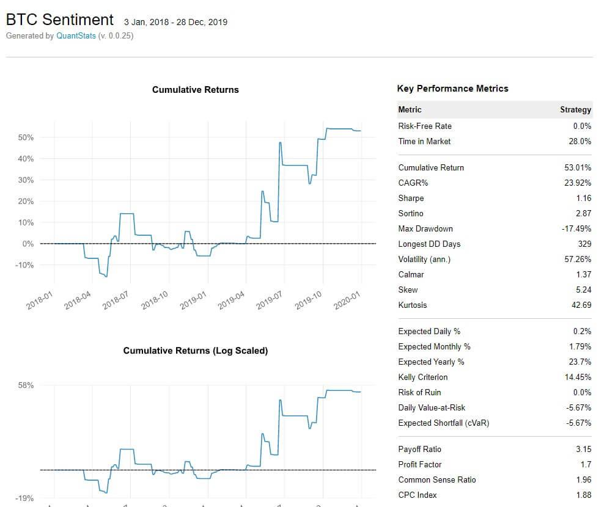

Algorithmic trading, often known as algo trading, involves the use of computer programs and algorithms to execute trades at high speed and volume, leveraging complex mathematical models and formulas. This method has become significant in financial markets as it enhances trading efficiency and decision-making while minimizing human intervention. With the ability to analyze vast datasets and execute trades within milliseconds, algo trading allows market participants to capitalize on micro-movements in price, improving liquidity and market dynamics.

Backtrader emerges as a powerful tool in this landscape, specifically designed for backtesting trading strategies. It provides a comprehensive framework for quantitative trading, enabling traders to test and validate their strategies on historical data before deploying them live. This process is crucial as it helps in identifying potential flaws and optimizing strategy parameters without financial risk.



Using Backtrader offers several notable advantages. It supports multiple data feeds and custom analyzers, making it versatile and adaptable for different trading approaches. Its modular design allows for flexibility in constructing, testing, and deploying trading strategies with minimal programming effort. Additionally, as an open-source platform, Backtrader is accessible to a wide audience, fostering a vibrant community of users and contributors who continually enhance its capabilities.

The purpose of this article is to explore the features and use cases of Backtrader within the context of algorithmic trading. We will examine the tool's implementation, its user community, and conclude with a reflection on its role in the continuously evolving landscape of financial trading. The subsequent sections will cover an in-depth understanding of algorithmic trading, an introduction to Backtrader and its history, a detailed analysis of its features, a guide on implementing trading strategies, and insights into the Backtrader community and available resources.

## Table of Contents

## Understanding Algorithmic Trading

Algorithmic trading, often termed as algo trading, involves the execution of trades using predefined computational algorithms. These algorithms make critical trading decisions, such as when to buy or sell financial instruments, based on programmed instructions. The key components of algorithmic trading include a historical data feed, a strategy, an execution model, risk management rules, and performance metrics.

Algorithms enhance trading efficiency by minimizing human intervention, thereby reducing the likelihood of emotional trading. This systematic approach allows for faster and more accurate trading decisions, capitalizing on computational speed and data analysis capabilities. Algorithms can process vast amounts of data to identify trading signals and execute trades at optimal times, often in mere milliseconds.

Common [algorithmic trading](/wiki/algorithmic-trading) strategies include [trend following](/wiki/trend-following), [arbitrage](/wiki/arbitrage), mean reversion, and [statistical arbitrage](/wiki/statistical-arbitrage). Trend following strategies, for instance, rely on algorithms to identify market trends and generate buy or sell signals accordingly. A simple trend-following strategy might look for situations where short-term [momentum](/wiki/momentum) surpasses long-term momentum, indicating a potential upward trend. Arbitrage strategies exploit price discrepancies between different markets or instruments, executing trades to profit from these differences before they converge.

Backtesting plays a pivotal role in refining trading strategies by assessing their potential in historical market conditions. It allows traders to evaluate the effectiveness and risk of strategies by simulating their performance on past data. This process helps in identifying flaws or weaknesses, leading to iterative strategy improvements. For instance, using Python libraries like Backtrader, traders can backtest strategies with historical data, visualize performance metrics, and adjust parameters for enhanced execution.

Transitioning to tools like Backtrader, they facilitate these processes by providing a comprehensive platform to implement and test algorithmic strategies. Backtrader supports multiple data feeds, offers visualization tools, and includes pre-built indicators, making it accessible for both novice and experienced traders to refine and validate their trading algorithms.

 to Backtrader

Backtrader is a widely recognized open-source platform specifically designed for [backtesting](/wiki/backtesting) trading strategies. It has gained significant traction within the trading community for its robust functionality and versatility. Launched in 2015 by Daniel Rodriguez, Backtrader addresses the need for a comprehensive, user-friendly tool that enables traders to test their trading strategies against historical data before applying them in live markets.

The popularity of Backtrader can be attributed to its open-source nature, which not only allows traders to use it without licensing costs but also encourages community contributions. This collaborative environment has led to continuous improvements and the addition of features, making it a flexible and powerful tool for algorithmic traders at various levels of expertise.

Backtrader offers a wide array of core functionalities that cater to the diverse needs of traders. It provides support for multiple data feeds, which means users can input and analyze data from different sources, such as CSV files, databases, or live data streams. Furthermore, Backtrader's architecture allows for the integration of custom indicators and strategies, giving users the ability to tailor their approach to their specific trading requirements. The platform's simulation capabilities are particularly noteworthy, allowing users to replicate trading scenarios, evaluate risk, and adjust strategies accordingly.

The comparison of Backtrader with other backtesting platforms often highlights its simplicity and ease of use, distinct features that set it apart. While platforms like QuantConnect and Zipline offer similar functionalities, Backtrader is praised for its straightforward implementation and vast documentation. Unlike some proprietary trading systems, which may limit user access to underlying algorithms, Backtrader's open-source framework provides transparency and adaptability.

Overall, Backtrader stands out in the landscape of algorithmic trading tools due to its powerful features, supportive community, and open-access philosophy. These attributes make it an attractive choice for traders looking to refine their strategies in a flexible yet reliable environment.

## Features and Benefits of Using Backtrader

Backtrader is an acclaimed open-source framework for backtesting trading strategies, offering robust simulation capabilities and a suite of features that cater to both novice and seasoned algorithmic traders.

One of Backtrader's prominent features is its ability to handle multiple data feeds and indicators seamlessly. This capability allows users to work with various asset classes, timeframes, and aggregated data without complication. The platform supports data feeds from diverse sources such as CSV files, Yahoo Finance, and even real-time feeds, providing traders with flexibility in accessing and resampling data to suit their strategy needs. Moreover, Backtrader’s comprehensive library of indicators includes moving averages, stochastic oscillators, and other technical analysis tools that traders can readily implement and modify.

The platform shines in the adaptability it offers for creating custom strategies. Users can develop complex trading algorithms using Python, enabling the combination of multiple indicators and trading signals based on specific conditions. Backtrader's architecture facilitates the integration of these bespoke strategies within its simulation environment, allowing traders to test their hypotheses rigorously. Below is a simple example demonstrating how a user might define a moving average crossover strategy in Backtrader:

```python
class MovingAverageCrossover(bt.SignalStrategy):
    def __init__(self):
        self.ma_short = bt.indicators.SimpleMovingAverage(self.data.close, period=10)
        self.ma_long = bt.indicators.SimpleMovingAverage(self.data.close, period=30)
        self.signal_add(bt.SIGNAL_LONG, self.ma_short > self.ma_long)
        self.signal_add(bt.SIGNAL_SHORT, self.ma_short < self.ma_long)
```

Backtrader’s user-friendly interface is another significant advantage, making it accessible to traders with varying levels of programming expertise. The detailed and comprehensive documentation further enhances the user experience, providing clear guidance on platform functionalities, strategy development, and data handling, which assists users in overcoming common challenges associated with backtesting environments. This attention to documentation supports effective troubleshooting and accelerates the learning curve for new users.

Despite its many benefits, Backtrader is not without challenges. The platform, being primarily reliant on Python, may encounter some performance limitations when handling extremely large datasets or executing complex computational tasks. Additionally, users may need to invest time in coding and understanding Backtrader's API to exploit its full potential, which could be a hurdle for those less familiar with programming.

Overall, while Backtrader offers comprehensive tools and flexibility, traders should weigh these challenges against the advantages to assess whether it aligns with their trading strategy development and backtesting needs.

## Implementing Trading Strategies with Backtrader

Implementing trading strategies with Backtrader involves a series of structured steps that encompass setting up the platform, ingesting and visualizing data, and executing strategies. This process is crucial for traders aiming to harness the full potential of algorithmic trading.

### Step-by-step Guide on Setting up Backtrader

1. **Installation**: Begin by installing Backtrader using pip, a package manager for Python. Run the following command:
   ```bash
   pip install backtrader
   ```

2. **Environment Preparation**: Ensure you have a working Python environment. It is advisable to use a virtual environment to manage dependencies. You can set this up using:
   ```bash
   python -m venv backtrader-env
   ```

3. **Initial Setup**: Create a new Python script and import the essential Backtrader modules:
   ```python
   import backtrader as bt
   ```

4. **Creating a Strategy**: Define a basic strategy by subclassing `bt.Strategy`. This involves specifying trading logic within key methods such as `__init__` and `next`.

### Explanation of Data Ingestion and Visualization Process

Backtrader supports various data feeds, allowing traders to input historical data in different formats, such as CSV or through APIs from data providers.

1. **Data Feed Setup**: Prepare your data in a compatible format. For example, if using CSV:
   ```python
   data = bt.feeds.YahooFinanceCSVData(dataname='your_data.csv')
   ```

2. **Adding Data to Cerebro**: Cerebro is the main engine in Backtrader that orchestrates the execution of strategies. Add your data feed to Cerebro:
   ```python
   cerebro = bt.Cerebro()
   cerebro.adddata(data)
   ```

3. **Visualization**: Backtrader automatically plots the results of strategy execution. This feature helps in visualizing the trading decisions and outcomes interactively.

### Examples of Implementing a Basic Trading Strategy

Implementing a simple moving average crossover strategy involves defining two moving averages and generating buy/sell signals based on their interactions. Below is an example strategy:

```python
class SMAStrategy(bt.Strategy):
    def __init__(self):
        self.sma1 = bt.indicators.SimpleMovingAverage(self.data.close, period=10)
        self.sma2 = bt.indicators.SimpleMovingAverage(self.data.close, period=30)

    def next(self):
        if self.sma1 > self.sma2 and not self.position:
            self.buy()
        elif self.sma1 < self.sma2 and self.position:
            self.sell()
```

### How to Perform Backtesting and Analyze Results

Backtesting involves executing a trading strategy using historical data to assess its performance.

1. **Executing Backtests**: Add your strategy to Cerebro and run it:
   ```python
   cerebro.addstrategy(SMAStrategy)
   cerebro.run()
   ```

2. **Analyzing Results**: Upon completion, Backtrader will provide detailed logs and performance metrics. These include portfolio value over time, trade logs, and more.

### Case Studies of Successful Trading Strategies Implemented with Backtrader

While specific case studies depend on available data and strategies, Backtrader users often share successful implementations through community platforms and forums. Examples include:

- **Mean Reversion**: Using statistical methods to identify deviations from average prices and making trades accordingly.
- **Pair Trading**: Exploiting price movements between correlated securities, demonstrated effectively using Backtrader’s flexibility in handling multiple data feeds.

These steps and examples outline the fundamental process of implementing and testing trading strategies using Backtrader, showcasing its utility in developing robust algorithmic trading solutions.

## Backtrader Community and Resources

The Backtrader community is a dynamic and supportive group of traders and developers who share a common interest in algorithmic trading. This community is instrumental in enhancing the tool's functionality through collaborative efforts and provides an invaluable resource for both novice and experienced users. Various online forums, such as the GitHub repository (https://github.com/mementum/[backtrader](/wiki/backtrader)) and the Backtrader Community Forum (https://community.backtrader.com), serve as hubs for discussion, troubleshooting, and sharing of strategies and ideas.

Within these platforms, users can find a wealth of resources, including tutorials, guides, and sample codes. These materials are designed to help traders effectively implement and backtest their trading strategies using Backtrader. Numerous tutorials and step-by-step guides are available, both official and user-generated, which cover everything from installation to advanced strategy development. Sample codes provide practical examples of how to execute various trading strategies, offering a hands-on approach to learning the platform's capabilities.

Community contributions are vital to Backtrader's evolution. Users are encouraged to share their insights, plugins, and enhancements, which can lead to the development of new features and functionalities. Plugins extend Backtrader's core capabilities by adding new indicators, data feeds, and execution modules, thereby broadening the range of strategies that can be tested and implemented. This collaborative aspect of the community not only drives innovation but also ensures that Backtrader remains a relevant and versatile tool for algorithmic trading.

Engagement with the community is highly encouraged, as it aids in skill development and problem-solving. By participating in discussions, users can gain new perspectives, receive feedback on their strategies, and stay informed about the latest updates and trends in algorithmic trading. The community also provides a support network for troubleshooting, enabling users to overcome technical challenges more efficiently.

Contributing to Backtrader's development can be achieved in several ways. Users can report bugs, suggest improvements, or submit pull requests for new features on the platform's GitHub page. Contributions to the documentation, such as clarifying complex aspects or translating guides into other languages, are also valuable. These efforts not only support the community but also contribute to the overall refinement and growth of Backtrader as a leading tool in algorithmic trading.

## Conclusion

Backtrader has emerged as a valuable tool in the field of algorithmic trading, particularly for those who focus on backtesting and strategy development. Throughout this article, we have explored the comprehensive capabilities that Backtrader offers to both novice and experienced traders. Its significance is underscored by its powerful simulation environment, which allows for the thorough evaluation of trading strategies before deploying them in live markets. By facilitating the backtesting process, Backtrader helps improve strategy refinement, thereby contributing to more informed decision-making in trading activities.

Among the advantages of using Backtrader is its capability to support multiple data feeds and custom indicators, which provides traders with the flexibility required to craft sophisticated trading strategies. The platform's user-friendly interface and extensive documentation make it accessible for traders who are just beginning their journey in algorithmic trading, while its open-source nature allows for continuous improvement and community contributions.

For traders interested in starting with Backtrader, it is recommended to begin by exploring the rich repository of tutorials and sample codes available online. Engaging with the active user community can provide additional insights and practical advice, enhancing the learning curve. Starting with simple strategies can foster a gradual understanding of the platform’s functionalities, allowing for subsequent advancements into more complex endeavors.

Looking forward, the landscape of algorithmic trading continues to evolve, driven by technological advancements and increased market data availability. Tools like Backtrader empower traders to continuously test and adapt their strategies, which is crucial in a dynamic market environment. As the industry grows, acquiring skills in algorithm development and staying abreast of emerging trends will be essential for maintaining a competitive edge.

Thus, traders are encouraged to embrace ongoing learning and experimentation with algorithmic trading tools. By leveraging platforms like Backtrader, they can gain deeper insights, optimize their strategies, and navigate the challenges of modern financial markets with increased confidence.

## References & Further Reading

[1]: Bergstra, J., Bardenet, R., Bengio, Y., & Kégl, B. (2011). ["Algorithms for Hyper-Parameter Optimization."](https://dl.acm.org/doi/10.5555/2986459.2986743) Advances in Neural Information Processing Systems 24.

[2]: ["Advances in Financial Machine Learning"](https://www.amazon.com/Advances-Financial-Machine-Learning-Marcos/dp/1119482089) by Marcos Lopez de Prado

[3]: ["Evidence-Based Technical Analysis: Applying the Scientific Method and Statistical Inference to Trading Signals"](https://www.amazon.com/Evidence-Based-Technical-Analysis-Scientific-Statistical/dp/0470008741) by David Aronson

[4]: ["Machine Learning for Algorithmic Trading"](https://github.com/stefan-jansen/machine-learning-for-trading) by Stefan Jansen

[5]: ["Quantitative Trading: How to Build Your Own Algorithmic Trading Business"](https://www.amazon.com/Quantitative-Trading-Build-Algorithmic-Business/dp/1119800064) by Ernest P. Chan