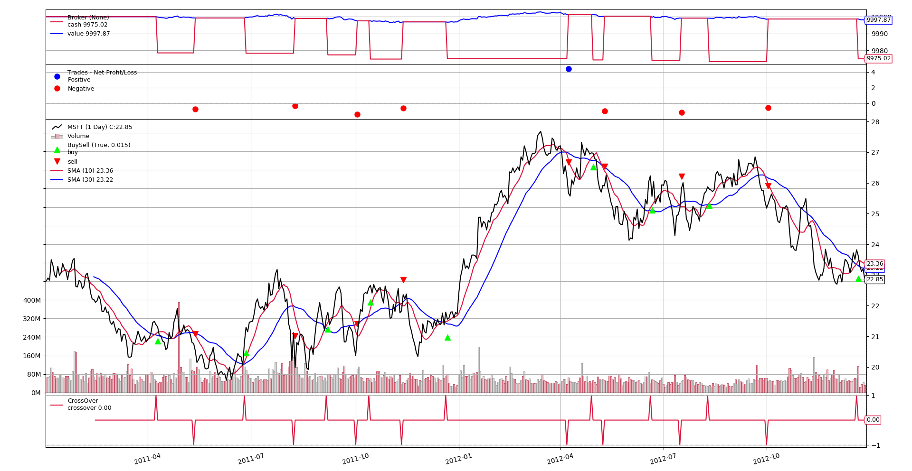

## Table of Contents

## What is Backtrader and why is it used for backtesting?

Backtrader is a popular open-source Python framework used for backtesting trading strategies. It allows traders and developers to simulate how a trading strategy would have performed in the past using historical market data. This helps in evaluating the effectiveness of a strategy before using it with real money. Backtrader is flexible and can handle various types of financial instruments, such as stocks, futures, and forex. It also supports different data feeds and allows users to create custom indicators and strategies.

Backtesting is important because it helps traders understand the potential risks and rewards of their strategies without risking actual capital. By using Backtrader, traders can test their ideas in a controlled environment, make adjustments, and refine their approaches. This process can save time and money, as it reduces the likelihood of making costly mistakes in live trading. Backtrader's comprehensive features and ease of use make it a valuable tool for anyone looking to develop and test trading strategies.

## How do you install Backtrader on different operating systems?

To install Backtrader on Windows, you first need to make sure you have Python installed on your computer. You can download Python from the official website if you don't have it already. Once Python is set up, open the command prompt and type `pip install backtrader`. Press enter, and the installation will start. It might take a few minutes, but once it's done, you can start using Backtrader to test your trading strategies.

For macOS users, the process is similar. Ensure you have Python installed, which often comes pre-installed on Macs. Open the Terminal, which you can find in the Applications folder under Utilities. In the Terminal, type `pip install [backtrader](/wiki/backtrader)` and hit enter. The installation should begin and complete in a few minutes, after which you can use Backtrader for your trading strategy [backtesting](/wiki/backtesting).

On Linux, you'll also need Python installed, which is commonly available on most distributions. Open the terminal and type `pip install backtrader`, then press enter. The installation will run and finish shortly, allowing you to use Backtrader to analyze your trading strategies.

## What are the basic components of a Backtrader strategy?

A Backtrader strategy has a few main parts that help it work. The first part is the initialization method, often called `__init__`. This is where you set up things like indicators and data feeds. Indicators are tools that help you understand the market, like moving averages or relative strength index. Data feeds give your strategy the historical price information it needs to make decisions. In the `__init__` method, you tell the strategy what data to use and what indicators to watch.

The next important part is the `next` method. This is where the strategy makes its trading decisions. Every time new data comes in, the `next` method runs and looks at the current market situation. Based on what it sees, it decides whether to buy, sell, or do nothing. You write the rules for these decisions in the `next` method. For example, you might decide to buy if a short-term moving average crosses above a long-term moving average. This method is crucial because it's where your trading logic lives.

There are also some other parts that can be useful but aren't always needed. One is the `stop` method, which runs at the end of the backtest. You can use it to clean up or do final calculations. Another is the `notify_order` and `notify_trade` methods, which tell you when orders are placed or trades happen. These can help you keep track of what's going on during the backtest. Together, these components make up a Backtrader strategy that can test how well your trading ideas would have worked in the past.

## How do you set up a simple trading strategy using Backtrader?

To set up a simple trading strategy using Backtrader, you first need to create a strategy class that inherits from Backtrader's Strategy class. In this class, you'll define the `__init__` method to set up your indicators and data feeds. For example, you might use a moving average crossover strategy where you compare a short-term moving average (like a 5-day average) with a long-term moving average (like a 20-day average). In the `__init__` method, you'll create these moving averages using Backtrader's built-in functions. You'll also add data feeds to tell Backtrader what historical data to use, such as daily prices for a specific stock.

Next, you'll define the `next` method in your strategy class. This is where you'll write the rules for when to buy or sell. For the moving average crossover strategy, you might decide to buy when the short-term moving average crosses above the long-term moving average, and sell when it crosses below. In the `next` method, you'll use conditional statements to check these conditions and then use Backtrader's `buy` and `sell` functions to execute trades. Once you've defined your strategy, you can run the backtest using Backtrader's Cerebro engine, which will simulate how your strategy would have performed using the historical data you provided.

1. **Installation**: Begin by installing Backtrader using pip, a package manager for Python. Run the following command:
   ```bash
   pip install backtrader
   ```

2. **Environment Preparation**: Ensure you have a working Python environment. It is advisable to use a virtual environment to manage dependencies. You can set this up using:
   ```bash
   python -m venv backtrader-env
   ```

3. **Initial Setup**: Create a new Python script and import the essential Backtrader modules:
   ```python
   import backtrader as bt
   ```

4. **Creating a Strategy**: Define a basic strategy by subclassing `bt.Strategy`. This involves specifying trading logic within key methods such as `__init__` and `next`.

### Explanation of Data Ingestion and Visualization Process

Backtrader supports various data feeds, allowing traders to input historical data in different formats, such as CSV or through APIs from data providers.

1. **Data Feed Setup**: Prepare your data in a compatible format. For example, if using CSV:
   ```python
   data = bt.feeds.YahooFinanceCSVData(dataname='your_data.csv')
   ```

2. **Adding Data to Cerebro**: Cerebro is the main engine in Backtrader that orchestrates the execution of strategies. Add your data feed to Cerebro:
   ```python
   cerebro = bt.Cerebro()
   cerebro.adddata(data)
   ```

3. **Visualization**: Backtrader automatically plots the results of strategy execution. This feature helps in visualizing the trading decisions and outcomes interactively.

### Examples of Implementing a Basic Trading Strategy

Implementing a simple moving average crossover strategy involves defining two moving averages and generating buy/sell signals based on their interactions. Below is an example strategy:

```python
class SMAStrategy(bt.Strategy):
    def __init__(self):
        self.sma1 = bt.indicators.SimpleMovingAverage(self.data.close, period=10)
        self.sma2 = bt.indicators.SimpleMovingAverage(self.data.close, period=30)

    def next(self):
        if self.sma1 > self.sma2 and not self.position:
            self.buy()
        elif self.sma1 < self.sma2 and self.position:
            self.sell()
```

### How to Perform Backtesting and Analyze Results

Backtesting involves executing a trading strategy using historical data to assess its performance.

1. **Executing Backtests**: Add your strategy to Cerebro and run it:
   ```python
   cerebro.addstrategy(SMAStrategy)
   cerebro.run()
   ```

2. **Analyzing Results**: Upon completion, Backtrader will provide detailed logs and performance metrics. These include portfolio value over time, trade logs, and more.

### Case Studies of Successful Trading Strategies Implemented with Backtrader

While specific case studies depend on available data and strategies, Backtrader users often share successful implementations through community platforms and forums. Examples include:

- **Mean Reversion**: Using statistical methods to identify deviations from average prices and making trades accordingly.
- **Pair Trading**: Exploiting price movements between correlated securities, demonstrated effectively using Backtrader’s flexibility in handling multiple data feeds.

These steps and examples outline the fundamental process of implementing and testing trading strategies using Backtrader, showcasing its utility in developing robust [algorithmic trading](/wiki/algorithmic-trading) solutions.


## What data formats does Backtrader support for historical price data?

Backtrader can use many different types of files for historical price data. It works well with CSV files, which are simple text files where data is separated by commas. It also supports other common formats like Excel files and even databases like SQLite. This means you can use data from many different sources without having to change it much.

You can also get data directly from the internet using Backtrader. It has built-in tools to fetch data from places like Yahoo Finance or other online data providers. This makes it easy to keep your data up to date and start backtesting quickly.

## How can you optimize a trading strategy using Backtrader's built-in tools?

To optimize a trading strategy using Backtrader, you can use its built-in optimization tools. These tools let you test your strategy with different settings to see which ones work best. For example, if you're using moving averages, you can try different time periods for the short-term and long-term averages. Backtrader will run your strategy many times, each time with different settings, and then show you which settings made the most money or had the least risk.

After running the optimization, Backtrader gives you a report that shows how each set of settings performed. This helps you pick the best settings for your strategy. You can then use these settings to backtest your strategy again and see how it would have done with real historical data. This way, you can fine-tune your strategy to make it work better before you start using it with real money.

## What are the key performance metrics Backtrader provides for evaluating strategies?

Backtrader gives you several key numbers to help you see how well your trading strategy is doing. These numbers include things like how much money you made overall, which is called the total return. It also tells you about the risk you took, with metrics like the maximum drawdown, which is the biggest drop in your account value. Another important number is the Sharpe ratio, which helps you understand if the returns you got were worth the risk you took.

You can also look at how often your strategy made money, which is the win rate. Backtrader will show you the average win and the average loss, so you can see if your winning trades are bigger than your losing trades. It also gives you the profit [factor](/wiki/factor-investing), which is the total money made from winning trades divided by the total money lost from losing trades. All these numbers help you decide if your strategy is good or if you need to make changes.

## How do you implement risk management in Backtrader?

In Backtrader, you can use risk management to make your trading strategy safer. One way to do this is by setting stop-loss orders. A stop-loss order is like a safety net that automatically sells your stock if its price drops too much. You can tell Backtrader to use stop-loss orders by writing code that says, "If the price goes down by this much, sell the stock." This helps you lose less money if the market goes against your trade.

Another way to manage risk in Backtrader is by controlling how much money you put into each trade. You can set a rule that says you'll only use a small part of your total money for each trade. This is called position sizing. By using position sizing, you spread out your risk so that one bad trade won't hurt your whole account too much. Backtrader lets you set these rules in your strategy code, so you can make sure you're not risking too much on any single trade.

## Can you explain how to use Backtrader for multi-asset backtesting?

To use Backtrader for multi-asset backtesting, you need to set up your strategy to handle more than one type of investment at the same time. This means you can test how your trading rules work with different stocks, currencies, or other financial products all at once. In Backtrader, you do this by adding multiple data feeds to your strategy. Each data feed represents the historical prices of a different asset. For example, you might add data feeds for Apple stock, the Euro to US Dollar exchange rate, and gold prices. By including these different feeds, Backtrader can simulate how your strategy would perform across all these assets together.

Once you have your data feeds set up, you can write your strategy's rules in the `next` method to make decisions based on all the assets. For instance, you might decide to buy Apple stock if its price goes up, while also selling Euros if the exchange rate drops. Backtrader will run through the historical data for all these assets at the same time, letting you see how your strategy would have worked in the past. This helps you understand if your trading ideas are good across different types of investments, which can make your strategy more robust and less risky.

## What advanced features does Backtrader offer for experienced users?

Backtrader has some cool tools for people who know a lot about trading and coding. One of these tools is called 'sizers'. Sizers help you decide how much of your money to use for each trade. You can set up different rules for how much to buy or sell, based on things like how much money you have or how risky the trade is. Another advanced feature is 'resampling' and 'replaying'. These let you change the time periods of your data. For example, you can take daily data and turn it into weekly data to see how your strategy works over longer times. This is useful if you want to test your strategy in different ways.

Another neat thing in Backtrader is 'pyfolio integration'. Pyfolio is a tool that gives you detailed reports about how your strategy did. When you use it with Backtrader, you get a lot more information about your trades, like how much risk you took and how well you did compared to the market. This can help you make your strategy even better. Also, Backtrader lets you use 'custom indicators' and 'analyzers'. Custom indicators are special tools you make yourself to help understand the market better. Analyzers give you numbers and charts to see how your strategy is doing. All these features make Backtrader a powerful tool for experienced traders who want to really dig into their strategies.

## How do you integrate external data sources into Backtrader for more complex strategies?

To use external data in Backtrader for more complex strategies, you first need to get the data from where it's stored. This could be a website, a database, or a file. Once you have the data, you need to make sure it's in a format that Backtrader can understand, like a CSV file. You can write code to take the data from the external source and turn it into a format that Backtrader can read. After you've done this, you add the data to your Backtrader strategy using something called a 'data feed'. This tells Backtrader to use the new data when it's running your strategy.

Once you've added the external data to your strategy, you can use it to make smarter trading decisions. For example, you might use weather data to help predict how certain stocks will do, or economic reports to decide when to buy or sell. In your strategy's code, you can write rules that look at this extra data along with the usual price data. This way, your strategy can be more complex and might work better because it's using more information. Backtrader makes it easy to mix different kinds of data, so you can test out all sorts of ideas to see what works best.

## What are common pitfalls and best practices when using Backtrader for backtesting?

When using Backtrader for backtesting, one common pitfall is overfitting your strategy. This happens when you make your strategy too complicated, trying to fit it perfectly to past data. It might look great in the backtest, but it won't work well in real trading because it's too specific to the past. Another pitfall is not accounting for trading costs like commissions and slippage. If you don't include these in your backtest, your strategy might seem more profitable than it really is. It's also easy to forget about things like market holidays or different trading hours, which can mess up your results.

To avoid these pitfalls, it's best to keep your strategy simple and focused on a few clear rules. Don't try to make it too perfect. Always include realistic trading costs in your backtest so you get a true picture of how your strategy will perform. Also, make sure to use a good amount of historical data, and test your strategy over different time periods to see if it works consistently. This helps you avoid overfitting and gives you a better idea of how your strategy will do in the future.

## References & Further Reading

[1]: Bergstra, J., Bardenet, R., Bengio, Y., & Kégl, B. (2011). ["Algorithms for Hyper-Parameter Optimization."](https://dl.acm.org/doi/10.5555/2986459.2986743) Advances in Neural Information Processing Systems 24.

[2]: ["Advances in Financial Machine Learning"](https://www.amazon.com/Advances-Financial-Machine-Learning-Marcos/dp/1119482089) by Marcos Lopez de Prado

[3]: ["Evidence-Based Technical Analysis: Applying the Scientific Method and Statistical Inference to Trading Signals"](https://www.amazon.com/Evidence-Based-Technical-Analysis-Scientific-Statistical/dp/0470008741) by David Aronson

[4]: ["Machine Learning for Algorithmic Trading"](https://github.com/stefan-jansen/machine-learning-for-trading) by Stefan Jansen

[5]: ["Quantitative Trading: How to Build Your Own Algorithmic Trading Business"](https://www.amazon.com/Quantitative-Trading-Build-Algorithmic-Business/dp/1119800064) by Ernest P. Chan