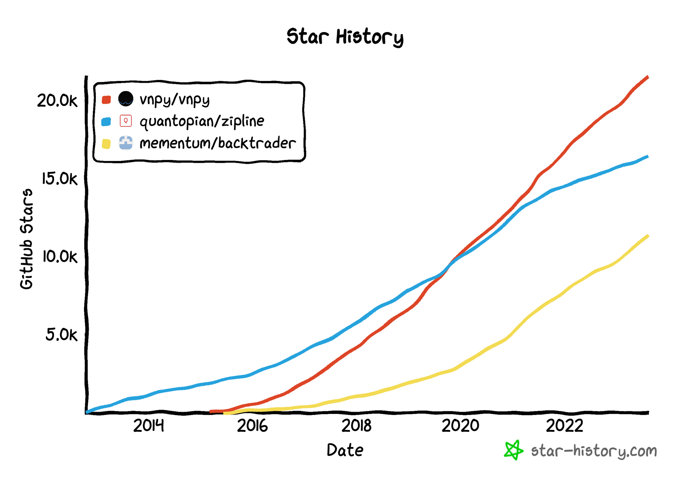

Backtesting, at its core, is the process of testing a [trading strategy](https://paperswithbacktest.com/) or hypothesis on [historical data](https://paperswithbacktest.com/datasets) to evaluate its viability in the real market. This method stands at the forefront of algorithmic trading. By simulating trades on [past market data](https://paperswithbacktest.com/datasets), traders gain insights into how a particular strategy might perform in the future, without risking real capital. While it's essential to remember that past performance is not always indicative of future results, [backtesting offers a systematic way to scrutinize a strategy](https://blog.paperswithbacktest.com/p/backtesting-a-trading-strategy-on), refine it, and boost confidence before taking it live.

Enter Backtrader. Backtrader has rapidly ascended as one of the go-to platforms for both newcomers and seasoned professionals in the trading world. The platform's intuitive interface, extensive library of indicators, and adaptability across [various data sources](https://paperswithbacktest.com/datasets) make it an indispensable asset. But beyond its feature-rich environment, Backtrader shines in its ability to cater to users across the expertise spectrum. For beginners, it's a welcoming entry point into the vast world of algorithmic trading, with ample documentation and community support. For experts, it offers a depth of customization, allowing for intricate strategy design and performance analysis, positioning itself as a robust engine powering countless trading ventures.



So, whether you're dipping your toes into the algorithmic trading waters or are a seasoned trader seeking a comprehensive tool, Backtrader promises a blend of functionality and flexibility, ready to be the backbone of your trading journey.

# What is Backtrader?

Backtrader originated as an open-source Python framework crafted to meet the demands of those in the algorithmic trading sphere. Its inception was driven by a need for a flexible, comprehensive, and efficient tool that could accommodate the various facets of backtesting and trading[1]. Over the years, it has evolved, fortified by consistent updates and an ever-growing community of enthusiasts, developers, and traders. Today, it stands as one of the most preferred platforms for those delving into the intricacies of algorithmic trading, be it backtesting or live trading.


At its core, Backtrader boasts an extensive suite of features tailored to ensure that traders, irrespective of their expertise level, can navigate the world of algorithmic trading with relative ease. Some of its standout functionalities include:

1. **Versatile Data Feed Compatibility:** Backtrader can seamlessly integrate with various data feeds, be it [historical data for backtesting](https://paperswithbacktest.com/datasets) or real-time data for live trading, ensuring a user isn’t limited by data source constraints.
2. **Rich Library of Indicators:** From common indicators like moving averages to the more complex ones, Backtrader has an extensive set pre-built, yet it also provides the flexibility to craft custom indicators tailored to a trader’s specific needs.
3. **Visual Analysis Tools:** Integrated plotting tools allow traders to visually analyze their strategies against [historical data](https://blog.paperswithbacktest.com/p/how-to-collect-data-for-backtesting), offering insights that might be missed in mere numerical evaluations.
4. **Broker Integration:** For those looking to transition from backtesting to live trading, Backtrader supports integration with a range of brokers, simplifying the shift from a simulated environment to the real market.
5. **Modular Approach:** One of Backtrader's key strengths is its modular structure. Components like strategies, analyzers, and indicators can be developed independently, fostering easier testing and iteration.
6. **Optimization Capabilities:** Users can run strategies with various parameters to discern the most optimal configurations, a vital step before deploying any strategy live.

In essence, Backtrader amalgamates a host of essential features, paving the way for a streamlined and efficient trading workflow. Its development trajectory, coupled with its expansive toolset, underscores its significance in the algorithmic trading domain and its continued relevance in an ever-evolving market landscape[2].

# Why Choose Backtrader?

When navigating the diverse landscape of algorithmic trading tools, one might wonder: Why should Backtrader be the tool of choice? The answer lies in its unique combination of features, flexibility, and community support that differentiates it from other platforms.

1. **Ease of Use:** For those embarking on their algorithmic trading journey, Backtrader offers an intuitive framework. The platform is designed with a user-friendly syntax, making the process of coding, backtesting, and [trading strategies](https://paperswithbacktest.com/) straightforward, even for those with limited programming experience.
2. **Extensibility:** Backtrader's architecture is inherently modular. Whether it's adding a custom indicator, integrating a new data feed, or even connecting a different broker, the platform allows for seamless extensions without disrupting existing configurations.
3. **Comprehensive Documentation:** One of the challenges many traders face with new tools is the steep learning curve. Backtrader mitigates this with its robust documentation, providing clear examples, tutorials, and guides to ensure users can quickly grasp its functionalities.
4. **Active Community:** A testament to Backtrader's popularity is its thriving community. Online forums, discussion groups, and GitHub repositories are bustling with traders and developers sharing insights, solutions, and enhancements, facilitating collective growth and learning.
5. **Broker-agnostic:** Unlike some platforms that bind users to specific brokers, Backtrader offers flexibility. It supports a multitude of brokers, ensuring traders have the freedom to choose one that aligns best with their trading needs.
6. **Performance Metrics:** Post-backtest analysis is crucial, and Backtrader shines here with its detailed metrics, ranging from Sharpe ratios to drawdown statistics, ensuring traders can evaluate their strategies' robustness effectively.
7. **Visualization Capabilities:** While numbers are informative, visual representations can offer deeper insights. Backtrader’s built-in plotting tools allow traders to visually assess strategies against historical data, making strategy evaluations more intuitive.

In summary, Backtrader’s prowess isn't just in its feature set but in its holistic approach, catering to both novice traders and seasoned professionals. Its adaptability, combined with an engaged community, ensures it remains a preferred choice in the realm of algorithmic trading.

# Potential Limitations and Challenges

While Backtrader has emerged as a standout tool in the algorithmic trading landscape, no platform is without its challenges. Addressing these head-on can ensure users are better prepared and can harness the platform's capabilities more effectively.

1. **Limited Native Support for Multi-asset Backtesting:** [Backtrader primarily supports single-asset backtesting](https://blog.paperswithbacktest.com/p/backtesting-a-trading-strategy-on). For traders wanting to test strategies involving multiple assets simultaneously, this can be a hindrance. However, with some advanced coding, it's possible to incorporate multi-asset backtesting, albeit with more effort.
2. **Broker Integrations:** Though Backtrader is broker-agnostic, not all broker APIs are natively supported. This may require traders to develop custom integrations. It's advisable to check the community forum or GitHub repositories, as often, integrations developed by other users are available for use.
3. **Learning Curve for Non-Python Programmers:** As Backtrader is Python-based, traders unfamiliar with Python might face initial challenges. The solution here is twofold: leverage the extensive documentation available, and consider investing time in basic [Python courses](https://paperswithbacktest.com/course) to smoothen the learning trajectory.
4. **Real-time Data Feeds:** Backtrader doesn't inherently provide real-time data. Traders must integrate with third-party data providers or brokers for this. While this offers flexibility in choosing data sources, it also means an additional step in the setup process.
5. **Memory Consumption during Optimization:** When performing optimization over extensive datasets or a vast parameter space, Backtrader can be memory-intensive. To alleviate this, traders can either optimize in chunks or consider using cloud-based solutions with greater memory capacities.
6. **Lack of GUI Interface:** Unlike some platforms that offer graphical interfaces, Backtrader operates primarily through code. While this offers greater flexibility and customization, it might be less appealing to those who prefer GUI-based systems. However, several community-developed projects offer GUI solutions on top of Backtrader.
7. **Parallelization Limitations:** Backtrader's built-in parallelization capabilities can sometimes be restricted, especially when dealing with complex strategies or large data volumes. To circumvent this, traders can manually implement parallelization techniques or use external libraries to enhance performance.

Understanding these challenges allows traders to navigate them effectively. By leveraging the solutions and workarounds available, and by actively participating in the Backtrader community, users can mitigate these limitations and make the most of what the platform offers.

# Setting Up Your Backtrader Environment

Getting your Backtrader environment up and running is the foundation for your algorithmic trading journey. Here's a step-by-step process to ensure you’re properly set up:

1. **Installation:**
    - Begin by ensuring you have Python installed, preferably Python 3.6 or later. If not, download it from the official [Python website](https://www.python.org/downloads/).
    - Once Python is set up, install Backtrader via pip with the command: `pip install backtrader`.
2. **Choosing an IDE:**
    - While Backtrader doesn’t demand a specific Integrated Development Environment (IDE), using a robust IDE can significantly enhance your coding experience.
    - **Visual Studio Code (VSCode)**: Highly versatile and widely used, VSCode offers extensions such as Python extension for enhanced Python coding, debugging, and linting.
    - **PyCharm:** Another favorite among Python developers, it offers a dedicated environment with powerful debugging tools and code navigation features.
    - **Jupyter Notebook:** Ideal for those who prefer an interactive coding environment, especially when analyzing data or plotting graphs.
    - After choosing an IDE, ensure it’s properly set up to recognize your Python interpreter. Often, this might involve pointing the IDE to the Python executable or setting up a virtual environment.
3. **Initial Configuration:**
    - **Setting up Data Feeds:** Backtrader doesn't provide market data by default. Depending on your trading needs, you might want to set up data feeds from sources like Yahoo Finance, Quandl, or directly from broker APIs. Typically, this involves creating a data feed object and passing it to the Backtrader engine.
    - **Broker Setup:** If you intend to do live trading later, consider setting up broker integration from the outset. Brokers like Interactive Brokers or Oanda can be integrated, though you might need additional libraries like `ibpy2` for Interactive Brokers.
    - **Logging and Visual Output:** Configure Backtrader’s logging settings based on your preference. If you're keen on visual output, ensure you have the required libraries (like `matplotlib`) installed for plotting.

Remember, setting up the environment correctly is paramount. It can save time, reduce errors, and ensure a smoother workflow as you deep dive deeper into algorithmic trading with Backtrader. Always refer to the [official Backtrader documentation](https://www.backtrader.com/docu/) for any detailed queries or nuances related to setup and configuration.

# Starting with Backtrader

Diving into Backtrader begins with writing your first line of code and understanding how data is imported, manipulated, and logged. Let’s embark on this journey.

**1. Your First Code with Backtrader:**
Begin by importing necessary libraries:

```python
import backtrader as bt
```

Now, create a simple strategy. In this case, a moving average crossover:

```python
class FirstStrategy(bt.Strategy):

    def __init__(self):
        self.sma1 = bt.indicators.SimpleMovingAverage(period=50)
        self.sma2 = bt.indicators.SimpleMovingAverage(period=200)

    def next(self):
        if self.sma1 > self.sma2:
            if not self.position:
                self.buy()
        elif self.sma1 < self.sma2:
            if self.position:
                self.sell()
```

**2. Acquiring and Importing Data:**

- **Conventional Sources:** Backtrader is equipped to import data from sources like Yahoo Finance. Here's how you can use a CSV file from Yahoo:
    
    ```python
    data = bt.feeds.YahooFinanceCSVData(dataname='path_to_your_file.csv')
    ```
    
- **Alternative Data Sources:** Maybe you have data in a custom format or from a different source. In such cases, you can create a custom data feed. Here's a simple structure:
    
    ```python
    class CustomData(bt.feed.GenericCSVData):
        params = (
            ('datetime', 0),
            ('open', 1),
            ('high', 2),
            ('low', 3),
            ('close', 4),
            ('volume', 5),
            ('openinterest', -1)
        )
    ```
    

With your custom class, load data using:

```python
data = CustomData(dataname='path_to_custom_file.csv')
```

<aside>
👉 **Data Sources**:

- [Yahoo Finance](https://finance.yahoo.com/): A reliable free source to obtain historical stock data in CSV format which can be fed into Backtrader.
- [Alpha Vantage](https://www.alphavantage.co/): Offers free APIs for historical and real-time stock data.
- [Quandl](https://www.quandl.com/): Provides a vast array of financial and economic datasets, some free and some paid.
</aside>

**3. Logging and Printing Data Using Strategy Class:**
To track and monitor data points or actions during backtesting, utilize the built-in logging methods:

```python
def log(self, txt, dt=None):
    ''' Logging function for the strategy'''
    dt = dt or self.datas[0].datetime.date(0)
    print(f'{dt.isoformat()}, {txt}')
```

Now, in your strategy, you can use the `log` method to track when a buy or sell order is executed:

```python
def next(self):
    if self.sma1 > self.sma2:
        if not self.position:
            self.buy()
            self.log('BUY EXECUTED')
        elif self.sma1 < self.sma2:
            if self.position:
                self.sell()
                self.log('SELL EXECUTED')
```

By following these steps, you've laid the groundwork for your algorithmic trading journey with Backtrader. Always keep the [official Backtrader documentation](https://www.backtrader.com/docu/) handy for deeper dives into specific functionalities.

# Deep Dive into Backtesting

Backtesting, at its core, is the process of testing a strategy using historical data before risking any actual money. A thorough backtest determines the feasibility of your strategy in real-world scenarios. Here's how to deep dive deeper with Backtrader:

**Crafting a Robust Strategy:**

Your strategy is the heart of your backtest. Start by clearly defining your buy and sell criteria. This could be based on technical indicators, price patterns, or any other data-driven logic. Remember to account for slippage, transaction costs, and other real-world considerations. Regularly review and refine your strategy, especially when you encounter consecutive losses or when market dynamics change.

**Utilizing Built-in Indicators and Crafting Custom Ones:**

Backtrader boasts a plethora of built-in indicators, such as Moving Averages, RSI, MACD, and more. These can be readily invoked with commands like:

```python
sma = bt.indicators.SimpleMovingAverage(self.data.close)
```

Sometimes, though, you'll need to craft custom indicators. This can be done by subclassing `bt.Indicator` and defining lines and formulas:

```python
class TripleMovingAverage(bt.Indicator):
    lines = ('tma',)
    params = (('period', 15),)

    def __init__(self):
        ma1 = bt.indicators.SimpleMovingAverage(self.data, period=self.p.period)
        ma2 = bt.indicators.SimpleMovingAverage(ma1, period=self.p.period)
        ma3 = bt.indicators.SimpleMovingAverage(ma2, period=self.p.period)
        self.lines.tma = ma3
```

**Understanding the Results: Key Performance Metrics Explained:**

After backtesting, understanding the results is crucial. Backtrader provides various metrics such as:

- **Net Profit:** Total profit after subtracting losses and costs.
- **Drawdown:** The decline in value from the highest point of your portfolio to the lowest.
- **Sharpe Ratio:** Measures the risk-adjusted performance.
- **Compound Annual Growth Rate (CAGR):** The geometric progression ratio providing a constant rate of return over time.

**Advanced Techniques:**

- **Optimization:** Backtrader supports strategy parameter optimization using the `optstrategy` method. While optimization can enhance results, be wary of overfitting — when a strategy works exceedingly well on past data but fails with new data.
- **Stock Screening:** You can use Backtrader to screen stocks based on specific criteria. For instance, you might want to filter stocks based on their average volume or a specific pattern in their price data.
- **Plotting:** Visual representation of your backtesting results can offer invaluable insights. Use the `plot()` function after running the backtest:
    
    ```python
    cerebro.run()
    cerebro.plot()
    ```
    

With Backtrader's versatile toolkit at your fingertips, the depths of backtesting are vast but navigable. Ensure that you leverage its capabilities while maintaining a critical eye to avoid pitfalls like overfitting. Remember, the best strategies are those that are robust across various scenarios and over time. For more intricate details, the [official Backtrader documentation](https://www.backtrader.com/docu/) remains a comprehensive resource.

<aside>
👉 **Tutorials and Courses**:

- [AlgoTrading101's Backtrader Guide](https://algotrading101.com/learn/backtrader-for-backtesting/): Comprehensive guide for beginners.
- [Sentdex's Algorithmic Trading Series on YouTube](https://www.youtube.com/playlist?list=PLQVvvaa0QuDcOdF96TBtRtuQksErCEBYZ): A series of video tutorials illustrating the ins and outs of algorithmic trading using Python.
</aside>

# Live Trading with Backtrader

Moving from backtesting to live trading is a significant leap, and with Backtrader, the transition can be seamless if approached with caution.

**Precautions and Preparations Before Going Live:**

Before you commence live trading, it's paramount to double-check your strategy against multiple data sets and time frames. A strategy that's been optimized too much on a specific set might falter in real-time conditions. This phenomenon, known as overfitting, can be your downfall. Moreover, ensure that you have a risk management plan in place, setting stop-loss and take-profit levels that align with your risk tolerance.

**Setting Up and Configuring a Live Trading Environment:**

Backtrader is compatible with various brokers through its built-in broker API integrations. Some popular choices include Interactive Brokers and Oanda. Once you've chosen your broker:

1. Obtain the necessary API keys or access tokens from the broker platform.
2. Initialize the broker within your Backtrader code. For instance, with Oanda:
    
    ```python
    import backtrader as bt
    
    cerebro = bt.Cerebro()
    broker_config = {'token': 'YOUR-TOKEN', 'account': 'YOUR-ACCOUNT-ID'}
    cerebro.broker = bt.brokers.OandaBroker(**broker_config)
    ```
    
3. Ensure real-time data feed is set up. Unlike backtesting, which uses static data, live trading requires real-time or near-real-time data. Most broker APIs provide this, but double-check the frequency and reliability.

**Monitoring and Adjusting Live Trades:**

Once live, continuous monitoring is essential. While Backtrader can automate most tasks, network issues, sudden market events, or unforeseen bugs can occur. Implement logging and alert mechanisms to notify you of trade executions or if something goes awry. Regularly review performance and be prepared to adjust or halt trading if the strategy starts underperforming or if market conditions change significantly.

While Backtrader simplifies the transition to live trading, always remember the inherent risks. Start with a smaller amount or a demo account to test the waters. As you gain more confidence and understand the nuances, you can gradually scale up. For in-depth details on broker integrations and live trading setups, the [official Backtrader documentation](https://www.backtrader.com/docu/) is an indispensable resource.

<aside>
👉 **Checklist for Quick Reference**:

- **Strategy Creation**: Define your entry and exit criteria, select indicators, determine risk management rules.
- **Backtesting**: Acquire relevant data, choose a timeframe, set starting capital, and run your strategy.
- **Optimization**: Adjust strategy parameters, but avoid overfitting.
- **Visualization**: Plot trades, indicators, and performance metrics.
- **Live Trading**: Ensure broker compatibility, monitor performance regularly, and have a contingency plan.
- **Continuous Learning**: Stay updated with market trends, Backtrader updates, and refine strategies as needed.
</aside>

# Extending Backtrader's Capabilities

To fully harness the power of Backtrader, it's essential to understand how to extend its functionalities to cater to advanced needs and unique requirements. Here are some ways to achieve this:

**Adding Visual Statistics to Backtests for Better Analysis:**

Backtrader's plotting capabilities are flexible. To visualize statistics beyond the default, you can make use of `Analyzers`. For instance, drawdown statistics or custom performance metrics can be calculated and added to your plots. By extending the `Analyzer` class and overriding the necessary methods, you can add these statistics. Once defined, they can be added to `Cerebro`, the core Backtrader engine, using the `addanalyzer` method and later plotted for better visual analysis[3].

**Saving Backtest Data for Further Study:**

The results of a backtest, including trades, performance metrics, and other relevant data, can be crucial for further analysis. Backtrader provides a built-in way to save this data. Using the `pyfolio` integration, you can extract a `Pandas` DataFrame with your backtest results. This DataFrame can then be saved in various formats, like CSV or Excel, for future reference and study[4].

**Using Alternative Data Sources for Unique Insights:**

While many traders rely on traditional price and volume data, alternative data sources can offer a unique edge. These can include sentiment data, economic indicators, or even satellite imagery. Backtrader is versatile in this regard. By extending the `Feed` class, you can incorporate any data source, as long as it's structured in a time-series format. This allows you to test strategies that incorporate a broader range of information, possibly leading to novel and robust trading signals[5].

Tapping into these extended capabilities can give traders a distinct advantage by enabling a more comprehensive analysis, preserving insights for future use, and capitalizing on unconventional data sources.

# Beyond Backtrader

While Backtrader excels in many areas, there are alternative platforms traders may wish to explore depending on specific needs and requirements.

**Alternatives to Backtrader and When You Might Consider Them:**

1. **QuantConnect**[6]: Built on top of the Lean Algorithm Framework, QuantConnect offers cloud-based backtesting and supports multiple asset types. It's ideal if you're looking for a platform that offers parallel cloud-based backtesting and easy transitioning to live trading.
2. **Zipline**[7]: Developed by Quantopian, Zipline is another open-source platform for algorithmic trading. While Quantopian's community service has shut down, Zipline remains popular due to its robustness and compatibility with PyData tools. Consider this if you're looking to utilize a vast ecosystem of Python-based financial tools.
3. **MetaTrader 4/5**[8]: These platforms are dominant in the Forex market. If Forex is your primary trading focus, you might prefer the native environment of MetaTrader for its wide acceptance among Forex brokers.
4. **AlgoTrader**[9]: A comprehensive solution, AlgoTrader covers everything from backtesting to order management and automated trading. Consider this if you're seeking an enterprise-grade system that can handle complex trading needs.

**Integrating Backtrader with Other Tools and Platforms for Enhanced Functionality:**

Backtrader's modular design makes integration with other platforms and tools feasible:

1. **Brokers Integration**: Using platforms like Alpaca[10], you can seamlessly transition from backtesting in Backtrader to live trading.
2. **Data Feeds**: Integrate with data providers like Quandl[11] or IEX[12] to enrich your strategies with diverse and high-quality datasets.
3. **Analytics Platforms**: Connect Backtrader outputs with analytics platforms such as Tableau or Power BI to produce comprehensive visual reports.
4. **Machine Learning**: Integrating with libraries like TensorFlow[13] or Scikit-learn[14] can equip your strategies with predictive models and advanced analytics.
5. **Collaborative Tools**: Integrating with platforms like Jupyter[15] can be beneficial for collaborative research and sharing strategies in an interactive format.

Remember, while Backtrader offers a robust standalone system, its true power may lie in how you integrate and extend its capabilities with other platforms and tools.

# Conclusion

Algorithmic trading stands as a revolution in modern finance, shifting paradigms from traditional discretionary methods to rule-based systematic strategies. Backtrader has emerged as a beacon for many in this realm, providing a platform where both neophytes and veterans can craft, test, and deploy their strategies with finesse.

As we wrap up our exploration, I invite you to dive deep, iterate often, and may your algorithms always be in your favor.

💡 **Read more:**

- Trading strategies papers with code on [Equities](https://wiki.paperswithbacktest.com/trading-strategies/equities), [Cryptocurrencies](https://wiki.paperswithbacktest.com/trading-strategies/cryptocurrencies), [Commodities](https://wiki.paperswithbacktest.com/trading-strategies/commodities), [Currencies](https://wiki.paperswithbacktest.com/trading-strategies/currencies), [Bonds](https://wiki.paperswithbacktest.com/trading-strategies/bonds), [Options](https://wiki.paperswithbacktest.com/trading-strategies/options)
- [A curated list](https://github.com/paperswithbacktest/awesome-systematic-trading) of awesome libraries, packages, strategies, books, blogs, and tutorials for systematic trading
- [A bunch of datasets](https://huggingface.co/paperswithbacktest) for quantitative trading
- [A website to help you](https://paperswithbacktest.com/) become a quant trader and achieve financial independence

# References & Further Reading

[1]: [Backtrader's GitHub Repository](https://github.com/backtrader/backtrader)

[2]: [Backtrader's Official Documentation](https://www.backtrader.com/docu/)

[3]: [Backtrader's Official Documentation on Analyzers](https://www.backtrader.com/docu/analyzers/analyzers/)

[4]: [Backtrader to Pyfolio - Extracting Data](https://www.backtrader.com/docu/quickstart/quickstart/#backtrader-to-pyfolio)

[5]: [Extending Data Feeds in Backtrader](https://www.backtrader.com/docu/extending-a-datafeed/)

[6]: [QuantConnect](https://www.notion.so/edarchimbaud/%5BQuantConnect%5D(%3Chttps://www.quantconnect.com/%3E))

[7]: [Zipline on GitHub](https://github.com/stefan-jansen/zipline-reloaded)

[8]: [MetaTrader 4/5](https://www.metatrader4.com/)

[9]: [AlgoTrader](https://www.algotrader.com/)

[10]: [Alpaca](https://alpaca.markets/)

[11]: [Quandl](https://www.quandl.com/)

[12]: [IEX](https://iextrading.com/)

[13]: [TensorFlow](https://www.tensorflow.org/)

[14]: [Scikit-learn](https://scikit-learn.org/)

[15]: [Jupyter](https://jupyter.org/)