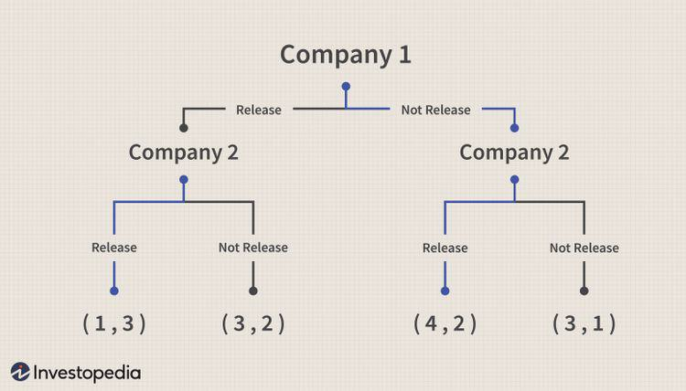

Backward induction is a strategic method widely employed in game theory, economics, and finance to determine the optimal sequence of actions by reasoning backwards from the conclusion of a problem or scenario. This iterative process is essential for solving games and inferring the best possible actions that lead to a desired outcome. In game theory, particularly, backward induction is invaluable for identifying optimal strategies in extensive-form and sequential games. These are games where players make decisions at various stages and have information about previous actions, requiring a detailed analysis of possible future scenarios.

The method's significance extends to algorithmic trading, a domain where decisions have to be meticulously modeled and predicted to optimize financial strategies. Algorithmic trading involves the use of computer programs to engage in high-frequency trading, relying on advanced algorithms to make critical buy and sell decisions faster than human capabilities. Backward induction becomes crucial in this context as it allows traders to model sequential decisions and forecast potential market movements to enhance profitability.



By understanding the end goals and working backward, backward induction enables players and decision-makers to anticipate future actions and contingencies, crafting a robust strategy that aligns with their objectives. This process ensures that each decision is not only optimal in its immediate context but also aligns with the overarching strategy, thus providing a comprehensive framework for strategic decision-making in diverse fields.

## Table of Contents

## What is Backward Induction?

Backward induction is a problem-solving method that entails analyzing a situation by considering the desired end result and then reasoning backward to determine the optimal sequence of actions or decisions. This approach was notably popularized by John von Neumann and Oskar Morgenstern in their seminal work, "Theory of Games and Economic Behavior," published in 1944. [1]

The core premise of backward induction is the assumption of rational behavior among decision-makers, or players, engaged in a strategic interaction. Rationality, in this context, implies that each participant consistently selects actions that maximize their utility, given their beliefs about other players' strategies. The methodology of backward induction is employed to identify the optimal action at each decision point, ultimately leading to the best possible outcome for each player.

One crucial application of backward induction is seen in game theory, particularly in the study of sequential games. In these games, players make decisions one after another, which creates a structured sequence of moves. By employing backward induction, game theorists can calculate the optimal strategy by contemplating the final possible choices in the game and reasoning backward to the initial move. This iterative process allows the determination of Nash equilibria in sequential games, where a Nash equilibrium represents a scenario where no player can gain by unilaterally deviating from their strategy, given the strategies of other players.

The power of backward induction lies in its ability to provide a clear, structured approach to decision-making in situations characterized by multiple stages and strategic interactions. By working backward from the desired outcome, decision-makers can systematically explore the consequences of their actions, ensuring that each decision optimally contributes to their ultimate objectives.

---
[1] Von Neumann, J., & Morgenstern, O. (1944). Theory of Games and Economic Behavior. Princeton University Press.

## Backward Induction in Game Theory

Game theory employs backward induction as a fundamental method to determine optimal sequences of actions within a game. This technique leverages the ability to anticipate future actions of opponents, thereby allowing players to refine their strategies in order to maximize their own outcomes. By systematically analyzing each decision point in reverse chronological order, players can forecast the consequences of potential moves and select the most advantageous paths.

One of the key elements achieved through backward induction is the computation of Nash equilibria in sequential games. A Nash equilibrium is a stable set of strategies where no player can gain additional benefit by unilaterally changing their strategy, assuming that the other players maintain their strategies unchanged. In sequential games, backward induction provides a mechanism by which these equilibria can be identified. By assessing the optimal choices at each stage of the game and considering the response of opponents, players can ensure that their strategy achieves subgame perfect equilibrium. This concept refers to a refinement of Nash equilibrium applicable specifically to extensive-form games, where the strategy remains optimal in every subgame.

Through the precise application of backward induction, decision making is systematically optimized by aligning strategies with predicted outcomes. This approach relies on the premise of perfect rationality, where players possess the capability to evaluate and execute the most advantageous moves considering the entire structure of the game. Despite its assumptions, backward induction remains pivotal in crafting strategies where the sequencing of actions significantly influences the result.

## Application of Backward Induction in Algorithmic Trading

Algorithmic trading has become an essential component of financial markets, leveraging complex algorithms to execute trading strategies at speeds and frequencies that are impossible for human traders. A crucial aspect of these strategies is the ability to predict market movements and adjust strategies accordingly, which is where backward induction plays a pivotal role.

Backward induction is used in [algorithmic trading](/wiki/algorithmic-trading) to anticipate future market conditions and make informed decisions based on those predictions. The method involves working backward from a presumed future state of the market to determine the sequence of optimal trading actions required in the present. By doing so, traders aim to maximize profits or minimize risks, taking into consideration the potential responses from other market participants.

To illustrate, consider a simple dynamic trading strategy where a trader aims to optimize the timing of buy and sell orders. Using backward induction, the algorithm starts by considering the expected future market conditions, such as price trends or [volatility](/wiki/volatility-trading-strategies) levels, at the time of an eventual sale. It then works backward to determine the optimal points to enter and [exit](/wiki/exit-strategy) positions, based on maximizing expected returns.

```python
def optimize_trades(prices, future_market_conditions):
    # Start by considering future market conditions
    future_value = calculate_future_value(prices[-1], future_market_conditions)
    optimal_strategy = [0] * len(prices)

    # Work backward through prices to determine optimal actions
    for t in reversed(range(len(prices) - 1)):
        future_value = max(future_value, prices[t] + calculate_future_value(prices[t], future_market_conditions))
        optimal_strategy[t] = future_value - prices[t]

    return optimal_strategy

def calculate_future_value(price, future_market_conditions):
    # Placeholder for complex future market condition calculation
    return price * (1 + future_market_conditions['expected_return'])
```

The code example above demonstrates a simplified backward induction approach to optimizing trading decisions in a hypothetical market. The `optimize_trades` function uses expected future market conditions to determine the best trading strategy by iterating backward through historical price data.

One of the main advantages of employing backward induction in algorithmic trading is its ability to create robust strategies that account for a dynamic market environment. With continuous data inflows, algorithms can adjust forecasts and strategies in real time, adapting to market changes swiftly.

However, the method does assume a degree of predictability regarding future market conditions, which can be a limitation in highly volatile environments. Despite this, backward induction remains a powerful tool for formulating and optimizing algorithmic trading strategies where sequential decision-making is necessary. Its application underpins many successful trading algorithms, demonstrating the critical role of strategic foresight in financial markets.

## Example of Backward Induction

The centipede game serves as an illustrative example of backward induction in game theory. In this sequential-move game, two players each have the opportunity to take a larger share of an increasing pot of money as the game progresses. The game is played over several rounds, and with each round, the available pot increases in value.

Backward induction proposes that rational players should take the pot at their first opportunity. This strategic choice is based on the assumption that if a player does not take the pot, the other player will do so in the subsequent move, thus ending the game with a larger share for the opponent and leaving the current player with a smaller payoff. Here's why:

1. **Final Decision Node**: At the last possible decision node in the game, it is in the interest of the player whose turn it is to take the pot, as waiting would yield no benefit but potential loss if the opponent takes any remaining share.

2. **Penultimate Decision Node**: Knowing that the opponent will take the pot at the final decision node, the rational choice for the player at the penultimate node is to take the pot instead of passing, as this ensures a definite payoff greater than zero.

3. **Iterative Reasoning**: This logic extends backward to earlier moves in the game, suggesting that at any given move, if a player expects their opponent to act rationally (i.e., aiming to maximize their own payoff), they should take the pot immediately rather than risk getting a smaller payoff or nothing at all if the opponent takes in subsequent turns.

However, empirical studies and experimental data often show a divergence from this theoretical prediction. Players frequently pass the pot multiple times, thereby increasing the total payoff potential for both participants. This behavior contrasts with the backward induction outcome, leading to higher payoffs than the minimum predicted by immediate taking. The discrepancy between theory and practice might result from players factoring in trust, cooperation, or the possibility of mutual gain, illustrating the limitations of backward induction's assumption of strict rationality. Such behavior suggests that players might assign value to cooperative payoffs and are willing to risk potential gains for larger, shared rewards.

## Solving Sequential Games with Backward Induction

Backward induction is a critical method used for determining optimal strategies in sequential games by analyzing the game from the end to the beginning. This iterative reasoning begins by assessing the last possible move in the game and identifying the optimal choice at that point. The player then reasons back through each prior decision point, sequentially uncovering the series of optimal moves that guide towards optimal outcomes throughout the game.

One of the fundamental outcomes of this process is the identification of subgame perfect equilibria. A subgame perfect equilibrium (SPE) is a refinement of a Nash equilibrium applicable to dynamic games with a sequential structure. A SPE ensures that a player's strategy constitutes a Nash equilibrium within every subgame of the original game, affirming stability throughout various decision stages. This makes backward induction particularly effective for evaluating scenarios where the sequence of actions is crucial, as it prevents non-credible threats—situations where a player's threat to choose a detrimental strategy is not believable within the framework of rational gameplay.

To apply backward induction in a formal setting, consider a simple sequential game between two players. At each terminal node of the game tree, players calculate their payoffs for each action, selecting the move with the highest payoff. The optimal choice at the final decision node forms the basis for reasoning backward. With each preceding move, decisions are optimized based on the expected outcomes of future potential actions, accurately modeling rational behavior in complex strategic interactions.

For instance, imagine a sequential game modeled as a decision tree where Player A can choose move X or Y at the first node, and Player B responds with moves M or N at the second node. Using backward induction, Player B's optimal choice between M and N is evaluated based on maximizing their payoff. Player A, anticipating Player B's response, determines the optimal choice between X and Y by evaluating which yields a better outcome under Player B's optimal strategy. This recursive process establishes strategic clarity, ensuring each player’s decision is optimal given the anticipated responses of others.

Backward induction's methodical approach provides a comprehensive framework to navigate the complexities of sequential decision-making in games, effectively guiding players towards insights that facilitate robust strategic planning. While it assumes rational decision-making, its analytical rigor is indispensable for crafting strategies that endure across multiple stages of interaction.

## Challenges and Limitations

A significant limitation of backward induction is its reliance on the assumption of perfect rationality among all decision-makers involved. This assumption posits that players are capable of accurately predicting future moves and consistently act to maximize their utility. However, in real-world situations, human decision-making is often influenced by emotions, biases, and incomplete information, resulting in actions that deviate from those predicted by backward induction.

For instance, psychological factors such as risk aversion, overconfidence, and loss aversion can drive players to make choices that are not necessarily optimal from an economic standpoint. Incomplete information further complicates the matter, as players may not have access to all relevant data or fail to interpret it correctly, leading to suboptimal decisions.

Despite these challenges, backward induction remains an essential tool for constructing strategic models within controlled environments, such as algorithmic simulations and experimental economics. By analyzing simplified models where rational behavior is assumed, researchers and practitioners can gain valuable insights into the mechanics of decision-making processes. This understanding, while limited, can still contribute significantly to the refinement of strategies in settings where conditions approximate the assumptions of backward induction.

Furthermore, advancements in behavioral game theory attempt to bridge the gap between traditional game theory and real-world behavior by incorporating psychological insights into strategic models. These developments highlight both the potential and the limitations of backward induction, reminding us of the complex nature of human decision-making.

## Conclusion

Backward induction is an essential tool in strategic decision-making, particularly within game theory and financial markets. By enabling decision-makers to start from an end goal and work backwards, it provides a methodical way to determine optimal strategies at each stage of a decision-making process. This reverse approach helps in anticipating future states and actions, which is especially useful in sequential games and in solving complex, multi-step problems.

Despite its reliance on the assumption of rationality among participants, backward induction remains powerful in shedding light on sequential decision processes. It offers valuable insights into how strategies can be optimized by considering the possible moves and counter-moves of all involved players. This is crucial for arriving at strategies that are not only optimal but also robust against potential deviations.

In the context of algorithmic trading, backward induction underscores its relevance by facilitating forecasting and decision optimization in fluctuating markets. Through predictive modeling, traders can reverse-engineer optimal strategies that account for market volatility and the dynamic nature of trading environments. As a result, backward induction helps algorithmic traders increase profitability by enabling precise decision-making based on anticipated market behaviors and trends. Thus, despite its limitations, backward induction continues to be a vital component of strategy formulation in both theoretical and practical applications.

## References & Further Reading

[1]: Von Neumann, J., & Morgenstern, O. (1944). ["Theory of Games and Economic Behavior."](https://psycnet.apa.org/record/1945-00500-000) Princeton University Press.

[2]: Osborne, M. J., & Rubinstein, A. (1994). ["A Course in Game Theory."](https://sites.math.rutgers.edu/~zeilberg/EM20/OsborneRubinsteinMasterpiece.pdf) MIT Press.

[3]: Fudenberg, D., & Tirole, J. (1991). ["Game Theory."](https://mitpress.mit.edu/9780262061414/game-theory/) MIT Press.

[4]: Camerer, C. F. (2003). ["Behavioral Game Theory: Experiments in Strategic Interaction."](https://psycnet.apa.org/record/2003-06054-000) Princeton University Press.

[5]: Lopez de Prado, M. (2018). ["Advances in Financial Machine Learning."](https://www.amazon.com/Advances-Financial-Machine-Learning-Marcos/dp/1119482089) Wiley.

[6]: Jarrow, R. A., & Protter, P. (2012). ["A Short History of Stochastic Integration and Mathematical Finance: The Early Years, 1880-1970."](https://www.jstor.org/stable/4356300) Annual Review of Financial Economics, 4, 1-25.

[7]: Bouchaud, J.-P., & Potters, M. (2003). ["Theory of Financial Risk and Derivative Pricing: From Statistical Physics to Risk Management."](https://www.cambridge.org/core/books/theory-of-financial-risk-and-derivative-pricing/5BBBA04CE72ED9E5E7C1C028D9A94FCB) Cambridge University Press.

[8]: Jansen, S. (2018). ["Machine Learning for Algorithmic Trading."](https://github.com/stefan-jansen/machine-learning-for-trading) Packt Publishing.

[9]: Crandall, R. E., & Thompson, W. (2001). ["Theory of Interest: As Determined by Impatience to Spend Income and Opportunity to Invest It."](https://www.kennewickea.org/file_viewer.php?id=63871) Palgrave Macmillan.