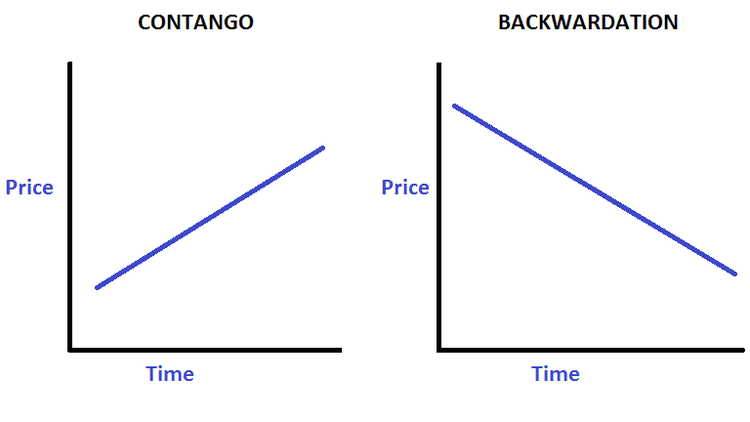

## Table of Contents

## What is backwardation?

Backwardation is a term used in the futures market. It happens when the price of a futures contract is lower than the expected future spot price of the commodity. This situation shows that people expect the commodity's price to go up in the future. For example, if the current price of oil is $50 per barrel, but the futures contract for oil in six months is $45 per barrel, the market is in backwardation.

Backwardation can be good for people who own the commodity. They can sell their commodity at a higher price now and buy a futures contract at a lower price. This way, they can make a profit. Backwardation often happens when there is a high demand for the commodity now, but people think the supply will be better in the future. It's like a signal that the market thinks the commodity is more valuable right now than it will be later.

## How does backwardation differ from contango?

Backwardation and contango are two opposite situations in the futures market. Backwardation happens when the price of a futures contract is lower than the current price of the commodity. This means people expect the commodity to be more valuable now than in the future. For example, if oil is $50 per barrel today but the futures contract for oil in six months is $45 per barrel, the market is in backwardation.

Contango, on the other hand, is when the price of a futures contract is higher than the current price of the commodity. This shows that people expect the commodity to be more valuable in the future than it is now. Using the same oil example, if oil is $50 per barrel today but the futures contract for oil in six months is $55 per barrel, the market is in contango. Both backwardation and contango give us clues about what people think will happen to commodity prices in the future.

## What are the basic causes of backwardation in commodity markets?

Backwardation in commodity markets often happens when there is a high demand for the commodity right now but people think there will be more of it in the future. Imagine there's a big need for oil today because of a cold winter, but people believe that oil production will go up in the coming months. So, the price of oil today might be higher than the price for oil in the future. This situation shows that people value the commodity more at the present time than they expect to in the future.

Another cause of backwardation can be when people are worried about the supply of the commodity in the short term. For example, if there's a risk that a big oil field might stop producing because of a storm, the price of oil today could go up a lot. But if people believe that the problem will be fixed soon, the price for oil in the future might stay lower. This creates backwardation because the current high demand and supply worries push the present price above the future price.

## Can you explain the role of supply and demand in causing backwardation?

Backwardation happens when the price of a commodity today is higher than the price for the same commodity in the future. This often occurs because of how supply and demand work right now. If there's a big need for a commodity today but people think there will be more of it later, the price today can go up a lot. For example, if there's a cold winter and everyone needs more oil to stay warm, the price of oil today might be high. But if people believe that oil production will increase in the future, the price for oil in the future might be lower. This shows that people value the commodity more right now than they expect to later.

Another way supply and demand can cause backwardation is when there are short-term worries about the supply of the commodity. Imagine there's a risk that a big oil field might stop producing because of a storm. This can make the price of oil today go up a lot because people are worried about not having enough oil. But if people believe that the problem will be fixed soon, the price for oil in the future might stay lower. So, the current high demand and supply worries push the present price above the future price, creating backwardation.

## How do expectations of future prices contribute to backwardation?

Backwardation happens when people think a commodity will be worth less in the future than it is now. This is because the price of the commodity today is higher than what people are willing to pay for it in the future. If people expect the price to go down, they won't want to buy futures contracts at a high price. So, the price for the futures contract will be lower than the price of the commodity today.

Expectations of future prices can make backwardation happen because they change how people act in the market. If people think there will be more of a commodity later, like more oil because new wells will start producing, they won't pay as much for it in the future. This makes the futures price lower than the price today. So, the belief that the commodity will be easier to get in the future makes people less willing to pay a lot for it now, leading to backwardation.

## What impact does the cost of carry have on backwardation?

The cost of [carry](/wiki/carry-trading) is what it costs to keep a commodity until you sell it. It includes things like storage, insurance, and interest on money you borrowed to buy the commodity. When the cost of carry is high, it can make backwardation less likely because people will want to be paid more to hold onto the commodity until the future. But if the cost of carry is low, it can help cause backwardation because people won't need as much extra money to keep the commodity, so the price for the future can be lower than the price today.

In backwardation, the futures price is lower than the spot price. If the cost of carry is low, people might be okay with selling the commodity now at a higher price and buying a futures contract at a lower price. This is because the cost of keeping the commodity until the future isn't too high. So, low costs of carry can make backwardation more likely to happen.

## How can seasonal factors lead to backwardation?

Seasonal factors can lead to backwardation because some commodities are more needed at certain times of the year. For example, during winter, people use more natural gas to heat their homes. This makes the price of natural gas go up in winter. But if people think there will be less need for natural gas in the summer, the price for natural gas in the future might be lower. So, the high demand in winter and the lower expected demand in summer can cause the price today to be higher than the price in the future, which is backwardation.

Another way seasonal factors can cause backwardation is with farming products like corn or wheat. Farmers usually harvest these crops at certain times of the year. When the harvest happens, there is a lot of the crop available, so the price might go down. But before the harvest, when there is less of the crop around, the price might be higher. If people know that a big harvest is coming soon, they might expect the price to drop. This can make the price of the crop today higher than the price in the future, leading to backwardation.

## What are some real-world examples of backwardation in commodity markets?

One real-world example of backwardation happened in the oil market in 2020. During the early months of the COVID-19 pandemic, there was a big drop in demand for oil because fewer people were driving and flying. Oil storage tanks started to fill up, and people were worried about where to put all the oil. The price of oil for immediate delivery went down a lot, even becoming negative at one point. But the price for oil in the future stayed higher because people thought the demand would come back later. This created a big difference between the current price and the future price, showing backwardation.

Another example is in the natural gas market during winter. When it gets cold, people use more natural gas to heat their homes, so the demand goes up. This can make the price of natural gas today higher than the price for natural gas in the future. People know that the demand will go down in the summer when it's warmer, so they expect the price to drop. This difference between the high winter price and the lower expected summer price can cause backwardation in the natural gas market.

## How do traders and investors typically respond to backwardation?

Traders and investors often see backwardation as a chance to make money. If they own the commodity, they can sell it now at a high price and buy a futures contract at a lower price. This way, they can make a profit from the difference between the two prices. For example, if someone owns oil and the market is in backwardation, they might sell their oil today and then buy a futures contract to get oil back later at a cheaper price. This strategy works well when the cost of keeping the commodity until the future isn't too high.

Some investors might also use backwardation to predict future price changes. If they see that the market is in backwardation, they might think that the commodity will be worth less in the future. This can help them decide whether to buy or sell the commodity. For example, if the market for wheat is in backwardation, an investor might believe that the price of wheat will go down soon. They could then decide to sell their wheat now before the price drops. This way, backwardation can give investors important information about what might happen to prices in the future.

## What advanced strategies can be used to profit from backwardation?

One advanced strategy to profit from backwardation is called a cash-and-carry [arbitrage](/wiki/arbitrage). This is when traders buy the commodity at the current high price and then sell a futures contract at the lower future price. They make money from the difference between these two prices. But they also have to think about the cost of keeping the commodity until the future, like storage and insurance. If these costs are low enough, the strategy can work well. Traders need to be careful and make sure the profit from the price difference is more than the cost of carry.

Another strategy is to use options. Traders can buy put options on the commodity, which give them the right to sell it at a certain price in the future. If the market stays in backwardation and the future price stays low, the value of the put option can go up. Traders can then sell the put option for a profit. This strategy can be good because it limits the risk. The most a trader can lose is the price they paid for the option. But if the market changes and goes into contango, the value of the put option might go down, so traders need to watch the market closely.

## How does backwardation affect the pricing of futures contracts?

Backwardation happens when the price of a futures contract is lower than the price of the commodity right now. This means that people think the commodity will be worth less in the future. When the market is in backwardation, the futures contract's price is set lower because people are not willing to pay as much for the commodity later. They believe that there will be more of the commodity available in the future, so they don't want to buy it at today's high price.

Traders and investors use this information to make decisions. If they own the commodity, they might sell it now at the high price and buy a futures contract at the lower price. This way, they can make a profit from the difference. Backwardation can also tell investors that the price of the commodity might go down in the future, so they might choose to sell their commodity now before the price drops. This shows how backwardation affects the pricing of futures contracts by making the future price lower than the current price.

## What are the implications of backwardation for hedging strategies in commodities trading?

Backwardation can change how people use hedging strategies in commodities trading. Hedging is when people try to protect themselves from big price changes by making deals in the futures market. If someone owns a commodity and the market is in backwardation, they can sell their commodity now at a high price and buy a futures contract at a lower price. This way, they can make sure they don't lose money if the price goes down in the future. It's like locking in a good price today and not worrying about what happens later.

But backwardation can also make things tricky for people who need to buy the commodity in the future. If they want to lock in a price now to buy the commodity later, they might have to pay more for the futures contract than the commodity is worth today. This can be a problem if the price of the commodity goes up a lot before they need it. So, people have to think carefully about when to use futures contracts and how backwardation might affect their plans.

## References & Further Reading

[1]: Bergstra, J., Bardenet, R., Bengio, Y., & Kégl, B. (2011). ["Algorithms for Hyper-Parameter Optimization."](https://dl.acm.org/doi/10.5555/2986459.2986743) Advances in Neural Information Processing Systems 24.

[2]: ["Advances in Financial Machine Learning"](https://www.amazon.com/Advances-Financial-Machine-Learning-Marcos/dp/1119482089) by Marcos Lopez de Prado

[3]: ["Evidence-Based Technical Analysis: Applying the Scientific Method and Statistical Inference to Trading Signals"](https://books.google.com/books/about/Evidence_Based_Technical_Analysis.html?id=MeoJAQAAMAAJ) by David Aronson

[4]: ["Machine Learning for Algorithmic Trading"](https://github.com/stefan-jansen/machine-learning-for-trading) by Stefan Jansen

[5]: ["Quantitative Trading: How to Build Your Own Algorithmic Trading Business"](https://www.amazon.com/Quantitative-Trading-Build-Algorithmic-Business/dp/1119800064) by Ernest P. Chan