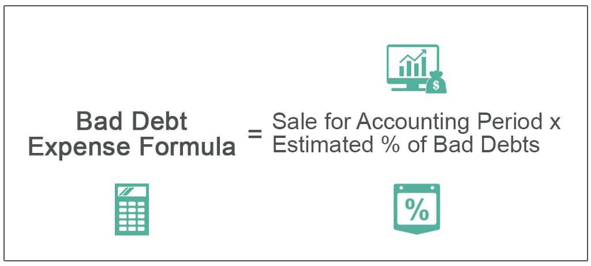

In today's fast-paced financial world, managing debt and accurately predicting expenses are pivotal for businesses and investors striving for stability and growth. As financial markets evolve, algorithmic trading has emerged as a transformative tool, revolutionizing how expenses are estimated and how bad debt is managed. This article examines the intersection of bad debt management, financial methodologies, expense estimation, and algorithmic trading, shedding light on their critical roles in optimizing financial decision-making.

Bad debt management is a fundamental aspect of financial stability, as it involves identifying and mitigating the risks associated with uncollectible receivables. If not managed properly, bad debt can stagger cash flow and profitability, making it crucial for businesses to leverage advanced techniques to predict and manage these risks. Algorithmic trading, with its data-centric approach, facilitates more accurate predictions and management strategies in this field.



Algorithmic trading is characterized by the use of sophisticated computer programs to perform high-speed and high-volume trading. By utilizing data-driven strategies and statistical models, algorithmic trading enhances the efficiency of various financial operations, including expense estimation. This efficiency stems from the ability to analyze vast datasets in real time, allowing for precise calculations of future costs and improved financial management.

The integration of traditional financial methods with algorithmic trading offers synergetic benefits, combining the robustness of established techniques with the innovation of modern technology. This amalgamation facilitates better management of bad debts and more accurate expense predictions, empowering businesses and investors to make informed financial decisions. By harnessing these advanced tools, organizations can optimize their financial strategies, reduce risks, and gain a competitive advantage in a dynamic market landscape.

## Table of Contents

## Understanding Bad Debt

Bad debt refers to receivables that are unlikely to be collected due to various factors such as customer insolvency, economic downturns, or poor financial management. These uncollected debts are detrimental to a company’s financial health as they directly impact cash flow and the reliability of financial statements.

To ensure accurate financial reporting and maintain financial health, companies must recognize and account for bad debts. This involves evaluating the accounts receivable and estimating the portion that is expected to remain uncollectible. Failing to accurately account for bad debts can lead to overstated assets and false financial health, misleading stakeholders and investors.

There are two primary methods used to estimate bad debt: the direct write-off method and the allowance method.

1. **Direct Write-off Method**: This straightforward approach records bad debts only when they are confirmed to be uncollectible. Under this method, an entry is made to debit bad debt expense and credit accounts receivable. However, this method does not align with the Generally Accepted Accounting Principles (GAAP), as it can result in mismatched timing between when revenue is recognized and when the corresponding expense is recorded. For instance, a company might recognize revenue from a sale in one period and the associated bad debt expense in another, skewing financial results.

   Example of recording using the direct write-off method:
   ```python
   # Python pseudo code for direct write-off
   accounts_receivable = 10000
   bad_debt_expense = 500

   accounts_receivable -= bad_debt_expense
   ```

2. **Allowance Method**: This approach adheres to GAAP by estimating uncollectible accounts at the end of each accounting period, creating an allowance for doubtful accounts. This method matches bad debt expenses with related revenues by establishing a reserve account to anticipate future bad debts. The estimation can be based on historical data and economic forecasts. Common techniques within this method include the percentage of sales method and accounts receivable aging method.

   The accounts are adjusted like this:
   - Debit: Bad Debt Expense
   - Credit: Allowance for Doubtful Accounts

   Formula for estimating using the allowance method:
$$
   \text{Estimated Bad Debt} = \text{Total Credit Sales} \times \text{Percentage of Credit Sales Estimated Uncollectible}

$$

Recognizing and accurately estimating bad debts is crucial for companies to maintain financial integrity. Both methods have their applications, with the allowance method being preferred for adhering to accounting standards and providing a more accurate financial snapshot.

## Methods for Estimating Bad Debt

Bad debt estimation is a fundamental aspect of financial management, requiring a choice between predominantly two methods: the allowance method and the direct write-off method. These methods not only affect financial statements but also influence the strategy for handling credit policies and financial planning.

The allowance method is considered more accurate in reflecting the financial health of a business. Established according to Generally Accepted Accounting Principles (GAAP), this method involves estimating uncollectible accounts at the end of each period and creating a reserve or allowance to cover potential future losses. The key advantage here is that it anticipates potential bad debts and aligns expenses with the revenues they helped generate, ensuring the adherence to the matching principle. The primary formula involved is:

$$
\text{Allowance for Doubtful Accounts} = \text{Estimated Percentage} \times \text{Accounts Receivable}
$$

Here, the estimated percentage is based on historical data and industry standards, allowing firms to earmark a portion of their receivables that might remain unpaid.

In contrast, the direct write-off method records bad debts only when they are confirmed as uncollectible. This method, although straightforward, may lead to periods of significant financial misalignment, as expenses related to bad debts may not be reported in the same period as the associated revenues, thus violating the matching principle. This can distort financial health assessments and complicate cash flow projections. The corresponding entry is made directly to the bad debt expense account as follows:

```plaintext
Bad Debt Expense
  Accounts Receivable
```

Choosing between these methods requires a careful consideration of the business's financial strategy and reporting needs. The allowance method's adherence to GAAP is generally preferred for financial reporting, but some businesses might favor the simplicity of the direct write-off method for internal use, especially when bad debts are infrequent or of minor impact.

Ultimately, understanding these methods aids in making informed decisions regarding credit policies and financial planning, enabling a firm to maintain a robust and accurate financial standing while optimizing its credit management practices.

## Expense Estimation in Finance

Expense estimation is a fundamental component of financial management, enabling businesses to anticipate future costs and allocate resources efficiently. By accurately predicting expenses, organizations can better prepare for financial challenges, thereby maintaining profitability and achieving strategic goals.

To estimate expenses effectively, businesses employ several techniques. One widely used method is the percentage of sales technique, which estimates expenses as a fixed percentage of total sales revenue. This approach is based on historical data and assumes a consistent relationship between sales and expenses. For example, if a company historically spends 20% of its sales revenue on marketing, it can project future marketing expenses by applying this percentage to projected sales. The formula for this estimation method is:

$$
\text{Estimated Expenses} = (\text{Percentage of Sales}) \times \text{Projected Sales}
$$

Another technique involves accounts receivable aging, which focuses on estimating potential bad debt expenses. By categorizing receivables based on their age, companies can identify patterns in payment behaviors and assess the likelihood of collection. This method helps in evaluating the risk associated with outstanding accounts and adjusting the allowance for doubtful accounts accordingly.

Accurate expense estimation is crucial for effective budgeting and forecasting. It enables businesses to set realistic financial targets and allocate funds in alignment with strategic objectives. Moreover, it supports the maintenance of cash flow stability, as accurate forecasts help prevent over-expenditure and ensure sufficient [liquidity](/wiki/liquidity-risk-premium) for operations.

In addition to traditional methods, advanced statistical models and software tools can enhance the accuracy of expense estimation. By analyzing large datasets, businesses can identify trends and anomalies, enabling them to refine their predictions. Technologies such as [machine learning](/wiki/machine-learning) can provide more dynamic and responsive estimation processes, adapting to changing market conditions and internal business factors.

Ultimately, precise expense estimation is integral to financial success. It aids in the identification of cost-saving opportunities, supports investment decisions, and contributes to the overall financial health of an organization. For businesses aiming to optimize their financial strategies, incorporating robust expense estimation techniques is essential for sustained growth and competitive advantage.

## The Role of Algorithmic Trading

Algorithmic trading employs advanced computer algorithms to execute trades at speeds and volumes impossible for human traders. By leveraging high-frequency trading and quantitative models, [algorithmic trading](/wiki/algorithmic-trading) has become a vital component of modern financial markets. It not only streamlines trading operations but also plays a pivotal role in financial decision-making processes, particularly in expense estimation and bad debt management.

The core advantage of algorithmic trading lies in its ability to process vast amounts of data quickly and efficiently. This capability is essential for enhancing expense estimation in financial settings. Traditional methods of estimating expenses often rely on historical data and basic statistical models, which may not account for real-time market dynamics and uncertainties. Algorithmic trading algorithms, on the other hand, utilize machine learning techniques and predictive analytics to analyze current market conditions and forecast future expenses accurately.

For instance, consider the application of a statistical [arbitrage](/wiki/arbitrage) model in algorithmic trading. This model can identify price discrepancies in related financial instruments by calculating z-scores based on historical mean and standard deviation. By monitoring these discrepancies, trading algorithms can execute trades that capitalize on inefficiencies while simultaneously adjusting financial estimates in real-time. The use of such models allows for continuous refinement of expense estimation, ensuring that it reflects the latest market trends and data patterns.

Moreover, reducing bad debt risks is another area where algorithmic trading proves beneficial. By integrating predictive modeling techniques, trading algorithms can assess customer credit risk and market [volatility](/wiki/volatility-trading-strategies). Through real-time data analysis, algorithms can identify trends and patterns associated with higher probabilities of bad debt, enabling businesses to act proactively. For example, machine learning classifiers such as decision trees and support vector machines can be employed to predict the likelihood of default based on customer transaction history and external economic factors.

The integration of algorithmic trading strategies with financial operations optimizes decision-making processes, providing businesses and investors with actionable insights into managing expenses and mitigating risks associated with bad debt. By enhancing these financial processes, algorithmic trading contributes significantly to maintaining financial health and achieving long-term profitability in a dynamic market environment.

## Integration of Financial Methods and Algo Trading

Combining traditional financial methods with modern algorithmic trading offers substantial improvements in managing bad debt. Traditional methods, such as the allowance and direct write-off methods, provide a foundational understanding for estimating uncollectible debts. However, the integration of algorithmic trading enhances these processes through real-time data analysis and predictive modeling, substantially upgrading financial decision-making.

Real-time data analysis through algorithmic systems allows businesses to monitor financial transactions as they occur, reducing the lag typically associated with traditional methods. This immediate access to data aids in the swift identification of potential bad debts and allows for quick adjustments to credit policies. Predictive modeling, enabled by algorithms, further enhances this process. By analyzing historical financial data, machine learning models can predict future debt risks and trends, allowing companies to proactively mitigate bad debt risks.

For example, consider a Python-based approach using historical sales and credit data to predict bad debts. The following Python snippet outlines a basic model employing a time series forecasting method:

```python
import pandas as pd
from statsmodels.tsa.arima.model import ARIMA

# Load historical sales and credit data
data = pd.read_csv('financial_data.csv')
data.index = pd.to_datetime(data['Date'])

# Define and fit ARIMA model
model = ARIMA(data['Bad_Debt'], order=(1, 1, 1))
model_fit = model.fit()

# Forecast future bad debts
forecast = model_fit.forecast(steps=12)
print(f"Forecasted Bad Debts: {forecast}")
```

This model illustrates a simplified method for leveraging historical data to anticipate future bad debts, demonstrating the predictive power of algorithmic trading strategies.

Successful integrations of financial methods with algorithmic trading are evident in various industries. In the banking sector, algorithmic trading systems have been used to predict loan defaults, enabling financial institutions to adjust their lending strategies proactively. Moreover, retail companies employ these algorithms for managing inventory credit and assessing customer creditworthiness, thereby minimizing bad debt exposure.

Such integrations result in enhanced accuracy and efficiency in bad debt management, enabling businesses to adapt quickly to market changes and improve their financial stability. By merging the robustness of traditional financial methods with the analytical prowess of algorithmic systems, companies can significantly streamline their financial processes and bolster their overall strategic outlook.

## Conclusion

Effective management of bad debt and precise expense estimation are essential components of achieving sustainable financial health. A well-structured approach to these elements not only fortifies an organization's financial standing but also enhances its ability to navigate and capitalize on emerging market opportunities. Algorithmic trading, characterized by the use of sophisticated computer algorithms, stands out as a powerful tool for optimizing such financial processes.

Algorithmic trading employs advanced statistical models and real-time data analysis to automate trading decisions and execute them at speeds unimaginable to human traders. This capability allows for the precise estimation of expenses by incorporating vast amounts of data to forecast future costs. By systematically analyzing historical and live data, algorithms can anticipate expense trends, adjust trading strategies, and thereby minimize financial risks associated with incorrect predictions.

The integration of algorithmic trading with traditional financial methods offers a multi-faceted approach to handling bad debt. Through predictive modeling and real-time data analysis, algorithms can identify potential defaults before they occur, allowing businesses to make proactive decisions such as adjusting credit terms or pursuing collections earlier. These anticipatory measures can significantly reduce the incidence of uncollectible accounts, thereby improving the overall financial health of the organization.

Businesses and investors who adeptly combine algorithmic trading capabilities with conventional financial management strategies benefit from a competitive edge. This integration enables the fine-tuning of financial strategies, resulting in more informed decision-making and improved efficiency. In turn, this leads to enhanced profitability and a more robust ability to withstand market volatilities.

In conclusion, leveraging algorithmic trading to enhance bad debt management and expense estimation processes can transform financial strategies into more strategic and resilient operations. By adopting these innovative solutions, businesses and investors position themselves to optimize financial performance and secure a leadership stance in their respective markets.

## References & Further Reading

[1]: ["Advances in Financial Machine Learning"](https://www.amazon.com/Advances-Financial-Machine-Learning-Marcos/dp/1119482089) by Marcos Lopez de Prado

[2]: ["Quantitative Trading: How to Build Your Own Algorithmic Trading Business"](https://www.amazon.com/Quantitative-Trading-Build-Algorithmic-Business/dp/1119800064) by Ernest P. Chan

[3]: ["Machine Learning for Asset Managers"](https://ia802907.us.archive.org/31/items/machine_learning_for_asset_managers/machine_learning_for_asset_managers.pdf) by Marcos Lopez de Prado

[4]: ["Evidence-Based Technical Analysis: Applying the Scientific Method and Statistical Inference to Trading Signals"](https://www.amazon.com/Evidence-Based-Technical-Analysis-Scientific-Statistical/dp/0470008741) by David Aronson

[5]: ["Machine Learning for Algorithmic Trading"](https://github.com/PacktPublishing/Machine-Learning-for-Algorithmic-Trading-Second-Edition) by Stefan Jansen