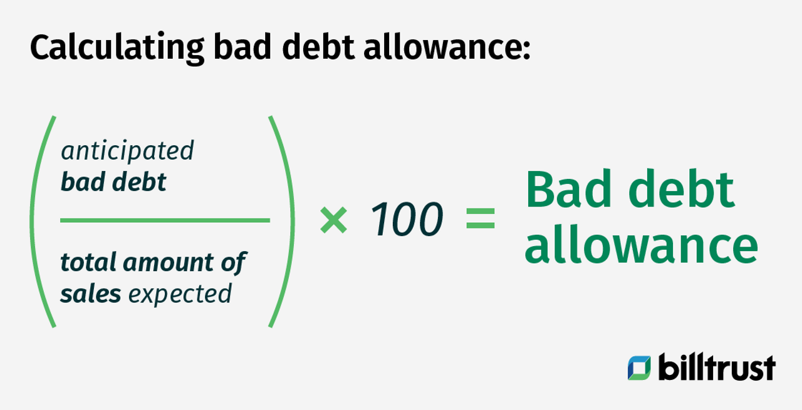

## Table of Contents

## What is bad debt expense?

Bad debt expense is the amount of money a business thinks it won't be able to collect from customers who bought things on credit. When a business sells something and lets the customer pay later, there's a chance the customer might not pay at all. This risk is called bad debt. To account for this, businesses estimate how much money they might lose and record it as an expense on their financial statements.

This expense is important because it helps businesses show a more accurate picture of their profits. If a company didn't account for bad debts, their profits would look higher than they really are. By recording bad debt expense, the business can better plan for the future and make sure they have enough money to cover losses. It's like setting aside money for a rainy day, just in case some customers don't pay up.

## Why is it important to estimate bad debt expense?

Estimating bad debt expense is important because it helps a business know how much money they might not get back from customers who bought things on credit. If a business doesn't guess this amount, they might think they have more money than they really do. This can lead to problems when they find out they can't collect the money they were expecting. By guessing how much money might be lost, a business can plan better and make sure they have enough money to keep running smoothly.

Also, estimating bad debt expense helps a business show a true picture of how much money they are making. If they don't account for the money they might not get, their profits will look bigger than they really are. This can trick people who look at the business's financial reports, like investors or banks. By including an estimate of bad debt expense, the business can be honest about their financial health and make better decisions for the future.

## What are the common methods used to estimate bad debt expense?

One common method to estimate bad debt expense is the percentage of sales method. This method involves looking at the total credit sales a business makes and then guessing what percentage of those sales might turn into bad debts. For example, if a business has $100,000 in credit sales and they think 2% of those sales will not be paid, they would estimate a bad debt expense of $2,000. This method is simple and works well when a business wants to keep track of bad debt as a part of their regular sales.

Another method is the accounts receivable aging method. This method involves sorting the money customers owe into different groups based on how long it has been since the sale. The longer the time since the sale, the more likely it is that the customer won't pay. The business then applies different percentages to each group to estimate how much money might not be collected. For example, if $10,000 is owed for less than 30 days, they might use a 1% bad debt rate, but for $5,000 owed for over 90 days, they might use a 10% rate. This method is more detailed and can give a more accurate estimate, especially if some customers are slower to pay than others.

Both methods help businesses guess how much money they might lose from customers not paying their bills. The percentage of sales method is easier to use but might not be as accurate for businesses with different types of customers. The accounts receivable aging method takes more work but can give a better picture of which customers are more likely to not pay. Choosing the right method depends on the business's needs and how much detail they want in their financial planning.

## How does the direct write-off method work?

The direct write-off method is a way for businesses to deal with money they think they won't get back from customers. When a business knows for sure that a customer won't pay, they record that amount as a bad debt expense right away. For example, if a customer owes $500 and stops responding, the business will write off that $500 as a bad debt expense in their [books](/wiki/algo-trading-books).

This method is simple and easy to use because it only deals with debts when they are known to be bad. However, it can cause problems with matching expenses to the time when the sale was made. If a sale was recorded in one year but the debt was written off in a later year, it can make the business's profits look wrong for both years. Because of this, the direct write-off method is not usually used for financial reporting under accounting rules like Generally Accepted Accounting Principles (GAAP).

## What is the difference between the direct write-off method and the allowance method?

The direct write-off method and the allowance method are two ways businesses handle bad debts, but they work differently. With the direct write-off method, a business waits until they know for sure a customer won't pay before they record it as a bad debt expense. This means if a customer owes $500 and stops paying, the business writes off that $500 as a bad debt expense right away. It's simple but can cause problems because the expense might not match the time when the sale was made, which can make the business's profits look wrong for different years.

The allowance method, on the other hand, tries to guess how much money might not be collected before it actually happens. Businesses use this method to estimate bad debt expense based on their sales or how long customers have owed money. They set aside money in an allowance account to cover these expected losses. This way, the expense is recorded in the same period as the sales, which gives a more accurate picture of the business's profits. The allowance method is preferred under accounting rules like GAAP because it matches expenses with revenues better.

## How is the allowance method applied in accounting?

The allowance method is used in accounting to guess how much money a business might not get back from customers who bought things on credit. Instead of waiting until a customer doesn't pay, the business estimates this amount early and sets aside money in an account called "Allowance for Doubtful Accounts." This account is like a savings pot for bad debts. The business uses methods like the percentage of sales or the accounts receivable aging to make this guess. For example, if a business thinks 2% of their $100,000 in credit sales won't be paid, they would put $2,000 into the allowance account.

When a specific customer actually doesn't pay, the business takes money out of the allowance account to cover that bad debt. This way, the expense is recorded in the same period as the sale, which makes the business's financial reports more accurate. For example, if a customer owes $500 and stops paying, the business would reduce the allowance account by $500 and also reduce the accounts receivable by $500. This method helps the business plan better and show a true picture of their profits because they are guessing and saving for bad debts before they happen.

## What is the percentage of sales method for estimating bad debts?

The percentage of sales method is a way for businesses to guess how much money they might not get back from customers who bought things on credit. They do this by looking at their total credit sales and then guessing what percentage of those sales might turn into bad debts. For example, if a business has $100,000 in credit sales and they think 2% of those sales will not be paid, they would estimate a bad debt expense of $2,000. This method is simple and works well when a business wants to keep track of bad debt as a part of their regular sales.

Using the percentage of sales method, businesses can set aside money in an account called "Allowance for Doubtful Accounts" to cover the expected bad debts. This helps them plan better because they are guessing and saving for bad debts before they happen. It also makes their financial reports more accurate because the expense is recorded in the same period as the sales. This method is easier to use than other methods but might not be as accurate for businesses with different types of customers.

## How does the aging of accounts receivable method work?

The aging of accounts receivable method helps businesses guess how much money they might not get back from customers. They do this by sorting the money customers owe into different groups based on how long it has been since the sale. The longer the time since the sale, the more likely it is that the customer won't pay. For example, they might group money owed into categories like less than 30 days, 30 to 60 days, 60 to 90 days, and over 90 days. Then, they apply different percentages to each group to estimate how much money might not be collected. If $10,000 is owed for less than 30 days, they might use a 1% bad debt rate, but for $5,000 owed for over 90 days, they might use a 10% rate.

This method gives a more detailed and accurate picture of which customers are more likely to not pay. By using different percentages for each age group, businesses can better plan for the money they might lose. The money they guess they won't get back is put into an account called "Allowance for Doubtful Accounts." This helps the business show a true picture of their profits because they are guessing and saving for bad debts before they happen. The aging of accounts receivable method takes more work than other methods but can be more accurate, especially if some customers are slower to pay than others.

## What are the advantages and disadvantages of using the percentage of sales method?

The percentage of sales method is easy to use because it only needs one number: the total credit sales. A business just guesses what percent of those sales might turn into bad debts and sets aside that amount of money. This method is good for businesses that want a simple way to guess how much money they might lose from bad debts. It's also good because it helps businesses plan for the future by setting aside money for bad debts before they happen.

But the percentage of sales method can have some problems. It might not be very accurate because it uses the same guess for all customers, no matter how long they've owed money. Some customers might be more likely to pay than others, but this method doesn't take that into account. Also, it might not match the expenses with the right time period if the guess is different from what actually happens. This can make the business's financial reports less accurate.

## What are the advantages and disadvantages of using the aging of accounts receivable method?

The aging of accounts receivable method is good because it gives a more accurate guess about which customers might not pay. It sorts the money customers owe into different groups based on how long it has been since the sale. By using different percentages for each group, businesses can see which customers are more likely to not pay and plan better for the money they might lose. This method helps businesses show a true picture of their profits because they are guessing and saving for bad debts before they happen.

But the aging of accounts receivable method can be hard to use because it takes more work. Businesses need to keep track of how long each customer has owed money and use different percentages for each group. This can be time-consuming and might need more people or computer systems to do it right. Also, if the guesses about which customers won't pay are wrong, the business's financial reports might still not be accurate.

## How can a company determine which method of estimating bad debt is most appropriate for their business?

A company can figure out which method of estimating bad debt is best for them by looking at how their business works and what they need. If they want a simple way to guess how much money they might lose from bad debts, the percentage of sales method might be good. This method is easy to use because it only needs one number: the total credit sales. But if the company has different types of customers who pay at different times, this method might not be accurate enough. They need to think about how important it is for them to have a very accurate guess about bad debts.

If a company needs a more detailed and accurate way to guess bad debts, the aging of accounts receivable method might be better. This method sorts the money customers owe into different groups based on how long it has been since the sale. By using different percentages for each group, the company can see which customers are more likely to not pay and plan better for the money they might lose. But this method takes more work because they need to keep track of how long each customer has owed money and use different percentages for each group. The company should think about if they have the time and resources to use this method and if the extra accuracy is worth it for their business.

## What are the implications of bad debt expense on financial statements and ratios?

Bad debt expense affects a company's financial statements by reducing their net income. When a company guesses how much money they might not get back from customers and records it as a bad debt expense, it makes their profits look smaller. This expense is shown on the income statement, which means the company's earnings before taxes are lower. On the balance sheet, the company sets aside money in an account called "Allowance for Doubtful Accounts," which reduces the total accounts receivable. This makes the company's assets look smaller too.

Bad debt expense also changes some important financial ratios. For example, it can make the company's profit margin smaller because the net income is lower. The profit margin is the percentage of sales that turns into profit, so if the profit is smaller, the margin goes down. Another ratio that changes is the accounts receivable turnover ratio, which shows how quickly a company collects money from customers. If the company has a lot of bad debts, this ratio can go down because the total accounts receivable is smaller after setting aside money for bad debts. These changes can make the company look less healthy to investors and lenders.

## What is Bad Debt and How Can We Understand It?

Bad debt refers to receivables that are unlikely to be collected due to various factors such as customer insolvency, economic downturns, or poor financial management. These uncollected debts are detrimental to a company’s financial health as they directly impact cash flow and the reliability of financial statements.

To ensure accurate financial reporting and maintain financial health, companies must recognize and account for bad debts. This involves evaluating the accounts receivable and estimating the portion that is expected to remain uncollectible. Failing to accurately account for bad debts can lead to overstated assets and false financial health, misleading stakeholders and investors.

There are two primary methods used to estimate bad debt: the direct write-off method and the allowance method.

1. **Direct Write-off Method**: This straightforward approach records bad debts only when they are confirmed to be uncollectible. Under this method, an entry is made to debit bad debt expense and credit accounts receivable. However, this method does not align with the Generally Accepted Accounting Principles (GAAP), as it can result in mismatched timing between when revenue is recognized and when the corresponding expense is recorded. For instance, a company might recognize revenue from a sale in one period and the associated bad debt expense in another, skewing financial results.

   Example of recording using the direct write-off method:
   ```python
   # Python pseudo code for direct write-off
   accounts_receivable = 10000
   bad_debt_expense = 500

   accounts_receivable -= bad_debt_expense
   ```

2. **Allowance Method**: This approach adheres to GAAP by estimating uncollectible accounts at the end of each accounting period, creating an allowance for doubtful accounts. This method matches bad debt expenses with related revenues by establishing a reserve account to anticipate future bad debts. The estimation can be based on historical data and economic forecasts. Common techniques within this method include the percentage of sales method and accounts receivable aging method.

   The accounts are adjusted like this:
   - Debit: Bad Debt Expense
   - Credit: Allowance for Doubtful Accounts

   Formula for estimating using the allowance method:
$$
   \text{Estimated Bad Debt} = \text{Total Credit Sales} \times \text{Percentage of Credit Sales Estimated Uncollectible}

$$

Recognizing and accurately estimating bad debts is crucial for companies to maintain financial integrity. Both methods have their applications, with the allowance method being preferred for adhering to accounting standards and providing a more accurate financial snapshot.

## What are the methods for estimating bad debt?

Bad debt estimation is a fundamental aspect of financial management, requiring a choice between predominantly two methods: the allowance method and the direct write-off method. These methods not only affect financial statements but also influence the strategy for handling credit policies and financial planning.

The allowance method is considered more accurate in reflecting the financial health of a business. Established according to Generally Accepted Accounting Principles (GAAP), this method involves estimating uncollectible accounts at the end of each period and creating a reserve or allowance to cover potential future losses. The key advantage here is that it anticipates potential bad debts and aligns expenses with the revenues they helped generate, ensuring the adherence to the matching principle. The primary formula involved is:

$$
\text{Allowance for Doubtful Accounts} = \text{Estimated Percentage} \times \text{Accounts Receivable}
$$

Here, the estimated percentage is based on historical data and industry standards, allowing firms to earmark a portion of their receivables that might remain unpaid.

In contrast, the direct write-off method records bad debts only when they are confirmed as uncollectible. This method, although straightforward, may lead to periods of significant financial misalignment, as expenses related to bad debts may not be reported in the same period as the associated revenues, thus violating the matching principle. This can distort financial health assessments and complicate cash flow projections. The corresponding entry is made directly to the bad debt expense account as follows:

```plaintext
Bad Debt Expense
  Accounts Receivable
```

Choosing between these methods requires a careful consideration of the business's financial strategy and reporting needs. The allowance method's adherence to GAAP is generally preferred for financial reporting, but some businesses might favor the simplicity of the direct write-off method for internal use, especially when bad debts are infrequent or of minor impact.

Ultimately, understanding these methods aids in making informed decisions regarding credit policies and financial planning, enabling a firm to maintain a robust and accurate financial standing while optimizing its credit management practices.

## What is Expense Estimation in Finance?

Expense estimation is a fundamental component of financial management, enabling businesses to anticipate future costs and allocate resources efficiently. By accurately predicting expenses, organizations can better prepare for financial challenges, thereby maintaining profitability and achieving strategic goals.

To estimate expenses effectively, businesses employ several techniques. One widely used method is the percentage of sales technique, which estimates expenses as a fixed percentage of total sales revenue. This approach is based on historical data and assumes a consistent relationship between sales and expenses. For example, if a company historically spends 20% of its sales revenue on marketing, it can project future marketing expenses by applying this percentage to projected sales. The formula for this estimation method is:

$$
\text{Estimated Expenses} = (\text{Percentage of Sales}) \times \text{Projected Sales}
$$

Another technique involves accounts receivable aging, which focuses on estimating potential bad debt expenses. By categorizing receivables based on their age, companies can identify patterns in payment behaviors and assess the likelihood of collection. This method helps in evaluating the risk associated with outstanding accounts and adjusting the allowance for doubtful accounts accordingly.

Accurate expense estimation is crucial for effective budgeting and forecasting. It enables businesses to set realistic financial targets and allocate funds in alignment with strategic objectives. Moreover, it supports the maintenance of cash flow stability, as accurate forecasts help prevent over-expenditure and ensure sufficient [liquidity](/wiki/liquidity-risk-premium) for operations.

In addition to traditional methods, advanced statistical models and software tools can enhance the accuracy of expense estimation. By analyzing large datasets, businesses can identify trends and anomalies, enabling them to refine their predictions. Technologies such as [machine learning](/wiki/machine-learning) can provide more dynamic and responsive estimation processes, adapting to changing market conditions and internal business factors.

Ultimately, precise expense estimation is integral to financial success. It aids in the identification of cost-saving opportunities, supports investment decisions, and contributes to the overall financial health of an organization. For businesses aiming to optimize their financial strategies, incorporating robust expense estimation techniques is essential for sustained growth and competitive advantage.

## References & Further Reading

[1]: ["Advances in Financial Machine Learning"](https://www.amazon.com/Advances-Financial-Machine-Learning-Marcos/dp/1119482089) by Marcos Lopez de Prado

[2]: ["Quantitative Trading: How to Build Your Own Algorithmic Trading Business"](https://www.amazon.com/Quantitative-Trading-Build-Algorithmic-Business/dp/1119800064) by Ernest P. Chan

[3]: ["Machine Learning for Asset Managers"](https://ia802907.us.archive.org/31/items/machine_learning_for_asset_managers/machine_learning_for_asset_managers.pdf) by Marcos Lopez de Prado

[4]: ["Evidence-Based Technical Analysis: Applying the Scientific Method and Statistical Inference to Trading Signals"](https://www.amazon.com/Evidence-Based-Technical-Analysis-Scientific-Statistical/dp/0470008741) by David Aronson

[5]: ["Machine Learning for Algorithmic Trading"](https://github.com/PacktPublishing/Machine-Learning-for-Algorithmic-Trading-Second-Edition) by Stefan Jansen