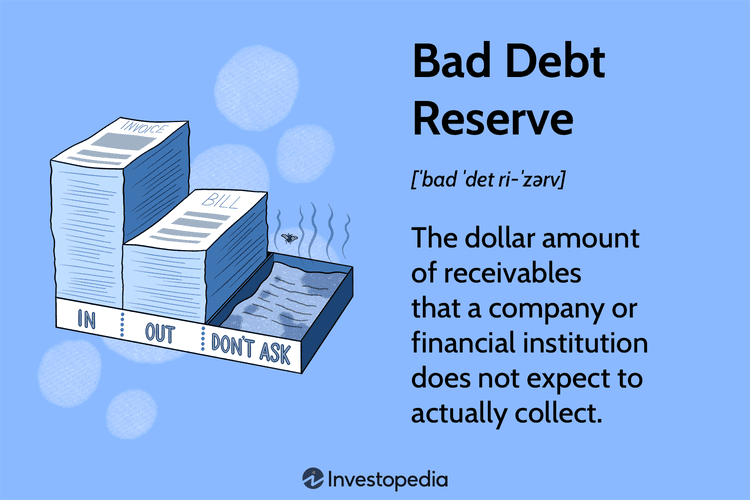

## Table of Contents

## What is bad debt reserve?

A bad debt reserve is money a company sets aside to cover debts that customers might not pay back. When a company sells goods or services on credit, there's a chance that some customers won't pay. To prepare for this, the company estimates how much money it might lose and keeps that amount in a special account called the bad debt reserve.

This reserve helps the company show a more accurate picture of its finances. Instead of suddenly losing a lot of money when a customer doesn't pay, the company can use the money from the bad debt reserve. This way, the company's financial statements look more stable because the potential losses are already accounted for.

## Why is bad debt reserve important in financial analysis?

Bad debt reserve is important in financial analysis because it helps show a more realistic view of a company's financial health. When a company sells things on credit, some customers might not pay back what they owe. By setting aside money in a bad debt reserve, the company can predict and plan for these losses. This makes the company's financial statements more accurate and reliable, because the potential losses are already accounted for.

Having a bad debt reserve also helps analysts and investors understand how well a company manages its credit risks. If a company has a large bad debt reserve, it might mean that it's being cautious about the possibility of customers not paying. On the other hand, a small reserve might suggest that the company is confident its customers will pay, or it might be underestimating the risk. This information can be crucial for making informed decisions about whether to invest in the company or how to value it.

## How is bad debt reserve calculated?

Bad debt reserve is calculated by looking at how much money a company thinks it won't get back from customers. The company uses a method called the allowance method to figure this out. They look at past records to see how much money they lost from customers not paying in previous years. Then, they use this information to guess how much money they might lose in the future. This guess is based on a percentage of their total sales on credit or the total amount of money they are owed.

For example, if a company usually loses 2% of its credit sales to bad debts, and this year they made $1 million in credit sales, they would set aside $20,000 for the bad debt reserve. Another way to calculate it is by looking at the accounts receivable. If the company thinks 5% of the $500,000 they are owed won't be paid, they would reserve $25,000. The exact method can vary, but the goal is always to make a good guess about future losses so the company's financial statements are more accurate.

## What are the common methods used to estimate bad debt reserve?

There are two common methods used to estimate bad debt reserve: the percentage of sales method and the accounts receivable aging method. The percentage of sales method involves looking at past records to see what percentage of credit sales turned into bad debts. For example, if a company usually loses 2% of its credit sales to bad debts, they would use this percentage to estimate the bad debt reserve for the current year. This method is simple and straightforward, but it doesn't take into account how long the money has been owed.

The accounts receivable aging method is a bit more detailed. It involves sorting the money owed to the company into different time periods, like 0-30 days, 31-60 days, and so on. Each time period has a different percentage of bad debt risk. For example, money owed for over 90 days might have a higher chance of not being paid back than money owed for just 30 days. By applying these percentages to the amounts in each time period, the company can get a more accurate estimate of the bad debt reserve. This method is more precise but also more complex to calculate.

## How does bad debt reserve affect a company's financial statements?

Bad debt reserve affects a company's financial statements by making them more accurate. When a company sells things on credit, some customers might not pay back what they owe. To prepare for this, the company guesses how much money it might lose and sets that amount aside in the bad debt reserve. This reserve is shown as a reduction in the company's accounts receivable on the balance sheet. By doing this, the company's financial statements show a more realistic picture of how much money it really expects to get back from customers.

The bad debt reserve also affects the income statement. When the company adds money to the bad debt reserve, it records this as an expense called "bad debt expense." This expense reduces the company's net income for the year. By including this expense, the income statement shows a lower profit, which is more accurate because it takes into account the money the company might not get back. This way, the financial statements give a clearer view of the company's financial health.

## Can you explain the difference between bad debt reserve and allowance for doubtful accounts?

Bad debt reserve and allowance for doubtful accounts are basically the same thing. They both refer to the money a company sets aside to cover debts that customers might not pay back. When a company sells things on credit, there's a chance some customers won't pay. To prepare for this, the company estimates how much money it might lose and keeps that amount in a special account. This account is called the bad debt reserve or the allowance for doubtful accounts.

The difference between the two terms is mostly about how they are used or described in different places. "Bad debt reserve" is a common term, but "allowance for doubtful accounts" is the more formal name used in accounting rules and financial statements. Both terms help the company show a more accurate picture of its finances. By setting aside money for debts that might not be paid, the company can make its financial statements look more realistic and stable.

## What are the implications of understating or overstating bad debt reserve?

If a company understates its bad debt reserve, it means they are not setting aside enough money to cover debts that customers might not pay. This can make the company's financial statements look better than they really are. People might think the company is doing better than it is because its profits seem higher. But if customers don't pay, the company could suddenly lose a lot of money, which could be a big problem. This can also make investors and lenders lose trust in the company because they might feel the company is not being honest about its financial health.

On the other hand, if a company overstates its bad debt reserve, it means they are setting aside too much money for debts that might not be paid. This can make the company's financial statements look worse than they really are. The company's profits will seem lower because they are taking a bigger expense for bad debts. While this might seem safer because it prepares for the worst, it can make the company look less profitable and might scare away investors. It's important for a company to find a balance and estimate the bad debt reserve as accurately as possible to show a true picture of its financial situation.

## How do changes in bad debt reserve impact a company's profitability?

When a company changes its bad debt reserve, it can affect how profitable the company looks. If the company decides to increase the bad debt reserve, it means they are setting aside more money for debts that customers might not pay. This increase is recorded as a higher bad debt expense on the income statement, which reduces the company's net income. So, the company's profits will look lower. This might make investors think the company is not doing as well, even if the company is just being more cautious about possible losses.

On the other hand, if the company decreases the bad debt reserve, it means they are setting aside less money for debts that might not be paid. This decrease reduces the bad debt expense on the income statement, which makes the company's net income higher. So, the company's profits will look better. This can make the company seem more profitable to investors, but it could also mean the company is underestimating the risk of customers not paying. Finding the right balance in estimating the bad debt reserve is important for showing a true picture of the company's financial health.

## What role does bad debt reserve play in assessing a company's credit risk?

Bad debt reserve helps people understand how much risk a company is taking when it sells things on credit. When a company sets aside money in the bad debt reserve, it shows they are thinking about the chance that some customers won't pay. If the bad debt reserve is big, it might mean the company thinks there's a high risk that customers won't pay. This can tell investors and lenders that the company is being careful about credit risk. On the other hand, if the bad debt reserve is small, it might mean the company thinks there's a low risk of customers not paying, or they might not be taking the risk seriously enough.

By looking at the bad debt reserve, people can get a better idea of how well a company is managing its credit risks. If a company keeps changing its bad debt reserve a lot, it might mean they are not sure about how much money they will get back from customers. This can make investors and lenders worried about the company's financial health. A stable bad debt reserve can show that the company has a good understanding of its credit risks and is managing them well. This helps people trust the company more when they are deciding whether to invest or lend money to it.

## How do regulatory requirements influence the management of bad debt reserve?

Regulatory requirements can have a big impact on how a company manages its bad debt reserve. Different countries and industries have rules about how companies should guess how much money they might lose from customers not paying. These rules make sure that companies are being honest and careful when they set aside money for bad debts. For example, some rules might say that companies need to use certain methods to calculate their bad debt reserve, like the percentage of sales method or the accounts receivable aging method. If a company doesn't follow these rules, they could get in trouble with the people who make sure companies are following the law.

These rules also help make sure that companies are showing a true picture of their financial health. If a company is too optimistic and doesn't set aside enough money for bad debts, they might be breaking the rules. This can make investors and lenders lose trust in the company. On the other hand, if a company is too careful and sets aside too much money, they might also be breaking the rules because they are making their profits look worse than they really are. So, companies need to follow the regulatory requirements carefully to make sure they are managing their bad debt reserve in the right way.

## What are the best practices for managing and reviewing bad debt reserve?

Managing and reviewing bad debt reserve well means a company should keep a close eye on how much money customers owe them and how likely those customers are to pay. It's important to use good methods to guess how much money might be lost, like looking at past records and sorting debts by how long they've been owed. Companies should also keep updating their guesses as things change, like if the economy gets better or worse, or if customers start paying differently. Talking to people who know about credit and money can help too, so the company can make smart choices about how much money to set aside.

It's also a good idea to check the bad debt reserve often to make sure it's still right. This means looking at the guesses made before and seeing if they were close to what really happened. If the guesses were way off, the company should think about why and change how they do things. Keeping good records and being open about how the bad debt reserve is managed helps everyone trust the company more. This way, the company can show a true picture of its money situation and make better plans for the future.

## How can advanced analytics improve the accuracy of bad debt reserve estimations?

Advanced analytics can help companies guess better how much money they might lose from customers not paying. By using special computer programs, companies can look at a lot of information all at once. This information can include how much money customers owe, how long they've owed it, what they've done in the past, and even things like the economy or how well the company is doing. With all this information, the computer can find patterns and make smarter guesses about which customers might not pay. This means the company can set aside just the right amount of money for the bad debt reserve, making their financial statements more accurate.

Using advanced analytics also helps companies keep their bad debt reserve up to date. Things can change quickly, like the economy getting better or worse, or customers starting to pay differently. With advanced analytics, companies can look at new information all the time and change their guesses as needed. This way, the bad debt reserve stays accurate and the company can plan better for the future. It also helps the company show a true picture of its money situation to investors and lenders, which can make them trust the company more.

## What are Key Financial Indicators and How Can We Understand Them?

Financial indicators are vital tools for assessing a company's health and stability. Key among these are bad debt reserves and debt ratios, which offer insights into a company’s financial practices and risk exposure.

Bad debt reserve, often referred to as allowance for doubtful accounts, is a financial metric used to estimate the portion of accounts receivable that may not be collected. This metric is essential for accurate financial reporting and planning, as it provides a realistic view of potential credit losses. Establishing a bad debt reserve involves analyzing historical data to predict future receivable defaults. Companies typically account for bad debts based on past experience, industry norms, and current economic conditions. By maintaining a sufficiently robust bad debt reserve, a company safeguards its liquidity, ensuring that unexpected losses do not impair its financial operations.

The debt ratio, on the other hand, is a fundamental measure of a company's financial leverage, calculated as the total liabilities divided by total assets. It is expressed in the formula:

$$
\text{Debt Ratio} = \frac{\text{Total Liabilities}}{\text{Total Assets}}
$$

This ratio assesses the extent to which a company's assets are financed through debt, providing insights into the firm's risk exposure and financial resilience. A higher debt ratio indicates greater financial leverage, which can suggest potential vulnerability to changing economic conditions or [interest rate](/wiki/interest-rate-trading-strategies) fluctuations. However, the acceptable level of a debt ratio varies across industries, as sectors have different capital structures and financial practices. A nuanced understanding of the debt ratio helps stakeholders evaluate the sustainability of a company's growth strategy and its ability to meet long-term obligations.

Both bad debt reserves and debt ratios are instrumental in informing business decisions, credit evaluations, and investment strategies, underpinning the fiscal robustness of an organization.

## What are Debt Ratios and What are Their Implications?

A company's debt ratio assesses its financial leverage by measuring the proportion of total debt relative to total assets. The formula is typically expressed as:

$$
\text{Debt Ratio} = \frac{\text{Total Debt}}{\text{Total Assets}}
$$

This ratio is a key indicator of a company's risk level. A high debt ratio suggests that a large portion of a company's assets is financed through debt, which can lead to financial distress if not managed appropriately. Such situations may adversely affect investor confidence, as the company might struggle to meet its debt obligations during economic downturns or fluctuations in cash flow.

Debt ratios serve as a benchmark for evaluating corporate leverage and financial health across different industries. For example, industries with steady cash flows, like utilities, might operate with higher debt ratios due to their predictable income, whereas sectors subject to greater [volatility](/wiki/volatility-trading-strategies), such as technology, might maintain lower debt ratios to cushion against financial instability. These variations are influenced by sector-specific practices and the typical capital intensity within each industry. Investors and financial analysts often compare a company's debt ratio to industry averages to assess whether it aligns with sector norms and to evaluate the potential risks involved.

Understanding these nuances helps stakeholders make informed decisions regarding the financial health and sustainability of organizations. Companies must balance their debt levels to optimize financial performance while maintaining an appealing risk portfolio for investors.

## What is the role of Credit Evaluation in maintaining Financial Health?

Credit evaluation is a crucial process in determining a company's capacity to meet its financial obligations. This assessment plays a significant role in understanding the financial health of a business. It involves an analysis of various factors such as financial statements, credit history, and current debt levels to gauge the likelihood of fulfilling debts. A robust credit evaluation essentially strengthens a firm's financial health and augments its investment appeal to potential investors and stakeholders.

A strong credit evaluation signifies a lower risk of default, thereby improving a company's attractiveness to creditors and investors. It reflects a company’s responsible financial management and stability, serving as an assurance to investors and lenders. This, in turn, can result in favorable borrowing conditions, such as lower interest rates and extended credit terms.

The relationship between credit scores and debt ratios offers a comprehensive view of a company’s financial condition. The debt ratio—a metric denoting the proportion of a company's assets that are financed by debt—is an important determinant in this evaluation. The formula for calculating the debt ratio is:

$$
\text{Debt Ratio} = \frac{\text{Total Debt}}{\text{Total Assets}}
$$

A lower debt ratio indicates a higher proportion of company financing through equity, which suggests lower financial risk. Conversely, a high debt ratio can imply greater risk, potentially affecting the company's credit score negatively.

Incorporating credit scores with debt ratios gives a holistic picture of financial health. While the debt ratio provides insight into financial leverage, the credit score reflects creditworthiness based on payment histories and current credit applications. The interplay between these indicators ensures a more accurate assessment of risk, guiding credit policies and investment decisions. This synthesis of quantitative metrics reinforces the foundation for informed strategic planning and financial management, ensuring sustainable business growth and market competitiveness.

## What are some strategies for optimizing financial health?

Developing a balanced approach between debt and equity is essential for optimizing financial health. Companies must strategically manage their capital structure to ensure long-term sustainability while maximizing growth opportunities. A favorable balance between debt and equity helps firms minimize the cost of capital and boosts investor confidence. This balance can be calculated using the debt-to-equity ratio, which is formulated as:

$$
\text{Debt-to-Equity Ratio} = \frac{\text{Total Debt}}{\text{Shareholders' Equity}}
$$

A ratio lower than the industry average may suggest a less risky financial profile, though industry norms and specific business models must be considered.

The use of analytics for ongoing financial health monitoring supports informed decision-making. Advanced data analytics can provide insights into financial trends and potential risk areas. Techniques such as predictive modeling, [machine learning](/wiki/machine-learning) algorithms, and real-time data analysis allow companies to anticipate financial hurdles and adjust their strategies accordingly. For instance, Python libraries like pandas and NumPy offer tools for data manipulation and analysis, which can be employed in financial forecasting and scenario planning.

Aligning reserve policies with broader financial strategies is imperative for maintaining financial stability. Reserves act as financial cushions that protect against unforeseen financial difficulties. Companies should regularly assess and adjust their reserve levels to reflect changes in market conditions and operational requirements. Integrating these reserves into the overall financial strategy can help ensure liquidity during downturns and promote confidence among stakeholders.

By adopting these strategies, businesses can enhance their financial health, ensuring resilience in a rapidly changing economic environment.

## References & Further Reading

1. Altman, E. I. (1968). "Financial Ratios, Discriminant Analysis and the Prediction of Corporate Bankruptcy." *Journal of Finance, 23*(4), 589-609. This seminal paper introduces the Altman Z-Score, a formula used to predict the probability of bankruptcy, which is integral in credit evaluation and risk assessment.

2. Damodaran, A. (2002). "Investment Valuation: Tools and Techniques for Determining the Value of Any Asset." Wiley Finance. This book provides comprehensive insights into valuation methods, including the evaluation of financial health indicators such as debt ratios.

3. Hull, J. (2010). "Options, Futures, and Other Derivatives." Prentice Hall. This account covers the essential aspects of derivatives and algorithmic trading strategies, emphasizing the use of financial metrics to inform trading decisions.

4. Jegadeesh, N., & Titman, S. (1993). "Returns to Buying Winners and Selling Losers: Implications for Stock Market Efficiency." *Journal of Finance, 48*(1), 65-91. This paper discusses momentum trading strategies, highlighting the role of financial health indicators in shaping trading algorithms.

5. Lintner, J. (1965). "The Valuation of Risk Assets and the Selection of Risky Investments in Stock Portfolios and Capital Budgets." *Review of Economics and Statistics, 47*(1), 13-37. Lintner's work on risk assessment provides foundational understanding for integrating credit evaluations and debt ratios in financial decision-making.

6. Liu, X., & Zhao, M. (2019). "Algorithmic Trading Strategies Based on Fundamental and Technical Indicators." *The Journal of Finance and Data Science, 5*(1), 1-18. This article examines the implementation of algorithmic trading systems that leverage financial indicators, including credit evaluations, for improving trade outcomes.

For further reading on algorithmic trading strategies involving financial metrics, consider the following resources:

- Chan, E. P. (2009). "Quantitative Trading: How to Build Your Own Algorithmic Trading Business." Wiley Trading. This resource provides practical guidelines for implementing algorithmic trading systems using quantitative financial metrics.

- Tsay, R. S. (2010). "Analysis of Financial Time Series." Wiley. This book is pivotal for understanding the statistical techniques employed in algorithmic trading, detailing methods for analyzing financial time series data crucial to credit risk assessment.

These readings offer a foundation for better understanding how financial health indicators and algorithmic trading strategies intersect and inform investment and risk management activities.

