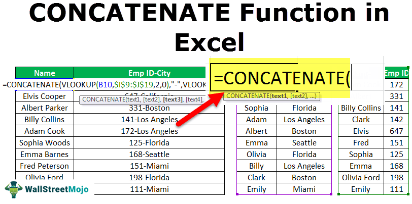

Algorithmic trading, often referred to as algo trading, represents a transformative approach to financial markets, leveraging computer algorithms to execute trading decisions at optimal speeds and efficiencies. This method dominates modern trading platforms, as it mitigates the delays inherent in human decision-making, thus facilitating quicker and data-driven responses to market opportunities. The rise of algorithmic trading has led to increased market liquidity, diminished transaction costs, and improved price discovery processes. Automated trading systems now account for a significant portion of equity market trades, revolutionizing how assets are exchanged and managed globally. Its core advantage lies in executing complex strategies at a velocity and scale beyond human capacity, commonly employing strategies like moving averages or arbitrage.

In contrast, the term "bad title" finds its grounding in the legal and real estate sectors. A "bad title" in real estate refers to a situation where the legal ownership of a property is clouded by discrepancies, such as outstanding liens, unresolved encumbrances, or any defects in the title record that could challenge rightful ownership. Such a title is problematic as it complicates property transactions, potentially leading to financial losses or protracted legal disputes for the parties involved. The resolution of a bad title usually involves thorough legal scrutiny, correction of records, and, if necessary, litigation to clear any claims obstructing a clear title.



Interestingly, both algorithmic trading and the concept of a "bad title" highlight the importance of accuracy and efficiency in their respective fields. The connection between these seemingly disparate topics can be found in the notion of data integrity and error resolution. In algorithmic trading, erroneous data or faults in trading logic can lead to faulty market decisions, much like how a bad title can derail a real estate transaction. Both scenarios underscore the critical need for precision and verification within operational processes to prevent and rectify issues that could lead to significant financial implications.

## Table of Contents

## Understanding 'Bad Title' in Real Estate

A "bad title" in real estate refers to a title defect that can compromise the legal ownership of a property. Such defects could arise from various issues that might surface when researching the title history of a property. A bad title can lead to serious legal and financial consequences for property buyers and sellers.

### Definition and Implications

A bad title, sometimes referred to as a defective title, occurs when the title search reveals imperfections that could affect the ownership rights. This may include outstanding liens, unpaid taxes, clerical errors, or claims from heirship or adverse possession. The implications of a bad title are significant as they can prevent the smooth transfer of property ownership, complicate future sales, and may even lead to costly litigation.

### Common Causes and Consequences

There are several common causes of a bad title. Among them are:

- **Clerical Errors:** Mistakes in public records such as incorrect spellings, omissions, or incorrect descriptions of the property can affect the validity of a title.

- **Liens and Encumbrances:** Existing liens for unpaid debts or taxes, including mortgages or unpaid contractor bills, can result in a bad title. Certain liens may not be disclosed until a detailed title search is conducted.

- **Boundary Disputes:** Discrepancies in land surveys or lost boundary markers can lead to conflicts over property boundaries, contributing to title defects.

- **Forgery and Fraud:** Historical instances of forged documents may cloud the title, calling into question the legitimacy of past transfers.

The consequences of a bad title can range from delays in property transactions to complete legal battles over property ownership. In the worst cases, a buyer could lose the property or be forced to pay unforeseen debts.

### Processes to Rectify and Clear a Bad Title

Resolving a bad title generally involves several key steps:

1. **Title Search and Examination:** A thorough title search is essential to uncover any defects. Title companies or real estate attorneys typically perform these searches.

2. **Title Insurance:** Purchasing title insurance can protect against future claims and losses due to pre-existing title defects. The insurance company often covers the costs to resolve disputes.

3. **Legal Resolution:** In cases where title disputes arise, it may be necessary to take legal action to settle claims. This might involve negotiating settlements or litigating contested ownerships.

4. **Clearing Liens and Encumbrances:** For issues related to outstanding debts or liens, settling these financial obligations is critical. Working with creditors or tax authorities to resolve these debts is essential before obtaining a clear title.

5. **Correcting Clerical Errors:** Any discovered errors in documentation should be corrected with the relevant public office, such as the county recorder.

Clearing a bad title can be a complex process requiring legal and financial expertise. Engaging professionals like title companies and real estate attorneys is crucial to navigate these challenges effectively. Addressing title issues not only secures property ownership but also smooths the path for future transactions.

## Algorithmic Trading: Basics and Benefits

Algorithmic trading, commonly referred to as algo trading, represents a method of executing orders using automated pre-programmed trading instructions that account for variables such as time, price, and [volume](/wiki/volume-trading-strategy). This trading strategy employs complex algorithms designed to exploit micro-level price discrepancies or implement large trade orders effectively. 

At its core, [algorithmic trading](/wiki/algorithmic-trading) integrates three essential components: data feeds, signal generation, and order execution. Data feeds provide the necessary real-time or historical market data to drive decision-making processes. Signal generation relies on quantitative models to derive buy or sell signals based on predefined criteria. Order execution involves the use of sophisticated execution algorithms to optimize trade performance while reducing market impact and transaction costs.

The benefits of algorithmic trading are numerous: 

1. **Speed**: Algorithms can process vast amounts of market data and execute trades within milliseconds, significantly faster than human capabilities. This high velocity is crucial in markets where profitable opportunities can appear and vanish within seconds.

2. **Accuracy**: Algorithmic trading reduces the potential for human errors associated with manual trading. The reliance on predefined criteria ensures that decisions are executed consistently and based on quantitative analysis.

3. **Automation**: Automation allows for the simultaneous monitoring of multiple markets and trading opportunities, freeing traders from the time-consuming task of manual monitoring. It also enables the execution of complex trading strategies across diverse instruments and markets without manual intervention.

Common strategies used in algorithmic trading include:

- **Trend Following Strategies**: These strategies involve algorithms designed to identify and capitalize on trends within the market, utilizing technical indicators such as moving averages or channel breakouts.

- **Arbitrage Strategies**: Arbitrage takes advantage of price differences between related securities. These algorithms are programmed to identify and exploit these price differentials, often requiring sophisticated infrastructure and low-latency connections.

- **Market Making**: Algorithms in market making simultaneously place buy and sell orders to profit from the bid-ask spread, providing liquidity to the market. They require high-speed execution and are commonly used by high-frequency trading firms.

- **Mean Reversion Strategies**: These algorithms are based on the premise that asset prices will revert to their historical mean or average value. By identifying deviations from the mean, these strategies execute trades anticipating a return to the long-term average.

Algorithmic trading's capacity to process data and execute trades with unparalleled speed and precision has led to its widespread adoption across financial markets globally. By leveraging these strategies, traders can optimize returns and enhance their market competitiveness.

## Designing Trading Algorithms

Designing trading algorithms involves a systematic approach to developing a set of rules for entering and exiting trades based on technical analysis, statistical metrics, or other market data. Below are the steps and detailed guidance for constructing a simple trading algorithm, specifically focusing on the implementation of a moving average crossover strategy using Python.

### Steps to Build a Simple Trading Algorithm

1. **Define the Strategy**:
   The first step in designing a trading algorithm is to define the logic or strategy. In the case of the moving average crossover strategy, this involves identifying conditions under which trades will be made. A common approach is to use two moving averages: a short-term and a long-term. A buy signal occurs when the short-term moving average crosses above the long-term moving average, and a sell signal occurs when it crosses below.

2. **Data Acquisition**:
   Obtain historical price data to test the algorithm. This can be sourced from APIs provided by financial data vendors such as Alpha Vantage, Yahoo Finance, or Quandl.

3. **Strategy Implementation**:
   Utilizing Python and libraries such as Pandas for data manipulation and NumPy for numerical operations, you can implement the moving average crossover strategy. Below is a simple example:

   ```python
   import pandas as pd
   import numpy as np
   import matplotlib.pyplot as plt

   # Load data
   df = pd.read_csv('historical_stock_data.csv')
   df['Date'] = pd.to_datetime(df['Date'])
   df.set_index('Date', inplace=True)

   # Calculate moving averages
   short_window = 40
   long_window = 100

   df['Short_MA'] = df['Close'].rolling(window=short_window, min_periods=1).mean()
   df['Long_MA'] = df['Close'].rolling(window=long_window, min_periods=1).mean()

   # Generate signals
   df['Signal'] = 0
   df['Signal'][short_window:] = np.where(df['Short_MA'][short_window:] > df['Long_MA'][short_window:], 1, 0)
   df['Position'] = df['Signal'].diff()

   # Plot the closing prices along with short and long moving averages
   plt.figure(figsize=(14, 7))
   plt.plot(df['Close'], label='Close Price')
   plt.plot(df['Short_MA'], label='40-Day MA', alpha=0.7)
   plt.plot(df['Long_MA'], label='100-Day MA', alpha=0.7)
   plt.plot(df[df['Position'] == 1].index, df['Short_MA'][df['Position'] == 1], '^', markersize=10, color='g', lw=0, label='Buy Signal')
   plt.plot(df[df['Position'] == -1].index, df['Short_MA'][df['Position'] == -1], 'v', markersize=10, color='r', lw=0, label='Sell Signal')
   plt.title('Moving Average Crossover Strategy')
   plt.legend()
   plt.show()
   ```

4. **Backtesting the Algorithm**:
   Backtesting is essential for evaluating the performance of a trading algorithm before putting it into live operation. It involves running the algorithm using historical market data to assess how well it would have performed. This helps in understanding the return expectations and the risks associated. In the earlier Python example, [backtesting](/wiki/backtesting) involves analyzing the positions and computing returns based on hypothetical buy and sell signals.

5. **Analysis of Backtest Results**:
   After backtesting, analyze the results to evaluate metrics such as total return, Sharpe ratio, maximum drawdown, etc. This analysis helps in refining the strategy by adjusting parameters like the window size of moving averages.

6. **Optimize and Iterate**:
   Adjust the strategy parameters and continue testing different conditions to improve performance metrics. This includes exploring different timeframes, alternative indicators, and combining strategies.

By systematically defining a strategy, acquiring appropriate data, implementing and backtesting it, one can develop an effective trading algorithm. Moving average crossover strategies serve as a good starting point due to their simplicity and effectiveness in trending markets. However, ongoing analysis and optimization are crucial to adapt to changing market conditions and ensuring robust performance.

## Advanced Techniques in Algo Trading

High-frequency trading ([HFT](/wiki/high-frequency-trading-strategies)) and [machine learning](/wiki/machine-learning) are transformative components of modern algorithmic trading, facilitating rapid and informed decision-making in financial markets. High-frequency trading involves using sophisticated algorithms to execute a large number of orders at extremely high speeds, often measured in microseconds. This technique capitalizes on minimal price discrepancies, providing [liquidity](/wiki/liquidity-risk-premium) and minimizing spreads. HFT is particularly impactful in markets with high volumes and [volatility](/wiki/volatility-trading-strategies), where speed provides a distinct advantage.

Machine learning in algorithmic trading enhances the predictive capability of trading systems by analyzing vast datasets to identify patterns and correlations. Machine learning algorithms can adapt to new information, making them ideal for markets that are dynamic and constantly evolving. For instance, regression analysis, decision trees, and neural networks are commonly used to model complex relationships between indicators and market behavior. A concrete application of machine learning in trading is the development of predictive models that [factor](/wiki/factor-investing) in historical prices, market sentiment, and macroeconomic indicators to forecast future price movements.

An example of machine learning in trading can be seen in the application of a Support Vector Machine (SVM) algorithm. SVMs classify data into different categories based on training data, enabling traders to predict whether an asset's price will rise or fall. By training an SVM on historical price data, traders can identify optimal entry and [exit](/wiki/exit-strategy) points as part of a broader trading strategy.

```python
from sklearn import svm
import numpy as np

# Sample feature vectors derived from financial indicators and corresponding labels
features = np.array([[0.1, 0.2], [0.2, 0.8], [0.7, 0.2], [0.6, 0.7]])
labels = [1, 0, 1, 0]  # Labels representing buying (1) or selling (0)

# Initializing and training the SVM classifier
classifier = svm.SVC(kernel='linear')
classifier.fit(features, labels)

# Predicting the trend of a new data point
new_data = np.array([[0.5, 0.3]])
predicted_label = classifier.predict(new_data)
```

Walk-forward analysis is another critical technique that ensures the robustness of algorithmic trading strategies. This validation method involves testing a trading strategy on a rolling basis, which means gradually advancing the testing period over time while retraining the model at each step. Walk-forward analysis mimics real-world conditions more closely by accounting for changes in market dynamics, ensuring that the strategy remains effective across different market environments. This technique addresses the risk of overfitting, where a model performs well on historical data but fails to adapt to new or unseen data.

Walk-forward analysis involves multiple cycles of optimization and validation. During each cycle, a model is optimized on an initial dataset, and its performance is validated on a subsequent dataset. The results of these validation periods are aggregated to assess the strategy's overall performance, offering insights into its stability and adaptability.

In conclusion, advanced techniques such as high-frequency trading, machine learning, and walk-forward analysis play a pivotal role in algorithmic trading, enhancing precision, adaptability, and resilience in a rapidly changing financial landscape.

## Risk Management and Optimization in Algo Trading

Risk management and optimization are critical components in the development and implementation of algorithmic trading strategies. Effective risk management ensures that trading systems can withstand market volatility and unexpected events while optimizing strategies enhance performance and profitability.

Risk management in trading systems focuses on mitigating potential losses and maintaining consistent returns. One fundamental technique is the use of stop-loss orders, which automatically liquidate a position when its price moves unfavorably by a specified amount. This prevents further losses beyond the trader's risk tolerance level. For example, if a trader sets a stop-loss at 5% below the entry price, the position will be automatically closed if the asset's price falls by that margin.

Take profit orders are another essential aspect, designed to lock in gains once a predetermined price level is reached. By securing profits at specific levels, traders can avoid the pitfalls of holding positions for too long in volatile markets. Combined with stop-loss orders, take profit levels create a balanced risk/reward ratio, helping traders define clear exit strategies.

Position sizing is a third crucial element in risk management, determining the amount of capital allocated to a specific trade. Various methods, such as the Kelly Criterion or fixed fractional position sizing, guide traders in balancing risk across multiple trades. A common approach is to risk a fixed percentage of total capital on each trade, ensuring that no single loss has a devastating impact on the overall portfolio.

Optimization of trading algorithms involves fine-tuning parameters and strategies to maximize performance. This process often includes backtesting, which assesses how the algorithm would have performed on historical data, offering insights into its potential effectiveness. Through backtesting, traders can identify weaknesses and make data-driven adjustments to improve performance.

One common optimization strategy is parameter adjustments in technical indicators. For instance, in a moving average crossover strategy, the lengths of the short-term and long-term averages can be optimized to yield the best historical performance. Python libraries like Pandas and NumPy are frequently used for these analyses, enabling traders to efficiently test various configurations.

Additionally, machine learning techniques can enhance optimization by uncovering patterns and relationships within large datasets that are not immediately apparent. Algorithms like Random Forests or Support Vector Machines can process complex data structures to refine trading strategies further.

Ultimately, the success of algorithmic trading hinges on a robust risk management framework and continuous optimization practices. These elements not only safeguard investments against unforeseen risks but also allow traders to adapt to changing market conditions, ensuring long-term success.

## Deploying and Monitoring Trading Systems

Deploying algorithmic trading systems requires meticulous planning to ensure both robustness and efficiency. A critical aspect of deployment is the seamless transition from a testing environment to live markets. This involves various stages, including system setup, integration with trading platforms, and rigorous testing to identify potential issues before execution in the real world.

One of the best practices in this phase is to conduct thorough unit and integration testing. Systems should be tested under various scenarios to ascertain their performance under different market conditions. Additionally, employing a simulated trading environment can help in replicating real market conditions without financial risk. This approach assists in fine-tuning the algorithm and fixing any bugs that may appear during testing.

Real-time monitoring and performance assessment are indispensable components of an effective trading system. Tools such as Grafana and Prometheus, which enable visualization and analysis of system performance metrics, can be implemented to track the health of the algorithm in real time. These tools provide insights into latency issues, data feed quality, and execution speeds, enabling timely interventions to avert potential problems.

Continuous monitoring is essential for ensuring the consistent performance of trading systems. It encompasses the assessment of algorithm outputs, market conditions, and system health. Any deviation from expected outcomes can be swiftly addressed by automated alerts and fail-safes. Continuous monitoring not only helps in identifying operational anomalies but also aids in updating strategies to adapt to evolving market environments.

Environment consistency is another crucial aspect that ensures the reliability of trading systems. Maintaining a consistent environment between testing, development, and production phases minimizes discrepancies that may arise due to system updates or configuration changes. Version control tools, such as Git, help to manage code versions and facilitate systematic updates, ensuring that any modification is carefully documented and reversible if needed.

In summary, deploying and monitoring algorithmic trading systems necessitates a structured approach involving rigorous testing, real-time performance tracking, and maintaining consistency across environments. This practice not only mitigates risks but also enhances the agility and responsiveness of trading systems in dynamic markets.

## Conclusion

Algorithmic trading offers numerous advantages to traders and financial markets alike. By automating the execution of trades, algorithms significantly improve the speed and accuracy of transactions, allowing traders to capitalize on market opportunities in fractions of a second. This automation not only reduces human error but also facilitates the handling of large trading volumes consistently. Enhanced market liquidity and efficiency are direct results of these capabilities, contributing to overall market competitiveness.

To fully harness the potential of algorithmic trading, continuous learning and strategy adaptation are essential. Financial markets are dynamic, influenced by ever-changing economic data, geopolitical events, and technological advancements. This necessitates the continual evaluation and refinement of trading strategies to ensure they remain effective under new market conditions. Traders must stay abreast of developments in trading technology and data analysis techniques, incorporating innovations like machine learning models and high-frequency trading algorithms to maintain a competitive edge.

Moreover, leveraging technology effectively in trading involves not just the design and implementation of robust algorithms but also their rigorous testing and ongoing refinement. Backtesting strategies against historical data and conducting walk-forward analysis are critical to validating an algorithm's performance before deployment. Continuous monitoring of deployed systems ensures they operate as intended and adapt to real-time market conditions. This vigilance is crucial for detecting anomalies and optimizing strategies, ensuring consistent profitability.

Through the integration of sophisticated algorithms and adaptive strategies, traders can achieve greater success in an increasingly competitive landscape. Maintaining a focus on innovation, risk management, and strategic optimization will be pivotal in leveraging the full spectrum of technological advancements that algo trading has to offer.

## References & Further Reading

1. **Books and Articles on Algorithmic Trading:**
   - *Algorithmic Trading: Winning Strategies and Their Rationale* by Ernest P. Chan provides a comprehensive guide to designing and implementing trading strategies. The book covers risk management and trading psychology, making it a useful resource for both beginners and experienced traders.
   - *Quantitative Trading: How to Build Your Own Algorithmic Trading Business* by Ernest P. Chan is an introductory book that explores the different facets of building an algorithmic trading operation, including risk management and optimization techniques.
   - *Advances in Financial Machine Learning* by Marcos López de Prado introduces cutting-edge machine learning algorithms and models specifically tailored for finance. It also covers advanced techniques for risk management and optimization.

2. **Research Papers and Journals:**
   - *Risk Management and Return in Quantitative Equity Management* by Attilio Meucci in Risk Management Series discusses comprehensive frameworks for managing risk in algorithmic trading environments.
   - *High-Frequency Trading and Price Discovery* by Jonathan Brogaard, Terrence Hendershott, and Ryan Riordan, published in The Review of Financial Studies, examines the impact of high-frequency trading on market efficiency and price discovery.

3. **Online Courses and Workshops:**
   - Coursera offers a series of Specializations in financial engineering and risk management, which are tailored towards the application of algorithmic trading strategies.
   - edX provides various courses on algorithmic trading and machine learning in finance, offering practical examples and exercises.

4. **Technical Blogs and Online Communities:**
   - QuantStart is a popular blog that offers a range of guides and tutorials on quantitative finance and algorithmic trading concepts.
   - QuantConnect provides an open-source platform and community for building and backtesting trading algorithms and has numerous resources available for enhancing algorithm performance.

5. **Toolkits and Libraries:**
   - *QuantLib* is a free/open-source library for modeling, trading, and risk management in real-life.
   - Python's Pandas, NumPy, and SciPy libraries are essential for data manipulation and numerical operations required in algorithmic trading.

6. **Financial Dataset Providers:**
   - Quandl and Alpha Vantage offer extensive datasets that are crucial for backtesting and developing trading strategies.

By exploring these resources, individuals can deepen their understanding of algorithmic trading and enhance their ability to apply advanced techniques in risk management and optimization effectively.

