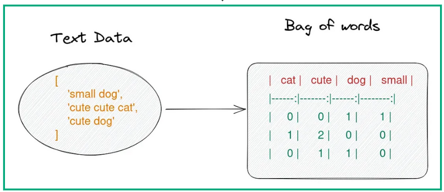

## Table of Contents

## What is the Bag of Words model in NLP?

The Bag of Words model is a way to represent text in natural language processing (NLP). It works by counting how many times each word appears in a piece of text, without considering the order of the words. Imagine you have a bag and you throw all the words from a sentence into it. You then count how many times each word appears, but you don't care about the sequence in which they originally appeared.

This model is simple but useful for tasks like text classification and sentiment analysis. For example, if you want to know if a movie review is positive or negative, you can count the words and see if there are more positive words like "good" or "great" than negative words like "bad" or "terrible." The Bag of Words model helps computers understand text by turning it into numbers, which computers are good at processing. However, it does not capture the meaning or context of the text, which can be a limitation.

Mathematically, the BoW model can be expressed with the help of a term-document matrix. For a corpus containing $n$ documents and $m$ unique words across the documents, the term-document matrix $A$ is an $n \times m$ matrix where each entry $a_{ij}$ represents the frequency of the $j$-th word in the $i$-th document.

Python is commonly used to implement Bag of Words models due to its rich ecosystem of libraries designed for data manipulation and [machine learning](/wiki/machine-learning). The following code snippet demonstrates how to use Python's `scikit-learn` library to convert a collection of text documents into a BoW representation:

```python
from sklearn.feature_extraction.text import CountVectorizer

# Sample corpus
documents = [
    "NLP and machine learning are crucial in algorithmic trading.",
    "Bag of Words is a fundamental technique in NLP.",
    "Algorithmic trading relies heavily on data analysis."
]

# Initialize CountVectorizer
vectorizer = CountVectorizer()

# Transform documents into BoW
bow_matrix = vectorizer.fit_transform(documents)

# Get feature names
features = vectorizer.get_feature_names_out()

# Display BoW matrix and features
print("Feature names:", features)
print("BoW matrix:\n", bow_matrix.toarray())
```

By providing a numeric representation of text, the BoW model is widely used in various NLP tasks such as text classification, sentiment analysis, and information retrieval. Its straightforward mechanism for feature extraction makes it a popular choice, especially when the contextual meaning of words is not of primary concern. However, it is crucial to note that by ignoring syntax and word order, BoW loses context, which can sometimes be pivotal in understanding the sentiment or theme of a text.

## How does the Bag of Words model represent text?

The Bag of Words model turns text into numbers by counting how many times each word shows up. Imagine you have a sentence, and you take all the words out of it and put them into a bag. You then count each word without worrying about the order they were in before. This creates a list where each word is matched with its count. For example, if you have the sentence "The cat sat on the mat," the Bag of Words model would count "the" as 2, "cat" as 1, "sat" as 1, "on" as 1, and "mat" as 1.

This way of representing text is useful because computers are good at working with numbers. By turning words into counts, the Bag of Words model helps computers understand and process text for tasks like figuring out if a review is good or bad. However, it doesn't keep track of the order of words, so it misses out on the meaning and context that can be important for understanding language fully.

## What are the main steps to create a Bag of Words model?

To create a Bag of Words model, start by taking your text and breaking it down into individual words. This means you need to split the sentences into words, usually by spaces. Then, you make a list of all the unique words you found. This list is called a vocabulary. Next, you go through your text again and count how many times each word from your vocabulary appears. You do this for each piece of text you want to represent.

Once you have counted all the words, you can represent your text as a list of numbers. Each number in the list shows how many times a word from your vocabulary appears in the text. This list is called a vector. Every piece of text you process will have its own vector, and these vectors can be used by computers to do things like classify text or find patterns. Remember, the Bag of Words model doesn't care about the order of the words, just how many times they show up.

## What is tokenization and why is it important in Bag of Words?

Tokenization is the process of breaking down text into smaller pieces, usually words. In the Bag of Words model, this means splitting sentences into individual words. Imagine you have a sentence like "The cat sat on the mat." Tokenization would turn this into a list of words: ["The", "cat", "sat", "on", "the", "mat"]. This step is important because it helps the computer understand the text by focusing on the individual words.

Without tokenization, the Bag of Words model wouldn't be able to count how many times each word appears. If you didn't break the sentence into words, you'd just have one big chunk of text, and it would be hard to analyze. By turning the text into tokens, you can then count each word and create the list of numbers that the Bag of Words model uses. This makes it easier for computers to process and understand the text for tasks like sorting reviews or finding common themes in documents.

## How do you handle text preprocessing in Bag of Words?

Text preprocessing in Bag of Words means getting the text ready so the model can work with it better. First, you turn all the words into lowercase so "The" and "the" are counted as the same word. Then, you take out things like punctuation and numbers because they usually don't help with understanding the meaning of the text. You might also want to remove common words like "and," "the," and "is" because they show up a lot but don't add much to what the text is about. These common words are called stop words.

After that, you might want to change words to their basic form, which is called stemming or lemmatization. For example, "running," "ran," and "runner" all come from the root word "run." This way, all these different forms are counted as the same word. Once you've done all this, you can break the text into words, which is called tokenization. This makes it easier to count each word and create the list of numbers that the Bag of Words model uses to understand the text.

## What are the advantages of using the Bag of Words model?

The Bag of Words model is easy to use and understand. It turns text into numbers by counting how many times each word shows up. This makes it simple for computers to work with text. Because it's not complicated, you can use it for things like sorting emails into folders or figuring out if a review is good or bad. It's also quick to set up, so you can start using it without spending a lot of time getting ready.

Another good thing about the Bag of Words model is that it works well for some tasks. For example, if you want to see if two pieces of text are talking about the same thing, you can count the words they have in common. It's also helpful for looking at big collections of text to find common themes or topics. Even though it doesn't keep track of word order, it can still give you useful information about what the text is about.

## What are the limitations of the Bag of Words model?

The Bag of Words model has some problems because it doesn't care about the order of words. This means it can't tell the difference between sentences like "The dog bit the man" and "The man bit the dog." Both sentences would look the same to the model because they have the same words, just in a different order. This can make it hard for the model to understand what the text really means, especially when the order of words is important.

Another issue is that the Bag of Words model treats all words the same, no matter how important they are. It counts common words like "the" and "and" the same as important words like "happy" or "sad." This can make it hard to figure out what the text is really about. Also, the model doesn't understand that some words mean the same thing, like "big" and "large." This can lead to missing out on important information because the model doesn't see the connections between words.

## How can Bag of Words be used in machine learning applications?

The Bag of Words model is used in machine learning to help computers understand and work with text. It does this by turning words into numbers, which computers are good at handling. For example, in email sorting, the model can count words in emails to decide if they should go into the spam folder or the inbox. If an email has a lot of words like "free" or "money," the model might think it's spam. This way, the Bag of Words model helps computers sort and organize text data quickly and easily.

Another use of the Bag of Words model is in figuring out if a review is positive or negative, which is called sentiment analysis. The model counts words in the review and looks for words that show feelings, like "good" or "bad." If there are more positive words, the model might say the review is good. This can help businesses understand what people think about their products or services. Even though the model is simple, it can still be very helpful in these kinds of tasks where understanding the general idea of the text is enough.

## What is the difference between Bag of Words and TF-IDF?

The Bag of Words model and TF-IDF are both ways to turn text into numbers so computers can work with them, but they do it differently. The Bag of Words model counts how many times each word shows up in a piece of text. It's simple and doesn't care about the order of the words. For example, if you have a sentence like "The cat sat on the mat," the model would count "the" as 2, "cat" as 1, "sat" as 1, "on" as 1, and "mat" as 1. This makes it easy to use for tasks like sorting emails or figuring out if a review is good or bad.

TF-IDF, which stands for Term Frequency-Inverse Document Frequency, goes a step further. It not only counts how many times a word appears in a piece of text, but also looks at how important that word is across all the texts you're looking at. Words that show up a lot in one piece of text but not in others are seen as more important. For example, if "cat" is common in one document but not in others, TF-IDF would give it a higher score in that document. This makes TF-IDF better at finding what makes a piece of text special compared to others, which can be useful for searching through big collections of text or figuring out what a document is about.

## How do you implement Bag of Words in Python using libraries like NLTK or scikit-learn?

To implement the Bag of Words model in Python using the NLTK library, you first need to install NLTK and download the necessary data. Once you have NLTK set up, you can start by tokenizing your text, which means breaking it into individual words. You can use NLTK's `word_tokenize` function for this. After tokenizing, you might want to remove stop words and do some other text cleaning like turning everything to lowercase. NLTK has a list of stop words you can use. Once your text is cleaned, you can use NLTK's `FreqDist` to count how many times each word appears. This gives you the Bag of Words representation of your text.

Using scikit-learn to implement the Bag of Words model is also straightforward. First, make sure you have scikit-learn installed. Then, you can use the `CountVectorizer` class from scikit-learn to turn your text into a Bag of Words model. This class does a lot of the work for you, including tokenizing the text and counting the words. You just need to create a `CountVectorizer` object, fit it to your text data, and then use it to transform your text into a matrix where each row represents a piece of text and each column represents a word. This matrix is your Bag of Words model, ready to be used in machine learning tasks.

## What advanced techniques can be used to improve the Bag of Words model?

One way to make the Bag of Words model better is by using something called n-grams. Instead of just looking at single words, n-grams let you look at groups of words, like pairs or even bigger groups. This helps the model understand the order of words a bit better, which can be important for understanding what the text means. For example, if you're looking at reviews, knowing that "not good" is different from "good" can make a big difference. By using n-grams, the Bag of Words model can catch these differences and do a better job at figuring out the meaning of the text.

Another way to improve the Bag of Words model is by using word embeddings. Word embeddings turn words into numbers in a way that shows how similar or different words are to each other. This means the model can understand that words like "happy" and "joyful" mean similar things, even if they're different words. This can help the model understand the text better, especially when the exact words used aren't as important as the general idea. By using word embeddings, the Bag of Words model can get a better sense of what the text is really about, making it more useful for tasks like figuring out what people think about a product or sorting emails.

## How does Bag of Words compare to more advanced NLP models like word embeddings?

The Bag of Words model is a simple way to turn text into numbers by counting how many times each word appears. It doesn't care about the order of words, so it can miss out on important details like the difference between "not good" and "good." This can make it hard for the model to understand what the text really means. But, because it's simple, the Bag of Words model is easy to use and can still be helpful for tasks like sorting emails or figuring out if a review is positive or negative.

Word embeddings, on the other hand, are a more advanced way to represent words. They turn words into numbers in a way that shows how similar or different words are to each other. This means the model can understand that words like "happy" and "joyful" mean similar things. Word embeddings help the model get a better sense of what the text is really about, making them more useful for tasks like understanding what people think about a product or figuring out the main topics in a big collection of text. While word embeddings are more powerful, they can also be more complicated to set up and use.

## How to implement BoW with Python?

To implement the Bag of Words (BoW) model in Python, the `CountVectorizer` class from the `scikit-learn` library is commonly used to transform a collection of text documents into a matrix of token counts. This process involves several steps, utilizing Python's powerful natural language processing libraries such as `NLTK` and `scikit-learn`, which streamline text preprocessing, vectorization, and application of NLP algorithms.

### Importing Libraries
Begin by importing the necessary Python libraries, which include `scikit-learn` for vectorization and potentially `NLTK` for additional text preprocessing tasks (e.g., tokenization, stop words removal).

```python
from sklearn.feature_extraction.text import CountVectorizer
from nltk.corpus import stopwords
```

Make sure to download the stop words if you are using `NLTK`:
```python
import nltk
nltk.download('stopwords')
```

### Defining Documents
Text data is typically presented in the form of a list, where each element is a document string. For example:

```python
documents = [
    "Stock market rises amid economic growth",
    "Economic downturn affects stock market",
    "Positive trends in the stock market this quarter"
]
```

### Transforming Text into Vectors
Create an instance of `CountVectorizer`, specifying any additional parameters such as removal of common words (stop words) to improve model performance.

```python
vectorizer = CountVectorizer(stop_words=stopwords.words('english'))
```

Fit the `CountVectorizer` to the documents and transform these documents into a matrix where each row corresponds to a document and each column corresponds to a word from the vocabulary.

```python
X = vectorizer.fit_transform(documents)
```

### Viewing the Result
The resulting count matrix `X` is a sparse matrix. To visualize it, convert it to an array or a dense matrix:

```python
print(X.toarray())
```

The `CountVectorizer` also allows us to retrieve the feature names, which correspond to the words in the vocabulary.

```python
print(vectorizer.get_feature_names_out())
```

### Preparing for Machine Learning Tasks
The generated matrix of vectors is now ready for use in machine learning models. This vectorized form can serve as the input for a variety of tasks such as text classification or clustering.

For example, each document is transformed into a fixed-length numeric vector suitable for feeding into algorithms like logistic regression or random forests, enabling further predictive modeling:

```python
from sklearn.linear_model import LogisticRegression

# Example of creating and training a simple model
model = LogisticRegression()
model.fit(X, [0, 1, 0])  # Assuming binary classification labels for illustration
```

By processing text data into a structured numerical format, the Bag of Words model facilitates the application of machine learning methodologies on textual data, making it a crucial tool in text analysis and algorithm development.

## References & Further Reading

[1]: Harris, C. (2014). ["Trading on Sentiment: The Power of Minds Over Markets."](https://books.google.com/books/about/Trading_on_Sentiment.html?id=tDW7CwAAQBAJ) Wiley Trading.

[2]: Jurafsky, D., & Martin, J. H. (2020). ["Speech and Language Processing."](https://web.stanford.edu/~jurafsky/slp3/) Prentice Hall.

[3]: Manning, C. D., Raghavan, P., & Schütze, H. (2008). ["Introduction to Information Retrieval."](https://nlp.stanford.edu/IR-book/information-retrieval-book.html) Cambridge University Press.

[4]: Aggarwal, C. C. (2018). ["Machine Learning for Text."](https://link.springer.com/book/10.1007/978-3-319-73531-3) Springer.

[5]: López de Prado, M. (2018). ["Advances in Financial Machine Learning."](https://www.amazon.com/Advances-Financial-Machine-Learning-Marcos/dp/1119482089) Wiley.