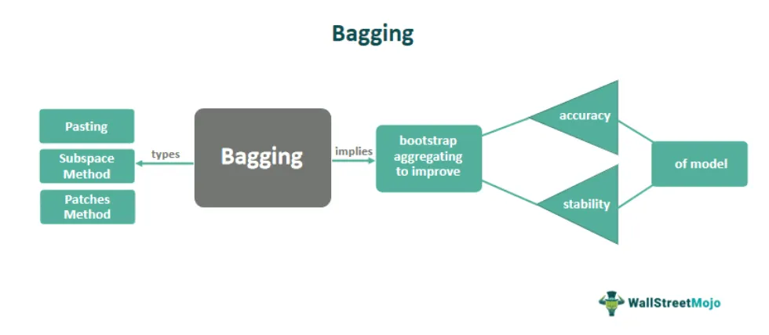

Algorithmic trading, a sophisticated approach to financial market participation, leverages advanced statistical and computational techniques to optimize trading strategies. Within this domain, bagging, or Bootstrap Aggregating, stands out as an effective ensemble method aimed at enhancing model accuracy and robustness. Bagging empowers traders by diversifying across numerous models, which distributes risk and reduces variance—an intrinsic element of financial market data that is typically volatile and unpredictable. Through this reduction of variance, bagging also contributes to potentially boosting returns, providing traders with a more stable and reliable performance landscape.

The concept of bagging revolves around generating multiple versions of a model by training each on random subsets of data, known as bootstrapped samples. This ensemble of models independently predicts outcomes, and their aggregated responses, achieved by averaging or majority voting, culminate in the final prediction. Such an approach mitigates the overfitting issues that single models often encounter when dealing with complex financial data. In financial environments, preventing overfitting is crucial because models need to generalize well to unseen data to maintain their predictive power and reliability.



This article journey begins with exploring the principles of bagging, continues to its application in algorithmic trading, and concludes with a comparison to other ensemble methods like boosting and stacking. By demystifying these concepts, algorithmic traders can fine-tune their strategies, gaining a significant technological and strategic edge in the ever-evolving and competitive trading landscape.

Understanding and applying bagging within algorithmic trading is not merely an academic exercise; it is a practical solution that addresses pressing challenges faced by traders. By integrating bagging techniques, traders develop more resilient systems, enhancing decision-making accuracy and optimizing risk management processes. This exploration of bagging and its relevance in algorithmic trading sets the stage for a detailed examination of its techniques and practical applications in subsequent sections.

## Table of Contents

## Understanding Bagging in Algorithmic Trading

Bagging, or Bootstrap Aggregating, is a widely used ensemble learning technique in [algorithmic trading](/wiki/algorithmic-trading), designed to enhance model performance by mitigating variance and overfitting. At its core, bagging involves generating multiple versions of a predictive model by training these models on different random subsets of the available training data. The essential concept is that each model contributes to the final prediction through an aggregation process, such as averaging for regression tasks or majority voting for classification tasks.

The process of bagging can be summarized as follows:

1. **Data Resampling**: For each model, generate a bootstrap sample by randomly selecting subsets of the original training data with replacement. This means individual data points may appear multiple times in a single subset.

2. **Model Training**: Independently train a model on each resampled dataset. These models are usually of the same type, such as decision trees, to maintain uniformity in the predictions.

3. **Aggregation**: The final prediction combines the outputs of all individual models. In regression, this is typically the arithmetic mean of all predictions, while in classification, it results from majority voting.

The effect of bagging in an algorithmic trading context is profound, particularly in volatile financial markets where robust model predictions are crucial. By reducing the variance of predictions, bagging minimizes the likelihood of overfitting, ensuring that models are not excessively tailored to the noise in a given training dataset but instead capture the underlying market trends more reliably.

A prominent example of bagging in practice is the Random Forest algorithm. Random Forests make use of multiple decision trees to derive a consensus result, capitalizing on the collective wisdom of these trees to improve prediction accuracy and stability. Each tree in a Random Forest is trained on a different bootstrap sample of the data, and a random subset of features is considered for splitting at each node, which enhances the diversity among the trees.

In algorithmic trading, mastering the techniques of bagging empowers traders to construct more resilient and reliable trading systems. By leveraging multiple models trained on diverse data samples, traders can achieve better generalization, leading to improved trading decisions and risk management. The strength of bagging lies in its simplicity and effectiveness, making it a valuable tool for traders seeking to develop sophisticated and adaptable algorithmic strategies.

## Case Study: Bagging in Trading

Bagging, an abbreviation for Bootstrap Aggregating, is a statistical method that is particularly effective in the landscape of trading due to its ability to mitigate risk and enhance returns through diversification. In trading, this technique finds its utilization in crafting diversified portfolios that arise from creating multiple trading strategies based on bootstrap samples of market data. Each trading strategy, derived independently through this approach, targets specific market segments or different categories of assets, thereby promoting a more balanced investment strategy.

By focusing individual strategies on distinct segments, bagging helps traders reduce the overall portfolio risk. This reduction in risk is achieved through the smoothing of the equity curve, which is particularly advantageous during periods of market [volatility](/wiki/volatility-trading-strategies). By having multiple strategies run concurrently, the variability in returns can be more controlled, making the trader's portfolio less susceptible to large swings in value. 

The practical implementation of bagging in trading involves the development of several models. Take, for example, the currency trading models: multiple models could be designed each focusing on different currency pairs or market conditions. These models would be trained using different random subsets of historical currency data, allowing each to address diverse market conditions. Once trained, the aggregation of predictions from all models is used to guide final trading decisions. 

The aggregation might involve taking a majority voting among classification models or averaging predictions in regression models, which could then be adapted as buy or sell signals. This ensemble of predictions capitalizes on the strengths of multiple strategies while neutralizing the weaknesses apparent when relying on a single model.

In essence, by facilitating the creation of diversified trading strategies, bagging showcases its practical benefits within real-world trading scenarios, providing an invaluable tool for traders aiming to adopt robust and resilient trading frameworks against market uncertainties.

## Comparing Bagging with Other Ensemble Methods

Bagging, boosting, and stacking are ensemble methods that offer distinct approaches to improving the predictive performance of models, each with specific strengths. Bagging (Bootstrap Aggregating) primarily reduces variance. By training multiple versions of a model on different random subsets of the training data and aggregating their outputs—through methods like averaging in regression or majority voting in classification—bagging enhances model stability and decreases overfitting, which is particularly beneficial in volatile financial markets.

In contrast, boosting targets both bias and variance by sequentially constructing a series of weak models, where each new model attempts to correct errors made by its predecessors. This process re-weights the data points, giving more attention to those that were previously misclassified, thereby refining the aggregated predictions. Common boosting algorithms such as AdaBoost and Gradient Boosting are known for their robust performance in improving model accuracy, albeit at the cost of increased complexity and computational burden.

Stacking differs by combining predictions from multiple models using a meta-learner, focusing on advancing the overall prediction accuracy. The base models, which might be trained on entire data sets, make initial predictions that are then used as inputs for the meta-model. This technique can leverage the strengths of different algorithms, potentially enhancing predictive power more than any single model could on its own.

The choice between these ensemble methods depends heavily on the specific requirements of a trading strategy. For instance, if mitigating model variance is the primary goal, bagging provides a straightforward and effective solution. On the other hand, if both lowering bias and variance is essential, especially when predictions need to be fine-tuned continually, boosting might be more suitable. For those interested in model diversity and combining disparate algorithmic insights, stacking offers a flexible framework to synthesize multiple models effectively.

Understanding these distinctions is crucial for traders, aiding them in selecting the optimal ensemble technique to suit their algorithmic trading strategies, ensuring both enhanced predictive capabilities and improved risk management.

## Implementation of Bagging in Algo Trading Strategies

To effectively implement bagging in algorithmic trading strategies, it is essential for traders to begin with multiple models, each trained on random subsets of historical market data. This process hinges on the core principle of bagging, which aims to reduce model variance and improve prediction accuracy by leveraging diverse, independently trained models.

In practice, traders aggregate predictions from these individual models to create a more robust and reliable output. This aggregation minimizes risks associated with the failure of individual models, thereby providing a buffer against unpredictable market fluctuations. For regression problems, prediction aggregation is typically achieved through averaging, while for classification tasks, majority voting is used.

Machine learning libraries play a crucial role in facilitating the development of bagging models. Algorithms like Random Forests, which inherently utilize bagging, are particularly useful due to their ability to generate a large number of decision trees, each trained on a different random subset of the data. The following Python code snippet demonstrates how to implement a Random Forest model using the Scikit-learn library:

```python
from sklearn.ensemble import RandomForestClassifier
from sklearn.model_selection import train_test_split
from sklearn.metrics import accuracy_score

# Load your trading data
X, y = load_trading_data()

# Split the data into training and testing sets
X_train, X_test, y_train, y_test = train_test_split(X, y, test_size=0.2, random_state=42)

# Initialize the Random Forest model
random_forest_model = RandomForestClassifier(n_estimators=100, random_state=42)

# Train the model on the training data
random_forest_model.fit(X_train, y_train)

# Evaluate the model on the test data
predictions = random_forest_model.predict(X_test)
accuracy = accuracy_score(y_test, predictions)

print(f'Accuracy: {accuracy}')
```

Successful implementation of bagging in trading also mandates rigorous [backtesting](/wiki/backtesting) and validation processes. Backtesting involves applying the model to historical data to assess its performance, while validation ensures the reliability of the model through simulated environments before deploying it in live trading. Such meticulous testing helps traders understand how their bagging-based strategy performs under various market conditions and allows for adjustment and optimization.

Ultimately, by leveraging bagging techniques, traders can build resilient trading strategies that better adapt to market changes. The ensemble nature of bagging ensures that the resulting model seizes the strengths of individual models while mitigating their weaknesses, thus enhancing the overall trading strategy's robustness and effectiveness.

## Conclusion

Bagging, or Bootstrap Aggregating, serves as a formidable ensemble method in the field of algorithmic trading, enhancing the robustness and accuracy of trading models by effectively reducing variance through diversification. This ensemble approach inherently supports traders by mitigating the risks associated with overfitting and model variability, thus offering a level of consistency essential in making informed trading decisions within the unpredictable financial market landscape.

In the highly competitive arena of algorithmic trading, keen understanding and application of bagging can equip traders with a notable competitive edge. By leveraging the strength of multiple models, each trained on different subsets of data, traders can achieve a consolidation of predictions through methods such as averaging in regression or majority voting in classification tasks. This results in models that are not only more accurate but also more adaptable to market fluctuations.

Bagging distinguishes itself through its simplicity compared to more complex ensemble methods like boosting and stacking. While boosting enhances performance by sequentially correcting errors in weak models, and stacking blends model predictions using meta-learning, bagging’s focus on reducing variance provides a straightforward yet powerful mechanism for improving model stability. The ease of implementation and the significant reduction in variance make bagging an attractive choice for traders whose primary concern is achieving reliable model performance across diverse market conditions.

However, to effectively harness the benefits of bagging, traders must engage in rigorous backtesting and simulate their strategies extensively in controlled environments. This meticulous process is crucial to tailor the bagging methodology to specific trading objectives and market dynamics, ensuring that the strategies deployed will perform well when transitioned to live trading environments. Moreover, leveraging [machine learning](/wiki/machine-learning) libraries and computational resources can further facilitate the implementation process, aiding in the creation of resilient trading strategies.

Ultimately, bagging stands as a pivotal tool for algorithmic traders, enhancing decision-making processes and advancing risk management practices. By embracing this method, traders can better align their strategies with market realities, thereby attaining improved performance outcomes and reduced exposure to volatile financial environments.

## References & Further Reading

[1]: Breiman, L. (1996). ["Bagging Predictors."](https://link.springer.com/article/10.1023/A:1018054314350) Machine Learning, 24(2), 123-140.

[2]: ["Advances in Financial Machine Learning"](https://www.amazon.com/Advances-Financial-Machine-Learning-Marcos/dp/1119482089) by Marcos Lopez de Prado

[3]: Friedman, J., Hastie, T., & Tibshirani, R. (2001). ["The Elements of Statistical Learning."](https://link.springer.com/book/10.1007/978-0-387-84858-7) Springer Series in Statistics.

[4]: ["Machine Learning for Algorithmic Trading"](https://github.com/stefan-jansen/machine-learning-for-trading) by Stefan Jansen

[5]: Dietterich, T. G. (2000). ["Ensemble Methods in Machine Learning."](https://link.springer.com/chapter/10.1007/3-540-45014-9_1) Lecture Notes in Computer Science, 1857, 1-15.

[6]: ["Quantitative Trading: How to Build Your Own Algorithmic Trading Business"](https://books.google.com/books/about/Quantitative_Trading.html?id=j70yEAAAQBAJ) by Ernest P. Chan

[7]: Bauer, E., & Kohavi, R. (1999). ["An Empirical Comparison of Voting Classification Algorithms: Bagging, Boosting, and Variants."](https://link.springer.com/article/10.1023/A:1007515423169) Machine Learning, 36(1/2), 105-139.